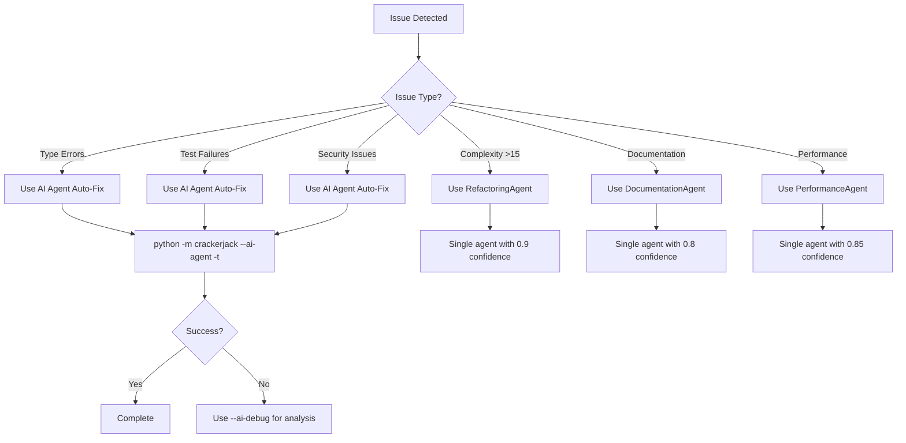
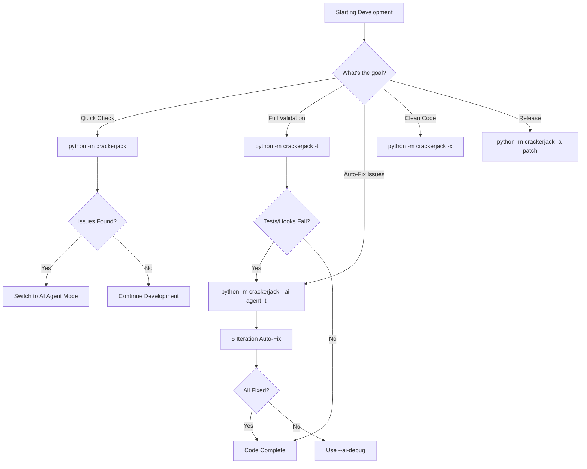

# AI-REFERENCE.md

**AI-Optimized Reference for Crackerjack Package Architecture and Commands**

This document is specifically structured for AI assistants to quickly understand and operate Crackerjack effectively. All information is presented in parseable formats with clear decision trees and lookup tables.

## Quick Command Matrix

### Primary Workflows (Most Used)

| Command | Use Case | AI Context | Success Pattern |
|---------|----------|-------------|-----------------|
| `python -m crackerjack` | Quality checks only | Standard development iteration | Exit code 0, no issues found |
| `python -m crackerjack -t` | Quality + tests | Comprehensive validation | All tests pass, hooks pass |
| `python -m crackerjack --ai-agent -t` | AI auto-fixing | **RECOMMENDED**: Autonomous issue resolution | 5 iterations max, all issues resolved |
| `python -m crackerjack --ai-debug -t` | AI debugging | Troubleshooting AI agent issues | Verbose output, decision explanations |
| `python -m crackerjack -x` | Code cleaning | TODO resolution required | Blocks if TODOs found, creates backups |

### Server Management

| Command | Purpose | When to Use | Expected Outcome |
|---------|---------|-------------|------------------|
| `--start-mcp-server` | Start MCP server | AI agent integration needed | Server running, tools available |
| `--restart-mcp-server` | Restart MCP server | Server issues, config changes | Fresh server instance |
| `--start-websocket-server` | Progress tracking server | Real-time progress monitoring | Server on localhost:8675 |
| `--watchdog` | Auto-restart services | Production monitoring | Auto-recovery active |

## AI Decision Trees





## Agent Selection Matrix

### By Issue Type

| Issue Pattern | Best Agent | Confidence | Command Pattern |
|---------------|------------|------------|-----------------|
| `Cognitive complexity of X exceeds 15` | RefactoringAgent | 0.9 | Break into helper methods |
| `F401 imported but unused` | RefactoringAgent | 0.8 | AST-based cleanup |
| `Performance: O(n²) loop detected` | PerformanceAgent | 0.85 | Real code transformation |
| `B108: hardcoded_tmp_directory` | SecurityAgent | 0.8 | Use tempfile module |
| `Tests failed: X assertions` | TestCreationAgent | 0.8 | Fix fixtures/assertions |
| `Documentation inconsistency` | DocumentationAgent | 0.8 | Update .md files |
| `Code duplication detected` | DRYAgent | 0.8 | Extract common patterns |

### Agent Capabilities Quick Reference

```json
{
  "DocumentationAgent": {
    "confidence": 0.8,
    "specializes": ["changelog", "README", "markdown_consistency"],
    "output_format": "markdown_files",
    "typical_fixes": ["version_updates", "link_validation", "structure_consistency"]
  },
  "RefactoringAgent": {
    "confidence": 0.9,
    "specializes": ["complexity_reduction", "dead_code", "AST_analysis"],
    "complexity_limit": 15,
    "typical_fixes": ["method_extraction", "unused_imports", "simplification"]
  },
  "PerformanceAgent": {
    "confidence": 0.85,
    "specializes": ["O_n_squared_detection", "string_optimization", "memory_efficiency"],
    "transforms_code": true,
    "typical_fixes": ["loop_optimization", "string_building", "data_structure_choice"]
  }
}
```

## Error Pattern Library

### Type Errors

```python
# BEFORE: Type annotation missing
def process_data(data):
    return data.get("result")


# AFTER: Proper typing
def process_data(data: dict[str, t.Any]) -> t.Any:
    return data.get("result")
```

### Security Issues

```python
# BEFORE: Hardcoded path vulnerability
temp_file = "/tmp/crackerjack_temp.yaml"

# AFTER: Secure tempfile usage
with tempfile.NamedTemporaryFile(suffix=".yaml") as f:
    temp_file = f.name
```

### Complexity Reduction

```python
# BEFORE: Complexity 34 (too high)
def complex_method(self, data: dict) -> bool:
    # 30+ lines of nested logic
    if condition1:
        if condition2:
            if condition3:
                # deep nesting

# AFTER: Complexity 3 (good)
def complex_method(self, data: dict) -> bool:
    if not self._validate_input(data):
        return self._handle_invalid_input()
    processed = self._process_data(data)
    return self._save_results(processed)
```

## Command Success Indicators

### Quality Check Success

```
✅ All hooks passed
✅ No type errors
✅ Security scan clean
✅ Complexity within limits (≤15)
```

### Test Success Pattern

```
✅ All tests passed
✅ Coverage maintained (≥10.11%)
✅ No test failures
✅ Test timeout within 300s
```

### AI Agent Success Pattern

```
✅ Issues detected: X
✅ Issues resolved: X
✅ Iterations used: Y/5
✅ Confidence: High
✅ All hooks passing
```

## Workflow Sequences

### Standard Development Cycle

1. `python -m crackerjack` - Quick quality check
1. `python -m crackerjack -t` - Full validation
1. If issues found → `python -m crackerjack --ai-agent -t`
1. Commit changes
1. Repeat

### Release Cycle

1. `python -m crackerjack --ai-agent -t` - Ensure quality
1. `python -m crackerjack --bump patch` - Version bump
1. `python -m crackerjack -a patch` - Publish release
1. Verify deployment

### Troubleshooting Sequence

1. `python -m crackerjack --ai-debug -t` - Verbose analysis
1. Check MCP server: `--restart-mcp-server`
1. Monitor progress: `--start-websocket-server`
1. Use watchdog: `--watchdog`

## File Structure Context

### Critical Files for AI Understanding

```
crackerjack/
├── CLAUDE.md              # AI instructions (THIS FILE)
├── AI-AGENT-RULES.md      # Agent workflow rules
├── __main__.py            # Entry point (122 lines, clean)
├── core/
│   ├── orchestrator.py    # Main workflow coordination
│   └── phase_coordinator.py # Phase management
├── managers/              # Service layer managers
├── services/              # Core business logic
└── mcp/                   # AI agent integration
    ├── server_core.py     # MCP server (921 lines, optimized)
    └── tools/             # AI agent tools
```

### Import Pattern (CRITICAL)

```python
# ❌ WRONG: Import concrete classes
from ..managers.test_manager import TestManager

# ✅ CORRECT: Import protocols
from ..models.protocols import TestManagerProtocol
```

## Configuration Context

### Quality Thresholds

- **Complexity**: ≤15 per function
- **Coverage**: ≥10.11% (ratchet system)
- **Test Timeout**: 300s
- **Iterations**: 5 max for AI agent

### Python Requirements

- **Version**: 3.13+ required
- **Type System**: `|` unions, protocols
- **Imports**: `import typing as t`
- **Async**: Full async/await support

## AI Agent Architecture

### 9 Specialized Sub-Agents

1. **DocumentationAgent** (0.8) - Changelog, README, .md files
1. **RefactoringAgent** (0.9) - Complexity, dead code, AST
1. **PerformanceAgent** (0.85) - O(n²), string optimization
1. **DRYAgent** (0.8) - Code duplication, patterns
1. **FormattingAgent** (0.8) - Style, imports, consistency
1. **SecurityAgent** (0.8) - Vulnerabilities, best practices
1. **ImportOptimizationAgent** - Import cleanup, organization
1. **TestCreationAgent** (0.8) - Test failures, fixtures
1. **TestSpecialistAgent** (0.8) - Advanced testing, frameworks

### Coordination Logic

```python
if confidence >= 0.7:
    use_single_agent(best_match)
else:
    use_collaborative_approach(multiple_agents)
```

## Terminal Recovery Commands

### If Terminal Breaks After Monitor

```bash
# Option 1: Use recovery script
./fix_terminal.sh

# Option 2: Manual recovery
stty sane; reset; exec $SHELL -l

# Option 3: Simple reset
reset
```

## MCP Server Integration

### Available Tools

- `execute_crackerjack` - Auto-fixing workflow
- `get_job_progress` - Progress tracking
- `get_comprehensive_status` - System status
- `analyze_errors` - Error pattern analysis

### WebSocket Progress Server

- **URL**: http://localhost:8675/
- **Real-time**: Live progress updates
- **Rich formatting**: Color-coded status

### Slash Commands

- `/crackerjack:run` - Full auto-fixing
- `/crackerjack:status` - System status
- `/crackerjack:init` - Project initialization

## Common Failure Patterns to Avoid

### Import Errors

```python
# ❌ This will cause import errors
from crackerjack.managers.test_manager import TestManager

# ✅ Always use protocols
from crackerjack.models.protocols import TestManagerProtocol
```

### Async Test Issues

```python
# ❌ Async tests that can hang
@pytest.mark.asyncio
async def test_batch_processing():
    await complex_operation()  # Can hang


# ✅ Simple synchronous tests
def test_batch_configuration():
    assert config.max_batch_size == expected
```

### Regex Security Issues

```python
# ❌ DANGEROUS: Raw regex with spacing
text = re.sub(r"(\w+) - (\w+)", r"\g < 1 >-\g < 2 >", text)

# ✅ SAFE: Use centralized patterns
from crackerjack.services.regex_patterns import SAFE_PATTERNS

text = SAFE_PATTERNS["fix_hyphenated_names"].apply(text)
```

## Success Metrics

### AI Efficiency Indicators

- **Clarification Questions**: \<10% of interactions
- **First-Try Success**: >80% for standard commands
- **Error Resolution**: >90% with AI agent mode
- **Documentation Access**: \<5s lookup time

### Quality Indicators

- **Hook Pass Rate**: 100% after AI fixing
- **Test Success**: >95% first run
- **Coverage Maintenance**: Never decrease from 10.11%
- **Complexity Compliance**: 100% ≤15

This reference document is designed to minimize AI assistant confusion and maximize autonomous operation of the Crackerjack system.
