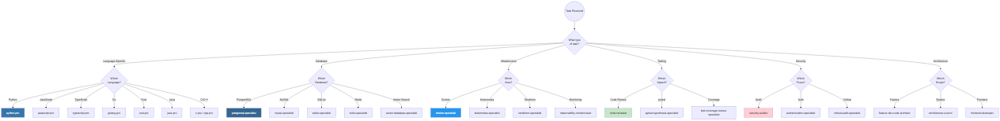
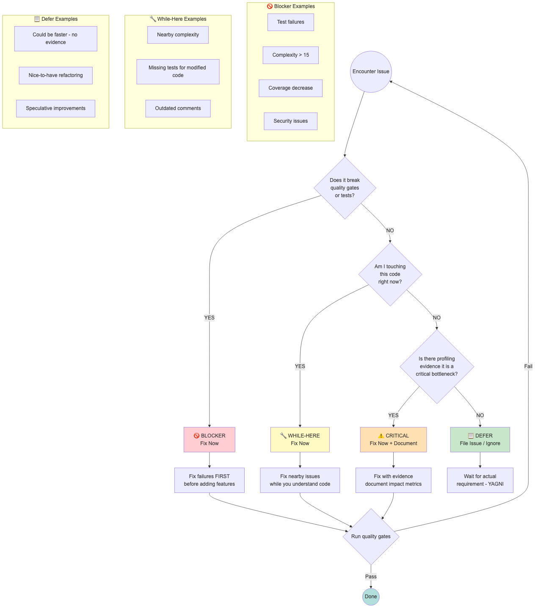

# CLAUDE.md

This file provides guidance to Claude Code (claude.ai/code) when working with code in this repository.

## Project Overview

Crackerjack is an opinionated Python project management tool unifying UV, Ruff, pytest, and quality tools into a single workflow with AI agent integration via MCP.

**Key Dependencies**: Python 3.13+, UV, pytest

**IMPORTANT**: Crackerjack does **NOT** use pre-commit.com hooks. It runs its own native tool orchestration system that integrates directly with git. When we say "hooks" in crackerjack, we mean **quality tools that run during our workflow** (ruff, pytest, codespell, etc.) - NOT pre-commit.com hooks.

**Clean Code Philosophy**: DRY/YAGNI/KISS - Every line is a liability. Optimize for readability with self-documenting code.

______________________________________________________________________

## Timeless Software Engineering Wisdom

### The Zen of Python (PEP 20)

Crackerjack embodies these principles:

> Beautiful is better than ugly.
> Explicit is better than implicit.
> Simple is better than complex.
> Complex is better than complicated.
> Flat is better than nested.
> Sparse is better than dense.
> Readability counts.
> Special cases aren't special enough to break the rules.
> Although practicality beats purity.
> Errors should never pass silently.
> Unless explicitly silenced.
> In the face of ambiguity, refuse the temptation to guess.
> There should be one-- and preferably only one --obvious way to do it.
> Now is better than never.

*See: `python -c "import this"` or PEP 20 for the complete Zen of Python.*

### The Unix Philosophy (Ken Thompson, Dennis Ritchie, 1978)

> Write programs that do one thing and do it well. Write programs to work together. Write programs to handle text streams, because that is a universal interface.

**Embodied in Crackerjack**:

- 9 specialized agents, each doing one thing excellently
- Modular hooks that work together via orchestration
- Protocol-based design enables components to work together seamlessly

### The Two Hard Problems (Phil Karlton, 1997)

> There are only two hard things in Computer Science: cache invalidation and naming things.

**Why Naming Matters**:

- "Readability counts" from Zen of Python
- Self-documenting code requires good names
- Protocols and interfaces are all about clear naming

### Knuth's Optimization Rule (Donald Knuth, 1974)

> Premature optimization is the root of all evil.

**Full Context**:

> Programmers waste enormous amounts of time thinking about, or worrying about, the speed of noncritical parts of their programs, and these attempts at efficiency actually have a strong negative impact when debugging and maintenance are considered.

**In Practice**:

- Profile first, confirm bottleneck, then optimize
- "Could be faster" is NOT a valid reason without evidence
- See: Quality Decision Framework - "Fix Now or Later?"

### Postel's Law (Jon Postel, 1984)

> Be conservative in what you send, be liberal in what you accept.

**Protocol-Based Design**:

- Strict output contracts: protocols define exactly what to send
- Flexible input handling: accept various compatible types
- Robustness through clear boundaries

### The Pragmatic Programmer: No Broken Windows (Andrew Hunt, David Thomas, 1999)

> Don't leave "broken windows" (bad designs, wrong decisions, or poor code) unrepaired. Fix each one as soon as it's discovered.

**In Crackerjack**:

- "Fix failures FIRST" before adding features
- "Complexity >15" must be fixed immediately
- Quality gates catch issues early

### Hyrum's Law (Hyrum Wright)

> With a sufficient number of users of an API, it does not matter what you promise in the contract: all observable behaviors of your system will be depended on by somebody.

**Implication**:

- Breaking changes are dangerous even if "technically allowed"
- Validates "NEVER MAKE UNAUTHORIZED CHANGES" rule
- Observable behavior = part of the contract

### Occam's Razor (William of Ockham, 14th Century)

> Entities should not be multiplied beyond necessity.

**Software Version**: KISS (Keep It Simple, Stupid)

- Prefer simple solutions over clever ones
- YAGNI: You Aren't Gonna Need It
- Every line of code is a liability

### The Tao of Programming (Geoffrey James, 1987)

> A program should be light and agile, its subroutines connected like a string of pearls. The spirit and intent of the program should be retained throughout. There should be neither too little nor too much, neither needless loops nor useless variables, neither lack of structure nor overwhelming rigidity.

**Modern Translation**:

- Modular architecture with clear intent
- No dead code, no complexity bloat
- Flexible structure, not rigid hierarchies

### Murphy's Law for Software (Edward Murphy, 1949)

> Anything that can go wrong will go wrong.

**Corollary**: Never test for an error condition you don't know how to handle.

**In Crackerjack**:

- Comprehensive error handling in quality tools
- AI agents attempt fixes before giving up
- Failing fast with clear error messages

### Hanlon's Razor (Robert Hanlon)

> Never attribute to malice that which is adequately explained by stupidity.

**Software Version**: Never attribute to malice that which is adequately explained by a misunderstanding of the requirements.

**Practice**:

- Ask questions when requirements are unclear
- Don't assume users are trying to trick you
- "NO ASSUMPTIONS OR GUESSING" rule

______________________________________________________________________

## CRITICAL SECURITY & QUALITY RULES

### 1. NEVER MAKE UNAUTHORIZED CHANGES

- **ONLY** modify what is explicitly requested.
- **NEVER** change unrelated code, files, or functionality.
- If you think something else needs changing, **ASK FIRST**.
- Changing anything not explicitly requested is considered **prohibited change**.

### 2. DEPENDENCY MANAGEMENT IS MANDATORY

- **ALWAYS** update pyproject.toml when adding imports.
- **NEVER** add import statements without corresponding dependency entries.
- **VERIFY** all dependencies are properly declared before suggesting code.

### 3. NO PLACEHOLDERS - EVER

- **NEVER** use placeholder values like "YOUR_API_KEY", "TODO", or dummy data.
- **ALWAYS** use proper variable references or configuration patterns.
- If real values are needed, **ASK** for them explicitly.
- Use environment variables or config files, not hardcoded values.

### 4. QUESTION VS CODE REQUEST DISTINCTION

- When a user asks a **QUESTION**, provide an **ANSWER** - do NOT change code.
- Only modify code when explicitly requested with phrases like "change", "update", "modify", "fix".
- **NEVER** assume a question is a code change request.

### 5. NO ASSUMPTIONS OR GUESSING

- If information is missing, **ASK** for clarification.
- **NEVER** guess library versions, API formats, or implementation details.
- **NEVER** make assumptions about user requirements or use cases.
- State clearly what information you need to proceed.

### 6. SECURITY IS NON-NEGOTIABLE

- **NEVER** put API keys, secrets, or credentials in client-side code.
- **ALWAYS** implement proper authentication and authorization.
- **ALWAYS** use environment variables for sensitive data.
- **ALWAYS** implement proper input validation and sanitization.

### 7. PRESERVE FUNCTIONAL REQUIREMENTS

- **NEVER** change core functionality to "fix" errors.
- When encountering errors, fix the technical issue, not the requirements.
- If requirements seem problematic, **ASK** before changing them.

### 8. EVIDENCE-BASED RESPONSES

- When asked if something is implemented, **SHOW CODE EVIDENCE**.
- Format: "Looking at the code: [filename] (lines X-Y): [relevant code snippet]"
- **NEVER** guess or assume implementation status.
- If unsure, **SAY SO** and offer to check specific files.

## Essential Commands

**IMPORTANT**: Crackerjack has a two-level CLI structure:

- `python -m crackerjack --help` shows **command list** (start, stop, run, etc.)
- `python -m crackerjack run --help` shows **all 100+ quality options** (-t, -x, -c, --ai-fix, etc.)

All quality-checking flags live under the `run` subcommand!

```bash
# Help commands
python -m crackerjack run --help        # Shows command list
python -m crackerjack run --help    # Shows ALL options (640 lines!)

# Daily workflow
python -m crackerjack run                       # Quality checks
python -m crackerjack run --run-tests           # With tests
python -m crackerjack run -t                    # Short form
python -m crackerjack run --ai-fix --run-tests  # AI auto-fixing (recommended)
python -m crackerjack run --ai-fix -t           # Short form

# Development
python -m crackerjack run --ai-debug --run-tests # Debug AI issues
python -m crackerjack run --skip-hooks           # Skip hooks during iteration
python -m crackerjack run --strip-code           # Code cleaning mode
python -m crackerjack run -x                     # Short form
python -m crackerjack run -x -t --ai-fix         # Combined shortcuts

# MCP Server management
python -m crackerjack start          # Start MCP server
python -m crackerjack stop           # Stop MCP server
python -m crackerjack restart        # Restart MCP server
python -m crackerjack status         # Check server status
python -m crackerjack health         # Server health check

# Additional server options (via run command)
python -m crackerjack run --watchdog             # Monitor/restart services

# Release workflow
python -m crackerjack run --all patch  # Full release workflow

# Testing options
python -m pytest tests/test_file.py::TestClass::test_method -v  # Specific test
python -m pytest --cov=crackerjack --cov-report=html             # Coverage
python -m crackerjack run --run-tests                            # Auto-detect workers (default)
python -m crackerjack run --run-tests --test-workers 4           # Explicit workers
python -m crackerjack run --run-tests --test-workers 1           # Sequential execution
python -m crackerjack run --run-tests --test-workers -2          # Fractional (half cores)

# Standalone test command (simpler, no quality checks)
python -m crackerjack run-tests              # Just run pytest
python -m crackerjack run-tests --workers 4  # With explicit workers
```

## Architecture

**Modular Oneiric Architecture**: `__main__.py` → CLI Handlers → Coordinators → Managers → Services


*8-layer modular architecture with 100% protocol compliance*

### Critical Architectural Pattern: Protocol-Based Design

Crackerjack uses **protocol-based dependency injection** with constructor injection:

```python
# ✅ GOLD STANDARD: Always import protocols, never concrete classes
from crackerjack.models.protocols import Console, TestManagerProtocol


def setup_ai_agent_env(
    ai_agent: bool, debug_mode: bool = False, console: Console | None = None
) -> None:
    """All functions use protocol-based dependencies via constructor injection."""
    if console is None:
        from rich.console import Console

        console = Console()
    console.print("[green]AI agent environment configured[/green]")


class SessionCoordinator:
    def __init__(
        self,
        console: Console,
        test_manager: TestManagerProtocol,
        pkg_path: Path,
    ) -> None:
        """Constructor injection with protocol-based dependencies."""
        self.console = console
        self.test_manager = test_manager
        self.pkg_path = pkg_path
```

**THE MOST CRITICAL PATTERN**: Always import protocols from `models/protocols.py`, never concrete classes

```python
# ❌ Wrong - Direct class imports (BREAKS ARCHITECTURE)
from crackerjack.managers.test_manager import TestManager
from rich.console import Console as RichConsole

# ✅ Correct - Protocol imports (FOLLOWS ARCHITECTURE)
from crackerjack.models.protocols import TestManagerProtocol, Console
```

### Anti-Patterns to Avoid

```python
# ❌ Global singletons
console = Console()  # At module level

# ❌ Factory functions without dependency injection
self.tracker = get_agent_tracker()
self.timeout_manager = get_timeout_manager()


# ✅ Correct - Constructor injection
def __init__(
    self,
    console: Console,
    cache: CrackerjackCache,
    tracker: AgentTrackerProtocol,
) -> None:
    self.console = console
    self.cache = cache
    self.tracker = tracker


# ✅ Correct - Module-level logger
logger = logging.getLogger(__name__)
```

### Core Layers & Compliance Status

**🎉 FULLY COMPLETE** - All Components (Phase 5-7 Completion)

Based on Phase 2-7 refactoring audit (100% legacy-free):

- **CLI Handlers** (100% compliant): Entry points, option processing

  - ✅ All handlers use protocol-based typing
  - ✅ Constructor injection patterns
  - ✅ `CrackerjackCLIFacade` fully integrated
  - ✅ MCPServerCLIFactory integration complete (Phase 6)

- **Services** (100% compliant): Filesystem, git, config, security, health monitoring

  - ✅ All Phase 3 refactored services follow standards
  - ✅ Constructor consistency, lifecycle management
  - ✅ legacy references removed (Phase 5)

- **Managers** (100% compliant): Hook execution (fast→comprehensive), test management, publishing

  - ✅ All managers use protocol-based typing
  - ✅ Constructor injection standard
  - ✅ legacy patterns replaced (Phase 5)

- **Coordinators** (100% compliant): Session/phase coordination, async workflows, parallel execution

  - ✅ Phase coordinators use proper DI
  - ✅ Async coordinators protocol standardization complete
  - ✅ Workflow type hints restored (Phase 6)

- **Orchestration** (100% compliant): `WorkflowOrchestrator`, lifecycle management

  - ✅ `SessionCoordinator` - Gold standard protocol integration
  - ✅ `ServiceWatchdog` - Oneiric-based lifecycle
  - ✅ Oneiric workflow integration complete (Phase 6)

- **Agent System** (100% compliant): AI agents, coordination

  - ✅ All agents use protocol-based design
  - ✅ `AgentContext` pattern for agent isolation
  - ✅ Protocols defined and implemented
  - ✅ No legacy dependencies remaining

- **Adapters** (100% compliant): 18 QA adapters + AI adapters

  - ✅ All adapters use constructor injection (Phase 4)
  - ✅ legacy `depends.set()` patterns removed (Phase 5)
  - ✅ Protocol-based registration via server initialization

- **MCP Integration** (100% compliant): mcp-common integration

  - ✅ MCPServerCLIFactory patterns adopted (Phase 6)
  - ✅ Server lifecycle management complete
  - ✅ Health probes and rate limiting configured

### Architecture Decision Records

**Why Protocol-Based Design?**

- Loose coupling between layers
- Easy testing with mock implementations
- Clear interface contracts
- Runtime type checking via `@runtime_checkable`
- No framework lock-in (legacy removed, pure Python patterns)

**Why AgentContext Pattern for Agents?**

- Dataclass-based context provides agent isolation
- Clean separation of concerns
- Protocols allow flexible implementations
- Works well without complex DI frameworks

## Quality Process

**Crackerjack vs pre-commit.com**: Crackerjack runs its own tool orchestration system - we call them "hooks" but they're **NOT** pre-commit.com hooks. We directly integrate with git and run quality tools (ruff, pytest, codespell, etc.) in our workflow.

**Workflow Order**:

1. **Fast Tools/Hooks** (~5s): formatting, basic checks → retry once if fail → **AI-fix if enabled and still failing**
1. **Full Test Suite**: collect ALL failures, don't stop on first
1. **Comprehensive Tools/Hooks** (~30s): type checking, security, complexity → collect ALL issues → **AI-fix if enabled and failing**
1. **AI Batch Fixing**: process all collected failures together (up to 10 iterations)

**Testing**: pytest with asyncio, 300s timeout, auto-detected workers via pytest-xdist
**Coverage**: Ratchet system targeting 100%, never decrease

### Test Parallelization

Crackerjack uses **pytest-xdist** for intelligent parallel test execution with memory safety:

**Worker Configuration**:

- `test_workers: 0` (default) → Auto-detect via pytest-xdist (`-n auto`)
- `test_workers: 1` → Sequential execution (no parallelization)
- `test_workers: N` (N > 1) → Explicit worker count
- `test_workers: -N` (N < 0) → Fractional (e.g., -2 = half of CPU cores)

**Safety Features**:

- Memory-based limiting: 2GB per worker minimum (prevents OOM)
- Benchmark auto-skip: Benchmarks always run sequentially (parallel skews results)
- Distribution strategy: `--dist=loadfile` (keeps fixtures from same file together)
- Emergency rollback: `export CRACKERJACK_DISABLE_AUTO_WORKERS=1`

**Configuration Priority** (highest to lowest):

1. CLI flag: `--test-workers N`
1. `pyproject.toml`: `[tool.crackerjack] test_workers = N`
1. `settings/crackerjack.yaml`: `test_workers: N`
1. Default: 0 (auto-detect)

**Examples**:

```bash
# Auto-detect (default, recommended)
python -m crackerjack run --run-tests

# Explicit worker count
python -m crackerjack run --run-tests --test-workers 4

# Sequential (debugging flaky tests)
python -m crackerjack run --run-tests --test-workers 1

# Fractional (conservative parallelization)
python -m crackerjack run --run-tests --test-workers -2  # Half cores

# Disable auto-detection globally
export CRACKERJACK_DISABLE_AUTO_WORKERS=1
python -m crackerjack run --run-tests  # Forces sequential
```

**Performance Impact** (8-core MacBook):

- Before (1 worker): ~60s test suite, 12% CPU utilization
- After (auto-detect): ~15-20s test suite, 70-80% CPU utilization (3-4x faster)

### Phase Parallelization

Crackerjack supports **parallel execution of tests and comprehensive hooks** for improved performance:

**Overview**: When `enable_parallel_phases` is enabled, tests and comprehensive hooks run concurrently instead of sequentially, reducing workflow time by 20-30%.

**Usage**:

```bash
# Enable parallel execution
python -m crackerjack run --enable-parallel-phases --run-tests -c

# Short form
python -m crackerjack run --parallel-phases -t -c
```

**Configuration**:

Add to `settings/local.yaml` or `settings/crackerjack.yaml`:

```yaml
enable_parallel_phases: true
```

**Performance Impact** (typical workflow):

- Sequential (default): `[tests] → [comprehensive_hooks]` = 60s + 30s = 90s
- Parallel (enabled): `[tests] + [comprehensive_hooks]` = max(60s, 30s) = 60s
- **Speedup**: 33% faster (90s → 60s)

**When to Use**:

- ✅ Full CI/CD pipelines with tests + comprehensive hooks
- ✅ Large test suites (>30 seconds)
- ✅ Multi-core systems (4+ CPUs)
- ❌ Resource-constrained machines (\<2 CPUs)
- ❌ Debugging flaky tests

**Technical Details**:

The feature is implemented in the Oneiric workflow DAG builder (`crackerjack/runtime/oneiric_workflow.py`). Both tasks depend on the same predecessor (e.g., `fast_hooks`) but NOT on each other, allowing true parallel execution:

```python
# Sequential mode (default)
{"id": "tests", "depends_on": ["fast_hooks"]}
{"id": "comprehensive_hooks", "depends_on": ["tests"]}  # Waits for tests

# Parallel mode (enabled)
{"id": "tests", "depends_on": ["fast_hooks"]}
{"id": "comprehensive_hooks", "depends_on": ["fast_hooks"]}  # Parallel!
```

**Backward Compatibility**: Default is sequential. Opt-in via flag or config.

**Documentation**: See `docs/features/PARALLEL_EXECUTION.md` for complete details.

**Combined Parallelization**: Maximum performance with both features enabled:

```bash
# Ultimate parallelization:
# - Tests run across 4 workers (pytest-xdist)
# - Comprehensive hooks run parallel to tests (phase parallelization)
python -m crackerjack run --parallel-phases --test-workers 4 -t -c
```

## Code Standards

**Quality Rules**:

- **Complexity ≤15** per function
- **No hardcoded paths** (use `tempfile`)
- **No shell=True** in subprocess
- **Type annotations required**
- **Protocol-based DI** (import from `models/protocols.py`)
- **Python 3.13+**: `|` unions, protocols, pathlib

**Refactoring Pattern**: Break complex methods into helpers

```python
def complex_method(self, data: dict) -> bool:
    if not self._validate_input(data):
        return self._handle_invalid_input()
    processed = self._process_data(data)
    return self._save_results(processed)
```

**Critical Regex Safety**: NEVER write raw regex. Use centralized registry:

```python
# ❌ DANGEROUS
text = re.sub(r"(\w+) - (\w+)", r"\g<1>-\g<2>", text)

# ✅ SAFE
from crackerjack.services.regex_patterns import SAFE_PATTERNS

text = SAFE_PATTERNS["fix_hyphenated_names"].apply(text)
```

## Working Protocols

### Code Review Protocol

**Purpose**: Ensure systematic, comprehensive review of code changes, PRs, and implementations.

**Protocol Steps**:

1. **READ FULL CONTEXT**

   - Read entire modified files before suggesting changes
   - Check imports against pyproject.toml dependencies
   - Verify architectural compliance with protocol-based design
   - **Verification**: Can you explain what the code does without looking at it again?

1. **VALIDATE ARCHITECTURAL COMPLIANCE**

   - Check imports: `from crackerjack.models.protocols import ...` ✅
   - Check constructor injection: all dependencies via `__init__`
   - Check no legacy patterns: no `depends.set()`, no global singletons
   - **Verification**: Run `grep -n "from crackerjack\." file.py | grep -v protocols` - should return empty

1. **VERIFY DEPENDENCIES**

   - Every new import has corresponding entry in pyproject.toml
   - Version constraints specified if needed
   - No undeclared dependencies
   - **Verification**: `uv pip check` passes without errors

1. **CHECK QUALITY STANDARDS**

   - Complexity ≤15 per function (run `python -m crackerjack run --comprehensive`)
   - No hardcoded paths or placeholders
   - Type annotations present
   - **Verification**: Quality gates pass, no complexity warnings

1. **VALIDATE TESTS**

   - New code has corresponding tests
   - Coverage not decreased (ratchet system)
   - Tests use synchronous patterns where possible
   - **Verification**: `python -m crackerjack run --run-tests` passes

1. **RUN QUALITY GATES**

   - Execute full quality workflow: `python -m crackerjack run --run-tests -c`
   - Review ALL failures, not just first one
   - Fix issues before claiming "done"
   - **Verification**: Exit code 0, no failures

1. **PROVIDE EVIDENCE**

   - Reference specific files and line numbers
   - Show code snippets for claims
   - Never guess or assume
   - **Verification**: Every claim has `[filename]:[line]` evidence

**When to Use This Protocol**:

- ✅ Before suggesting code changes
- ✅ After implementing features
- ✅ When reviewing PRs
- ✅ Before claiming work is "complete"
- ❌ Not for simple typo fixes or obvious bugs

### Agent Selection Protocol


*Task-based routing to specialized agents by domain*

**Purpose**: Ensure appropriate use of 9 specialized agents for task-specific expertise.

**Key Selection Rules**:

1. **Language-Specific Tasks** → Use language specialists

   - Python → `python-pro`
   - JavaScript/TypeScript → `javascript-pro`, `typescript-pro`
   - Go → `golang-pro`
   - Rust → `rust-pro`
   - Java → `java-pro`
   - C/C++ → `c-pro`, `cpp-pro`

1. **Database & Storage** → Use database specialists

   - PostgreSQL → `postgresql-specialist`
   - MySQL → `mysql-specialist`
   - SQLite → `sqlite-specialist`
   - Redis → `redis-specialist`
   - Vector Search → `vector-database-specialist`

1. **Infrastructure & DevOps** → Use infrastructure specialists

   - Docker → `docker-specialist`
   - Kubernetes → `kubernetes-specialist`
   - Terraform → `terraform-specialist`
   - Monitoring → `observability-incident-lead`

1. **Testing & Quality** → Use quality specialists

   - Code Review → `code-reviewer` or `superpowers:code-reviewer`
   - pytest → `pytest-hypothesis-specialist`
   - Test Coverage → `test-coverage-review-specialist`

1. **Security** → Use security specialists

   - Security Audit → `security-auditor`
   - Authentication → `authentication-specialist`
   - Critical Audit → `critical-audit-specialist`
   - Privacy → `privacy-officer`

1. **Architecture & Design** → Use architecture specialists

   - Feature Architecture → `feature-dev:code-architect`
   - System Architecture → `architecture-council`
   - Frontend Design → `frontend-developer`

**Usage Protocol**:

```python
# Correct pattern - specific specialist
Task(
    subagent_type="python-pro",
    prompt="Review this Python code for security issues"
)

# WRONG - generalist for specialist task
Task(
    subagent_type="general-assistant",
    prompt="Review this Python code for security issues"
)
```

**Workflows vs Agents**:

- Complex multi-phase task → Use workflows (check `/workflows:WORKFLOW-CATALOG`)
- Feature delivery → `feature-dev:feature-dev`
- PR review → `pr-review-toolkit:review-pr`
- Architecture planning → `Plan` agent (not Task)

**Common Anti-Patterns**:

- ❌ Using `general-assistant` for specialized tasks
- ❌ Using `python-pro` for Rust code
- ❌ Not using agents at all ("I'll just do it myself")
- ❌ Using `code-reviewer` for implementation (use `feature-dev` instead)

### Evidence Protocol

**Purpose**: Ensure all claims, assertions, and responses are backed by specific, verifiable code evidence.

**Format 1: Implementation Status**

*When user asks "Is X implemented?"*

````markdown
Looking at [filename] (lines [start]-[end]):

```python
[code snippet]
````

[Explanation of what this shows]

````

**Format 2: Code Review Findings**

*When identifying issues or violations*

```markdown
**Issue**: [Brief description]
**Location**: [filename]:[line]
**Evidence**:
```python
[problematic code]
````

**Impact**: [What problem this causes]
**Fix**: [Specific fix]

````

**Format 3: Verification Claims**

*When claiming something is "fixed" or "done"*

```markdown
**Verification**: [what was verified]
**Method**: [how verification was performed]
**Evidence**: [output, logs, or test results]
**Status**: ✅ Verified / ❌ Failed
````

**Mandatory Evidence For**:

- ✅ Implementation status claims
- ✅ Architecture compliance assertions
- ✅ Bug fix verification
- ✅ Performance improvements
- ✅ Security assessments
- ✅ Test coverage changes

**No Evidence Required For**:

- ❌ Straightforward questions
- ❌ Opinion-based requests
- ❌ Documentation/explanation requests (unless citing specific behavior)

### Architecture Compliance Protocol

**Purpose**: Systematic verification that code follows crackerjack's protocol-based architecture.

**Compliance Checklist**:

1. **Import Compliance**

   - All imports use protocols from `models/protocols.py`
   - No direct class imports from other crackerjack modules
   - Verification: `grep -r "from crackerjack" crackerjack/ --include="*.py" | grep -v protocols | grep -v __pycache__` should return empty

1. **Constructor Injection**

   - All dependencies injected via `__init__`
   - No factory functions like `get_test_manager()`
   - No module-level singletons
   - Verification: Search for `get_.*()` patterns in `__init__` methods

1. **Protocol Definitions**

   - Custom types defined as protocols in `models/protocols.py`
   - All protocol methods have type annotations
   - `@runtime_checkable` decorator if using `isinstance()`

1. **Lifecycle Management**

   - No global state
   - Proper cleanup patterns (context managers or explicit teardown)
   - Resource management handled correctly

1. **No Legacy Patterns**

   - No `depends.set()` patterns
   - No DI container usage
   - No `@inject` decorators from old framework
   - Verification: `grep -r "depends\." crackerjack/ --include="*.py"` should return empty

**Non-Compliance Response**:

When architecture violations are found:

1. Document the issue with specific location and evidence
1. Explain why it matters (impact on architecture, testing, maintenance)
1. Provide correct pattern example
1. Offer to refactor

**Integration with Quality Gates**:

- Automated checks: `python -m crackerjack run -c` (import verification, complexity, type checking)
- Manual checks: Constructor injection, protocol definitions, lifecycle management
- Protocol: Always run automated checks BEFORE claiming architectural compliance

### Quality Decision Framework: "Fix Now or Later?"


*Decision tree for when to fix issues immediately vs. defer*

**Purpose**: Unified decision framework for when to fix issues immediately vs. defer them, preventing both technical debt accumulation and premature optimization.

**Quick Decision Matrix**:

| Issue Type | Not Touching Code | Touching Right Now | Action |
|------------|-------------------|-------------------|--------|
| Quality gates/tests failing | → | → | **FIX NOW** (Blocker) |
| Complexity >15 | File issue | → | **FIX NOW** (While-Here) |
| Known bottleneck (has evidence) | → | → | **FIX NOW** (Critical) |
| "Could be better" (no evidence) | → | → | **DEFER** (YAGNI) |

**Fix Now Categories**:

1. **Blockers** (Never proceed without fixing)

   - ✅ Test failures → Fix before adding features
   - ✅ Complexity >15 → Refactor immediately
   - ✅ Coverage decrease → Restore baseline first
   - ✅ Quality gate failures → Fix ALL failures
   - ✅ Architecture violations → Protocol-based design compliance
   - ✅ Security issues → Fix immediately, never defer
   - **Verification**: `python -m crackerjack run --run-tests -c` passes

1. **While-Here Fixes** (Fix when touching code)

   - ✅ Nearby complexity issues (you're already there)
   - ✅ Improve readability while you understand the code
   - ✅ Add missing tests for code you're modifying
   - ✅ Update outdated comments/documentation
   - ✅ Fix architectural violations in the same file
   - **Protocol**: "I'm already touching this code, fix nearby issues too"

1. **Critical Issues** (Fix even if not touching)

   - ✅ Confirmed performance bottlenecks (requires profiling evidence)
   - ✅ Security vulnerabilities (CVE reports, security audits)
   - ✅ Data loss risks, race conditions, memory leaks
   - **Evidence Required**: Document impact with metrics/data before treating as critical

**Defer Categories**:

1. **Performance Optimizations** (Without evidence)

   - ❌ "This function looks slow" (no measurements)
   - ❌ "I'll cache this result" (no evidence it's called frequently)
   - **Protocol**: Profile first, confirm bottleneck, then optimize

1. **Nice-to-Have Refactoring** (Not touching code)

   - ❌ "This function could be more elegant" (but works fine)
   - ❌ "I prefer a different pattern" (personal preference)
   - **Protocol**: File issue for future consideration

1. **Speculative Improvements** (YAGNI violations)

   - ❌ "Let's add this parameter in case we need it"
   - ❌ "I'll make this flexible for future use cases"
   - **Protocol**: "You Aren't Gonna Need It" - wait for actual requirement

**Protocol Checklist**:

```markdown
[ ] Does it break quality gates or tests?
    → YES: Fix now (Blocker)

[ ] Am I already touching this code right now?
    → YES: Fix now (While-Here)

[ ] Is there profiling/evidence it's a critical bottleneck?
    → YES: Fix now (Critical), document evidence

[ ] Is it just "could be better" without evidence?
    → YES: Defer/Ignore (YAGNI/KISS)

[ ] Have I run quality gates after my fixes?
    → Verification: python -m crackerjack run --run-tests -c
```

**Anti-Patterns to Avoid**:

- ❌ "I'll fix it later" (for blockers) → Compound failures
- ❌ Premature optimization → No measurements, unnecessary complexity
- ❌ Refactoring spree → Rewriting working code without understanding
- ❌ "While I'm here" trap → Came for typo, stayed for 4 hours refactoring

**Key Insight**: Fix what's broken, what you're touching, or what's proven critical. Defer everything else.

## Common Issues & Solutions

**Development**:

- **AI agent ineffective**: Use `--ai-debug --run-tests` for analysis
- **Import errors**: Always import protocols from `models/protocols.py`
- **Test hangs**: Avoid complex async tests, use simple synchronous config tests
- **Coverage failing**: Never reduce below baseline, add tests incrementally
- **Complexity >15**: Break into helper methods using RefactoringAgent approach

**Testing Performance**:

- **Slow tests**: Auto-detection enabled by default (3-4x faster)
- **Flaky tests with parallelization**: Use `--test-workers 1` to debug sequentially
- **Out of memory errors**: Reduce `memory_per_worker_gb` in settings or use `--test-workers -2`
- **Tests failing only in parallel**: Check for shared state issues (singletons, DI container)
- **Force sequential globally**: `export CRACKERJACK_DISABLE_AUTO_WORKERS=1`

**Server**:

- **MCP not starting**: `--restart-mcp-server` or `--watchdog`
- **Terminal stuck**: `stty sane; reset; exec $SHELL -l`
- **Coverage data loss with xdist**: Verify `pyproject.toml` has `parallel = true` in `[tool.coverage.run]`

## Oneiric Settings Integration

**Configuration Loading**: Crackerjack uses Oneiric Settings with YAML-based configuration:

```python
from crackerjack.config import CrackerjackSettings

# Option 1: Load directly (synchronous)
settings = CrackerjackSettings.load()

# Option 2: Load asynchronously (for runtime use)
settings = await CrackerjackSettings.load_async()

# Option 3: Access globally configured instance
from crackerjack.config import settings  # Pre-loaded singleton
```

**Configuration Files**:

- `settings/crackerjack.yaml` - Base configuration (committed to git)
- `settings/local.yaml` - Local overrides (gitignored, for development)

**Priority Order** (highest to lowest):

1. `settings/local.yaml` - Local developer overrides
1. `settings/crackerjack.yaml` - Base project configuration
1. Default values in `CrackerjackSettings` class

**Usage Examples**:

```yaml
# settings/local.yaml (gitignored)
verbose: true
max_parallel_hooks: 8
test_workers: 4
ai_debug: true
```

```python
# Access settings in code
from crackerjack.config import CrackerjackSettings


def my_function(settings: CrackerjackSettings | None = None):
    if settings is None:
        settings = CrackerjackSettings.load()
    if settings.verbose:
        print(f"Running with {settings.max_parallel_hooks} parallel hooks")
```

**Implementation Details**:

- Settings automatically loaded during module initialization
- Unknown YAML fields silently ignored (no validation errors)
- Type validation via Pydantic
- Async initialization available for secret loading
- All 60+ configuration fields supported

## MCP Server Integration

**Note:** This project uses the global MCP configuration in `~/.claude/.mcp.json` (recommended). The project-level `.mcp.json` has been removed as redundant.

**Features**: MCP protocol, real-time progress tracking, job management

```bash
# Start server
python -m crackerjack start
```

**Available Tools**: `execute_crackerjack`, `get_job_progress`, `get_comprehensive_status`, `analyze_errors`

**Slash Commands**: `/crackerjack:run`, `/crackerjack:status`, `/crackerjack:init`

## Critical Reminders

**Core Principles**:

- **Take the time to do things right the first time**: Quality > speed. Proper implementation prevents technical debt and future refactoring cycles.
- Do only what's asked, nothing more
- NEVER create files unless absolutely necessary
  - **Exception**: When architectural patterns (protocols, proper separation) require it for correctness
- ALWAYS prefer editing existing files
- MAINTAIN coverage ratchet

**Quality Standards**:

- **Check yourself before you wreck yourself**: Always validate your work before considering it complete. Run `python -m crackerjack run`, verify dependencies, and ensure architectural compliance. Don't wait for quality gates to catch mistakes you could have prevented.
- **Test Quality**: Avoid async tests that hang, use synchronous config tests
- **Import Compliance**: Use protocols from `models/protocols.py`
- **Fix failures FIRST** before creating new tests
- Use IDE diagnostics after implementation

**Failure Patterns to Avoid**:

```python
# ❌ Async tests that hang
@pytest.mark.asyncio
async def test_batch_processing(self, batched_saver):
    await batched_saver.start()  # Can hang


# ✅ Simple synchronous tests
def test_batch_configuration(self, batched_saver):
    assert batched_saver.max_batch_size == expected_size


# ❌ Import concrete classes
from ..managers.test_manager import TestManager

# ✅ Import protocols
from ..models.protocols import TestManagerProtocol
```

**Current Status**: 21.6% coverage (baseline: 19.6%, targeting 100% via ratchet system). See [COVERAGE_POLICY.md](docs/reference/COVERAGE_POLICY.md) for complete details.

- make sure to run `python -m crackerjack run` after every editing/debugging cycle for quality checking
- always put implementation plans in a md doc for review and reference
- think when you need to think, think harder when you need to think harder

## AI Agent System

**12 Specialized Agents** handle domain-specific issues:

- **RefactoringAgent** (0.9): Complexity ≤15, dead code removal
- **PerformanceAgent** (0.85): O(n²) detection, optimization
- **SecurityAgent** (0.8): Hardcoded paths, unsafe operations
- **DocumentationAgent** (0.8): Changelog, .md consistency
- **TestCreationAgent** (0.8): Test failures, fixtures
- **DRYAgent** (0.8): Code duplication patterns
- **FormattingAgent** (0.8): Style violations, imports
- **ImportOptimizationAgent**: Import cleanup, reorganization
- **TestSpecialistAgent** (0.8): Advanced testing scenarios
- **SemanticAgent** (0.85): Semantic analysis, code comprehension, intelligent refactoring
- **ArchitectAgent** (0.85): Architecture patterns, design recommendations, system optimization
- **EnhancedProactiveAgent** (0.9): Proactive prevention, predictive monitoring, preemptive optimization

**Usage**: `--ai-fix` enables batch fixing; confidence ≥0.7 uses specific agents

**Expected Behavior**: See [AI_FIX_EXPECTED_BEHAVIOR.md](docs/AI_FIX_EXPECTED_BEHAVIOR.md) for complete details on what should be automatically fixed.

**Key Principle**: When `--ai-fix` is enabled, ALL quality issues (fast hooks, comprehensive hooks, tests) should be automatically resolved by AI agents without manual intervention.

## High-Performance Rust Integration

**Ultra-Fast Static Analysis** with seamless Python integration:

- **🦅 Skylos**: Dead code detection **20x faster** than vulture
- **🔍 Zuban**: Type checking **20-200x faster** than pyright
- **🚀 Performance**: 6,000+ operations/second throughput
- **🔄 Compatibility**: Zero breaking changes, drop-in replacements

**Benefits in Daily Workflow**:

- Pre-commit hooks complete in seconds instead of minutes
- `--run-tests` now blazingly fast with Rust-powered type checking
- AI agents get faster feedback for more efficient fixing cycles
- Development iteration speed dramatically improved
