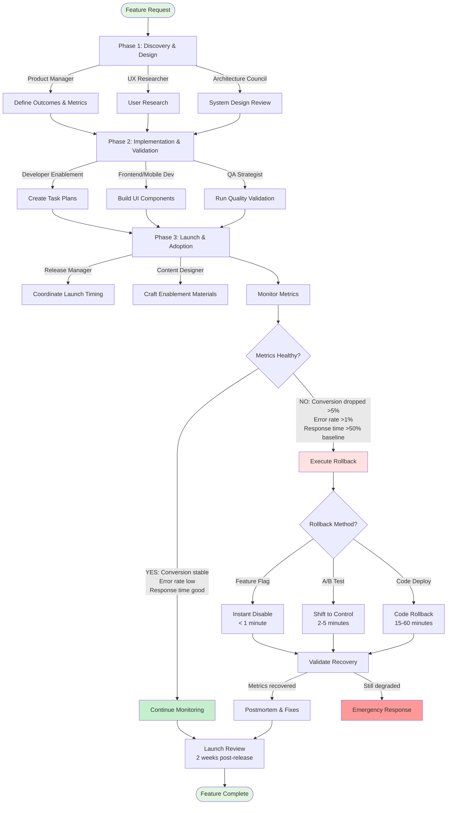

______________________________________________________________________

title: Feature Delivery Lifecycle
owner: Product Leadership
last_reviewed: 2025-02-06
related_tools:

- commands/tools/development/code-quality/dependency-lifecycle.md
- commands/tools/development/testing/quality-validation.md
- commands/tools/workflow/support-readiness.md
  risk: medium
  status: active
  id: 01K6EF5K3VBN8NXFCZMV04VZSM

______________________________________________________________________

## Feature Delivery Lifecycle

[Extended thinking: Provide one configurable path from idea validation through post-launch measurement, reducing duplication across feature playbooks.]

## Overview

Use this workflow for end-to-end delivery of a product increment, including architecture, implementation, validation, and adoption.

## Prerequisites

- Clear product objective and success metrics.
- Identified stakeholders (Product, Engineering, Design, Support).
- Access to relevant repositories and analytics dashboards.

## Inputs

- `$ARGUMENTS` — feature summary and goals.
- `$SCENARIOS` — choose any combination of `backend`, `frontend`, `data`, `multi-platform`.
- `$LAUNCH_TARGET` — target release or milestone date.

## Outputs

- Product discovery artifacts, technical design, and implementation checklist.
- Completed acceptance criteria and test evidence.
- Launch enablement assets and adoption monitoring plan.

## Workflow Visualization



## Phases

### Phase 1 – Discovery & Design

- Use Task tool with `subagent_type="product-manager"` to refine outcomes, personas, and success metrics.
- Engage `ux-researcher` for formative research when `$SCENARIOS` includes `frontend` or `multi-platform`.
- Delegate to `architecture-council` for system design review when backend or data changes are involved.

### Phase 2 – Implementation & Validation

- `developer-enablement-lead` to create task plans and scaffolding, referencing `commands/tools/development/code-quality/dependency-lifecycle.md`.
- `frontend-developer` or `mobile-developer` handle UI builds based on `$SCENARIOS`.
- `qa-strategist` runs validation leveraging `commands/tools/development/testing/quality-validation.md`.

### Phase 3 – Launch & Adoption

**Launch Coordination:**

- `release-manager` coordinates launch timing with `commands/tools/deployment/release-management.md`
- `content-designer` and `customer-success-lead` craft enablement materials
- `support-analytics-specialist` configures dashboards to track adoption and feedback

**Feature Rollback Procedures:**

**Agent:** `release-manager` executes rollback when metrics degrade

1. **When to Rollback a Feature:**

   **Automatic Rollback Triggers:**

   - Primary conversion metric drops >5% (sustained for 1 hour)
   - Error rate increases >1% above baseline
   - Page load time increases >50%
   - API response time p95 > 2x baseline
   - Customer support tickets spike >3x baseline
   - Security vulnerability discovered in new code

   **Manual Rollback Triggers:**

   - Critical bug affecting core user journey
   - Data integrity issues discovered
   - Compliance violation detected
   - Executive decision due to business reasons
   - Negative user feedback overwhelming positive

1. **Feature Rollback Decision Matrix:**

   | Rollout Stage | Rollback Method | Estimated Time | Risk Level |
   |--------------|-----------------|----------------|------------|
   | Internal beta (0% users) | Disable feature flag | < 1 minute | Very Low |
   | Canary (< 5% users) | Instant flag disable | 1-2 minutes | Low |
   | A/B test (50% users) | Shift to control | 2-5 minutes | Medium |
   | Full rollout (100%) | Emergency disable | 5-15 minutes | High |
   | Deployed code (no flag) | Code rollback required | 15-60 minutes | Very High |

1. **Feature Flag Rollback (Instant - Recommended):**

   ```python
   # LaunchDarkly example
   import launchdarkly

   ld_client = launchdarkly.get()

   # Instant disable for all users
   ld_client.variation_detail(
       "new-checkout-flow",
       context={"key": "anonymous"},
       default=False,  # Fallback to old implementation
   )

   # Or gradual rollback (reduce from 100% to 0%)
   for percentage in [75, 50, 25, 10, 5, 0]:
       update_flag_rollout("new-checkout-flow", percentage)
       time.sleep(300)  # Wait 5 minutes at each step
       if metrics_recovered():
           break
   ```

   ```bash
   # Via API for emergency situations
   curl -X PATCH https://app.launchdarkly.com/api/v2/flags/default/new-checkout-flow \
     -H "Authorization: $LD_API_KEY" \
     -d '{
       "patch": [
         {
           "op": "replace",
           "path": "/environments/production/on",
           "value": false
         }
       ]
     }'
   ```

1. **A/B Test Termination:**

   ```python
   # Optimizely example
   from optimizely import optimizely

   # Pause experiment, send all traffic to control (old version)
   optimizely_client.set_forced_variation(
       experiment_key="new_search_algorithm",
       user_id="*",  # All users
       variation_key="control",  # Original experience
   )

   # Or via API
   requests.patch(
       f"{OPTIMIZELY_API}/experiments/{experiment_id}",
       headers={"Authorization": f"Bearer {token}"},
       json={"status": "paused", "forcedVariations": {"*": "control"}},
   )
   ```

1. **Configuration-Based Rollback:**

   ```yaml
   # Update feature configuration
   features:
     new_checkout:
       enabled: false  # Disable via config change
       rollout_percentage: 0
       allowed_users: []  # Or whitelist specific users for testing

   # Kubernetes ConfigMap update
   kubectl patch configmap app-config -n production \
     -p '{"data":{"features.new_checkout.enabled":"false"}}'

   # Restart pods to pick up new config
   kubectl rollout restart deployment/api-server -n production
   ```

1. **Code Rollback (Last Resort):**

   ```bash
   # If feature can't be disabled via flag/config, rollback deployment

   # Kubernetes rollback
   kubectl rollout undo deployment/api-server -n production

   # Verify rollback
   kubectl rollout status deployment/api-server -n production

   # Check application version
   kubectl get pods -n production -o jsonpath='{.items[0].spec.containers[0].image}'
   ```

1. **Database Change Rollback:**

   ```sql
   -- If feature included database migrations

   -- Option 1: Soft rollback (mark feature as disabled in DB)
   UPDATE feature_flags SET enabled = false WHERE name = 'new_checkout_flow';

   -- Option 2: Data cleanup (if data was created)
   -- CAUTION: Test in staging first!
   BEGIN;
   DELETE FROM new_checkout_sessions WHERE created_at > '2025-10-01 14:00:00';
   -- Verify row count before commit
   SELECT COUNT(*) FROM new_checkout_sessions;
   COMMIT;

   -- Option 3: Schema rollback (use down migration)
   migrate -path ./migrations -database "$DATABASE_URL" down 1
   ```

1. **Metrics-Based Rollback Automation:**

   ```python
   # Automated circuit breaker for features
   import time
   from prometheus_client import Gauge

   feature_health = Gauge("feature_health", "Feature health score 0-100")


   def monitor_feature_health(feature_name, thresholds):
       """
       Monitor feature metrics and auto-rollback if degraded
       """
       metrics = {
           "conversion_rate": get_conversion_rate(feature_name),
           "error_rate": get_error_rate(feature_name),
           "response_time_p95": get_response_time_p95(feature_name),
           "support_tickets": get_support_ticket_count(feature_name),
       }

       # Calculate health score
       health_score = 100
       issues = []

       if metrics["conversion_rate"] < thresholds["min_conversion"] * 0.95:
           health_score -= 40
           issues.append(f"Conversion rate dropped to {metrics['conversion_rate']:.2%}")

       if metrics["error_rate"] > thresholds["max_error_rate"]:
           health_score -= 30
           issues.append(f"Error rate elevated to {metrics['error_rate']:.2%}")

       if metrics["response_time_p95"] > thresholds["max_response_time"]:
           health_score -= 20
           issues.append(f"P95 response time: {metrics['response_time_p95']}ms")

       if metrics["support_tickets"] > thresholds["max_tickets"] * 1.5:
           health_score -= 10
           issues.append(f"Support tickets: {metrics['support_tickets']}")

       feature_health.set(health_score)

       # Auto-rollback if health score too low
       if health_score < 60:
           logger.critical(f"Auto-rolling back {feature_name}. Issues: {issues}")
           rollback_feature(feature_name)
           send_alert(
               title=f"🚨 Auto-Rollback: {feature_name}",
               message=f"Health score: {health_score}/100\n" + "\n".join(issues),
               severity="critical",
           )
           return False

       return True


   # Run every 5 minutes
   while True:
       monitor_feature_health(
           "new_checkout_flow",
           {
               "min_conversion": 0.035,  # 3.5% baseline
               "max_error_rate": 0.01,  # 1% max
               "max_response_time": 500,  # 500ms p95
               "max_tickets": 10,  # 10 tickets/hour baseline
           },
       )
       time.sleep(300)
   ```

1. **Post-Rollback Validation:**

   **Immediate Checks (0-15 minutes):**

   - [ ] Feature disabled/reverted successfully
   - [ ] Users seeing old experience (verify in production)
   - [ ] Error rate returned to baseline
   - [ ] No new errors introduced by rollback itself
   - [ ] Database integrity maintained (no orphaned data)

   **Short-term Validation (15 minutes - 1 hour):**

   - [ ] Conversion rate recovered to baseline (within 2%)
   - [ ] Response times normal (p95 < 1.1x baseline)
   - [ ] Support ticket volume decreasing
   - [ ] No customer escalations
   - [ ] Business metrics stable (revenue, signups, etc.)

   **Extended Monitoring (1-24 hours):**

   - [ ] All metrics sustained at healthy levels
   - [ ] No delayed issues discovered
   - [ ] Analytics dashboards show expected behavior
   - [ ] Customer feedback neutral or positive

1. **Rollback Communication:**

   **Internal Communication Template:**

   ```markdown
   Subject: Feature Rollback: [Feature Name]

   Team,

   We've rolled back the [feature name] due to [brief reason].

   **Timeline:**
   - Launched: [timestamp]
   - Issue detected: [timestamp]
   - Rollback executed: [timestamp]
   - Systems stable: [timestamp]

   **Impact:**
   - Users affected: [percentage or number]
   - Duration: [time]
   - Customer complaints: [number]

   **Metrics:**
   - Conversion rate: [before] → [during] → [after rollback]
   - Error rate: [before] → [during] → [after rollback]

   **Root Cause (preliminary):**
   [Brief explanation of what went wrong]

   **Next Steps:**
   1. [Action item with owner]
   2. [Action item with owner]
   3. Postmortem scheduled for [date/time]

   Thank you for the quick response.
   [Name]
   ```

   **Customer Communication (if needed):**

   ```markdown
   Subject: Update: [Feature Name]

   Hi [Customer],

   We noticed an issue with the new [feature name] we launched today and
   have temporarily reverted to the previous version to ensure the best
   experience for you.

   **What this means for you:**
   - The service is fully operational
   - You'll see the familiar interface you're used to
   - No data was lost
   - No action needed on your part

   We're working on improvements and will re-launch when ready. We'll keep
   you posted.

   Thank you for your patience.

   [Support Team]
   ```

1. **Feature Rollback Checklist:**

   **Pre-Launch (Prevention):**

   - [ ] Feature flag configured with instant disable capability
   - [ ] A/B test designed with proper sample size
   - [ ] Success metrics defined with thresholds
   - [ ] Automated monitoring alerts configured
   - [ ] Rollback procedure documented and tested in staging
   - [ ] On-call engineer briefed on feature and rollback process

   **During Launch:**

   - [ ] Gradual rollout (5% → 10% → 25% → 50% → 100%)
   - [ ] Monitor metrics at each rollout stage (1-4 hours)
   - [ ] Support team monitoring customer feedback
   - [ ] Engineering team available for quick rollback

   **Rollback Execution:**

   - [ ] Rollback decision made by [Product Manager / Engineering Manager]
   - [ ] Feature disabled via flag/config (fastest method)
   - [ ] Rollback verified in production
   - [ ] Metrics confirm recovery
   - [ ] Internal team notified
   - [ ] Customers notified (if impact significant)

   **Post-Rollback:**

   - [ ] Root cause analysis completed
   - [ ] Fixes implemented and tested
   - [ ] Re-launch plan created
   - [ ] Lessons learned documented
   - [ ] Team postmortem scheduled

1. **Rollback vs Fix-Forward Decision Tree:**

   ```
   Feature Issue Detected
   │
   ├─ Affecting >10% of users OR critical path?
   │  ├─ YES → Rollback immediately
   │  └─ NO → Continue to next check
   │
   ├─ Can fix be deployed in <15 minutes?
   │  ├─ YES → Fix forward (if low risk)
   │  └─ NO → Rollback, fix offline
   │
   ├─ Data integrity at risk?
   │  ├─ YES → Rollback immediately
   │  └─ NO → Continue to next check
   │
   ├─ Conversion rate dropped >5%?
   │  ├─ YES → Rollback, investigate
   │  └─ NO → Monitor closely, may be acceptable variance
   │
   └─ Edge case affecting <1% users?
      ├─ YES → Document, fix in next release
      └─ NO → If affecting 1-10%, disable for affected users only
   ```

**Feature Rollback Best Practices:**

1. **Always Use Feature Flags:** Every feature should have an instant kill switch
1. **Gradual Rollouts:** Never go 0% → 100% immediately
1. **Metrics-Based Decisions:** Define success criteria before launch
1. **Fast Rollback, Slow Rollout:** Rollback in minutes, re-launch in days
1. **Automate When Possible:** Circuit breakers for critical metrics
1. **Communicate Transparently:** Internal and external stakeholders
1. **Learn and Improve:** Every rollback is a learning opportunity

## Handoffs & Follow-Up

- Schedule a launch review two weeks post-release to review success metrics.
- Capture lessons learned and feed them into product discovery and backlog grooming.
