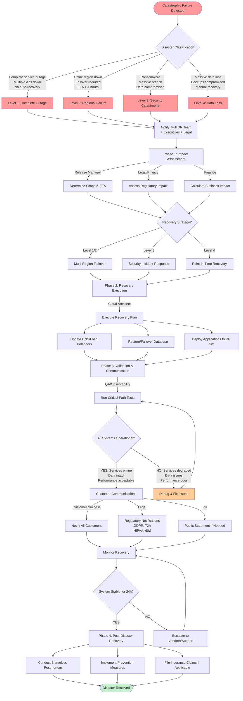

______________________________________________________________________

title: Disaster Recovery & Business Continuity Workflow
owner: Platform Reliability Guild
last_reviewed: 2025-10-01
related_tools:

- commands/tools/monitoring/observability-lifecycle.md
- commands/tools/maintenance/maintenance-cadence.md
- commands/tools/workflow/support-readiness.md
  risk: critical
  status: active
  id: 01K6HMQY2NXRZ8WV5T4JK6QH3P

______________________________________________________________________

## Disaster Recovery & Business Continuity Workflow

[Extended thinking: Prepare for and respond to catastrophic failures including complete service outages, data center failures, security breaches, and data loss scenarios.]

## Overview

Activate this workflow when facing catastrophic system failures that exceed normal incident response capabilities, including complete data center outages, ransomware attacks, massive data loss, or extended regional failures.

## Prerequisites

- Disaster recovery plan documented and tested annually
- Backup and recovery procedures validated
- Alternative infrastructure (secondary region/data center) provisioned
- Emergency contact tree established
- Business continuity insurance and legal contacts available

## Inputs

- `$ARGUMENTS` — disaster type and scope description
- `$DISASTER_TYPE` — `datacenter_outage`, `ransomware`, `data_loss`, `security_breach`, `vendor_failure`, `natural_disaster`
- `$AFFECTED_REGIONS` — geographic or cloud regions impacted
- `$ESTIMATED_DURATION` — expected outage duration (hours, days, weeks)

## Outputs

- Disaster declaration and executive notification
- Recovery plan with timeline and resource requirements
- Failover execution logs and validation reports
- Business impact assessment and customer communications
- Post-disaster recovery report and prevention plan

## Workflow Visualization



## Phases

### Phase 0 – Disaster Assessment & Declaration

**Immediate Actions (First 15 Minutes)**

1. **Disaster Classification:**

   **Level 1 - Complete Service Outage:**

   - All production services unavailable
   - Multiple availability zones down
   - No automatic recovery possible
   - **Response:** Activate full DR team

   **Level 2 - Regional Failure:**

   - Entire cloud region or data center unavailable
   - Backup region available but requires failover
   - Estimated recovery time > 4 hours
   - **Response:** Activate DR team + executive notification

   **Level 3 - Security Catastrophe:**

   - Ransomware or massive data breach
   - Data integrity compromised
   - Requires forensics and potential law enforcement
   - **Response:** Activate security IR team + legal + executives

   **Level 4 - Data Loss:**

   - Massive data deletion or corruption
   - Backups compromised or unavailable
   - Recovery requires PITR or manual reconstruction
   - **Response:** Activate DB team + legal + executives

1. **Executive Notification:**

   ```bash
   # Immediate notification (automated)
   curl -X POST $PAGERDUTY_API/incidents \
     -H "Authorization: Token $PAGERDUTY_TOKEN" \
     -d '{
       "incident": {
         "type": "incident",
         "title": "DISASTER: '${DISASTER_TYPE}'",
         "service": {"id": "'$SERVICE_ID'", "type": "service_reference"},
         "urgency": "high",
         "escalation_policy": {"id": "'$EXEC_ESCALATION_POLICY'", "type": "escalation_policy_reference"}
       }
     }'

   # Execute emergency call tree
   python scripts/emergency_call_tree.py \
     --disaster-type $DISASTER_TYPE \
     --severity CRITICAL \
     --affected-regions $AFFECTED_REGIONS
   ```

1. **Assemble War Room:**

   - **Incident Commander:** CTO or VP Engineering
   - **Technical Lead:** Principal Engineer / Architect
   - **Database Lead:** Senior DBA
   - **Security Lead:** CISO or Security Director (if security-related)
   - **Communications Lead:** VP Customer Success / PR
   - **Legal:** General Counsel (if data breach or regulatory impact)
   - **Finance:** CFO (if revenue impact significant)

1. **Initial Assessment:**

   ```bash
   # Check service health across all regions
   for region in us-east-1 us-west-2 eu-west-1; do
     echo "=== Checking $region ==="
     aws ec2 describe-instances --region $region \
       --filters "Name=tag:Environment,Values=production" \
       --query 'Reservations[*].Instances[*].[InstanceId,State.Name,PrivateIpAddress]'
   done

   # Check database availability
   for db_endpoint in $PRIMARY_DB $REPLICA_DB $DR_DB; do
     echo "Testing $db_endpoint..."
     pg_isready -h $db_endpoint -p 5432 && echo "✓ Available" || echo "✗ UNAVAILABLE"
   done

   # Check backup status
   latest_backup=$(aws s3 ls s3://$BACKUP_BUCKET/latest/ --recursive | sort | tail -n 1)
   echo "Latest backup: $latest_backup"
   ```

1. **Declare Disaster:**

   ```markdown
   # Disaster Declaration Template

   **Disaster ID:** DR-$(date +%Y%m%d-%H%M)
   **Type:** ${DISASTER_TYPE}
   **Severity:** Level X (1-4)
   **Declared At:** $(date -u +"%Y-%m-%d %H:%M:%S UTC")
   **Incident Commander:** [Name]

   ## Scope
   - **Affected Services:** [List]
   - **Affected Regions:** [List]
   - **Customer Impact:** [Estimated %]
   - **Data Impact:** [None / Potential / Confirmed]

   ## Initial Assessment
   - **Root Cause:** [Known / Under Investigation]
   - **Estimated Recovery Time:** [Hours / Days]
   - **Failover Available:** [Yes / No / Partial]

   ## Immediate Actions Taken
   - [ ] War room assembled
   - [ ] Executive team notified
   - [ ] Customer communications drafted
   - [ ] Backup systems assessed
   - [ ] Forensics initiated (if security-related)

   ## Next Steps
   1. [Action with owner and ETA]
   2. [Action with owner and ETA]
   3. [Action with owner and ETA]
   ```

**Assessment Checklist:**

- [ ] Disaster type classified (Level 1-4)
- [ ] Incident Commander assigned
- [ ] War room established (virtual or physical)
- [ ] Executive team notified
- [ ] Scope and impact assessed
- [ ] Backup systems inventoried
- [ ] Recovery time estimated
- [ ] Customer communication plan initiated

### Phase 1 – Immediate Stabilization & Triage

**Agent:** `observability-incident-lead` leads technical triage

1. **Stop the Bleeding:**

   **For Ransomware / Security Breach:**

   ```bash
   # Immediately isolate affected systems
   aws ec2 modify-instance-attribute \
     --instance-id $INFECTED_INSTANCE \
     --no-source-dest-check \
     --groups sg-isolated  # Security group with no egress

   # Rotate all credentials
   python scripts/emergency_credential_rotation.py --all

   # Enable enhanced logging
   aws cloudtrail update-trail --name prod-trail --is-multi-region-trail \
     --include-global-service-events --enable-log-file-validation

   # Take forensic snapshots before any remediation
   aws ec2 create-snapshot --volume-id $AFFECTED_VOLUME \
     --description "Forensic snapshot - DR-$(date +%Y%m%d)"
   ```

   **For Data Loss:**

   ```bash
   # Stop all write operations immediately
   kubectl scale deployment --all --replicas=0 -n production

   # Create snapshots of current state
   for db in $DB_LIST; do
     pg_dump -Fc $db > /forensics/current_state_${db}_$(date +%Y%m%d_%H%M%S).dump
   done

   # Inventory available backups
   aws s3 ls s3://$BACKUP_BUCKET/ --recursive | grep $(date +%Y-%m-%d) > /tmp/available_backups.txt
   ```

   **For Data Center Outage:**

   ```bash
   # Verify secondary region availability
   aws ec2 describe-availability-zones --region $DR_REGION

   # Check failover readiness
   kubectl get nodes --context $DR_CLUSTER
   psql $DR_DATABASE_URL -c "SELECT version();"

   # Verify DNS failover capability
   dig +short $DOMAIN_NAME
   dig +short $DOMAIN_NAME @8.8.8.8
   ```

1. **Engage Specialists:**

   - Use Task tool with `subagent_type="security-auditor"` for security breaches
   - Use Task tool with `subagent_type="database-operations-specialist"` for data loss
   - Use Task tool with `subagent_type="architecture-council"` for infrastructure failures
   - Use Task tool with `subagent_type="legal-advisor"` for regulatory implications

1. **Preserve Evidence:**

   ```bash
   # Capture system state
   kubectl get all --all-namespaces > /forensics/k8s_state_$(date +%Y%m%d_%H%M%S).yaml
   aws ec2 describe-instances --region $REGION > /forensics/ec2_state_$(date +%Y%m%d_%H%M%S).json

   # Export logs
   kubectl logs --all-containers --tail=10000 -n production > /forensics/app_logs_$(date +%Y%m%d_%H%M%S).log

   # CloudTrail export
   aws cloudtrail lookup-events --lookup-attributes AttributeKey=EventName,AttributeValue=DeleteBucket \
     --start-time $(date -u -d '24 hours ago' +%Y-%m-%dT%H:%M:%S) \
     --max-results 1000 > /forensics/cloudtrail_$(date +%Y%m%d_%H%M%S).json

   # Upload to secure forensics bucket
   aws s3 sync /forensics/ s3://$FORENSICS_BUCKET/DR-$(date +%Y%m%d)/ \
     --sse aws:kms --sse-kms-key-id $FORENSICS_KMS_KEY
   ```

1. **Assess Recovery Options:**

   | Disaster Type | Recovery Options | Estimated RTO | Estimated RPO |
   |--------------|------------------|---------------|---------------|
   | **Datacenter Outage** | Failover to DR region | 1-4 hours | 5-15 minutes |
   | **Ransomware** | Restore from clean backups | 4-12 hours | Last clean backup |
   | **Data Loss (DB)** | Point-in-time recovery | 2-8 hours | Backup interval |
   | **Data Loss (Files)** | S3 versioning restore | 1-4 hours | Near-zero |
   | **Security Breach** | Rebuild from known-good images | 8-24 hours | Varies |
   | **Vendor Failure** | Migrate to alternative provider | Days-Weeks | Backup-dependent |

**Stabilization Checklist:**

- [ ] No further damage occurring
- [ ] Forensic evidence preserved
- [ ] Backup systems inventoried and accessible
- [ ] Recovery options identified
- [ ] Legal and compliance teams briefed (if applicable)
- [ ] Estimated RTO/RPO communicated to executives

### Phase 2 – Recovery Execution

**Agent:** `deployment-engineer` executes recovery plan

**Recovery Procedure by Disaster Type:**

#### A. Datacenter / Regional Failover

```bash
# 1. Verify DR environment ready
kubectl get nodes --context $DR_CLUSTER
kubectl get namespaces --context $DR_CLUSTER

# 2. Restore latest database backup to DR region
pg_restore -d $DR_DATABASE_URL /backups/latest.dump

# 3. Deploy application to DR cluster
kubectl apply -f k8s/production/ --context $DR_CLUSTER

# 4. Update DNS to point to DR region (Route53 example)
aws route53 change-resource-record-sets --hosted-zone-id $ZONE_ID --change-batch '{
  "Changes": [{
    "Action": "UPSERT",
    "ResourceRecordSet": {
      "Name": "api.example.com",
      "Type": "CNAME",
      "TTL": 60,
      "ResourceRecords": [{"Value": "dr-api-lb.us-west-2.elb.amazonaws.com"}]
    }
  }]
}'

# 5. Monitor DNS propagation
watch -n 5 "dig +short api.example.com"

# 6. Verify application health
curl -v https://api.example.com/health

# 7. Enable traffic gradually
kubectl scale deployment api-server --replicas=3 --context $DR_CLUSTER
kubectl scale deployment api-server --replicas=10 --context $DR_CLUSTER
kubectl scale deployment api-server --replicas=50 --context $DR_CLUSTER
```

#### B. Ransomware Recovery

```bash
# 1. Identify last clean backup (before ransomware infection)
last_clean_backup=$(aws s3api list-object-versions \
  --bucket $BACKUP_BUCKET \
  --prefix latest/ \
  --max-items 100 \
  --query 'Versions[?LastModified<`2025-10-01T10:00:00Z`] | [0].VersionId')

# 2. Provision new clean infrastructure
terraform apply -var="environment=recovery" -var="use_new_vpc=true"

# 3. Restore from clean backup
aws s3 cp s3://$BACKUP_BUCKET/latest/db-backup.dump . --version-id $last_clean_backup
pg_restore -d $RECOVERY_DATABASE_URL db-backup.dump

# 4. Deploy application from verified clean images
docker pull myapp:$KNOWN_GOOD_VERSION
kubectl set image deployment/api-server api-server=myapp:$KNOWN_GOOD_VERSION

# 5. Rotate ALL credentials and secrets
python scripts/emergency_credential_rotation.py --all --force

# 6. Scan recovered systems for malware
clamscan -r /app --infected --remove
trivy image myapp:$KNOWN_GOOD_VERSION

# 7. Gradually restore service
# (DO NOT rush - verify each step)
```

#### C. Point-in-Time Recovery (Data Loss)

```bash
# 1. Identify recovery target time
RECOVERY_TIME="2025-10-01 09:45:00"  # Just before data loss

# 2. Restore base backup
pg_restore -d $RECOVERY_DATABASE_URL /backups/base-backup.dump

# 3. Apply WAL logs up to recovery point
# Configure in postgresql.conf:
# recovery_target_time = '2025-10-01 09:45:00'
# recovery_target_action = 'pause'

# 4. Start PostgreSQL in recovery mode
pg_ctl -D /var/lib/postgresql/data start

# 5. Verify recovery point
psql $RECOVERY_DATABASE_URL -c "SELECT pg_last_xact_replay_timestamp();"

# 6. Inspect data at recovery point
psql $RECOVERY_DATABASE_URL -c "SELECT count(*) FROM critical_table;"
psql $RECOVERY_DATABASE_URL -c "SELECT * FROM critical_table ORDER BY id DESC LIMIT 10;"

# 7. If correct, promote to primary
psql $RECOVERY_DATABASE_URL -c "SELECT pg_wal_replay_resume();"
pg_ctl promote
```

#### D. S3 Data Recovery (Deleted Objects)

```bash
# 1. List deleted object versions
aws s3api list-object-versions \
  --bucket $PRODUCTION_BUCKET \
  --prefix deleted-path/ \
  --query 'DeleteMarkers[].{Key:Key,VersionId:VersionId,LastModified:LastModified}' \
  > /tmp/deleted_objects.json

# 2. Restore specific version
aws s3api delete-object \
  --bucket $PRODUCTION_BUCKET \
  --key deleted-path/file.json \
  --version-id $DELETE_MARKER_VERSION_ID  # Removes delete marker

# 3. Bulk restore (Python script)
python scripts/s3_bulk_restore.py \
  --bucket $PRODUCTION_BUCKET \
  --prefix deleted-path/ \
  --before-time "2025-10-01T10:00:00Z"
```

**Recovery Execution Checklist:**

- [ ] Recovery environment provisioned
- [ ] Backups restored and validated
- [ ] Application deployed to recovery environment
- [ ] DNS updated (if failover)
- [ ] Traffic gradually restored
- [ ] Data integrity verified
- [ ] Authentication and authorization working
- [ ] Critical business functions operational

### Phase 3 – Service Restoration & Validation

**Agent:** `qa-strategist` validates recovered system

1. **Smoke Testing:**

   ```bash
   # Critical path testing
   python tests/smoke_tests/critical_user_journey.py --env recovery

   # Authentication
   curl -X POST https://api.example.com/auth/login \
     -d '{"email":"test@example.com","password":"test"}' \
     | jq '.access_token'

   # Database connectivity
   psql $RECOVERY_DATABASE_URL -c "\
     SELECT 'users' as table, count(*) from users \
     UNION ALL \
     SELECT 'orders', count(*) from orders \
     UNION ALL \
     SELECT 'products', count(*) from products;"

   # File storage
   aws s3 ls s3://$PRODUCTION_BUCKET/ | wc -l
   ```

1. **Data Integrity Validation:**

   ```bash
   # Compare row counts (if comparison DB available)
   psql $RECOVERY_DATABASE_URL -c "SELECT count(*) FROM users;" # Should match last known good

   # Check for orphaned records
   psql $RECOVERY_DATABASE_URL -c "\
     SELECT count(*) as orphaned_orders \
     FROM orders o \
     LEFT JOIN users u ON o.user_id = u.id \
     WHERE u.id IS NULL;"

   # Validate foreign key integrity
   psql $RECOVERY_DATABASE_URL -c "\
     SELECT conname, conrelid::regclass \
     FROM pg_constraint \
     WHERE contype = 'f' AND NOT convalidated;"

   # Business metrics validation
   python scripts/validate_business_metrics.py --env recovery --compare-to last-known-good
   ```

1. **Performance Validation:**

   ```bash
   # Load testing (reduced load)
   k6 run --vus 10 --duration 5m tests/load/api_endpoints.js --env RECOVERY

   # Query performance
   psql $RECOVERY_DATABASE_URL -c "\
     EXPLAIN ANALYZE SELECT * FROM users WHERE email = 'test@example.com';"

   # Response time validation
   for endpoint in /health /api/users /api/orders; do
     echo "Testing $endpoint..."
     curl -w "@curl-format.txt" -o /dev/null -s https://api.example.com$endpoint
   done
   ```

1. **Security Validation:**

   ```bash
   # Verify all credentials rotated
   python scripts/verify_credential_rotation.py --after-time $DISASTER_TIME

   # Security scan
   trivy image myapp:current-version
   safety check --json

   # Access control verification
   kubectl auth can-i --list --as=system:serviceaccount:default:api-server

   # Audit recent access
   aws cloudtrail lookup-events \
     --start-time $(date -u -d '1 hour ago' +%Y-%m-%dT%H:%M:%S) \
     --max-results 100 \
     --query 'Events[?ErrorCode!=`null`]'
   ```

1. **Gradual Traffic Ramp:**

   ```bash
   # Start with internal traffic only
   kubectl annotate ingress api-ingress \
     "nginx.ingress.kubernetes.io/whitelist-source-range=10.0.0.0/8"

   # Monitor for 15 minutes
   # Then remove whitelist for 1% of users
   # Then 5%, 10%, 25%, 50%, 100% over several hours
   ```

**Restoration Validation Checklist:**

- [ ] All smoke tests passing
- [ ] Data integrity verified (row counts, foreign keys)
- [ ] No orphaned or corrupted data detected
- [ ] Performance within acceptable range
- [ ] Security scans passing
- [ ] All credentials rotated
- [ ] Traffic ramped successfully
- [ ] No elevated error rates

### Phase 4 – Business Continuity & Communication

**Agent:** `customer-success-lead` manages communications

1. **Customer Communications:**

   **During Outage (Hourly Updates):**

   ```markdown
   # Status Page Update Template

   **$(date +"%Y-%m-%d %H:%M UTC")** - Investigating

   We are currently experiencing a service disruption affecting [description].
   Our team is actively working on restoration.

   **Impact:** [Description]
   **Affected Services:** [List]
   **Estimated Resolution:** [Timeframe or "Under investigation"]

   Next update in 1 hour or when significant progress is made.
   ```

   **After Resolution:**

   ```markdown
   # Post-Incident Communication

   Subject: [Service Name] Service Restoration Complete

   Dear Customers,

   We are writing to inform you that the service disruption that began on
   [date] at [time UTC] has been fully resolved as of [date] at [time UTC].

   **What Happened:**
   [Clear, honest explanation without excessive technical jargon]

   **Impact:**
   - Duration: [X hours]
   - Affected customers: [Percentage or "all customers"]
   - Data impact: [None / Explained]

   **Resolution:**
   [What was done to fix it]

   **Your Data:**
   [Explicitly state if customer data was affected, lost, or compromised]

   **Prevention:**
   We are taking the following steps to prevent recurrence:
   1. [Action item]
   2. [Action item]
   3. [Action item]

   **Compensation:** (if applicable)
   [Service credits, refunds, or other remediation]

   We sincerely apologize for this disruption and any impact to your business.

   [Executive signature]
   ```

1. **Internal Communications:**

   - All-hands meeting within 24 hours
   - Detailed postmortem within 72 hours
   - Engineering team retrospective
   - Update disaster recovery playbook

1. **Regulatory/Legal Notifications:**

   **If Data Breach (GDPR):**

   - Notify supervisory authority within 72 hours
   - Notify affected individuals "without undue delay"
   - Document breach in data breach register

   **If Healthcare Data (HIPAA):**

   - Notify HHS within 60 days (if >500 individuals)
   - Notify media (if >500 individuals in same state)
   - Notify individuals within 60 days

   **If Payment Data (PCI-DSS):**

   - Notify payment brands (Visa, Mastercard, etc.)
   - Notify acquiring bank
   - Engage PCI forensics investigator

1. **Financial Impact Assessment:**

   ```python
   # Calculate revenue impact
   revenue_per_hour = $X
   outage_hours = Y
   direct_revenue_loss = revenue_per_hour * outage_hours

   # SLA credits
   affected_customers = Z
   average_monthly_spend = $A
   sla_credit_percentage = B%
   sla_credits = affected_customers * average_monthly_spend * (sla_credit_percentage/100)

   # Estimated total impact
   total_impact = direct_revenue_loss + sla_credits + recovery_costs

   # Report to CFO and Board
   ```

**Communication Checklist:**

- [ ] Status page updated during outage (hourly)
- [ ] Customer email sent after resolution
- [ ] Regulatory notifications filed (if required)
- [ ] Internal all-hands completed
- [ ] Media/PR statement prepared (if public-facing)
- [ ] Financial impact assessed
- [ ] Insurance claim filed (if applicable)

## Post-Disaster Recovery

### Immediate Actions (First Week)

1. **Comprehensive Postmortem:**

   - Use `incident-response.md` postmortem template
   - Include timeline with all decisions made
   - Document what went well and what failed
   - Identify single points of failure
   - Calculate actual RTO/RPO vs targets

1. **Decommission Recovery Environment:**

   - Do NOT immediately decommission
   - Keep running for at least 7 days
   - Verify primary system stable
   - Extract any additional forensic data needed
   - Document recovery environment for future use

1. **Restore Normal Operations:**

   ```bash
   # Gradually migrate back to primary region (if failover occurred)
   # Use blue-green strategy

   # Verify primary region fully healthy
   # Enable replication from DR to primary
   # Switch read traffic to primary
   # Switch write traffic to primary (after soak period)
   # Decommission DR environment (keep snapshots)
   ```

### Medium-Term Actions (First Month)

1. **DR Plan Updates:**

   - Document lessons learned
   - Update runbooks with new procedures
   - Add any missing recovery scenarios
   - Update RTO/RPO targets based on actual experience

1. **Technical Improvements:**

   - Fix identified single points of failure
   - Enhance monitoring and alerting
   - Improve backup frequency if RPO missed
   - Automate manual recovery steps

1. **Training:**

   - Conduct DR simulation exercise
   - Train new team members on DR procedures
   - Cross-train specialists (reduce key person risk)

1. **Vendor Relationships:**

   - Review SLAs with vendors
   - Evaluate need for multi-vendor strategy
   - Ensure vendor DR plans align with yours

### Long-Term Actions (Ongoing)

1. **Regular DR Testing:**

   - Quarterly: Backup restore test
   - Semi-annually: Partial failover test
   - Annually: Full DR simulation

1. **DR Metrics Tracking:**

   ```
   Monthly Review:
   - Backup success rate: >99.9%
   - Backup restore test success: 100%
   - RTO target met: Yes/No
   - RPO target met: Yes/No
   - Mean Time to Detect (MTTD): <X minutes
   - Mean Time to Recover (MTTR): <X hours
   ```

1. **Architecture Evolution:**

   - Move toward multi-region active-active
   - Implement chaos engineering practices
   - Enhance observability and monitoring
   - Automate recovery procedures

## Handoffs & Follow-Up

- Complete comprehensive postmortem within 72 hours
- Share findings with entire engineering organization
- Update DR plan and runbooks within 1 week
- Schedule DR simulation within 1 month
- Implement technical improvements within 1 quarter
- Report to Board of Directors (for significant disasters)
- File insurance claim if applicable
- Review and update business continuity insurance

______________________________________________________________________

**Disaster Recovery Metrics:**

| Metric | Target | Actual | Status |
|--------|--------|--------|--------|
| Mean Time to Detect (MTTD) | \<15 min | | |
| Mean Time to Assemble Team | \<30 min | | |
| Mean Time to Declare Disaster | \<1 hour | | |
| Recovery Time Objective (RTO) | \<4 hours | | |
| Recovery Point Objective (RPO) | \<15 min | | |
| Data Loss | Zero | | |
| Customer Communication Time | \<2 hours | | |

______________________________________________________________________

**Remember:** Disasters are not "if" but "when". Regular testing, documentation, and continuous improvement of this workflow can mean the difference between a company-ending event and a recoverable incident.
