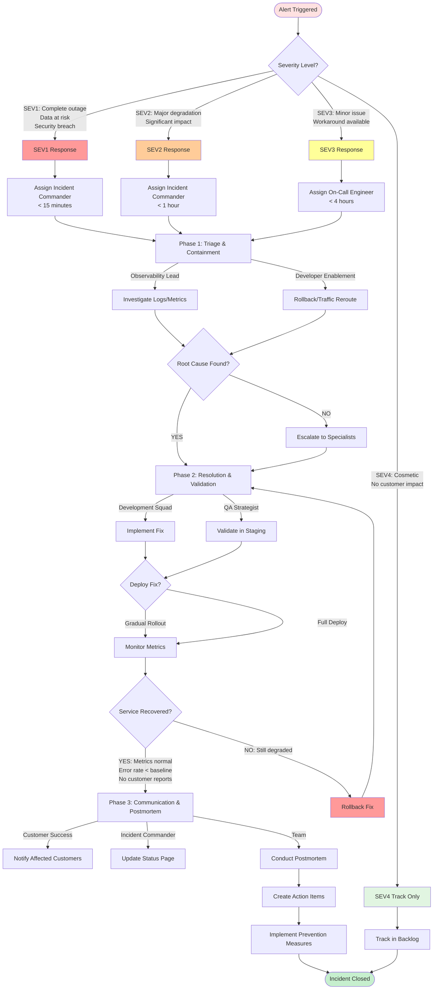

______________________________________________________________________

title: Incident Response Workflow
owner: Platform Reliability Guild
last_reviewed: 2025-02-06
related_tools:

- commands/tools/monitoring/observability-lifecycle.md
  risk: critical
  status: active
  id: 01K6EF8EJN8EVC240V87X7KH92

______________________________________________________________________

## Incident Response Workflow

[Extended thinking: Provide a reliable incident lifecycle from detection through postmortem with clear ownership and communications.]

## Overview

Activate this workflow when a service degradation or outage is declared.

## Prerequisites

- Incident commander assigned and severity agreed.
- Communication channels (Slack, Zoom, StatusPage) ready.
- Access to telemetry and deployment history.

## Severity Level Definitions

| Level | Definition | Response Time | Communication | Examples |
|-------|-----------|---------------|---------------|----------|
| **SEV1** | Complete service outage, customer data at risk, major revenue impact, security breach | **15 minutes** | Immediate executive notification, public status page update, customer emails | Database down, authentication broken, payment processing failed, data breach, complete site outage |
| **SEV2** | Major feature degraded, significant customer subset affected, revenue impact | **1 hour** | Status page update, affected customer notification | Search broken, slow API response (>5s), critical feature unavailable, region outage |
| **SEV3** | Minor feature issue, workaround available, limited customer impact | **4 hours** | Internal tracking, optional status page update | UI glitch affecting single page, minor feature bug, non-critical service degraded |
| **SEV4** | Cosmetic issue, no customer impact, tracking item | **24 hours** | Internal tracking only | Documentation error, minor UI cosmetic issue, tech debt item, improvement idea |

### Automated Incident Declaration Triggers

**SEV1 Auto-Declaration:**

- Error rate > 10% for > 5 minutes
- Authentication failure rate > 5%
- Database connection failures
- Payment processing failures > 1%
- Security alerts (unauthorized access, data exfiltration)

**SEV2 Auto-Declaration:**

- Error rate 5-10% for > 15 minutes
- API response time > 5 seconds (p95) for > 10 minutes
- Major feature availability < 95% for > 15 minutes
- Customer support ticket spike > 3x baseline

**Incident Commander Assignment:**

- SEV1/SEV2: On-call Platform Reliability Engineer immediately assigned
- SEV3: On-call engineer notified, can defer if handling higher severity
- SEV4: Assigned during business hours, tracked in backlog

### Response Time SLAs

| Severity | Time to Acknowledge | Time to Mitigation | Time to Resolution |
|----------|-------------------|-------------------|-------------------|
| SEV1 | 15 minutes | 1 hour | 4 hours |
| SEV2 | 1 hour | 4 hours | 24 hours |
| SEV3 | 4 hours | 24 hours | 1 week |
| SEV4 | 24 hours | 1 week | 1 month |

## Inputs

- `$ARGUMENTS` — incident summary and customer impact.
- `$SEVERITY` — incident severity level (SEV1–SEV4).
- `$AFFECTED_AREAS` — services or regions impacted.

## Outputs

- Mitigation status log and incident timeline.
- Verified fix with supporting evidence.
- Post-incident report and follow-up actions.

## Workflow Visualization

## Phases

### Phase 1 – Triage & Containment

- `observability-incident-lead` leads investigation using `commands/tools/monitoring/observability-lifecycle.md`.
- `developer-enablement-lead` assists with feature flags, rollbacks, or traffic rerouting.

### Phase 2 – Resolution & Validation

- Task `development` squads via `developer-enablement-lead` to implement fixes.
- `qa-strategist` validates remediation using targeted regression suites.

### Phase 3 – Communication & Recovery

- `release-manager` coordinates controlled rollout of the fix.
- `customer-success-lead` manages customer updates and executive summaries.

### Phase 4 – Post-Incident Review

- `observability-incident-lead` documents timeline and contributing factors.
- `finops-specialist` or `privacy-officer` join when impact includes cost or data exposure.

## Postmortem Template

**Required for:** SEV1 (within 48 hours), SEV2 (within 1 week)
**Optional for:** SEV3, SEV4

### 1. Incident Summary

- **Incident ID:** [Auto-generated]
- **Severity:** SEV1 / SEV2 / SEV3 / SEV4
- **Duration:** [Time from detection to full resolution]
- **Incident Commander:** [Name]
- **Teams Involved:** [List all teams]

### 2. Impact Assessment

- **Customer Impact:** [Number of users affected, % of total]
- **Service Impact:** [Which services/features were degraded]
- **Revenue Impact:** [Estimated financial impact if applicable]
- **Data Impact:** [Any data loss, corruption, or exposure]
- **SLA Breach:** [Yes/No, which SLAs were violated]

### 3. Timeline

| Time | Event | Action Taken | Owner |
|------|-------|-------------|-------|
| HH:MM | Initial detection | Alert fired from monitoring | System |
| HH:MM | Incident declared | IC assigned, war room opened | [Name] |
| HH:MM | Root cause identified | [Brief description] | [Name] |
| HH:MM | Mitigation deployed | [What was done] | [Name] |
| HH:MM | Service restored | Metrics returned to baseline | [Name] |
| HH:MM | Incident closed | All systems verified healthy | [Name] |

### 4. Root Cause Analysis

**What Happened:**
[Detailed technical explanation of what went wrong]

**Why It Happened:**

- **Immediate Cause:** [Direct technical trigger]
- **Contributing Factors:** [Configuration, process, human factors]
- **Underlying Cause:** [Systemic issues that allowed this to happen]

### 5. What Went Well

- [Things that helped resolve the incident quickly]
- [Monitoring/alerting that worked effectively]
- [Team coordination successes]

### 6. What Went Poorly

- [Gaps in monitoring or alerting]
- [Communication breakdowns]
- [Process failures]
- [Technical debt that contributed]

### 7. Action Items

| Priority | Action | Owner | Due Date | Status |
|----------|--------|-------|----------|--------|
| P0 | [Critical preventive measure] | [Name] | [Date] | Open |
| P1 | [High-priority improvement] | [Name] | [Date] | Open |
| P2 | [Medium-priority task] | [Name] | [Date] | Open |

### 8. Prevention & Detection Improvements

- **Monitoring:** [New alerts, dashboards, or metrics to add]
- **Testing:** [Test coverage gaps to address]
- **Documentation:** [Runbooks or procedures to create/update]
- **Architecture:** [System changes to prevent recurrence]

### 9. Lessons Learned

[Key takeaways that apply to future incidents or system design]

## Handoffs & Follow-Up

- Track all action items in maintenance cadences until resolved.
- Update runbooks and monitor configurations to prevent recurrence.
- Schedule postmortem review meeting for SEV1/SEV2 incidents.
- Share postmortem with broader engineering team and leadership.
