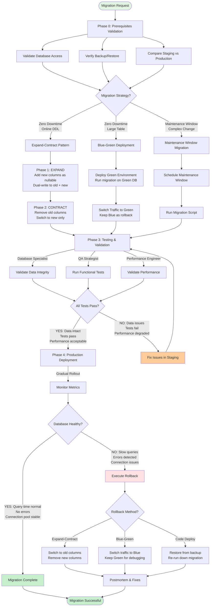

______________________________________________________________________

title: Database Migration Workflow
owner: Delivery Operations
last_reviewed: 2025-10-01
related_tools:

- commands/tools/deployment/release-management.md
- commands/tools/monitoring/observability-lifecycle.md
- commands/tools/workflow/privacy-impact-assessment.md
  risk: critical
  status: active
  id: 01K6HMQV8YWXN3PZ4JR6ST2K9E

______________________________________________________________________

## Database Migration Workflow

[Extended thinking: Enable safe, zero-downtime database schema changes with comprehensive rollback capabilities and data integrity validation.]

## Overview

Use this workflow to plan, execute, and validate database migrations across environments with zero downtime and guaranteed rollback capability.

## Prerequisites

- Database schema change requirements documented
- Target database access credentials and connection details
- Backup and restore procedures tested
- Staging environment matching production schema

## Inputs

- `$ARGUMENTS` — migration description and business justification
- `$DATABASE_TYPE` — PostgreSQL, MySQL, MongoDB, etc.
- `$MIGRATION_RISK` — `low`, `medium`, `high`, `critical` (affects validation requirements)
- `$DOWNTIME_ALLOWED` — `zero-downtime` or `maintenance-window`

## Outputs

- Validated migration scripts with rollback procedures
- Data integrity verification reports
- Performance impact analysis
- Post-migration validation results

## Workflow Visualization



## Phases

### Phase 0 – Prerequisites Validation

**Before starting migration work, validate all database access and backups:**

1. **Database Access Validation:**

   ```bash
   # PostgreSQL
   psql $DATABASE_URL -c "SELECT version();"
   psql $DATABASE_URL -c "SELECT current_user, session_user;"

   # MySQL
   mysql -h $DB_HOST -u $DB_USER -p$DB_PASS -e "SELECT VERSION();"
   mysql -h $DB_HOST -u $DB_USER -p$DB_PASS -e "SHOW GRANTS;"

   # MongoDB
   mongosh $MONGO_URI --eval "db.version()"
   mongosh $MONGO_URI --eval "db.runCommand({connectionStatus: 1})"
   ```

1. **Migration Tool Validation:**

   ```bash
   # Verify migration tools installed
   # Flyway
   flyway -v || echo "ERROR: Flyway not installed"

   # Liquibase
   liquibase --version || echo "ERROR: Liquibase not installed"

   # Alembic (Python)
   alembic --version || echo "ERROR: Alembic not installed"

   # golang-migrate
   migrate -version || echo "ERROR: golang-migrate not installed"

   # Prisma
   npx prisma --version || echo "ERROR: Prisma not installed"
   ```

1. **Backup Verification:**

   ```bash
   # PostgreSQL backup test
   pg_dump $DATABASE_URL > /tmp/test_backup.sql
   [ -s /tmp/test_backup.sql ] && echo "✓ Backup successful" || echo "ERROR: Backup failed"

   # MySQL backup test
   mysqldump -h $DB_HOST -u $DB_USER -p$DB_PASS $DB_NAME > /tmp/test_backup.sql
   [ -s /tmp/test_backup.sql ] && echo "✓ Backup successful" || echo "ERROR: Backup failed"

   # Verify backup age (must be < 24 hours old)
   latest_backup=$(aws s3 ls s3://$BACKUP_BUCKET/latest/ --recursive | sort | tail -n 1 | awk '{print $1" "$2}')
   echo "Latest backup: $latest_backup"
   ```

1. **Staging Environment Validation:**

   ```bash
   # Verify staging schema matches production
   pg_dump $PRODUCTION_URL --schema-only | md5sum
   pg_dump $STAGING_URL --schema-only | md5sum

   # Compare table row counts
   psql $PRODUCTION_URL -c "\
     SELECT schemaname, tablename, n_live_tup \
     FROM pg_stat_user_tables \
     ORDER BY n_live_tup DESC LIMIT 10;"

   psql $STAGING_URL -c "\
     SELECT schemaname, tablename, n_live_tup \
     FROM pg_stat_user_tables \
     ORDER BY n_live_tup DESC LIMIT 10;"
   ```

1. **Migration Script Validation:**

   ```bash
   # Verify migration scripts exist
   ls -la migrations/*.sql || ls -la alembic/versions/*.py || \
     echo "ERROR: No migration scripts found"

   # Check for down migrations (rollback scripts)
   for up_file in migrations/*_up.sql; do
       down_file="${up_file/_up.sql/_down.sql}"
       [ -f "$down_file" ] || echo "ERROR: Missing rollback for $up_file"
   done

   # Validate SQL syntax (PostgreSQL)
   for sql_file in migrations/*.sql; do
       psql $STAGING_URL -f $sql_file --dry-run || echo "ERROR: Syntax error in $sql_file"
   done
   ```

1. **Connection Pool Validation:**

   ```bash
   # Check current connection counts
   psql $DATABASE_URL -c "\
     SELECT count(*) as total_connections, \
            max_conn, \
            max_conn - count(*) as available \
     FROM pg_stat_activity, \
          (SELECT setting::int as max_conn FROM pg_settings WHERE name='max_connections') mc \
     GROUP BY max_conn;"

   # Verify connection pooler (PgBouncer/pgpool) if used
   psql -h $PGBOUNCER_HOST -p 6432 -c "SHOW POOLS;"
   ```

1. **Performance Baseline:**

   ```bash
   # Capture query performance before migration
   psql $DATABASE_URL -c "\
     SELECT query, calls, total_exec_time, mean_exec_time \
     FROM pg_stat_statements \
     ORDER BY mean_exec_time DESC LIMIT 20;" > /tmp/pre_migration_perf.txt

   # Capture table sizes
   psql $DATABASE_URL -c "\
     SELECT schemaname, tablename, \
            pg_size_pretty(pg_total_relation_size(schemaname||'.'||tablename)) AS size \
     FROM pg_tables \
     ORDER BY pg_total_relation_size(schemaname||'.'||tablename) DESC \
     LIMIT 20;" > /tmp/pre_migration_sizes.txt
   ```

1. **Lock Analysis:**

   ```bash
   # Check for long-running queries that might block migration
   psql $DATABASE_URL -c "\
     SELECT pid, usename, application_name, state, \
            now() - query_start as duration, query \
     FROM pg_stat_activity \
     WHERE state != 'idle' AND query_start < now() - interval '1 minute' \
     ORDER BY duration DESC;"

   # Check for table locks
   psql $DATABASE_URL -c "\
     SELECT relation::regclass, mode, granted \
     FROM pg_locks \
     WHERE relation IS NOT NULL;"
   ```

**Validation Checklist:**

- [ ] Database connectivity verified (read and write access)
- [ ] Migration tool installed and functional
- [ ] Recent backup available (< 24 hours old)
- [ ] Backup restore tested in staging
- [ ] Staging schema matches production
- [ ] All migration scripts have corresponding rollback scripts
- [ ] SQL syntax validated in staging
- [ ] Connection pool capacity sufficient
- [ ] Performance baseline captured
- [ ] No long-running queries blocking migrations
- [ ] DBA notified and available during migration window
- [ ] Monitoring dashboards prepared for migration metrics

**If any validation fails:**

1. **CRITICAL failures** (no backup, no rollback scripts) → STOP, do not proceed
1. **HIGH failures** (staging mismatch, syntax errors) → Fix before proceeding
1. **MEDIUM failures** (performance baseline missing) → Document and proceed with caution

### Phase 1 – Migration Planning & Design

**Agent:** `database-operations-specialist` leads migration design

1. **Schema Change Analysis:**

   - Classify migration type:
     - **Backward compatible:** Add columns, add indexes, add tables
     - **Backward incompatible:** Drop columns, rename columns, change data types
     - **Data transformation:** Populate new columns, migrate data formats
   - Assess table size and row count for timing estimates
   - Identify foreign key constraints and cascade implications
   - Document breaking changes for API consumers

1. **Zero-Downtime Strategy Selection:**

   **Strategy 1: Expand-Contract Pattern (Recommended)**

   ```
   Phase 1 (Expand): Add new schema elements alongside old
   Phase 2 (Migrate): Dual-write to old and new schema
   Phase 3 (Switch): Application reads from new schema
   Phase 4 (Contract): Remove old schema elements
   ```

   **Strategy 2: Blue-Green Database**

   ```
   1. Create new database with migrated schema
   2. Replicate data to new database
   3. Switch connection strings to new database
   4. Keep old database for rollback
   ```

   **Strategy 3: Online DDL (for supported operations)**

   ```
   PostgreSQL: CREATE INDEX CONCURRENTLY
   MySQL: ALTER TABLE ... ALGORITHM=INPLACE, LOCK=NONE
   ```

   **Strategy 4: Maintenance Window (last resort)**

   ```
   1. Schedule downtime
   2. Put application in maintenance mode
   3. Run migration
   4. Verify and restore service
   ```

1. **Migration Script Development:**

   - Use Task tool with `subagent_type="database-operations-specialist"` to write migration SQL
   - Follow database-specific best practices
   - Include progress logging for long-running migrations
   - Add checkpoints for resumability

1. **Rollback Procedure Design:**

   - Create down migration for every up migration
   - Test rollback in staging environment
   - Document data loss scenarios (if rollback impossible)
   - Define rollback decision criteria (error rate, data corruption)

**Deliverables:**

- Migration strategy document
- Forward migration scripts (`*_up.sql`)
- Rollback migration scripts (`*_down.sql`)
- Data integrity test queries
- Performance impact assessment

### Phase 2 – Staging Validation

**Agent:** `qa-strategist` validates migration safety

1. **Staging Migration Execution:**

   ```bash
   # Restore production backup to staging
   pg_restore -d $STAGING_URL /path/to/prod_backup.dump

   # Run migration
   migrate -path ./migrations -database "$STAGING_URL" up

   # Verify migration applied
   psql $STAGING_URL -c "SELECT * FROM schema_migrations ORDER BY version DESC LIMIT 10;"
   ```

1. **Data Integrity Validation:**

   ```bash
   # Row count validation
   psql $STAGING_URL -c "\
     SELECT 'users' as table, count(*) from users \
     UNION ALL \
     SELECT 'orders', count(*) from orders \
     UNION ALL \
     SELECT 'products', count(*) from products;"

   # Foreign key constraint validation
   psql $STAGING_URL -c "\
     SELECT conname, conrelid::regclass AS table_name \
     FROM pg_constraint \
     WHERE contype = 'f';"

   # Data type validation
   psql $STAGING_URL -c "\
     SELECT column_name, data_type \
     FROM information_schema.columns \
     WHERE table_name IN ('users', 'orders', 'products') \
     ORDER BY table_name, ordinal_position;"
   ```

1. **Performance Impact Testing:**

   ```bash
   # Run query performance tests
   pgbench -c 10 -j 2 -t 1000 $STAGING_URL

   # Compare query plans before/after
   psql $STAGING_URL -c "EXPLAIN ANALYZE SELECT * FROM users WHERE email = 'test@example.com';"

   # Check index usage
   psql $STAGING_URL -c "\
     SELECT schemaname, tablename, indexname, idx_scan, idx_tup_read \
     FROM pg_stat_user_indexes \
     WHERE idx_scan = 0 AND indexname NOT LIKE 'pg_%' \
     ORDER BY idx_tup_read DESC;"
   ```

1. **Application Integration Testing:**

   - Deploy application to staging environment
   - Run integration test suite against migrated database
   - Verify API responses match expected schema
   - Test edge cases (null values, default values, constraints)

1. **Rollback Testing:**

   ```bash
   # Test rollback migration
   migrate -path ./migrations -database "$STAGING_URL" down 1

   # Verify rollback successful
   psql $STAGING_URL -c "SELECT * FROM schema_migrations;"

   # Validate data integrity after rollback
   # Run same data integrity queries as step 2

   # Re-apply migration for production readiness
   migrate -path ./migrations -database "$STAGING_URL" up
   ```

**Staging Sign-Off Criteria:**

- [ ] Migration completes successfully
- [ ] All data integrity checks pass
- [ ] No performance degradation (or within acceptable limits)
- [ ] Application integration tests pass
- [ ] Rollback tested and verified
- [ ] No foreign key violations
- [ ] All indexes created successfully

### Phase 3 – Production Migration Execution

**Agent:** `deployment-engineer` executes production migration

**Pre-Migration Checklist (1 hour before):**

- [ ] Recent backup verified (< 1 hour old)
- [ ] DBA on standby
- [ ] Application on-call engineer available
- [ ] Monitoring dashboards open
- [ ] Rollback scripts tested and ready
- [ ] Communication channels prepared (Slack, StatusPage)
- [ ] Database connection count baseline captured
- [ ] Query performance baseline captured

**Execution Steps:**

1. **Create Production Backup:**

   ```bash
   # PostgreSQL
   pg_dump -Fc $PRODUCTION_URL > backups/pre_migration_$(date +%Y%m%d_%H%M%S).dump

   # Upload to S3 for safety
   aws s3 cp backups/pre_migration_*.dump s3://$BACKUP_BUCKET/migrations/

   # Verify backup integrity
   pg_restore --list backups/pre_migration_*.dump | head -20
   ```

1. **Enable Enhanced Monitoring:**

   ```bash
   # Increase logging verbosity (PostgreSQL)
   psql $PRODUCTION_URL -c "ALTER SYSTEM SET log_min_duration_statement = 100;"
   psql $PRODUCTION_URL -c "SELECT pg_reload_conf();"

   # Monitor active connections
   watch -n 5 "psql $PRODUCTION_URL -c 'SELECT count(*) FROM pg_stat_activity;'"
   ```

1. **Execute Migration:**

   ```bash
   # Run migration with logging
   migrate -path ./migrations -database "$PRODUCTION_URL" up 2>&1 | tee migration_$(date +%Y%m%d_%H%M%S).log

   # Verify migration version
   psql $PRODUCTION_URL -c "SELECT * FROM schema_migrations ORDER BY version DESC LIMIT 5;"
   ```

1. **Immediate Validation:**

   ```bash
   # Check for errors in database logs
   tail -n 100 /var/log/postgresql/postgresql-*.log | grep -i error

   # Verify table structure
   psql $PRODUCTION_URL -c "\d+ tablename"

   # Check constraints applied
   psql $PRODUCTION_URL -c "\
     SELECT conname, contype, convalidated \
     FROM pg_constraint \
     WHERE conrelid = 'tablename'::regclass;"
   ```

1. **Application Deployment (if schema changes require code changes):**

   - Use Task tool with `subagent_type="deployment-engineer"` to coordinate app deployment
   - Deploy application version compatible with new schema
   - Monitor error rates and response times
   - Verify no database-related errors in application logs

1. **Post-Migration Validation:**

   ```bash
   # Row count verification
   psql $PRODUCTION_URL -c "\
     SELECT schemaname, tablename, n_live_tup \
     FROM pg_stat_user_tables \
     WHERE schemaname = 'public' \
     ORDER BY tablename;"

   # Data integrity spot checks
   psql $PRODUCTION_URL -c "\
     SELECT count(*) as total, \
            count(DISTINCT id) as unique_ids, \
            count(*) - count(email) as null_emails \
     FROM users;"

   # Foreign key integrity
   psql $PRODUCTION_URL -c "\
     SELECT 'orders_user_id' as fk, count(*) \
     FROM orders o \
     LEFT JOIN users u ON o.user_id = u.id \
     WHERE u.id IS NULL;"
   ```

**During Migration - Monitor:**

- Database CPU and memory usage
- Connection count and wait events
- Replication lag (if using replicas)
- Application error rates
- API response times
- Customer support tickets

### Phase 4 – Post-Migration Validation & Monitoring

**Agent:** `observability-incident-lead` monitors post-migration health

1. **Performance Comparison:**

   ```bash
   # Compare query performance (before baseline from Phase 0)
   psql $PRODUCTION_URL -c "\
     SELECT query, calls, total_exec_time, mean_exec_time \
     FROM pg_stat_statements \
     ORDER BY mean_exec_time DESC LIMIT 20;" > /tmp/post_migration_perf.txt

   # Compare with pre-migration baseline
   diff /tmp/pre_migration_perf.txt /tmp/post_migration_perf.txt

   # Check for slow queries
   psql $PRODUCTION_URL -c "\
     SELECT query, mean_exec_time, calls \
     FROM pg_stat_statements \
     WHERE mean_exec_time > 1000 \
     ORDER BY mean_exec_time DESC LIMIT 10;"
   ```

1. **Table Size Validation:**

   ```bash
   # Compare table sizes
   psql $PRODUCTION_URL -c "\
     SELECT tablename, \
            pg_size_pretty(pg_total_relation_size(schemaname||'.'||tablename)) AS size \
     FROM pg_tables \
     WHERE schemaname = 'public' \
     ORDER BY pg_total_relation_size(schemaname||'.'||tablename) DESC \
     LIMIT 20;" > /tmp/post_migration_sizes.txt

   diff /tmp/pre_migration_sizes.txt /tmp/post_migration_sizes.txt
   ```

1. **Index Health Check:**

   ```bash
   # Verify indexes created and being used
   psql $PRODUCTION_URL -c "\
     SELECT schemaname, tablename, indexname, idx_scan, idx_tup_read, idx_tup_fetch \
     FROM pg_stat_user_indexes \
     WHERE schemaname = 'public' \
     ORDER BY idx_scan DESC \
     LIMIT 20;"

   # Check for bloat
   psql $PRODUCTION_URL -c "\
     SELECT schemaname, tablename, \
            pg_size_pretty(pg_total_relation_size(schemaname||'.'||tablename)) as total_size, \
            pg_size_pretty(pg_relation_size(schemaname||'.'||tablename)) as table_size, \
            pg_size_pretty(pg_total_relation_size(schemaname||'.'||tablename) - pg_relation_size(schemaname||'.'||tablename)) as indexes_size \
     FROM pg_tables \
     WHERE schemaname = 'public' \
     ORDER BY pg_total_relation_size(schemaname||'.'||tablename) DESC \
     LIMIT 10;"
   ```

1. **Replication Health (if applicable):**

   ```bash
   # Check replication lag
   psql $PRODUCTION_URL -c "\
     SELECT client_addr, state, \
            pg_wal_lsn_diff(pg_current_wal_lsn(), sent_lsn) AS send_lag, \
            pg_wal_lsn_diff(sent_lsn, write_lsn) AS write_lag, \
            pg_wal_lsn_diff(write_lsn, flush_lsn) AS flush_lag, \
            pg_wal_lsn_diff(flush_lsn, replay_lsn) AS replay_lag \
     FROM pg_stat_replication;"
   ```

1. **Business Metrics Validation:**

   - Partner with `support-analytics-specialist` to monitor business metrics
   - Check for anomalies in user signups, orders, transactions
   - Verify data consistency in reports and dashboards
   - Monitor customer support tickets for data-related issues

1. **Extended Monitoring (24-48 hours):**

   - Monitor error rates continuously
   - Watch for memory leaks or connection pool exhaustion
   - Check for slow query regressions
   - Validate backup jobs complete successfully
   - Monitor disk space usage (indexes may increase size)

**Post-Migration Sign-Off Criteria:**

- [ ] No increase in application error rates
- [ ] Query performance within 10% of baseline
- [ ] All data integrity checks pass
- [ ] Replication lag < 1 second
- [ ] No customer-reported data issues
- [ ] Backup jobs completing successfully
- [ ] No unexpected table bloat
- [ ] Business metrics stable

## Migration Rollback Procedures

### When to Rollback

Initiate rollback immediately if:

- **Data Corruption Detected:**

  - Foreign key violations discovered
  - Null values in NOT NULL columns
  - Data type mismatches causing application errors
  - Row count discrepancies (missing or duplicate data)

- **Performance Degradation:**

  - Query response time increased >25%
  - Database CPU usage >80% sustained
  - Connection pool exhaustion
  - Replication lag >10 seconds

- **Application Failures:**

  - Error rate >5%
  - Critical features broken
  - Payment processing failures
  - Authentication failures

- **Migration Failures:**

  - Migration script errors or timeouts
  - Constraint violations preventing completion
  - Deadlocks or lock timeouts
  - Disk space exhaustion

### Rollback Decision Matrix

| Time Since Migration | Rollback Complexity | Estimated Time | Data Loss Risk |
|---------------------|---------------------|----------------|----------------|
| < 1 hour | Low | 5-15 minutes | None (if no writes to new schema) |
| 1-4 hours | Medium | 15-30 minutes | Possible (recent writes) |
| 4-24 hours | High | 30-60 minutes | Likely (requires data reconciliation) |
| > 24 hours | Very High | 1-4 hours | High (requires careful planning) |

### Rollback Procedure

1. **Immediate Actions:**

   ```bash
   # Put application in read-only mode (if possible)
   kubectl set env deployment/api-server READ_ONLY_MODE=true

   # Or scale down application to prevent writes
   kubectl scale deployment/api-server --replicas=0

   # Create snapshot before rollback
   pg_dump -Fc $PRODUCTION_URL > backups/pre_rollback_$(date +%Y%m%d_%H%M%S).dump
   ```

1. **Execute Rollback Migration:**

   ```bash
   # Run down migration
   migrate -path ./migrations -database "$PRODUCTION_URL" down 1 2>&1 | tee rollback_$(date +%Y%m%d_%H%M%S).log

   # Verify rollback version
   psql $PRODUCTION_URL -c "SELECT * FROM schema_migrations ORDER BY version DESC LIMIT 5;"
   ```

1. **Data Reconciliation (if writes occurred during migration):**

   ```bash
   # Identify data written during migration window
   psql $PRODUCTION_URL -c "\
     SELECT id, created_at \
     FROM tablename \
     WHERE created_at BETWEEN '$MIGRATION_START_TIME' AND NOW();"

   # Export for manual review
   psql $PRODUCTION_URL -c "\
     COPY (SELECT * FROM tablename WHERE created_at > '$MIGRATION_START_TIME') \
     TO '/tmp/data_during_migration.csv' CSV HEADER;"
   ```

1. **Restore Application:**

   ```bash
   # Deploy previous application version
   kubectl set image deployment/api-server api-server=myapp:previous-version

   # Scale up application
   kubectl scale deployment/api-server --replicas=3

   # Disable read-only mode
   kubectl set env deployment/api-server READ_ONLY_MODE-
   ```

1. **Post-Rollback Validation:**

   ```bash
   # Verify schema rolled back
   psql $PRODUCTION_URL -c "\d+ tablename"

   # Check data integrity
   psql $PRODUCTION_URL -c "SELECT count(*) FROM tablename;"

   # Monitor application errors
   kubectl logs -l app=api-server --tail=100 | grep -i error
   ```

**Alternative: Point-in-Time Recovery (PITR)**

If down migration is not possible or data corruption is severe:

```bash
# PostgreSQL PITR
# 1. Identify recovery target time (before migration)
RECOVERY_TIME="2025-10-01 14:30:00"

# 2. Restore from base backup
pg_restore -d $PRODUCTION_URL /path/to/base_backup.dump

# 3. Apply WAL logs up to recovery point
# (in postgresql.conf or recovery.conf)
# recovery_target_time = '2025-10-01 14:30:00'
# recovery_target_action = 'promote'

# 4. Start PostgreSQL in recovery mode
pg_ctl restart

# 5. Verify recovery point
psql $PRODUCTION_URL -c "SELECT pg_last_xact_replay_timestamp();"
```

### Post-Rollback Actions

1. **Communication:**

   - Notify stakeholders of rollback
   - Update status page
   - Document rollback reason and timeline

1. **Incident Postmortem:**

   - Use `incident-response.md` workflow
   - Document what caused rollback
   - Identify gaps in testing or validation
   - Create action items to prevent recurrence

1. **Migration Retry Planning:**

   - Analyze root cause of failure
   - Enhance migration scripts or procedures
   - Add additional validation steps
   - Re-test in staging with fixes applied
   - Schedule new migration window

## Best Practices

### Schema Migration Safety Rules

1. **Never drop columns immediately** - Mark deprecated, remove in later release

   ```sql
   -- BAD: Immediate drop
   ALTER TABLE users DROP COLUMN old_column;

   -- GOOD: Mark deprecated, keep for backward compatibility
   COMMENT ON COLUMN users.old_column IS 'DEPRECATED: Use new_column instead. Will be removed in v2.5';
   ```

1. **Add NOT NULL constraints in multiple steps**

   ```sql
   -- Step 1: Add column as nullable
   ALTER TABLE users ADD COLUMN email VARCHAR(255);

   -- Step 2: Backfill data
   UPDATE users SET email = old_email WHERE email IS NULL;

   -- Step 3: Add NOT NULL constraint (after verification)
   ALTER TABLE users ALTER COLUMN email SET NOT NULL;
   ```

1. **Use CREATE INDEX CONCURRENTLY**

   ```sql
   -- Prevents table locks during index creation
   CREATE INDEX CONCURRENTLY idx_users_email ON users(email);
   ```

1. **Add foreign keys with NOT VALID, then VALIDATE**

   ```sql
   -- Step 1: Add constraint without validation (non-blocking)
   ALTER TABLE orders ADD CONSTRAINT fk_user_id
     FOREIGN KEY (user_id) REFERENCES users(id) NOT VALID;

   -- Step 2: Validate in background (can be canceled if needed)
   ALTER TABLE orders VALIDATE CONSTRAINT fk_user_id;
   ```

1. **Test migrations with production-sized datasets**

   - Clone production data to staging (anonymized)
   - Measure migration time on realistic data volumes
   - Test with concurrent application load

### Migration Timing Guidelines

| Table Size | Estimated Migration Time | Recommended Window |
|-----------|-------------------------|-------------------|
| < 1M rows | < 1 minute | Any time |
| 1M - 10M rows | 1-10 minutes | Low-traffic period |
| 10M - 100M rows | 10-60 minutes | Maintenance window |
| > 100M rows | > 1 hour | Dedicated maintenance |

### Zero-Downtime Patterns

**Pattern 1: Dual-Write Strategy**

```sql
-- Migration 1: Add new column
ALTER TABLE users ADD COLUMN new_email VARCHAR(255);

-- Application code: Write to both columns
UPDATE users SET email = $1, new_email = $1 WHERE id = $2;

-- Migration 2: Backfill old data
UPDATE users SET new_email = email WHERE new_email IS NULL;

-- Migration 3: Switch reads to new column (application code change)

-- Migration 4: Drop old column (after verification period)
ALTER TABLE users DROP COLUMN email;
```

**Pattern 2: Shadow Table**

```sql
-- Create new table with desired schema
CREATE TABLE users_v2 (...);

-- Copy data incrementally
INSERT INTO users_v2 SELECT * FROM users WHERE id > $LAST_ID LIMIT 10000;

-- Switch application to new table (minimal downtime)
BEGIN;
  ALTER TABLE users RENAME TO users_old;
  ALTER TABLE users_v2 RENAME TO users;
COMMIT;

-- Keep old table for rollback window
DROP TABLE users_old; -- After verification period
```

## Handoffs & Follow-Up

- Monitor database performance for 48 hours post-migration
- Document migration duration and any issues encountered
- Update migration playbook with lessons learned
- Schedule cleanup migration (remove deprecated columns) for next release
- Share migration report with `architecture-council` for pattern refinement
- Update database documentation and ER diagrams

______________________________________________________________________

**Migration Checklist Summary:**

**Pre-Migration:**

- [ ] Backup created and verified
- [ ] Rollback scripts tested in staging
- [ ] Migration tested with production-sized data
- [ ] DBA and on-call engineers notified
- [ ] Monitoring dashboards prepared

**During Migration:**

- [ ] Application scaled down or in read-only mode (if needed)
- [ ] Migration logs captured
- [ ] Active monitoring of database metrics
- [ ] Immediate validation queries executed

**Post-Migration:**

- [ ] Data integrity verified
- [ ] Performance baseline comparison completed
- [ ] Application error rates normal
- [ ] Rollback procedure remains available for 48 hours
- [ ] Migration documentation updated
