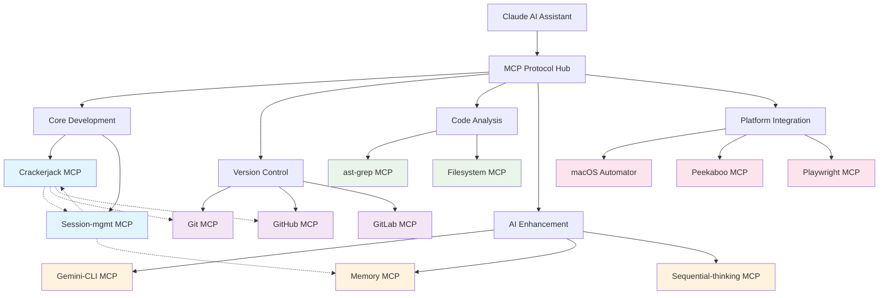
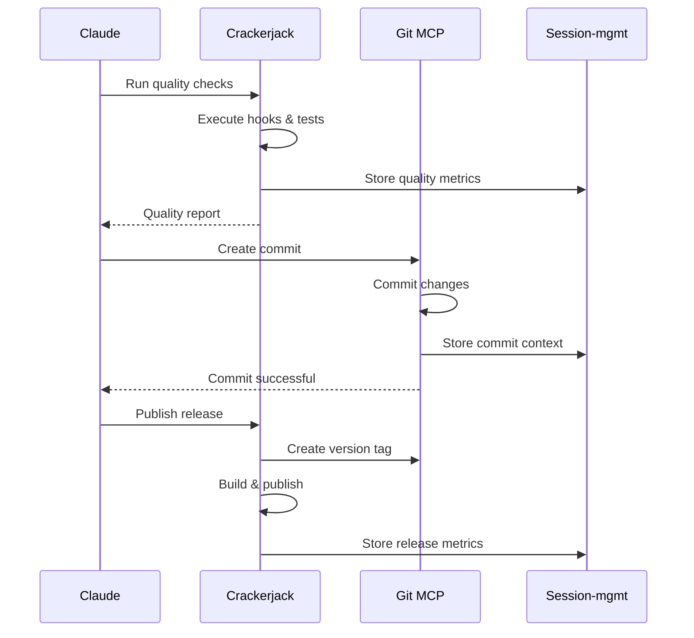
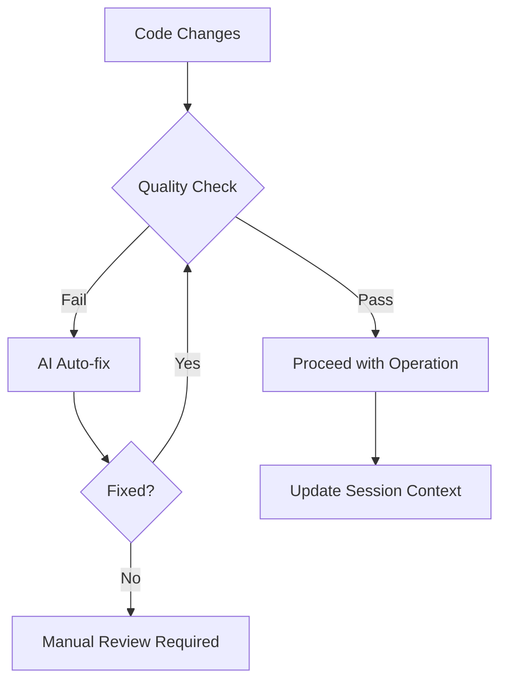
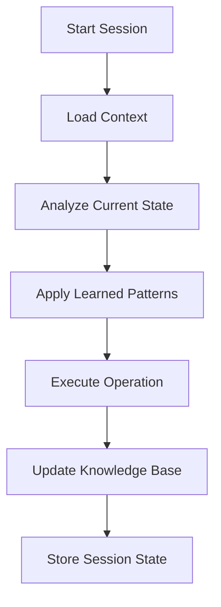

# MCP Server Ecosystem Integration

This document provides comprehensive guidance on integrating Crackerjack with other MCP servers to create a powerful AI-assisted development environment.

## Overview

Crackerjack provides a WebSocket-enabled MCP server that integrates seamlessly with other MCP servers through the Model Context Protocol. This creates a rich ecosystem where different tools can coordinate to provide enhanced AI assistance.

## Recommended MCP Server Stack

For the ultimate AI-assisted Python development environment, we recommend this layered MCP server stack:

### Core Development Layer

- **crackerjack**: Code quality enforcement, testing, AI auto-fixing, and release management
- **session-mgmt-mcp**: Conversation memory, context persistence, and learning system

### Version Control & Collaboration Layer

- **git-mcp-server**: Advanced Git operations and workflow management
- **github**: GitHub repository management, PR creation, issue tracking
- **gitlab**: GitLab integration for teams using GitLab

### Code Analysis & Search Layer

- **ast-grep**: Advanced code search, AST-based refactoring, and pattern matching
- **filesystem**: Enhanced file operations with workspace management

### AI & Enhancement Layer

- **gemini-cli**: Google Gemini AI integration for additional AI capabilities
- **memory**: Persistent knowledge graphs and fact storage
- **sequential-thinking**: Advanced problem-solving with structured thought processes

### Platform Integration Layer

- **macos_automator**: macOS system integration and automation (macOS only)
- **peekaboo**: Screen capture and UI automation for visual debugging
- **playwright**: Web automation and testing integration

## Integration Architecture



## Data Flow Between Servers

### Crackerjack ↔ Session-mgmt Integration

**Crackerjack → Session-mgmt:**

- Quality metrics and score trends
- Test execution results and patterns
- Error types and resolution methods
- Command effectiveness data
- Build status and deployment information

**Session-mgmt → Crackerjack:**

- Historical error patterns and successful fixes
- Previous quality score trends for context
- Learning insights about what works in this project
- Workflow optimization suggestions based on past sessions

### Crackerjack ↔ Git Integration

**Workflow Coordination:**



## MCP Server Configuration Examples

### Complete Development Stack (.mcp.json)

```json
{
  "mcpServers": {
    "crackerjack": {
      "command": "python",
      "args": ["-m", "crackerjack", "--start-mcp-server"],
      "env": {
        "UV_KEYRING_PROVIDER": "subprocess",
        "EDITOR": "code --wait"
      }
    },
    "session-mgmt": {
      "command": "python",
      "args": ["-m", "session_mgmt_mcp.server"]
    },
    "git": {
      "command": "npx",
      "args": ["-y", "@cyanheads/git-mcp-server@2.3.2"]
    },
    "github": {
      "command": "npx",
      "args": ["-y", "@modelcontextprotocol/server-github@latest"],
      "env": {
        "GITHUB_PERSONAL_ACCESS_TOKEN_USE_GHCLI": "true"
      }
    },
    "ast-grep": {
      "command": "uvx",
      "args": [
        "--from",
        "git+https://github.com/ast-grep/ast-grep-mcp",
        "ast-grep-server"
      ]
    },
    "filesystem": {
      "command": "rust-mcp-filesystem",
      "args": ["-w", "~/Projects"]
    },
    "gemini-cli": {
      "command": "npx",
      "args": ["-y", "gemini-mcp-tool@1.1.4"]
    },
    "memory": {
      "command": "npx",
      "args": ["-y", "@modelcontextprotocol/server-memory@2025.8.4"]
    }
  }
}
```

### Minimal Python Development Stack

For projects that only need core Python development tools:

```json
{
  "mcpServers": {
    "crackerjack": {
      "command": "python",
      "args": ["-m", "crackerjack", "--start-mcp-server"]
    },
    "session-mgmt": {
      "command": "python",
      "args": ["-m", "session_mgmt_mcp.server"]
    },
    "git": {
      "command": "npx",
      "args": ["-y", "@cyanheads/git-mcp-server@2.3.2"]
    }
  }
}
```

### Team Development Stack

For teams using GitHub with additional collaboration features:

```json
{
  "mcpServers": {
    "crackerjack": {
      "command": "python",
      "args": ["-m", "crackerjack", "--start-mcp-server"]
    },
    "session-mgmt": {
      "command": "python",
      "args": ["-m", "session_mgmt_mcp.server"]
    },
    "github": {
      "command": "npx",
      "args": ["-y", "@modelcontextprotocol/server-github@latest"],
      "env": {
        "GITHUB_PERSONAL_ACCESS_TOKEN_USE_GHCLI": "true"
      }
    },
    "memory": {
      "command": "npx",
      "args": ["-y", "@modelcontextprotocol/server-memory@2025.8.4"]
    },
    "playwright": {
      "command": "npx",
      "args": ["-y", "@executeautomation/playwright-mcp-server@1.0.6"]
    }
  }
}
```

## Server Coordination Patterns

### 1. Quality-First Development

**Pattern**: Always run quality checks before any major operations



**Implementation**:

- Crackerjack runs quality checks first
- If issues found, AI agents attempt fixes
- Session-mgmt records patterns and outcomes
- Git operations only proceed after quality passes

### 2. Context-Aware Development

**Pattern**: Each operation builds on accumulated knowledge



**Implementation**:

- Session-mgmt initializes with historical context
- Crackerjack uses learned patterns for better fixes
- Memory server maintains long-term knowledge
- All operations contribute to the learning system

### 3. Automated Workflow Integration

**Pattern**: Seamless integration between development phases

```python
# Example: Integrated release workflow
async def integrated_release_workflow():
    """Coordinate multiple MCP servers for release."""

    # 1. Quality enforcement
    quality_result = await crackerjack.run_comprehensive_checks()
    if not quality_result.success:
        await crackerjack.ai_auto_fix()

    # 2. Commit changes
    await git.commit_changes("Release preparation")

    # 3. Version management
    await crackerjack.bump_version("patch")

    # 4. Create GitHub release
    await github.create_release()

    # 5. Store release metrics
    await session_mgmt.store_release_metrics(quality_result)
```

## Advanced Integration Features

### Cross-Server Learning

Session-mgmt can learn from patterns across all MCP servers:

- **Git patterns**: Which commit patterns correlate with successful releases
- **Quality patterns**: Which fixes work best for specific error types
- **Workflow patterns**: Which sequences of operations are most effective
- **Team patterns**: How different team members approach similar problems

### Intelligent Routing

Based on historical data, the system can:

- **Predict optimal workflows** based on current context
- **Suggest tools** most likely to solve specific problems
- **Recommend sequences** that have worked well before
- **Alert about potential issues** based on past patterns

### Performance Optimization

The integrated system optimizes performance by:

- **Parallel execution** of non-dependent operations
- **Smart caching** of results across servers
- **Progressive loading** of context as needed
- **Resource sharing** between compatible servers

## Troubleshooting Integration Issues

### Server Communication Problems

```bash
# Test MCP server connectivity
curl -s "http://localhost:8675/" || echo "Crackerjack server not responding"

# Check server logs
tail -f ~/.cache/crackerjack/logs/debug/mcp-server-*.log
tail -f ~/.cache/session-mgmt-mcp/logs/server.log
```

### Configuration Validation

```bash
# Validate MCP configuration
python -c "
import json
with open('.mcp.json') as f:
    config = json.load(f)
    print(f'Configured servers: {list(config[\"mcpServers\"].keys())}')
"

# Test server startup
python -m crackerjack --start-mcp-server --verbose
python -m session_mgmt_mcp.server --test-connection
```

### Performance Issues

```bash
# Monitor server resource usage
ps aux | grep -E "(crackerjack|session-mgmt|mcp)"

# Check WebSocket connections
netstat -an | grep :8675

# Monitor memory usage
top -p $(pgrep -f "mcp")
```

## Best Practices

### 1. Server Ordering

Configure servers in dependency order:

1. **Core servers first** (crackerjack, session-mgmt)
1. **Infrastructure servers** (git, filesystem)
1. **Enhancement servers** (memory, ai tools)
1. **Platform-specific servers** last

### 2. Resource Management

- **Limit concurrent operations** to prevent resource exhaustion
- **Use WebSocket connections** for real-time updates
- **Configure appropriate timeouts** for long-running operations
- **Monitor memory usage** in long-running sessions

### 3. Error Handling

- **Graceful degradation** when servers are unavailable
- **Retry logic** with exponential backoff
- **Fallback mechanisms** for critical operations
- **Comprehensive logging** for debugging

### 4. Security Considerations

- **Validate all inputs** between servers
- **Use secure communication** protocols
- **Limit server permissions** to required operations only
- **Regular security audits** of integrated workflows

## Migration Guide

### From Single-Server to Multi-Server

1. **Start with core pair**: crackerjack + session-mgmt
1. **Add version control**: Include git or github server
1. **Enhance capabilities**: Add memory, ast-grep, or other tools
1. **Test integration**: Verify all servers communicate properly
1. **Optimize performance**: Fine-tune resource usage and timeouts

### Upgrading Existing Integrations

1. **Backup current config**: Save working .mcp.json files
1. **Update server versions**: Use latest stable releases
1. **Test incremental changes**: Update one server at a time
1. **Verify functionality**: Ensure all integrations still work
1. **Monitor performance**: Watch for regressions or issues

This integration ecosystem creates a powerful, intelligent development environment that learns from every interaction and becomes more effective over time. The combination of specialized tools coordinated through MCP protocol provides capabilities that far exceed any single tool working in isolation.
