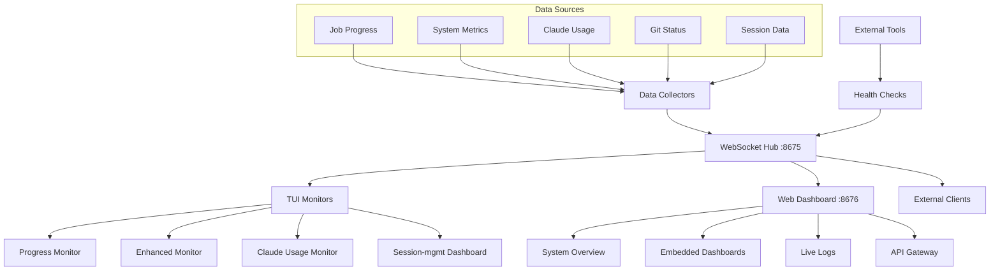

# Monitoring Integration Guide

This document provides comprehensive guidance for integrating new monitors, data sources, and visualization components into Crackerjack's unified monitoring system.

## Integration Philosophy

### Core Principles

1. **Single Data Source**: All monitors consume from the WebSocket hub (port 8675)
1. **Plugin Architecture**: Easy addition of new monitor types without core changes
1. **Rich-Based TUI**: Consistent Rich components across all terminal interfaces
1. **API-First Web**: RESTful APIs with WebSocket streaming for real-time updates
1. **Performance Optimized**: Lazy loading, efficient streaming, minimal resource usage

### Data Flow Overview



## Adding New Monitor Types

### 1. TUI Monitor Plugin

Create a new monitor by extending `BaseMonitor`:

```python
# crackerjack/monitors/your_monitor.py
from crackerjack.monitors.base import BaseMonitor
from rich.panel import Panel
from rich.table import Table
from rich.console import RenderableType
import asyncio


class YourMonitor(BaseMonitor):
    """Your custom monitor implementation."""

    def __init__(self):
        super().__init__()
        self.data = {}
        self.last_update = 0

    @property
    def display_name(self) -> str:
        """Tab name in unified monitor."""
        return "📊 Your Monitor"

    def render(self) -> RenderableType:
        """Render monitor content using Rich components."""

        # Create main table
        table = Table(title=f"Your Monitor - Last Update: {self.last_update}")
        table.add_column("Metric", style="cyan")
        table.add_column("Value", style="green")
        table.add_column("Status", style="yellow")

        # Add data rows
        for metric, value in self.data.items():
            status = "✅ OK" if self.is_healthy(metric, value) else "❌ WARN"
            table.add_row(metric, str(value), status)

        # Wrap in panel with border
        return Panel(
            table, title="Your Monitor", border_style="bright_green", padding=(1, 2)
        )

    async def update_data(self, websocket_data: dict) -> None:
        """Update with fresh data from WebSocket hub."""
        if "your_data_type" in websocket_data:
            self.data = websocket_data["your_data_type"]
            self.last_update = websocket_data.get("timestamp", 0)

    def handle_keypress(self, key: str) -> bool:
        """Handle monitor-specific keyboard input."""
        if key == "r":
            # Refresh data
            asyncio.create_task(self.refresh_data())
            return True
        elif key == "e":
            # Export data
            self.export_data()
            return True

        return False  # Not handled

    def is_healthy(self, metric: str, value) -> bool:
        """Check if metric is in healthy range."""
        # Your custom health logic
        return True

    async def refresh_data(self):
        """Force data refresh."""
        # Request fresh data from WebSocket hub
        pass

    def export_data(self):
        """Export current data to file."""
        import json
        from pathlib import Path

        export_file = Path(f"your_monitor_export_{int(time.time())}.json")
        with open(export_file, "w") as f:
            json.dump(self.data, f, indent=2)

        # Show notification to user
        print(f"Data exported to {export_file}")
```

### 2. Register Monitor in Unified Interface

```python
# crackerjack/monitors/unified_monitor.py (add to __init__)
from crackerjack.monitors.your_monitor import YourMonitor


class UnifiedMonitor:
    def __init__(self):
        # ... existing code ...
        self.monitors = {
            "progress": ProgressMonitor(),
            "enhanced": EnhancedMonitor(),
            "claude": ClaudeUsageMonitor(),
            "session": SessionMgmtMonitor(),
            "your_monitor": YourMonitor(),  # Add your monitor
        }
```

### 3. Add CLI Flag

```python
# crackerjack/__main__.py
@click.option("--your-monitor", is_flag=True, help="Start your custom monitor")
def main(your_monitor, **kwargs):
    if your_monitor:
        from crackerjack.monitors.your_monitor import YourMonitor

        monitor = YourMonitor()
        asyncio.run(monitor.run_standalone())
        return

    # ... existing code ...
```

## Adding Data Collectors

### 1. Create Data Collector

```python
# crackerjack/websocket/collectors/your_collector.py
from crackerjack.websocket.collectors.base import BaseCollector
import asyncio
import time


class YourDataCollector(BaseCollector):
    """Collect data from your custom source."""

    def __init__(self, config: dict = None):
        super().__init__()
        self.config = config or {}
        self.collection_interval = self.config.get("interval", 5)  # 5 seconds
        self.data_cache = {}

    async def start(self):
        """Start data collection."""
        self.running = True
        self.collection_task = asyncio.create_task(self.collection_loop())

    async def stop(self):
        """Stop data collection."""
        self.running = False
        if hasattr(self, "collection_task"):
            self.collection_task.cancel()

    async def collection_loop(self):
        """Main collection loop."""
        while self.running:
            try:
                # Collect fresh data
                data = await self.collect_data()

                # Update cache
                self.data_cache = {
                    "timestamp": time.time(),
                    "data": data,
                    "status": "healthy",
                }

                # Notify hub of new data
                await self.notify_update("your_data_type", self.data_cache)

                await asyncio.sleep(self.collection_interval)

            except Exception as e:
                # Handle collection errors
                self.data_cache["status"] = "error"
                self.data_cache["error"] = str(e)
                await asyncio.sleep(self.collection_interval)

    async def collect_data(self) -> dict:
        """Collect data from your source."""
        # Your custom data collection logic
        # Example: query database, call API, read files, etc.

        return {
            "metric1": 42,
            "metric2": "healthy",
            "metric3": [1, 2, 3, 4, 5],
            "collected_at": time.time(),
        }

    async def get_latest(self) -> dict:
        """Get latest cached data."""
        return self.data_cache

    def get_health_status(self) -> dict:
        """Return collector health information."""
        return {
            "collector": "YourDataCollector",
            "status": self.data_cache.get("status", "unknown"),
            "last_update": self.data_cache.get("timestamp", 0),
            "interval": self.collection_interval,
        }
```

### 2. Register Collector in Data Hub

```python
# crackerjack/websocket/hub.py (add to __init__)
from crackerjack.websocket.collectors.your_collector import YourDataCollector


class MonitoringDataHub:
    def __init__(self):
        # ... existing code ...
        self.collectors = {
            "jobs": JobDataCollector(),
            "system": SystemDataCollector(),
            "claude": ClaudeUsageCollector(),
            "your_data": YourDataCollector({"interval": 10}),  # Add collector
        }
```

## Web Dashboard Integration

### 1. Add API Endpoints

```python
# crackerjack/web/api/your_api.py
from fastapi import APIRouter, HTTPException
from crackerjack.websocket.hub import get_hub_instance

router = APIRouter(prefix="/api/your-monitor", tags=["your-monitor"])


@router.get("/status")
async def get_your_monitor_status():
    """Get current status of your monitor."""
    hub = get_hub_instance()
    collector = hub.collectors.get("your_data")

    if not collector:
        raise HTTPException(status_code=404, detail="Collector not found")

    return await collector.get_latest()


@router.get("/health")
async def get_your_monitor_health():
    """Get health status of your data collector."""
    hub = get_hub_instance()
    collector = hub.collectors.get("your_data")

    if not collector:
        raise HTTPException(status_code=404, detail="Collector not found")

    return collector.get_health_status()


@router.post("/refresh")
async def refresh_your_monitor():
    """Force refresh of your monitor data."""
    hub = get_hub_instance()
    collector = hub.collectors.get("your_data")

    if not collector:
        raise HTTPException(status_code=404, detail="Collector not found")

    # Trigger immediate collection
    await collector.collect_data()
    return {"status": "refresh_triggered"}


@router.get("/export")
async def export_your_monitor_data():
    """Export your monitor data as JSON."""
    hub = get_hub_instance()
    collector = hub.collectors.get("your_data")

    if not collector:
        raise HTTPException(status_code=404, detail="Collector not found")

    data = await collector.get_latest()
    return {"export_timestamp": time.time(), "data": data}
```

### 2. Register API Router

```python
# crackerjack/web/app.py
from crackerjack.web.api.your_api import router as your_api_router

app = FastAPI(title="Crackerjack Dashboard")

# Register API routers
app.include_router(your_api_router)
```

### 3. Add Frontend Component

```html
<!-- web/templates/components/your_monitor.html -->
<div class="monitor-widget" id="your-monitor-widget">
    <div class="widget-header">
        <h3>📊 Your Monitor</h3>
        <div class="widget-controls">
            <button onclick="refreshYourMonitor()">🔄 Refresh</button>
            <button onclick="exportYourMonitor()">💾 Export</button>
        </div>
    </div>

    <div class="widget-content">
        <div class="metrics-grid" id="your-metrics-grid">
            <!-- Metrics populated by JavaScript -->
        </div>

        <div class="status-indicator" id="your-status">
            <span class="status-dot"></span>
            <span class="status-text">Connecting...</span>
        </div>
    </div>
</div>
```

```javascript
// web/static/js/your_monitor.js
class YourMonitorWidget {
    constructor(containerId) {
        this.container = document.getElementById(containerId);
        this.metricsGrid = document.getElementById('your-metrics-grid');
        this.statusIndicator = document.getElementById('your-status');
        this.websocket = null;
    }

    init() {
        this.connectWebSocket();
        this.loadInitialData();
    }

    connectWebSocket() {
        const wsUrl = `ws://${window.location.host}/ws`;
        this.websocket = new WebSocket(wsUrl);

        this.websocket.onmessage = (event) => {
            const message = JSON.parse(event.data);
            if (message.type === 'your_data_update') {
                this.updateMetrics(message.payload);
            }
        };

        this.websocket.onopen = () => {
            this.updateStatus('connected', 'Connected');
        };

        this.websocket.onclose = () => {
            this.updateStatus('disconnected', 'Disconnected');
            // Attempt reconnection
            setTimeout(() => this.connectWebSocket(), 5000);
        };
    }

    async loadInitialData() {
        try {
            const response = await fetch('/api/your-monitor/status');
            const data = await response.json();
            this.updateMetrics(data);
        } catch (error) {
            console.error('Failed to load initial data:', error);
            this.updateStatus('error', 'Load Error');
        }
    }

    updateMetrics(data) {
        const metrics = data.data || {};
        const timestamp = data.timestamp || Date.now();

        // Clear existing metrics
        this.metricsGrid.innerHTML = '';

        // Add metrics
        Object.entries(metrics).forEach(([key, value]) => {
            const metricElement = document.createElement('div');
            metricElement.className = 'metric-item';
            metricElement.innerHTML = `
                <div class="metric-label">${key}</div>
                <div class="metric-value">${this.formatValue(value)}</div>
            `;
            this.metricsGrid.appendChild(metricElement);
        });

        // Update status
        const status = data.status || 'unknown';
        const lastUpdate = new Date(timestamp * 1000).toLocaleTimeString();
        this.updateStatus(status, `Last Update: ${lastUpdate}`);
    }

    updateStatus(status, text) {
        const statusDot = this.statusIndicator.querySelector('.status-dot');
        const statusText = this.statusIndicator.querySelector('.status-text');

        statusDot.className = `status-dot status-${status}`;
        statusText.textContent = text;
    }

    formatValue(value) {
        if (typeof value === 'number') {
            return value.toLocaleString();
        } else if (Array.isArray(value)) {
            return `[${value.length} items]`;
        } else {
            return String(value);
        }
    }
}

// Utility functions for controls
async function refreshYourMonitor() {
    try {
        await fetch('/api/your-monitor/refresh', { method: 'POST' });
        // Widget will update via WebSocket
    } catch (error) {
        console.error('Refresh failed:', error);
    }
}

async function exportYourMonitor() {
    try {
        const response = await fetch('/api/your-monitor/export');
        const data = await response.json();

        // Download as JSON file
        const blob = new Blob([JSON.stringify(data, null, 2)], {
            type: 'application/json'
        });
        const url = URL.createObjectURL(blob);

        const a = document.createElement('a');
        a.href = url;
        a.download = `your_monitor_export_${Date.now()}.json`;
        document.body.appendChild(a);
        a.click();
        document.body.removeChild(a);

        URL.revokeObjectURL(url);
    } catch (error) {
        console.error('Export failed:', error);
    }
}

// Initialize widget when page loads
document.addEventListener('DOMContentLoaded', () => {
    const widget = new YourMonitorWidget('your-monitor-widget');
    widget.init();
});
```

## External Dashboard Integration

### 1. Add Dashboard Configuration

```python
# crackerjack/web/config.py (add to EMBEDDED_DASHBOARDS)
EMBEDDED_DASHBOARDS["your_dashboard"] = {
    "name": "Your Dashboard",
    "url": "http://localhost:9999",
    "category": "custom",
    "description": "Your custom dashboard description",
    "health_check": "/health",
    "iframe_options": {"sandbox": "allow-same-origin allow-scripts", "loading": "lazy"},
    "auth": {
        "type": "none",  # or "basic", "bearer", "api_key"
        "credentials": {},
    },
}
```

### 2. Health Check Implementation

```python
# crackerjack/web/health.py
import aiohttp
import asyncio
from typing import Dict, Optional


class DashboardHealthChecker:
    """Check health of external dashboards."""

    def __init__(self, dashboards: Dict[str, dict]):
        self.dashboards = dashboards
        self.health_cache = {}

    async def check_all(self) -> Dict[str, dict]:
        """Check health of all configured dashboards."""
        tasks = [
            self.check_dashboard(name, config)
            for name, config in self.dashboards.items()
        ]

        results = await asyncio.gather(*tasks, return_exceptions=True)

        health_status = {}
        for (name, _), result in zip(self.dashboards.items(), results):
            if isinstance(result, Exception):
                health_status[name] = {
                    "status": "error",
                    "error": str(result),
                    "timestamp": time.time(),
                }
            else:
                health_status[name] = result

        self.health_cache = health_status
        return health_status

    async def check_dashboard(self, name: str, config: dict) -> dict:
        """Check health of a single dashboard."""
        url = config["url"]
        health_endpoint = config.get("health_check", "/health")

        full_url = f"{url.rstrip('/')}{health_endpoint}"

        try:
            timeout = aiohttp.ClientTimeout(total=5)
            async with aiohttp.ClientSession(timeout=timeout) as session:
                async with session.get(full_url) as response:
                    if response.status == 200:
                        return {
                            "status": "healthy",
                            "response_time": response.headers.get("X-Response-Time"),
                            "timestamp": time.time(),
                            "url": full_url,
                        }
                    else:
                        return {
                            "status": "unhealthy",
                            "http_status": response.status,
                            "timestamp": time.time(),
                            "url": full_url,
                        }

        except aiohttp.ClientConnectorError:
            return {
                "status": "unreachable",
                "error": "Connection failed",
                "timestamp": time.time(),
                "url": full_url,
            }
        except asyncio.TimeoutError:
            return {
                "status": "timeout",
                "error": "Request timeout",
                "timestamp": time.time(),
                "url": full_url,
            }

    def get_cached_health(self) -> Dict[str, dict]:
        """Get cached health status."""
        return self.health_cache
```

### 3. Add Health Check API

```python
# crackerjack/web/api/health.py
from fastapi import APIRouter
from crackerjack.web.health import DashboardHealthChecker
from crackerjack.web.config import EMBEDDED_DASHBOARDS

router = APIRouter(prefix="/api/health", tags=["health"])

health_checker = DashboardHealthChecker(EMBEDDED_DASHBOARDS)


@router.get("/dashboards")
async def check_dashboard_health():
    """Check health of all external dashboards."""
    return await health_checker.check_all()


@router.get("/dashboards/{dashboard_name}")
async def check_specific_dashboard(dashboard_name: str):
    """Check health of specific dashboard."""
    if dashboard_name not in EMBEDDED_DASHBOARDS:
        raise HTTPException(status_code=404, detail="Dashboard not found")

    config = EMBEDDED_DASHBOARDS[dashboard_name]
    return await health_checker.check_dashboard(dashboard_name, config)


@router.get("/system")
async def check_system_health():
    """Check overall system health."""
    return {
        "websocket_server": "healthy",  # TODO: Actual check
        "data_collectors": "healthy",  # TODO: Actual check
        "memory_usage": "normal",  # TODO: Actual check
        "timestamp": time.time(),
    }
```

## Metrics and Analytics

### 1. Performance Metrics Collector

```python
# crackerjack/websocket/collectors/metrics_collector.py
import psutil
import time
from crackerjack.websocket.collectors.base import BaseCollector


class MetricsCollector(BaseCollector):
    """Collect system performance metrics."""

    async def collect_data(self) -> dict:
        """Collect system metrics."""

        # CPU metrics
        cpu_percent = psutil.cpu_percent(interval=1)
        cpu_count = psutil.cpu_count()
        load_avg = psutil.getloadavg() if hasattr(psutil, "getloadavg") else [0, 0, 0]

        # Memory metrics
        memory = psutil.virtual_memory()
        swap = psutil.swap_memory()

        # Disk metrics
        disk = psutil.disk_usage("/")

        # Network metrics
        net_io = psutil.net_io_counters()

        # Process metrics for crackerjack processes
        crackerjack_processes = []
        for proc in psutil.process_iter(
            ["pid", "name", "cpu_percent", "memory_percent"]
        ):
            if "crackerjack" in proc.info["name"].lower():
                crackerjack_processes.append(proc.info)

        return {
            "timestamp": time.time(),
            "cpu": {"percent": cpu_percent, "count": cpu_count, "load_avg": load_avg},
            "memory": {
                "total": memory.total,
                "available": memory.available,
                "percent": memory.percent,
                "used": memory.used,
                "free": memory.free,
            },
            "swap": {"total": swap.total, "used": swap.used, "percent": swap.percent},
            "disk": {
                "total": disk.total,
                "used": disk.used,
                "free": disk.free,
                "percent": (disk.used / disk.total) * 100,
            },
            "network": {
                "bytes_sent": net_io.bytes_sent,
                "bytes_recv": net_io.bytes_recv,
                "packets_sent": net_io.packets_sent,
                "packets_recv": net_io.packets_recv,
            },
            "processes": crackerjack_processes,
        }
```

### 2. Usage Analytics

```python
# crackerjack/analytics/usage_tracker.py
import json
import sqlite3
from pathlib import Path
from datetime import datetime, timedelta
from typing import Dict, List, Optional


class UsageTracker:
    """Track crackerjack usage analytics."""

    def __init__(self, db_path: Optional[Path] = None):
        self.db_path = db_path or Path.home() / ".cache" / "crackerjack" / "usage.db"
        self.db_path.parent.mkdir(parents=True, exist_ok=True)
        self.init_database()

    def init_database(self):
        """Initialize SQLite database."""
        with sqlite3.connect(self.db_path) as conn:
            conn.execute("""
                CREATE TABLE IF NOT EXISTS command_usage (
                    id INTEGER PRIMARY KEY AUTOINCREMENT,
                    timestamp REAL,
                    command TEXT,
                    flags TEXT,
                    duration REAL,
                    exit_code INTEGER,
                    project_path TEXT,
                    success BOOLEAN
                )
            """)

            conn.execute("""
                CREATE TABLE IF NOT EXISTS monitor_usage (
                    id INTEGER PRIMARY KEY AUTOINCREMENT,
                    timestamp REAL,
                    monitor_type TEXT,
                    session_duration REAL,
                    interactions INTEGER,
                    project_path TEXT
                )
            """)

    def track_command(
        self,
        command: str,
        flags: List[str],
        duration: float,
        exit_code: int,
        project_path: str,
        success: bool,
    ):
        """Track command execution."""
        with sqlite3.connect(self.db_path) as conn:
            conn.execute(
                """
                INSERT INTO command_usage
                (timestamp, command, flags, duration, exit_code, project_path, success)
                VALUES (?, ?, ?, ?, ?, ?, ?)
            """,
                (
                    time.time(),
                    command,
                    json.dumps(flags),
                    duration,
                    exit_code,
                    project_path,
                    success,
                ),
            )

    def track_monitor(
        self,
        monitor_type: str,
        session_duration: float,
        interactions: int,
        project_path: str,
    ):
        """Track monitor usage."""
        with sqlite3.connect(self.db_path) as conn:
            conn.execute(
                """
                INSERT INTO monitor_usage
                (timestamp, monitor_type, session_duration, interactions, project_path)
                VALUES (?, ?, ?, ?, ?)
            """,
                (
                    time.time(),
                    monitor_type,
                    session_duration,
                    interactions,
                    project_path,
                ),
            )

    def get_usage_stats(self, days: int = 30) -> Dict:
        """Get usage statistics for the last N days."""
        since_timestamp = time.time() - (days * 24 * 60 * 60)

        with sqlite3.connect(self.db_path) as conn:
            # Command usage stats
            command_stats = conn.execute(
                """
                SELECT command, COUNT(*) as usage_count,
                       AVG(duration) as avg_duration,
                       SUM(success) as success_count
                FROM command_usage
                WHERE timestamp > ?
                GROUP BY command
                ORDER BY usage_count DESC
            """,
                (since_timestamp,),
            ).fetchall()

            # Monitor usage stats
            monitor_stats = conn.execute(
                """
                SELECT monitor_type, COUNT(*) as sessions,
                       AVG(session_duration) as avg_session_duration,
                       SUM(interactions) as total_interactions
                FROM monitor_usage
                WHERE timestamp > ?
                GROUP BY monitor_type
                ORDER BY sessions DESC
            """,
                (since_timestamp,),
            ).fetchall()

            # Daily usage pattern
            daily_usage = conn.execute(
                """
                SELECT DATE(timestamp, 'unixepoch') as date,
                       COUNT(*) as commands
                FROM command_usage
                WHERE timestamp > ?
                GROUP BY date
                ORDER BY date
            """,
                (since_timestamp,),
            ).fetchall()

        return {
            "period_days": days,
            "command_stats": [
                {
                    "command": row[0],
                    "usage_count": row[1],
                    "avg_duration": row[2],
                    "success_rate": row[3] / row[1] if row[1] > 0 else 0,
                }
                for row in command_stats
            ],
            "monitor_stats": [
                {
                    "monitor_type": row[0],
                    "sessions": row[1],
                    "avg_session_duration": row[2],
                    "total_interactions": row[3],
                }
                for row in monitor_stats
            ],
            "daily_usage": [
                {"date": row[0], "commands": row[1]} for row in daily_usage
            ],
        }
```

## Testing Integration Components

### 1. Monitor Testing Framework

```python
# tests/monitors/test_monitor_base.py
import pytest
import asyncio
from unittest.mock import Mock, patch
from crackerjack.monitors.base import BaseMonitor


class MockMonitor(BaseMonitor):
    """Mock monitor for testing."""

    @property
    def display_name(self) -> str:
        return "🧪 Mock Monitor"

    def render(self):
        return "Mock render"

    async def update_data(self, websocket_data: dict):
        self.data = websocket_data


class TestBaseMonitor:
    """Test base monitor functionality."""

    def test_display_name(self):
        """Test display name property."""
        monitor = MockMonitor()
        assert monitor.display_name == "🧪 Mock Monitor"

    def test_render(self):
        """Test render method."""
        monitor = MockMonitor()
        assert monitor.render() == "Mock render"

    @pytest.mark.asyncio
    async def test_update_data(self):
        """Test data update."""
        monitor = MockMonitor()
        test_data = {"test": "data"}

        await monitor.update_data(test_data)
        assert hasattr(monitor, "data")
        assert monitor.data == test_data

    def test_handle_keypress_default(self):
        """Test default keypress handling."""
        monitor = MockMonitor()
        assert monitor.handle_keypress("x") == False
```

### 2. WebSocket Integration Testing

```python
# tests/websocket/test_integration.py
import pytest
import asyncio
import websockets
from crackerjack.websocket.hub import MonitoringDataHub


@pytest.mark.asyncio
class TestWebSocketIntegration:
    """Test WebSocket hub integration."""

    async def test_hub_startup(self):
        """Test hub starts correctly."""
        hub = MonitoringDataHub()

        await hub.start()
        assert hub.websocket_server is not None
        assert len(hub.collectors) > 0

        await hub.stop()

    async def test_data_broadcasting(self):
        """Test data broadcasts to connected clients."""
        hub = MonitoringDataHub()
        await hub.start()

        # Connect test client
        test_messages = []

        async def client_handler():
            uri = "ws://localhost:8675"
            async with websockets.connect(uri) as websocket:
                async for message in websocket:
                    test_messages.append(json.loads(message))
                    if len(test_messages) >= 3:
                        break

        # Start client in background
        client_task = asyncio.create_task(client_handler())

        # Wait for messages
        await asyncio.wait_for(client_task, timeout=10)

        # Verify messages received
        assert len(test_messages) >= 3
        assert all("timestamp" in msg for msg in test_messages)

        await hub.stop()

    async def test_collector_integration(self):
        """Test collector integration with hub."""
        hub = MonitoringDataHub()

        # Mock collector
        mock_collector = Mock()
        mock_collector.get_latest.return_value = {"test": "data"}
        mock_collector.start.return_value = None

        hub.collectors["test"] = mock_collector

        await hub.start()

        # Verify collector was started
        mock_collector.start.assert_called_once()

        # Get latest data
        latest = await hub.collectors["test"].get_latest()
        assert latest == {"test": "data"}

        await hub.stop()
```

### 3. End-to-End Testing

```python
# tests/integration/test_full_monitoring.py
import pytest
import asyncio
import requests
from crackerjack.web.app import app
from crackerjack.monitors.unified_monitor import UnifiedMonitor


@pytest.mark.integration
class TestFullMonitoringStack:
    """End-to-end integration tests."""

    @pytest.fixture
    def web_client(self):
        """FastAPI test client."""
        from fastapi.testclient import TestClient

        return TestClient(app)

    def test_web_dashboard_health(self, web_client):
        """Test web dashboard health endpoints."""
        response = web_client.get("/api/health/system")
        assert response.status_code == 200

        data = response.json()
        assert "websocket_server" in data
        assert "timestamp" in data

    def test_api_endpoints(self, web_client):
        """Test all API endpoints."""
        endpoints = [
            "/api/status",
            "/api/jobs",
            "/api/dashboards",
            "/api/health/system",
        ]

        for endpoint in endpoints:
            response = web_client.get(endpoint)
            assert response.status_code == 200

    @pytest.mark.asyncio
    async def test_unified_monitor_startup(self):
        """Test unified monitor can start."""
        monitor = UnifiedMonitor()

        # Mock WebSocket client
        monitor.websocket_client = Mock()
        monitor.websocket_client.connect.return_value = None
        monitor.websocket_client.disconnect.return_value = None
        monitor.websocket_client.get_status.return_value = {
            "active_jobs": 0,
            "cpu_percent": 15.2,
            "memory_percent": 45.8,
        }

        # Test layout creation
        layout = monitor.create_layout()
        assert layout is not None

        # Test tab switching
        initial_tab = monitor.current_tab
        monitor.switch_tab(1)
        assert monitor.current_tab != initial_tab
```

## Configuration Management

### 1. Monitor Configuration

```python
# crackerjack/config/monitoring.py
from pathlib import Path
from typing import Dict, Any
import json


class MonitoringConfig:
    """Central configuration for monitoring system."""

    def __init__(self, config_path: Path = None):
        self.config_path = (
            config_path or Path.home() / ".config" / "crackerjack" / "monitoring.json"
        )
        self.config = self.load_config()

    def load_config(self) -> Dict[str, Any]:
        """Load monitoring configuration."""
        if not self.config_path.exists():
            return self.get_default_config()

        with open(self.config_path) as f:
            return json.load(f)

    def save_config(self):
        """Save current configuration."""
        self.config_path.parent.mkdir(parents=True, exist_ok=True)
        with open(self.config_path, "w") as f:
            json.dump(self.config, f, indent=2)

    def get_default_config(self) -> Dict[str, Any]:
        """Get default monitoring configuration."""
        return {
            "websocket": {"host": "localhost", "port": 8675, "max_connections": 100},
            "web_dashboard": {"host": "0.0.0.0", "port": 8676, "enable_cors": True},
            "collectors": {
                "jobs": {"enabled": True, "interval": 1},
                "system": {"enabled": True, "interval": 5},
                "claude": {"enabled": True, "interval": 30},
            },
            "monitors": {
                "unified": {
                    "default_tab": "progress",
                    "refresh_rate": 4,
                    "enable_mouse": True,
                }
            },
            "embedded_dashboards": {"health_check_interval": 60, "timeout": 5},
        }

    def get(self, key: str, default=None):
        """Get configuration value using dot notation."""
        keys = key.split(".")
        value = self.config

        for k in keys:
            if isinstance(value, dict) and k in value:
                value = value[k]
            else:
                return default

        return value

    def set(self, key: str, value: Any):
        """Set configuration value using dot notation."""
        keys = key.split(".")
        config = self.config

        for k in keys[:-1]:
            if k not in config:
                config[k] = {}
            config = config[k]

        config[keys[-1]] = value
```

This comprehensive integration guide provides all the building blocks needed to extend Crackerjack's monitoring system with new monitors, data sources, and visualization components while maintaining consistency and performance.
