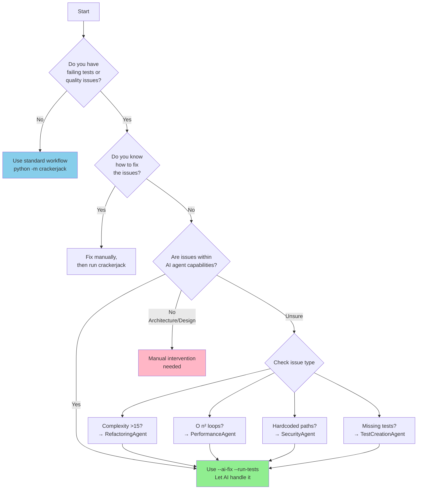
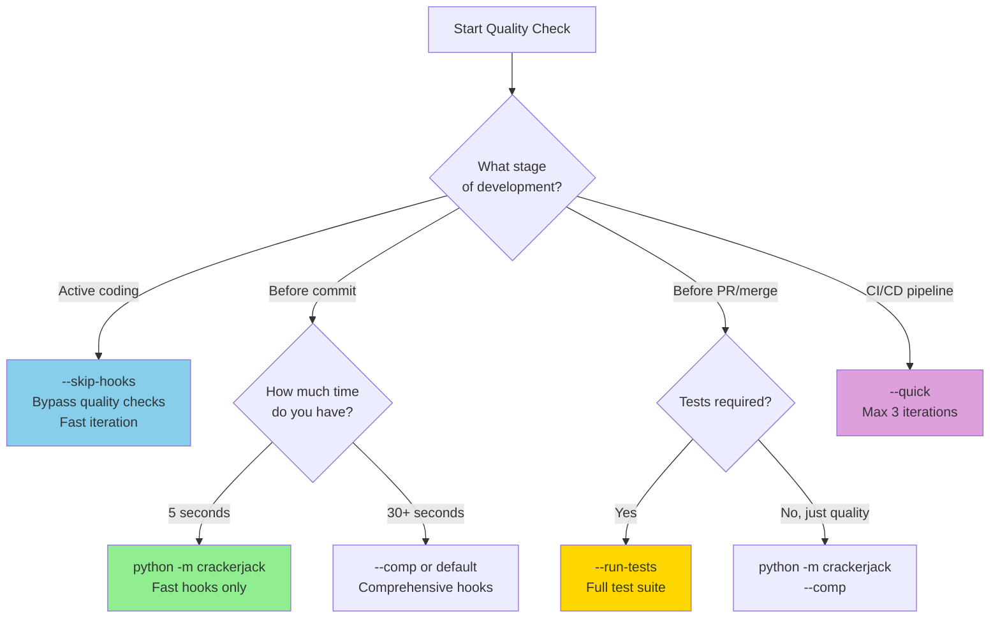
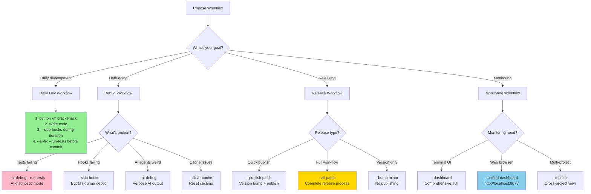

# Crackerjack AI Reference Guide

**A practical command reference with decision trees for AI-powered Python project management**

## Quick Command Finder

### "What command do I need right now?"

```
┌─ Just want to check quality? ──────────────────────────────────┐
│  → python -m crackerjack                                        │
│    (Fast hooks only, no tests, ~5s)                            │
└─────────────────────────────────────────────────────────────────┘

┌─ Ready to validate everything? ────────────────────────────────┐
│  → python -m crackerjack --run-tests                           │
│    (Full validation with test suite)                           │
└─────────────────────────────────────────────────────────────────┘

┌─ Tests/quality failing? Need AI help? ─────────────────────────┐
│  → python -m crackerjack --ai-fix --run-tests                  │
│    (AI agents auto-fix issues, recommended)                    │
└─────────────────────────────────────────────────────────────────┘

┌─ Developing actively, hooks slowing you down? ─────────────────┐
│  → python -m crackerjack --skip-hooks                          │
│    (Fast iteration during development)                         │
└─────────────────────────────────────────────────────────────────┘

┌─ Ready to release? ────────────────────────────────────────────┐
│  → python -m crackerjack --all patch                           │
│    (Complete release workflow)                                 │
└─────────────────────────────────────────────────────────────────┘
```

## Command Decision Trees

### Decision Tree 1: "Should I use --ai-fix?"



**Key Points:**

- **Use `--ai-fix`** when you have quality/test failures and want automated resolution
- **Skip `--ai-fix`** for known issues you prefer to fix manually
- **AI agent confidence** ≥0.7 required for automatic fixes (0.8-0.9 for critical issues)

### Decision Tree 2: "Which quality level do I need?"



**Quality Levels Explained:**

| Level | Command | Duration | Use Case |
|-------|---------|----------|----------|
| **Skip** | `--skip-hooks` | \<1s | Active development iteration |
| **Fast** | `--fast` or default | ~5s | Quick pre-commit check |
| **Comprehensive** | `--comp` | ~30s | Full quality analysis |
| **With Tests** | `--run-tests` | Variable | Complete validation |
| **CI/CD** | `--quick` | ~15s | Automated pipeline (max 3 iterations) |

### Decision Tree 3: "What workflow for my use case?"



## Workflow Patterns

### Pattern 1: Daily Development Cycle

```bash
# Morning: Check project health
python -m crackerjack

# During development: Fast iteration
python -m crackerjack --skip-hooks
# ... write code ...
python -m crackerjack --skip-hooks
# ... more coding ...

# Before commit: Full validation with AI
python -m crackerjack --ai-fix --run-tests

# If issues persist: Debug mode
python -m crackerjack --ai-debug --run-tests
```

**When to transition:**

- `--skip-hooks` → Fast iteration when hooks slow you down
- Fast hooks → Standard pre-commit check
- `--ai-fix --run-tests` → When you want automated issue resolution
- `--ai-debug` → When AI agents behave unexpectedly

### Pattern 2: AI-Assisted Fix Workflow

```bash
# Step 1: Detect issues
python -m crackerjack --run-tests
# Output: 5 test failures, 3 complexity violations

# Step 2: AI batch fixing
python -m crackerjack --ai-fix --run-tests
# AI agents analyze and fix issues automatically

# Step 3: Verify fixes
python -m crackerjack --run-tests
# All tests pass ✓

# Step 4: Commit
git add .
git commit -m "fix: resolved complexity and test issues via AI"
```

**AI Agent Selection Logic:**

```python
# Automatic agent invocation based on issue type
if complexity > 15:
    invoke(RefactoringAgent, confidence=0.9)
elif O_n_squared_detected:
    invoke(PerformanceAgent, confidence=0.85)
elif hardcoded_path or unsafe_operation:
    invoke(SecurityAgent, confidence=0.8)
elif test_failures:
    invoke(TestCreationAgent, confidence=0.8)
elif duplicate_code:
    invoke(DRYAgent, confidence=0.8)
# ... etc

# Batch all fixes, apply together
apply_fixes_if_confidence >= 0.7
```

### Pattern 3: Release Workflow

```bash
# Option A: Quick publish (version bump + PyPI)
python -m crackerjack --publish patch

# Option B: Full release workflow
python -m crackerjack --all patch
# Runs: quality checks → tests → version bump → changelog → git tag → publish

# Option C: Interactive version selection
python -m crackerjack --all interactive
# AI recommends version bump, you choose

# Option D: Version bump only (no publish)
python -m crackerjack --bump minor
```

**Version Intelligence:**

- AI analyzes git commits to recommend version bump
- Detects breaking changes → suggests major
- Detects new features → suggests minor
- Detects bug fixes only → suggests patch

### Pattern 4: Monitoring & Diagnostics

```bash
# Terminal-based comprehensive dashboard
python -m crackerjack --dashboard

# Web-based unified dashboard
python -m crackerjack --unified-dashboard
# Access at http://localhost:8675

# Multi-project monitoring
python -m crackerjack --monitor

# Performance benchmarking
python -m crackerjack --benchmark

# Cache statistics
python -m crackerjack --cache-stats
```

## AI Agent Reference

### 12 Specialized Agents

| Agent | Confidence | Triggers | Fixes |
|-------|-----------|----------|-------|
| **RefactoringAgent** | 0.9 | Complexity ≤15 | Break into helpers, extract methods |
| **PerformanceAgent** | 0.85 | O(n²) loops | Optimize algorithms, caching |
| **SecurityAgent** | 0.8 | Hardcoded paths, unsafe ops | Use tempfile, safe subprocess |
| **DocumentationAgent** | 0.8 | Changelog inconsistency | Update CHANGELOG.md, docs |
| **TestCreationAgent** | 0.8 | Test failures, missing tests | Create/fix test cases |
| **DRYAgent** | 0.8 | Code duplication | Extract common patterns |
| **FormattingAgent** | 0.8 | Style violations | Auto-format code |
| **ImportOptimizationAgent** | 0.8 | Import issues | Reorganize imports |
| **TestSpecialistAgent** | 0.8 | Advanced test scenarios | Complex test patterns |
| **SemanticAgent** | 0.85 | Semantic analysis | Intelligent refactoring |
| **ArchitectAgent** | 0.85 | Architecture patterns | Design optimization |
| **EnhancedProactiveAgent** | 0.9 | Predictive issues | Preemptive fixes |

### Agent Invocation Examples

```bash
# Explicit AI debugging
python -m crackerjack --ai-debug --run-tests
# Shows: Which agents triggered, confidence scores, fix decisions

# AI with custom iterations
python -m crackerjack --ai-fix --run-tests --max-iterations 5

# AI in quick mode (CI/CD)
python -m crackerjack --ai-fix --quick
# Max 3 iterations, faster feedback
```

## Flag Reference by Use Case

### Development Flags

| Flag | Purpose | When to Use |
|------|---------|-------------|
| `--skip-hooks` | Bypass pre-commit hooks | During active coding/debugging |
| `--fast` | Fast hooks only (~5s) | Quick validation |
| `--comp` | Comprehensive hooks (~30s) | Thorough quality check |
| `--run-tests` | Execute full test suite | Before commits/PRs |
| `--ai-fix` | Enable AI auto-fixing | When quality/test issues arise |
| `--test-workers N` | Control parallelization | Debugging slow tests |

### Debugging Flags

| Flag | Purpose | When to Use |
|------|---------|-------------|
| `--ai-debug` | Verbose AI diagnostics | AI agents behaving unexpectedly |
| `--debug` | General debug output | Troubleshooting workflow issues |
| `--clear-cache` | Reset all caches | Cache corruption suspected |
| `--cache-stats` | View cache metrics | Performance analysis |
| `--benchmark` | Disable parallelization | Accurate timing measurements |

### Release Flags

| Flag | Purpose | When to Use |
|------|---------|-------------|
| `--all VERSION` | Full release workflow | Complete release process |
| `--publish VERSION` | Version bump + publish | Quick PyPI publish |
| `--bump VERSION` | Version bump only | Update version without publish |
| `--all interactive` | Interactive version | AI-recommended versions |

### Monitoring Flags

| Flag | Purpose | When to Use |
|------|---------|-------------|
| `--dashboard` | Terminal UI dashboard | Comprehensive monitoring |
| `--unified-dashboard` | Web UI (port 8675) | Browser-based monitoring |
| `--monitor` | Multi-project view | Cross-project tracking |
| `--enhanced-monitor` | Advanced patterns | Deep pattern analysis |

### MCP Server Flags

| Flag | Purpose | When to Use |
|------|---------|-------------|
| `--start-mcp-server` | Launch MCP server | Enable MCP integration |
| `--restart-mcp-server` | Restart MCP server | Server not responding |
| `--watchdog` | Auto-restart services | Production monitoring |

### Performance Flags

| Flag | Purpose | When to Use |
|------|---------|-------------|
| `--quick` | Max 3 iterations | CI/CD pipelines |
| `--benchmark` | Benchmark mode | Performance testing |
| `--test-workers N` | Custom parallelization | Optimize test speed |
| `--strip-code` | Code cleaning mode | Remove debug code |

## Common Command Combinations

### For Daily Development

```bash
# Quick quality check before starting work
python -m crackerjack

# Fast iteration cycle
python -m crackerjack --skip-hooks

# Pre-commit validation with AI
python -m crackerjack --ai-fix --run-tests

# Debug failing tests
python -m crackerjack --ai-debug --run-tests
```

### For CI/CD

```bash
# Fast pipeline execution
python -m crackerjack --quick --run-tests

# With AI fixing (limited iterations)
python -m crackerjack --ai-fix --quick --run-tests

# Benchmark mode (no parallelization)
python -m crackerjack --benchmark --run-tests
```

### For Releases

```bash
# Interactive release with AI recommendations
python -m crackerjack --all interactive

# Automated patch release
python -m crackerjack --all patch

# Bump version, skip publish (for manual control)
python -m crackerjack --bump minor
```

### For Troubleshooting

```bash
# AI debugging with verbose output
python -m crackerjack --ai-debug --run-tests

# Clear cache and retry
python -m crackerjack --clear-cache --run-tests

# Check cache performance
python -m crackerjack --cache-stats

# Reduce test parallelization
python -m crackerjack --run-tests --test-workers 2
```

## Troubleshooting Guide

### Issue: Tests are failing

**Diagnostic Steps:**

```bash
# 1. Check if it's a known issue
python -m crackerjack --run-tests

# 2. Let AI attempt to fix
python -m crackerjack --ai-fix --run-tests

# 3. If AI fails, debug
python -m crackerjack --ai-debug --run-tests

# 4. Check specific test
python -m pytest tests/test_file.py::TestClass::test_method -v
```

**Common Causes:**

- Async tests hanging → Use synchronous config tests instead
- Import errors → Import protocols from `models/protocols.py`
- Coverage failing → Never reduce below baseline (use ratchet system)

### Issue: Pre-commit hooks are slow

**Solutions:**

```bash
# Option 1: Skip hooks during development
python -m crackerjack --skip-hooks

# Option 2: Use fast hooks only
python -m crackerjack --fast

# Option 3: Reduce test parallelization
python -m crackerjack --test-workers 2
```

### Issue: AI agents not fixing issues

**Diagnostic Steps:**

```bash
# 1. Enable AI debugging
python -m crackerjack --ai-debug --run-tests

# 2. Check agent confidence scores
# Look for: "Agent X triggered with confidence 0.85"

# 3. Verify issue is within agent capabilities
# RefactoringAgent: complexity ≤15
# PerformanceAgent: O(n²) detection
# SecurityAgent: unsafe operations
# TestCreationAgent: test failures
```

**When AI Can't Help:**

- Architecture/design issues → Manual intervention required
- Complex business logic → Human review needed
- Cross-cutting concerns → Comprehensive refactoring

### Issue: Cache problems

**Solutions:**

```bash
# Clear all caches
python -m crackerjack --clear-cache

# Check cache statistics
python -m crackerjack --cache-stats

# Verify cache hit rates
# Look for: "Cache hit rate: 85%"
```

### Issue: MCP server not responding

**Solutions:**

```bash
# Restart MCP server
python -m crackerjack --restart-mcp-server

# Auto-restart with watchdog
python -m crackerjack --watchdog

# Check server status
# MCP server runs on http://localhost:8675
```

### Issue: Terminal stuck/corrupted

**Recovery:**

```bash
# Reset terminal
stty sane; reset; exec $SHELL -l

# Or restart Claude Code session
```

## Advanced Workflows

### Workflow: Coverage Improvement

```bash
# 1. Check current coverage
python -m crackerjack --run-tests

# 2. Identify gaps
python -m pytest --cov=crackerjack --cov-report=html
# Open htmlcov/index.html

# 3. Let AI create missing tests
python -m crackerjack --ai-fix --run-tests
# TestCreationAgent will add missing test cases

# 4. Verify improvement
python -m crackerjack --coverage-status
```

### Workflow: Performance Optimization

```bash
# 1. Benchmark current performance
python -m crackerjack --benchmark

# 2. Let AI optimize
python -m crackerjack --ai-fix --run-tests
# PerformanceAgent detects O(n²) and optimizes

# 3. Verify improvements
python -m crackerjack --benchmark
# Compare before/after metrics
```

### Workflow: Security Hardening

```bash
# 1. Security scan
python -m crackerjack --comp --run-tests

# 2. AI security fixes
python -m crackerjack --ai-fix --run-tests
# SecurityAgent fixes hardcoded paths, unsafe operations

# 3. Manual review
# Check: No shell=True, no hardcoded secrets, tempfile usage
```

### Workflow: Multi-Project Release

```bash
# 1. Run comprehensive checks
python -m crackerjack --all interactive

# 2. AI recommends version based on commits
# Breaking changes detected → suggests major bump

# 3. Review and confirm
# Choose version: major/minor/patch

# 4. Automated release
# Updates version, changelog, git tag, publishes to PyPI
```

## Quick Reference Card

### Command Categories

**Quality Checks:**

- `python -m crackerjack` → Fast hooks (~5s)
- `python -m crackerjack --comp` → Comprehensive (~30s)
- `python -m crackerjack --run-tests` → With tests

**AI Assistance:**

- `--ai-fix` → Auto-fix issues
- `--ai-debug` → Verbose diagnostics
- `--ai-fix --run-tests` → Full AI workflow

**Development:**

- `--skip-hooks` → Fast iteration
- `--test-workers N` → Control parallelization
- `--debug` → General debugging

**Release:**

- `--all VERSION` → Full release
- `--publish VERSION` → Quick publish
- `--bump VERSION` → Version only

**Monitoring:**

- `--dashboard` → Terminal UI
- `--unified-dashboard` → Web UI
- `--monitor` → Multi-project

**Performance:**

- `--benchmark` → Accurate timing
- `--cache-stats` → Cache metrics
- `--clear-cache` → Reset caches

### Decision Flowchart Summary

```
Are you developing?
  → --skip-hooks (fast iteration)

Ready to commit?
  → --ai-fix --run-tests (AI validation)

Need to debug?
  → --ai-debug --run-tests (verbose output)

Ready to release?
  → --all patch (full workflow)

Want to monitor?
  → --unified-dashboard (web UI)
```

### Key Principles

1. **Always run crackerjack after editing** → Quality assurance
1. **Use `--ai-fix` when issues arise** → Automated resolution
1. **Use `--skip-hooks` during iteration** → Fast development
1. **Use `--ai-debug` when confused** → Understand AI decisions
1. **Never reduce coverage** → Ratchet system enforced

## Integration with Session Management

**Automatic Session Lifecycle** (for git repositories):

- **Session Start**: Auto-initialized when Claude Code connects
- **Mid-Session**: `/session-mgmt:checkpoint` with intelligent auto-compaction
- **Session End**: Auto-cleanup on `/quit`, disconnect, or crash

**Benefits:**

- Crackerjack metrics tracked over time
- Test patterns and fixes remembered
- Error resolution strategies learned
- Command effectiveness optimized

**Manual Control** (if needed):

```bash
# Initialize session
/session-mgmt:init

# Mid-session checkpoint
/session-mgmt:checkpoint

# End session
/session-mgmt:end
```

## Experimental Features

**Framework Status**: Ready for future tool evaluation

**Previous Candidates**: pyrefly, ty (removed due to availability issues)

**Evaluation Criteria**:

1. Availability across environments
1. Stability (no crashes/inconsistencies)
1. Value added (unique issue detection)
1. Performance (within time budgets)
1. Integration (pre-commit compatibility)

**Promotion Lifecycle**:

1. Experimental phase (manual stage only)
1. Evaluation period (30-90 days)
1. Promotion decision (move to tier if criteria met)
1. Removal (if criteria not met)

## Additional Resources

- **User Guide**: `README.md` - Comprehensive command reference
- **Advanced Features**: `docs/ADVANCED-FEATURES.md` - 82 enterprise/power user flags
- **Error Patterns**: `docs/ai/ERROR-PATTERNS.yaml` - Automated fix patterns
- **Agent Capabilities**: `docs/ai/AGENT-CAPABILITIES.json` - Structured agent data
- **Architecture**: `CLAUDE.md` - Modular DI architecture details

______________________________________________________________________

**Last Updated**: 2025-10-04
**Version**: 1.0.0
**Maintained By**: Crackerjack AI System
