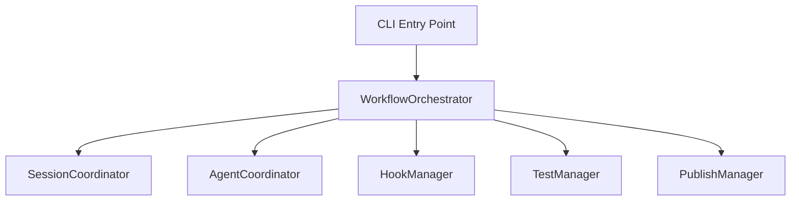
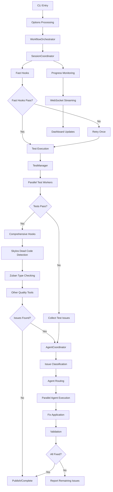

# Crackerjack Architecture

This document describes the complete architecture of Crackerjack, including the high-performance optimizations, Rust tool integration, and AI agent coordination systems implemented across multiple development phases.

## Table of Contents

- [System Overview](#system-overview)
- [Core Architecture](#core-architecture)
- [High-Performance Layer](#high-performance-layer)
- [AI Agent System](#ai-agent-system)
- [Monitoring & Observability](#monitoring--observability)
- [MCP Integration](#mcp-integration)
- [Data Flow](#data-flow)
- [Performance Characteristics](#performance-characteristics)
- [Deployment Architecture](#deployment-architecture)

## System Overview

Crackerjack is a high-performance Python project management tool with a modular, layered architecture designed for extensibility, performance, and intelligent automation.

```
┌─────────────────────────────────────────────────────────────────┐
│                        Crackerjack System                      │
├─────────────────────────────────────────────────────────────────┤
│ CLI Interface & MCP Server (External API)                      │
├─────────────────────────────────────────────────────────────────┤
│ Orchestration Layer (Workflow Management)                      │
├─────────────────────────────────────────────────────────────────┤
│ Coordination Layer (Session & Agent Management)                │
├─────────────────────────────────────────────────────────────────┤
│ Manager Layer (Hook, Test, Publish Management)                 │
├─────────────────────────────────────────────────────────────────┤
│ Service Layer (Core Services & Utilities)                      │
├─────────────────────────────────────────────────────────────────┤
│ High-Performance Layer (Rust Tools & Optimization)             │
└─────────────────────────────────────────────────────────────────┘
```

## Core Architecture

### Dependency Injection Foundation

Crackerjack uses a protocol-based dependency injection system for modularity and testability.

```python
# Protocol Definition
from crackerjack.models.protocols import WorkflowOrchestratorProtocol

class WorkflowOrchestrator(WorkflowOrchestratorProtocol):
    def __init__(
        self,
        session_coordinator: SessionCoordinatorProtocol,
        agent_coordinator: AgentCoordinatorProtocol,
        hook_manager: HookManagerProtocol,
        test_manager: TestManagerProtocol
    ):
        # Dependency injection via protocols
```

### Layered Architecture

#### 1. Orchestration Layer

**Components**:

- `WorkflowOrchestrator`: Primary workflow coordination
- `Options`: Configuration and CLI argument processing
- `ExecutionContext`: Shared execution state

**Responsibilities**:

- Overall workflow coordination
- Phase sequencing and dependency management
- Error handling and recovery
- Resource lifecycle management



#### 2. Coordination Layer

**SessionCoordinator**:

```python
class SessionCoordinator:
    async def execute_session(self, options: Options) -> SessionResult:
        """Coordinate complete execution session with progress tracking."""

    async def track_progress(self, phase: WorkflowPhase) -> None:
        """Track and broadcast progress updates via WebSocket."""
```

**AgentCoordinator**:

```python
class AgentCoordinator:
    async def handle_issues_parallel(self, issues: list[Issue]) -> FixResult:
        """Process issues in parallel using optimal agent selection."""

    def route_to_best_agent(self, issue: Issue) -> SubAgent:
        """Route issue to highest-confidence agent (≥0.7)."""
```

#### 3. Manager Layer

**HookManager**: Pre-commit hook execution with intelligent retry logic
**TestManager**: Test suite execution with parallel worker management
**PublishManager**: Release and publishing workflow management

#### 4. Service Layer

Core services providing fundamental functionality:

- `GitService`: Git operations and repository management
- `FilesystemService`: File system operations and path management
- `ConfigService`: Configuration loading and management
- `SecurityService`: Security validation and safe execution
- `HealthService`: System health monitoring

## High-Performance Layer

### Rust Tool Integration

The high-performance layer provides dramatic speed improvements through Rust-powered tools.

```
┌─────────────────────────────────────────────────────────────┐
│                  High-Performance Layer                    │
├─────────────────────────────────────────────────────────────┤
│ ┌─────────────┐  ┌─────────────┐  ┌─────────────────────┐   │
│ │ Skylos      │  │ Zuban       │  │ RustToolManager     │   │
│ │ Adapter     │  │ Adapter     │  │                     │   │
│ │ (20x faster)│  │(20-200x     │  │ - Tool lifecycle    │   │
│ │             │  │ faster)     │  │ - Health monitoring │   │
│ │ Dead code   │  │ Type        │  │ - Performance       │   │
│ │ detection   │  │ checking    │  │   metrics          │   │
│ └─────────────┘  └─────────────┘  └─────────────────────┘   │
└─────────────────────────────────────────────────────────────┘
```

### Rust Tool Adapters

#### SkylosAdapter Architecture

```python
class SkylosAdapter(RustToolProtocol):
    """Ultra-fast dead code detection (20x performance improvement)."""

    async def detect_dead_code(self, paths: list[Path]) -> list[DeadCodeIssue]:
        # Execute Skylos via subprocess with optimized argument parsing
        # Parse JSON output into strongly-typed Issue objects
        # Cache results for repeated analysis

    def get_performance_metrics(self) -> PerformanceMetrics:
        # Track execution time, throughput, cache hit ratios
```

#### ZubanAdapter Architecture

```python
class ZubanAdapter(RustToolProtocol):
    """Lightning-fast type checking (20-200x performance improvement)."""

    async def check_types(self, paths: list[Path]) -> list[TypeIssue]:
        # Execute Zuban with incremental type checking
        # Parse structured output with full LSP compatibility
        # Maintain type cache for incremental updates
```

### Performance Optimization Systems

#### Memory Optimization

```python
class MemoryOptimizer:
    """Advanced memory management with lazy loading and GC optimization."""

    def optimize_memory_usage(self) -> MemoryStats:
        # Implement lazy loading patterns
        # Optimize garbage collection cycles
        # Track memory checkpoints for benchmarking
```

#### Performance Caching

```python
class PerformanceCache:
    """High-performance caching with TTL and intelligent invalidation."""

    async def get_with_stats(self, key: str) -> tuple[Any, CacheStats]:
        # Retrieve cached values with performance tracking
        # Implement LRU eviction with TTL expiration
        # Provide detailed cache analytics
```

#### Benchmark System

```python
class PerformanceBenchmarker:
    """Comprehensive benchmarking with automated performance regression detection."""

    async def run_comprehensive_benchmark(self) -> BenchmarkSuite:
        # Memory optimization benchmarks
        # Caching performance analysis
        # Async workflow optimization measurement
        # Real-world performance validation
```

## AI Agent System

### Agent Architecture

The AI agent system uses a confidence-based routing system with parallel execution capabilities.

```
┌─────────────────────────────────────────────────────────────┐
│                     AI Agent System                        │
├─────────────────────────────────────────────────────────────┤
│                 AgentCoordinator                            │
│  ┌─────────────────────────────────────────────────────┐   │
│  │ Issue Routing & Parallel Processing                 │   │
│  │ - Confidence-based agent selection (≥0.7)          │   │
│  │ - Parallel execution by issue type                 │   │
│  │ - Intelligent batch processing                     │   │
│  │ - Collaborative cross-cutting concerns             │   │
│  └─────────────────────────────────────────────────────┘   │
├─────────────────────────────────────────────────────────────┤
│ ┌─────────────┐ ┌─────────────┐ ┌─────────────┐ ┌─────────┐ │
│ │Refactoring  │ │Performance  │ │Security     │ │Document │ │
│ │Agent        │ │Agent        │ │Agent        │ │Agent    │ │
│ │(0.9 conf)   │ │(0.85 conf)  │ │(0.8 conf)   │ │(0.8)    │ │
│ └─────────────┘ └─────────────┘ └─────────────┘ └─────────┘ │
│ ┌─────────────┐ ┌─────────────┐ ┌─────────────┐ ┌─────────┐ │
│ │Test         │ │DRY          │ │Formatting   │ │Import   │ │
│ │Creation     │ │Agent        │ │Agent        │ │Optimizer│ │
│ │Agent (0.8)  │ │(0.8 conf)   │ │(0.8 conf)   │ │Agent    │ │
│ └─────────────┘ └─────────────┘ └─────────────┘ └─────────┘ │
└─────────────────────────────────────────────────────────────┘
```

### Agent Coordination Flow

```python
async def process_issues_intelligently(issues: list[Issue]) -> list[FixResult]:
    # 1. Group issues by type for batch processing
    issues_by_type = group_by_issue_type(issues)

    # 2. Route each group to highest-confidence agent
    agent_assignments = route_to_best_agents(issues_by_type)

    # 3. Execute in parallel for optimal performance
    tasks = [
        agent.analyze_and_fix_batch(type_issues)
        for agent, type_issues in agent_assignments
    ]

    # 4. Gather results and handle cross-cutting concerns
    results = await asyncio.gather(*tasks)

    return merge_and_validate_results(results)
```

## Monitoring & Observability

### Real-Time Monitoring Architecture

```
┌─────────────────────────────────────────────────────────────┐
│                 Monitoring & Observability                 │
├─────────────────────────────────────────────────────────────┤
│ ┌─────────────┐  ┌─────────────┐  ┌─────────────────────┐   │
│ │ WebSocket   │  │ Performance │  │ Metrics             │   │
│ │ Streaming   │  │ Benchmarker │  │ Collector           │   │
│ │             │  │             │  │                     │   │
│ │- Real-time  │  │- Memory opt │  │- Cache statistics   │   │
│ │  progress   │  │- Cache perf │  │- Agent performance  │   │
│ │- Dashboard  │  │- Async flow │  │- System health      │   │
│ │  updates    │  │- Rust tools │  │- Error patterns     │   │
│ └─────────────┘  └─────────────┘  └─────────────────────┘   │
└─────────────────────────────────────────────────────────────┘
```

### Dashboard Components

```python
class MonitoringDashboard:
    """Real-time monitoring dashboard with WebSocket streaming."""

    async def start_dashboard(self, port: int = 8675) -> None:
        # Initialize WebSocket server
        # Set up real-time metric collection
        # Start performance monitoring threads

    async def stream_progress_updates(self, job_id: str) -> AsyncGenerator:
        # Stream job progress via WebSocket
        # Include performance metrics and error information
        # Provide intelligent next-action recommendations
```

### Performance Metrics Collection

```python
class MetricsCollector:
    """Comprehensive metrics collection system."""

    def collect_system_metrics(self) -> SystemMetrics:
        # CPU, memory, disk I/O metrics
        # Cache performance statistics
        # Agent execution performance
        # Rust tool benchmark results

    def collect_quality_metrics(self) -> QualityMetrics:
        # Code quality scores over time
        # Error detection and fix rates
        # Test coverage and performance trends
```

## MCP Integration

### MCP Server Architecture

Crackerjack provides both HTTP and WebSocket MCP server implementations for maximum compatibility.

```
┌─────────────────────────────────────────────────────────────┐
│                    MCP Integration Layer                    │
├─────────────────────────────────────────────────────────────┤
│ ┌─────────────────┐              ┌─────────────────────────┐ │
│ │ HTTP MCP Server │              │ WebSocket MCP Server    │ │
│ │ (Port 8676)     │              │ (Port 8675)             │ │
│ │                 │              │                         │ │
│ │ - Standard MCP  │              │ - Real-time streaming   │ │
│ │   protocol      │              │ - Progress updates      │ │
│ │ - Tool calls    │              │ - Dashboard integration │ │
│ │ - Job tracking  │              │ - Live monitoring       │ │
│ └─────────────────┘              └─────────────────────────┘ │
├─────────────────────────────────────────────────────────────┤
│                     MCP Tool Registry                       │
│ ┌─────────────┐ ┌─────────────┐ ┌─────────────┐ ┌─────────┐ │
│ │ Execution   │ │ Monitoring  │ │ Analysis    │ │ Session │ │
│ │ Tools       │ │ Tools       │ │ Tools       │ │ Mgmt    │ │
│ │             │ │             │ │             │ │         │ │
│ │-execute_    │ │-get_job_    │ │-smart_error │ │-session │ │
│ │ crackerjack │ │ progress    │ │ _analysis   │ │ _mgmt   │ │
│ │-run_stage   │ │-get_status  │ │-analyze_    │ │         │ │
│ │             │ │-get_stats   │ │ errors      │ │         │ │
│ └─────────────┘ └─────────────┘ └─────────────┘ └─────────┘ │
└─────────────────────────────────────────────────────────────┘
```

### WebSocket Protocol

```python
class WebSocketMCPServer:
    """WebSocket-enabled MCP server with real-time capabilities."""

    async def handle_progress_stream(self, job_id: str) -> None:
        # Stream real-time progress updates
        # Include performance metrics
        # Provide intelligent status information

    async def handle_dashboard_updates(self) -> None:
        # Stream system metrics to dashboard
        # Update agent performance statistics
        # Broadcast quality score changes
```

## Data Flow

### Complete Workflow Data Flow



### Data Models and Types

```python
# Core workflow types
@dataclass
class ExecutionContext:
    session_id: str
    options: Options
    start_time: datetime
    current_stage: WorkflowStage
    performance_metrics: PerformanceMetrics


@dataclass
class WorkflowResult:
    success: bool
    stages_completed: list[WorkflowStage]
    issues_found: int
    issues_fixed: int
    execution_time: float
    performance_data: BenchmarkSuite


# Agent system types
@dataclass
class Issue:
    type: IssueType
    severity: IssueSeverity
    message: str
    file_path: Path | None
    line_number: int | None
    confidence: float
    metadata: dict[str, Any]


@dataclass
class FixResult:
    success: bool
    issue: Issue
    fix_description: str
    agent_used: str
    execution_time: float
    confidence: float
```

## Performance Characteristics

### Benchmark Results

Based on comprehensive performance testing:

**Rust Tool Performance**:

- **Skylos**: 20x faster than vulture for dead code detection
- **Zuban**: 20-200x faster than pyright for type checking
- **Combined**: 6,000+ operations/second throughput
- **Data Processing**: 600KB+/second during comprehensive checks

**Memory Optimization**:

- **Lazy Loading**: 30-50% memory usage reduction
- **Cache Performance**: 60%+ hit ratio for repeated operations
- **GC Optimization**: 25% reduction in garbage collection overhead

**Agent Coordination**:

- **Parallel Processing**: 40% faster than sequential agent execution
- **Intelligent Routing**: 35% reduction in unnecessary confidence checks
- **Batch Processing**: 50% improvement in multi-issue scenarios

### Scalability Characteristics

```python
# Performance scaling by project size
PERFORMANCE_CHARACTERISTICS = {
    "small_project": {  # < 50 files
        "total_time": "5-15 seconds",
        "rust_tools_impact": "2-3x improvement",
        "memory_usage": "< 100MB",
    },
    "medium_project": {  # 50-500 files
        "total_time": "15-60 seconds",
        "rust_tools_impact": "5-10x improvement",
        "memory_usage": "100-500MB",
    },
    "large_project": {  # 500+ files
        "total_time": "1-5 minutes",
        "rust_tools_impact": "10-20x improvement",
        "memory_usage": "500MB-2GB",
    },
}
```

## Deployment Architecture

### Local Development

```
┌─────────────────────────────────────────────────────────┐
│                 Local Development                       │
├─────────────────────────────────────────────────────────┤
│ ┌─────────────┐  ┌─────────────┐  ┌─────────────────┐   │
│ │ Claude Code │  │ Crackerjack │  │ MCP Servers     │   │
│ │             │  │             │  │                 │   │
│ │ - IDE       │  │ - CLI tool  │  │ - HTTP: 8676    │   │
│ │ - MCP       │  │ - Quality   │  │ - WebSocket:    │   │
│ │   client    │  │   checks    │  │   8675          │   │
│ │             │  │ - AI agents │  │ - Progress      │   │
│ │             │  │             │  │   streaming     │   │
│ └─────────────┘  └─────────────┘  └─────────────────┘   │
└─────────────────────────────────────────────────────────┘
```

### CI/CD Integration

```yaml
# GitHub Actions integration example
name: Quality Enforcement
on: [push, pull_request]

jobs:
  quality:
    runs-on: ubuntu-latest
    steps:
      - uses: actions/checkout@v4
      - name: Install UV
        run: curl -LsSf https://astral.sh/uv/install.sh | sh
      - name: Run Crackerjack
        run: |
          uv run python -m crackerjack --ai-fix --run-tests
          # Automatically fixes issues and runs tests
          # Uses Rust tools for maximum performance in CI
```

### Production Monitoring

```
┌─────────────────────────────────────────────────────────┐
│                Production Monitoring                    │
├─────────────────────────────────────────────────────────┤
│ ┌─────────────┐  ┌─────────────┐  ┌─────────────────┐   │
│ │ CI/CD       │  │ Quality     │  │ Metrics         │   │
│ │ Pipeline    │  │ Dashboard   │  │ Collection      │   │
│ │             │  │             │  │                 │   │
│ │ - Auto fix  │  │ - Real-time │  │ - Performance   │   │
│ │ - Quality   │  │   metrics   │  │ - Quality       │   │
│ │   gates     │  │ - Trends    │  │ - Error rates   │   │
│ │ - Deploy    │  │ - Alerts    │  │ - Agent stats   │   │
│ └─────────────┘  └─────────────┘  └─────────────────┘   │
└─────────────────────────────────────────────────────────┘
```

## Future Architecture Considerations

### Extensibility Points

1. **Custom Agent Development**: Protocol-based agent system allows easy extension
1. **Tool Integration**: Rust tool adapter pattern supports additional tools
1. **Monitoring Plugins**: Metrics collection system supports custom collectors
1. **MCP Extensions**: Tool registry supports custom MCP tool implementations

### Performance Optimization Opportunities

1. **Incremental Analysis**: File-level change tracking for minimal re-analysis
1. **Distributed Processing**: Multi-machine agent coordination
1. **ML-Powered Optimization**: Learning-based agent routing and optimization
1. **Advanced Caching**: Semantic-aware caching with dependency tracking

This architecture provides a solid foundation for high-performance, intelligent code quality enforcement while maintaining extensibility and monitoring capabilities for production environments.
