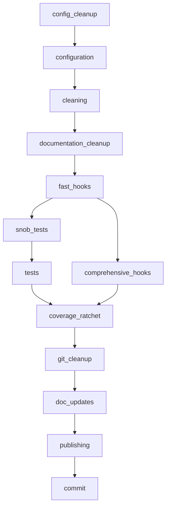
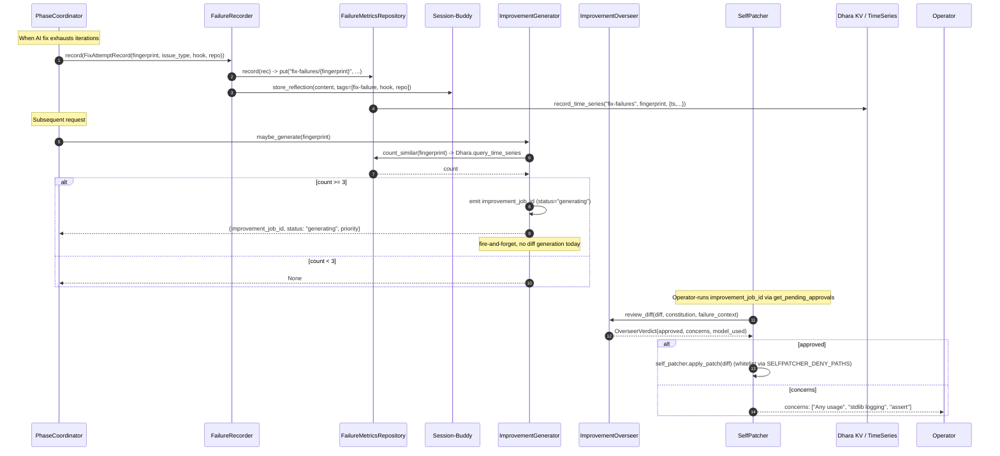
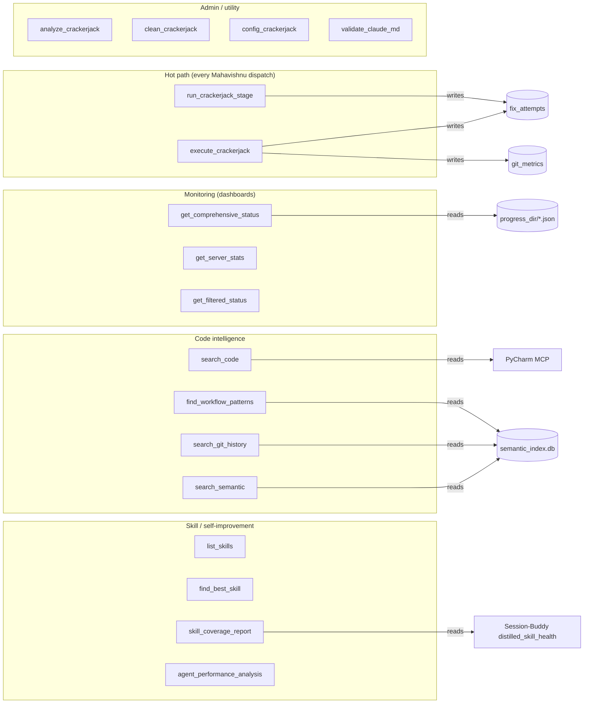
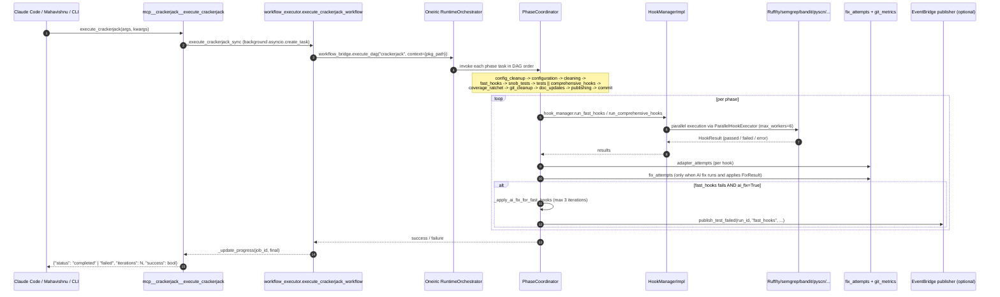
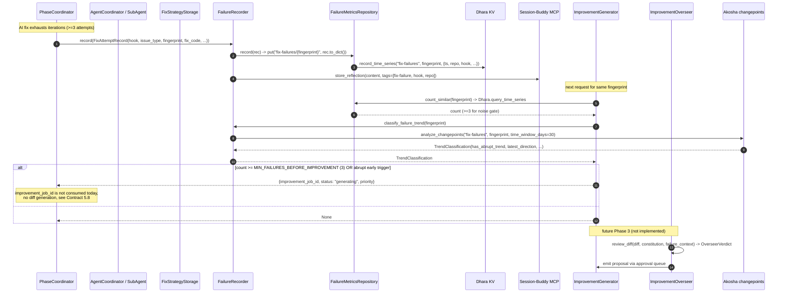

# Crackerjack Memory Architecture

> **Status**: Living document. Updated whenever the storage schema, MCP surface, or integration contracts change.
> **Audience**: Bodai ecosystem contributors, Claude Code users, and downstream components (Session-Buddy, Akosha, Dhara, Mahavishnu).
> **Source of truth**: The SQLite-backed memory layer under `crackerjack/memory/`, the MCP tool implementations under `crackerjack/mcp/tools/`, the self-improvement services under `crackerjack/services/`, and the integration tests under `tests/integration/` (especially `test_symbiotic_ecosystem.py`, `test_skills_tracking.py`, `test_ai_fix_workflow.py`, `test_skill_coverage_report.py`, `test_eventbridge_e2e.py`).

Crackerjack is the **Inspector / Quality** component of the Bodai ecosystem. It owns
the multi-strategy quality gate pipeline (fast / comprehensive / test / clean /
publish), the SQLite-backed **fix-attempt memory** and **git-metrics memory** that
make AI-driven self-improvement evidence-driven, the **skill registry** that
distilled-skill learning consumes, the **EventBridge publisher** that broadcasts
test lifecycle events to Mahavishnu, and the **MCP tool surface** (`mcp__crackerjack__*`)
that the rest of the ecosystem (and Claude Code) invokes to run hooks, query
status, search code, and trigger AI fixes.

This document describes what Crackerjack stores, who reads and writes it, and
the integration contracts the rest of the ecosystem depends on. The five
contract bugs captured below were the trigger for writing it — they all
stemmed from undocumented expectations about how the schema, the MCP surface,
the `crackerjack_run` invocation, and the self-improvement tools line up.

______________________________________________________________________

## Table of Contents

1. [Storage Inventory](#1-storage-inventory)
1. [MCP Write Surface](#2-mcp-write-surface)
1. [MCP Read Surface](#3-mcp-read-surface)
1. [Cross-Component Visibility](#4-cross-component-visibility)
1. [Integration Contract](#5-integration-contract)
1. [Sample Queries](#6-sample-queries)
1. [Diagrams](#7-diagrams)
1. [Operational Notes](#8-operational-notes)

______________________________________________________________________

## 1. Storage Inventory

Crackerjack persists state across **eight logical stores**: five SQLite
files (one of them currently broken on the shipped schema), one JSON
file per workflow checkpoint, one JSON file for the in-process
`StateManager` (used by `session_management`), and an in-process
`ErrorCache` (error patterns keyed by Ruff/Pyright/Bandit signatures). The
single anchor for cross-store joins is the **project path** plus the
**Crackerjack version** (`crackerjack_version: str` is on every
`FixAttemptRecord` and is the only field guaranteed to propagate from
`PhaseCoordinator._fire_exhaustion_record` through to the published
EventBridge envelope).

| Store | Engine | Anchor field | Default path | Owner / Purpose |
|-------|--------|--------------|--------------|-----------------|
| **fix-attempt memory** | SQLite (stdlib `sqlite3`, thread-local conn) | `fix_attempts.issue_fingerprint` (`sha256("hook::issue_type::<file-replaced-error>")`) | `.crackerjack/fix_strategy_memory.db` (overridable via `CrackerjackSettings.fix_strategy_memory.db_path`; default in `crackerjack/config/settings.py:69`) | `crackerjack/memory/fix_strategy_storage.py::FixStrategyStorage` — every Crackerjack agent invocation records a row (`record_attempt`); `crackerjack/memory/strategy_recommender.py::StrategyRecommender` reads it back. Triggered by `crackerjack/intelligence/agent_orchestrator.py:_record_fix_attempt` after each `analyze_and_fix` returns. |
| **strategy effectiveness** | SQLite (same DB) | `strategy_effectiveness.agent_strategy` (PK, `"agent:strategy"`) | same | `fix_strategy_schema.sql` trigger `update_strategy_effectiveness_after_insert` (note: trigger only fires when the row already exists; first insert is a no-op — `update_strategy_effectiveness` is the canonical full-rebuild path) |
| **git-metrics time-series** | SQLite (stdlib `sqlite3`, thread-local conn) | `(repository_path, timestamp, metric_type)` (composite PK) | `.crackerjack/git_metrics.db` (or `.git/git_metrics.db` per repo) | `crackerjack/memory/git_metrics_storage.py::GitMetricsStorage` (Pydantic `GitMetric` dataclass + raw SQL); consumed by `crackerjack/memory/git_metrics_collector.py::GitMetricsCollector` and `crackerjack/mcp/tools/git_metrics_tools.py` (`collect_git_metrics`, `get_repository_velocity`, `get_repository_health`, `get_conventional_compliance`) |
| **git events log** | SQLite (same DB as git-metrics) | `(repository_path, timestamp, event_type)` (composite PK) | same | `git_metrics_schema.sql` table `git_events`; written by `_GitRepository._check_merge_conflicts` and `get_reflog_events`. **The shipped schema has a SQL syntax error** that prevents `executescript` from running (see [Contract 5.1](#contract-51--crackers-shell-git_metrics_schema-sql-fails-executescript)). |
| **adapter learning** | SQLite (Dhara or local SQLite via Dhara integration) | `adapter_attempts.adapter_name` + `file_type` | `.crackerjack/adapter_learning.db` (override via `LearningSettings.adapter_learning_db`; default in `crackerjack/config/settings.py:354`) | `crackerjack/integration/dhara_integration.py::DharaLearningIntegration` — every hook adapter (Ruff, Pyright, Bandit, etc.) records `(adapter_name, file_type, success, execution_time_ms)`. PhaseCoordinator wires this through `PhaseCoordinator.__init__` (`crackerjack/core/phase_coordinator.py:107-125`) and feeds it back to `HookManagerImpl` for tool selection. |
| **fix-strategy strategy_effectiveness mirror** | SQLite (same DB) | `agent_strategy` PK | same as fix-attempts | Tracked alongside fix_attempts; updated by `FixStrategyStorage.update_strategy_effectiveness` (called from `crackerjack/skills/coverage.py` and after `record_attempt`). |
| **Oneiric workflow checkpoints** | SQLite (managed by `oneiric`) | `workflow_key` (composite of DAG run id + workflow name) | `.crackerjack/oneiric_cache/workflow_checkpoints.sqlite` (fallback to `${tempdir}/crackerjack/oneiric_cache/`) | `crackerjack/runtime/oneiric_workflow.py::_resolve_workflow_checkpoints_path` resolves; `WorkflowPipeline._clear_oneiric_cache` wipes `workflow_key="crackerjack"` runs at the start of every `run_complete_workflow` |
| **AI fix error pattern cache** | JSON file (in-process dict + atomic write) | `error_hash` (sha256 of pattern) | `~/.cache/crackerjack-mcp/error_patterns.json` + `fix_results.json` (configurable via `MCPServerConfig.cache_dir`) | `crackerjack/mcp/cache.py::ErrorCache` — extracted from Ruff/Pyright/Bandit output via `_extract_ruff_info` / `_extract_pyright_info` / `_extract_bandit_info`; consumed by `crackerjack/mcp/tools/error_analyzer.py::analyze_errors_with_caching` (via `smart_error_analysis`). The same JSON file backs `crackerjack/mcp/state.py::StateManager` (session / checkpoint / issue history). |
| **session / checkpoint state** | JSON file (in-process dict + `BatchedStateSaver`) | `job_id` (UUID) | `~/.cache/crackerjack-mcp/current_session.json` + `checkpoints/<name>.json` (same dir as cache) | `crackerjack/mcp/state.py` — `StateManager.start_session`, `save_checkpoint`, `complete_session`; `BatchedStateSaver` debounces writes 1s. Read via `get_job_progress`, `session_management`. |
| **In-process skill registry** | Python `dict` (no disk persistence) | `skill_id` (`"skill_<8hex>"` for `AgentSkill`, named for `MCPSkill`) | lives in `_skill_registries` module global in `crackerjack/mcp/tools/skill_tools.py` | Three registries: `AgentSkillRegistry` (`crackerjack/skills/agent_skills.py`), `MCPSkillRegistry` (`crackerjack/skills/mcp_skills.py`), `HybridSkillRegistry` (`crackerjack/skills/hybrid_skills.py`). Re-initialized on every MCP server start via `crackerjack/skills/registration.py::register_all_skills`. |
| **CI patterns** | JSON file | `pattern_id` (sha256-derived from error line) | `.crackerjack/ci_patterns.json` | `crackerjack/ci_feedback.py::CIFeedbackAnalyzer` — pattern catalog + fix suggestions; not on the MCP surface but consumed by `crackerjack run` exit-handling. |

The single **anchor point** for cross-component joins is **`issue_fingerprint`**
(SHA-256 of `hook::issue_type::<file-replaced-error>`), defined in
`crackerjack/services/failure_recorder.py::_compute_fingerprint`. It is the
join key between `fix_attempts`, the failure-metrics repository in Dhara
(`fix-failures/{fingerprint}`), the EventBridge-published
`fingerprint` field, and the Session-Buddy `distilled_skills.problem_pattern`
key after distillation.

### Schema map

The diagram below shows the on-disk schema and the in-process registries.
Green nodes are the **authoritative write targets** today; yellow nodes
are derived (computed on read, not stored separately); red nodes are
aspirational / aspirational-DLQ.

```mermaid
erDiagram
    %% fix-attempt + strategy_effectiveness (crackerjack/memory/fix_strategy_schema.sql)
    FixStrategyDB ||--o{ fix_attempts : "owns"
    FixStrategyDB ||--o{ strategy_effectiveness : "owns (trigger-rebuild)"
    fix_attempts {
        integer id PK
        text issue_type
        text issue_message
        text file_path
        text stage
        blob issue_embedding "Packed 384-dim float array (neural) OR zeros (TF-IDF)"
        blob tfidf_vector "Optional TF-IDF sparse (scipy.sparse.save_npz)"
        text agent_used
        text strategy
        bool success
        real confidence
        text timestamp
        text session_id
    }
    strategy_effectiveness {
        text agent_strategy PK "agent:strategy"
        integer total_attempts
        integer successful_attempts
        real success_rate
        text last_attempted
        text last_successful
    }

    %% git-metrics (crackerjack/memory/git_metrics_schema.sql)
    GitMetricsDB ||--o{ git_metrics : "owns"
    GitMetricsDB ||--o{ git_events : "owns"
    git_metrics {
        text timestamp PK
        text repository_path PK
        text metric_type PK "commit_velocity, merge_conflicts, ..."
        real value
        text metadata "JSON string"
    }
    git_events {
        text repository_path PK
        text event_type PK "commit, push, merge, rebase, ..."
        text timestamp PK
        text details "JSON string"
    }

    %% adapter learning (crackerjack/.crackerjack/adapter_learning.db)
    AdapterLearningDB ||--o{ adapter_attempts : "owns"
    AdapterLearningDB ||--o{ adapter_effectiveness : "owns"
    adapter_attempts {
        integer id PK
        text adapter_name
        text file_type
        integer file_size
        text project_context
        bool success
        integer execution_time_ms
        text error_type
        text timestamp
    }
    adapter_effectiveness {
        integer id PK
        text adapter_name
        text file_type "UNIQUE"
        integer total_attempts
        integer successful_attempts
        real success_rate
        real avg_execution_time_ms
        text common_errors "JSON string"
        text last_attempted
        text last_updated
    }

    %% Oneiric workflow checkpoints (managed by oneiric)
    OneiricDBSqlite ||--o{ workflow_checkpoints : "owns"
    OneiricDBSqlite ||--o{ workflow_executions : "owns"
    OneiricDBSqlite ||--o{ workflow_execution_nodes : "owns"
    workflow_checkpoints {
        text workflow_key PK
        text node_id PK
        blob payload
    }

    %% In-process state (crackerjack/mcp/state.py)
    StateManagerJson ||--o{ session_state : "owns (current_session.json)"
    StateManagerJson ||--o{ checkpoints : "owns (<name>.json)"
    StateManagerJson ||--o{ error_patterns : "owns (error_patterns.json)"
    StateManagerJson ||--o{ fix_results : "owns (fix_results.json)"
    session_state {
        text session_id
        text start_time
        text current_stage
        text stages_json
        text issues_json
        text fixes_applied_json
    }
    error_patterns {
        text pattern_id PK "sha256(error pattern)"
        text error_type "ruff | pyright | bandit"
        text error_code
        text message_pattern
        int frequency
        bool auto_fixable
        text last_seen
    }

    %% In-process skill registries (crackerjack/skills/)
    SkillRegistriesPython ||--o{ agent_skills : "holds"
    SkillRegistriesPython ||--o{ mcp_skills : "holds"
    SkillRegistriesPython ||--o{ hybrid_skills : "holds"
    agent_skills {
        text skill_id PK "skill_<8hex>"
        text name "agent class name"
        text category "code_quality | testing | security | ..."
        int execution_count
        real success_rate "EMA alpha=0.1"
    }
    mcp_skills {
        text skill_id PK "named in MCP_SKILL_GROUPS"
        text domain "execution | monitoring | intelligence | ..."
        int total_tools "sum of ToolReference per skill"
    }

    %% Failure-flow (failure_recorder.py + Dhara + SB)
    fix_attempts ||--o{ FixAttemptRecord : "produced by"
    FixAttemptRecord ||--o{ DharaKV : "put('fix-failures/{fingerprint}')"
    FixAttemptRecord ||--o{ SBReflection : "store_reflection(content, tags=[fix-failure, ...])"
    DharaKV ||--o{ FailureRecorderCount : "count_similar(fingerprint)"
    FailureRecorderCount ||--o{ ImprovementGenerator : "maybe_generate(fingerprint)"

    style FixStrategyDB fill:#dfd,stroke:#383
    style fix_attempts fill:#dfd,stroke:#383
    style strategy_effectiveness fill:#dfd,stroke:#383
    style GitMetricsDB fill:#ffd,stroke:#993
    style git_metrics fill:#dfd,stroke:#383
    style git_events fill:#dfd,stroke:#383
    style AdapterLearningDB fill:#dfd,stroke:#383
    style OneiricDBSqlite fill:#dde,stroke:#338
    style StateManagerJson fill:#ffd,stroke:#993
    style error_patterns fill:#ffd,stroke:#993
    style SkillRegistriesPython fill:#eee,stroke:#666
    style fix_attempts fill:#dff,stroke:#399
    style DharaKV fill:#dff,stroke:#399
    style SBReflection fill:#dff,stroke:#399
```



### Per-store ownership map

| Store | Read by (typical) | Written by (typical) | Retention / aging |
|-------|--------------------|----------------------|-------------------|
| `fix_attempts` (rows) | `StrategyRecommender.recommend_strategy` (consumed by Mahavishnu via `crackerjack_run` → `crackerjack/skills/coverage.py::skill_coverage_report` and by Session-Buddy Conscious Agent for distillation) | `crackerjack/intelligence/agent_orchestrator.py:_record_fix_attempt` after every agent invocation; `PhaseCoordinator._fire_exhaustion_record` after exhausting AI-fix iterations; `crackerjack/skills/coverage.py` does NOT write (read-only) | Operator-controlled; no built-in TTL |
| `strategy_effectiveness` | `FixStrategyStorage.get_statistics` (`top_strategies`); consumed by `PhaseCoordinator` and `StrategyRecommender` | `update_strategy_effectiveness_after_insert` trigger (only fires for existing rows) + `FixStrategyStorage.update_strategy_effectiveness` full rebuild | Full rebuild on each call — no separate aging |
| `git_metrics` (rows) | `collect_git_metrics`, `get_repository_velocity`, `get_conventional_compliance` MCP tools; `GitMetricsSessionCollector` for Session-Buddy snapshot; `get_repository_health` (joins with `git_events`) | `GitMetricsStorage.store_metric` (called by `_collect_commit_metrics`); rate-limited by `_purge_ts`-style retention in `GitMetricsCollector` | None today; schema has no TTL |
| `git_events` | `get_repository_health` (conflict / merge analysis) | `_check_merge_conflicts`, `_get_conflict_files`, `get_reflog_events` | None |
| `adapter_attempts` | `DharaLearningIntegration` (feeds `_adapter_learner`) | Every hook call (FastStrategy & ComprehensiveStrategy) | `min_attempts=5`; no TTL |
| `adapter_effectiveness` | Adapter selector chooses best adapter per `(file_type, file_size)` | `DharaLearningIntegration` aggregate update | No TTL |
| `workflow_checkpoints` | Oneiric workflow_bridge (resumable DAG) | `register_crackerjack_workflow` | `crackerjack` workflow_key is wiped by `WorkflowPipeline._clear_oneiric_cache` at the start of every `run_complete_workflow` |
| `error_patterns` | `analyze_errors_with_caching` (via `smart_error_analysis`) | `ErrorCache.add_pattern` (extracted from Ruff/Pyright/Bandit output) | `cleanup_old_patterns(older_than_days)` exists but is not scheduled |
| `fix_results` | `ErrorCache.get_fix_success_rate(pattern_id)` | `ErrorCache.add_fix_result` after each autofix | Same as `error_patterns` |
| `session_state` | `get_job_progress`, `session_management` (start/checkpoint/complete/reset) | `StateManager.start_session`, `add_issue`, `save_checkpoint` | `BatchedStateSaver` debounces writes 1s |
| `agent_skills` (registry) | `find_best_skill`, `get_skills_for_issue`, `agent_performance_analysis` | `initialize_skills` at MCP server startup (calls `register_all_skills` → `register_agent_skills`) | In-process only; no persistence across restarts |
| `mcp_skills` (registry) | `search_skills`, `list_skills`, `get_skill_statistics` | Same `initialize_skills` call; reads from `MCP_SKILL_GROUPS` literal in `crackerjack/skills/mcp_skills.py` | Same as `agent_skills` |

### Storage paths

Crackerjack uses an XDG-style layout via direct `Path` resolution (no
`platformdirs`):

| Path component | Linux | macOS | Crackerjack source |
|----------------|-------|-------|---------------------|
| `.crackerjack/` (project root) | `cwd/.crackerjack` | `cwd/.crackerjack` | `crackerjack/config/settings.py:69`, `:354` |
| `~/.cache/crackerjack-mcp/` | `~/.cache/crackerjack-mcp` | `~/Library/Caches/crackerjack-mcp` | `crackerjack/mcp/state.py:103`, `crackerjack/mcp/cache.py:54` (hardcoded, not platformdirs) |
| `.crackerjack/oneiric_cache/workflow_checkpoints.sqlite` | same | same | `crackerjack/runtime/oneiric_workflow.py:_resolve_workflow_checkpoints_path` |
| `.crackerjack/logs/ai-fix-errors-<timestamp>.json` | same | same | `crackerjack/ai_fix/` (per-run error log) |

The MCP server picks up `CrackerjackSettings` via the Pydantic
`OneiricMCPConfig` base in `crackerjack/config/settings.py`. Layered
resolution follows Oneiric's `oneiric://defaults` → `settings/crackerjack.yaml`
→ `settings/local.yaml` (gitignored) → env vars
(`CRACKERJACK_*`, double-underscore nested). See `pyproject.toml:[tool.crackerjack]`
for the MCP port (`8676`), host (`127.0.0.1`), and WebSocket port (`8696`)
defaults; the `[dependency-groups]` block includes `neural` (intentionally
empty — see `crackerjack/memory/issue_embedder.py:35-58`) so the TF-IDF
fallback in `FallbackIssueEmbedder` is the default.

______________________________________________________________________

## 2. MCP Write Surface

Crackerjack's MCP write surface is **medium-sized but gated by lifecycle**.
Writes flow through three layers: (1) directly-mutating tools
(`init_crackerjack`, `session_management`, `index_*`, `remove_*`,
`record_*`); (2) tools that write as a side-effect of running hooks
(`execute_crackerjack`, `run_crackerjack_stage`, `smart_error_analysis`,
`analyze_errors`); (3) tools that write via in-process registries
(`register_*` calls inside `register_all_skills` at startup, plus the
EventBridge publisher which writes to the external Bodai EventBridge
when wired). All tools are always registered in `crackerjack/mcp/server_core.py:227-265`
(regardless of profile — Crackerjack does NOT use a tool profile gate like
Mahavishnu or Session-Buddy). The `discover_tools` meta-tool is
**registered** as of 2026-07-30; see Contract 5.5 for resolution history.

### Always-on core tools

These are the 11 tool groups registered unconditionally by
`create_mcp_server` (`crackerjack/mcp/server_core.py::create_mcp_server`).
Each is a separate `_register_*_tools` function imported from
`crackerjack.mcp.tools.__init__`.

| Tool | Group | Caller (typical) | What it writes |
|------|-------|------------------|-----------------|
| `execute_crackerjack(args, kwargs)` | `execution_tools` | Mahavishnu worker `dispatch_to_pool` via `mcp__crackerjack__execute_crackerjack`; CLI `/crackerjack:run` slash command | `oneiric_cache/workflow_checkpoints.sqlite` via `WorkflowPipeline`; `fix_attempts` (every agent invocation); `strategy_effectiveness`; `adapter_attempts`; `error_patterns` (auto-extracted from hook output); `ai-fix-errors-<timestamp>.json` per run; `progress_dir/job-<id>.json` per `job_id` |
| `run_crackerjack_stage(args, kwargs)` | `core_tools` | CLI fallback / direct stage invocation | Same as `execute_crackerjack` but for one stage only (`fast | comprehensive | tests | cleaning | init`); per-stage `progress_dir/job-<id>.json` |
| `init_crackerjack(args, kwargs)` | `execution_tools` | First-time setup, `claude-code` system message | `pyproject.toml` (`[tool.crackerjack]` block) + `CLAUDE.md` + `example.mcp.json` + `settings/local.yaml`; overwrites only with `force=true` |
| `smart_error_analysis(use_cache=True)` | `execution_tools` | Mahavishnu `agent_performance_analysis` follow-up | Reads `error_patterns` (no write) — but pulls patterns from `ErrorCache` (filesystem JSON) which is the in-process state, so this is effectively a read tool that mutates the in-memory cache (frequency counter, `auto_fixable` flag) |
| `analyze_errors(output, include_suggestions=True)` | `core_tools` | Quality review / `cr /analyze` | Mutates `error_patterns` (`add_pattern` increments `frequency`); mutates `fix_results` (`add_fix_result` sets `auto_fixable=True` for successful fixes) |
| `clean_crackerjack(args, kwargs)` | `utility_tools` | Scheduled cleanup | Deletes `crackerjack-*.log`, `crackerjack-task-error-*.log`, `.coverage.*`, `*.json` in `progress_dir` (or `tempfile.gettempdir()` depending on `scope` arg) — no DB writes |
| `config_crackerjack(args, kwargs)` | `utility_tools` | Operator / one-off inspection | No writes — read-only dump of `CrackerjackSettings.model_dump()` |
| `analyze_crackerjack(args, kwargs)` | `utility_tools` | Operator | No writes (currently returns `status: mock_success`; see [Contract 5.6](#contract-56--analyze_crackerjack-is-mocked)) |
| `validate_claude_md(args, kwargs)` | `utility_tools` | Hook during `crackerjack init` | May call `InitializationService.initialize_project_full` (writes `CLAUDE.md`) if `update=true` is in args and validation fails |
| `crackerjack_doc_frontmatter_validate(pkg_path, strict, allow_nonstandard, validate_links, store)` | `doc_tools` | `crackerjack init` documentation phase | May write to `store` (defaults to in-memory `Dict`; if `store="path"`, writes to that path) |
| `publish_to_eventbridge(topic, payload, async_callback=False)` | `eventbridge_tools` | Mahavishnu `bodai_subscriber` integration via the `enabled=true` toggle in `crackerjack.yaml` | None locally — the publisher is `set_eventbridge_publisher(publisher)` at startup; when wired, the publisher (a `Oneiric EventBridge` instance) writes to the Bodai EventBridge (Mahavishnu consumes from there). When `enabled=false` (default in `settings/crackerjack.yaml:295`), the tool returns `{"status": "no_publisher"}` and writes nothing. |
| `get_job_progress(job_id)` | `progress_tools` | Operator / Mahavishnu status surface | Writes `progress_dir/job-<id>.json` (atomic write via `_update_progress`) |
| `session_management(action, checkpoint_name=None)` | `progress_tools` | Operator / state resume | Calls `StateManager.start_session` / `save_checkpoint` / `complete_session` / `reset_session` — writes `current_session.json` + `<name>.json` |

### Skill / coverage write surface

| Tool | Group | What it writes |
|------|-------|-----------------|
| `list_skills(skill_type="all")` | `skill_tools` | None (read-only — pulls from `_skill_registries` populated at startup) |
| `get_skill_info(skill_id, skill_type="agent")` | `skill_tools` | None |
| `search_skills(query, search_in="all")` | `skill_tools` | None (mutates `_skill_registries` only on `initialize_skills`) |
| `get_skills_for_issue(issue_type)` | `skill_tools` | None |
| `get_skill_statistics()` | `skill_tools` | None — returns aggregate counts per registry |
| `execute_skill(skill_id, issue_type, issue_data, timeout=None)` | `skill_tools` | Writes nothing directly — delegates to the skill's `execute` (which may write `fix_attempts` if the skill's agent is wired) |
| `find_best_skill(issue_type)` | `skill_tools` | None — runs the skill's `can_handle` and returns the highest-confidence match |
| `skill_coverage_report(...)` | `skills/coverage.py` (called by `Mahavishnu_aggregator.skill_coverage_report`, not directly on MCP surface) | None locally — calls `mcp__session-buddy__distilled_skill_health` and merges; see [Contract 5.4](#contract-54--crackerjack-skill_coverage_report-requires-session-buddy-mcp-distilled_skill_health) |

### Search / write tools (semantic + git semantic)

| Tool | Group | What it writes |
|------|-------|-----------------|
| `index_file_semantic(file_path, config_json="")` | `semantic_tools` | `crackerjack/.crackerjack/semantic_index.db` — `embeddings` row + `file_tracking` row (one chunk per `chunk_size=512` lines of the file) |
| `remove_file_from_semantic_index(file_path, config_json="")` | `semantic_tools` | Deletes rows from `embeddings` and `file_tracking` for that file |
| `search_semantic(query, max_results, min_similarity, file_types, config_json)` | `semantic_tools` | None (read-only vector search) |
| `get_semantic_stats(config_json="")` | `semantic_tools` | None |
| `get_embeddings(texts, config_json="")` | `semantic_tools` | None (calls `EmbeddingService.generate_embedding` or `generate_embeddings_batch`) |
| `calculate_similarity_semantic(embedding1, embedding2, config_json="")` | `semantic_tools` | None |
| `index_git_history(days_back, repository_path="")` | `git_semantic_tools` | `embeddings` + `file_tracking` (one row per git event) |
| `search_git_history(query, limit, days_back, repository_path="")` | `git_semantic_tools` | None (read-only semantic search over git events) |
| `find_workflow_patterns(pattern_description, days_back, min_frequency, repository_path="")` | `git_semantic_tools` | None |
| `recommend_git_practices(focus_area, days_back, repository_path="")` | `git_semantic_tools` | None |

### Self-improvement / monitoring writes

| Tool | Group | What it writes |
|------|-------|-----------------|
| `agent_performance_analysis()` | `intelligence_tool_registry` | None (read-only; pulls `learning_system.get_learning_summary` + `orchestrator.get_execution_stats`) |
| `execute_smart_task(...)` | `intelligence_tool_registry` | Writes `fix_attempts` (via `_record_fix_attempt` after every agent) |
| `get_comprehensive_status()` | `monitoring_tools` | None — but `get_filtered_status(components="jobs")` reads `progress_dir/*.json` |
| `query_local_traces(task_class, time_range_minutes, system_id, limit)` | `otel_tools` | None — proxies to Akosha MCP `query_local_traces` over HTTP; writes nothing locally |
| `get_cross_project_git_dashboard(...)` / `get_repository_health(...)` / `get_velocity_comparison(...)` / `get_cross_project_patterns(...)` | `mahavishnu_tools` | None (each tool calls the Mahavishnu aggregator which reads from the same `git_metrics` schema + cross-project SQLite) |
| `create_workspace(...)` / `list_workspaces(...)` / `get_workspace_info(...)` / `remove_workspace(...)` | `workspace_tools` | None — `_get_manager` raises `NotImplementedError`; see [Contract 5.7](#contract-57--crackerjack-workspace-tools-are-stubbed) |

### Phase-order / dependency map

`crackerjack/runtime/oneiric_workflow.py::_build_workflow_steps` produces
the linear DAG of phases for `crackerjack run`:



When `enable_parallel_phases=True` (default in `settings/crackerjack.yaml:212`),
`tests` and `comprehensive_hooks` run in parallel (see
`_handle_parallel_step`). `_should_run_config_cleanup` is hard-coded to
`return False` in `crackerjack/runtime/oneiric_workflow.py:328-330` (TODO
note) — the phase exists in the DAG but never runs. `publishing` and
`commit` always run last.

### Self-improvement loop (self_improvement flow)



`MIN_FAILURES_BEFORE_IMPROVEMENT=3` and `MAX_IMPROVEMENTS_PER_DAY=5` are
constants in `crackerjack/services/improvement_generator.py:17-19`. The
generator uses an "abrupt early trigger" — `count >= 1 && trend.has_abrupt_trend && trend.latest_direction == "down"` — that fires even with one failure
if Akosha reports a sudden downward changepoint via
`FailureRecorder.classify_failure_trend` → Akosha
`analyze_changepoints("fix-failures", fingerprint)`. The current
`ImprovementGenerator.maybe_generate` is **fire-and-forget**: it returns
a job id, but no actual diff generation runs (the
`_build_generation_prompt` helper exists but is not invoked by
`maybe_generate` — see [Contract 5.8](#contract-58--improvementgenerator-maybegenerate-is-fire-and-forget)).

______________________________________________________________________

## 3. MCP Read Surface

The Crackerjack read surface is **large and grouped by access pattern**.
The hot path is `execute_crackerjack` / `run_crackerjack_stage` (called
by Mahavishnu workers on every dispatch), followed by the monitoring
cluster (`get_comprehensive_status`, `get_server_stats`) for dashboards.

### Hot-path execution + quality

| Tool | Reads | Use when |
|------|-------|----------|
| `execute_crackerjack(args, kwargs)` | `CrackerjackSettings`; oneiric `LifecycleManager`; `HookManagerImpl`; `GitMetricsCollector` (when `git_metrics_enabled`) | Default Mahavishnu worker dispatch; `/crackerjack:run` slash command |
| `run_crackerjack_stage(args, kwargs)` | Same as above, one stage only | Operator wants a specific stage; CI gate |
| `smart_error_analysis(use_cache)` | `error_patterns` JSON cache | Want AI-prioritized fix suggestions for accumulated errors |
| `analyze_errors(output, include_suggestions)` | `output` argument (parsed) → `error_patterns` | Post-stage review |
| `collect_git_metrics(repo_path, days_back)` | `git_metrics` + `git_events` (live git CLI) | Velocity dashboard, trend reporting |
| `get_repository_velocity(repo_path, days_back)` | `git_metrics` only | Lightweight velocity check |
| `get_conventional_compliance(repo_path, days_back)` | `git_metrics` (commit_type filter) | Commit-message compliance reports |
| `get_repository_health(repo_path)` | `git_metrics` + `git_events` | Per-repo health score (joins branch + merge metrics) |
| `execute_smart_task(task_description, context_type, strategy, max_agents, use_learning)` | `intelligence.registry`, `learning_system`, `orchestrator` | High-level "find the best agent and run it" — used by Mahavishnu self-improvement tools |
| `get_agent_recommendation(task_description, context_type, include_analysis)` | Same | Suggest (don't run) the best agent |
| `intelligence_system_status()` | Same | Operator dashboard |
| `agent_performance_analysis()` | `learning_system._learning_insights`, `orchestrator.get_execution_stats` | Per-agent effectiveness rollup |
| `get_comprehensive_status(verbosity, client_id, client_ip)` | `progress_dir/*.json`, `state_manager`, `server_manager` (process scan), `agent_suggestions` from `_suggest_agent_for_context` | Mahavishnu `ecosystem_status` consumer + operator dashboard |
| `get_filtered_status(components)` | Same, filtered | Lightweight dashboards |
| `get_server_stats()` | Same | Minimal liveness snapshot |
| `get_stage_status()` | `state_manager.stages` | Fine-grained stage status |
| `get_next_action()` | Same | State-machine next-step hint |
| `list_slash_commands()` | Static dict | Self-description |

### Code search + IDE integration

| Tool | Reads | Use when |
|------|-------|----------|
| `search_code(pattern, file_pattern=None)` | `PyCharmMCPAdapter.search_regex` (returns `SearchResult[]`); errors when PyCharm MCP is not running → `"MCP server not connected"` | Cross-IDE regex search |
| `get_ide_diagnostics(file_path, errors_only=False)` | `PyCharmMCPAdapter.get_file_problems` | Inline IDE problem pull |
| `get_symbol_info(symbol_name, include_usages=False)` | PyCharm MCP — **not yet implemented**, always returns `status: not_implemented` (see [Contract 5.9](#contract-59--crackerjack-pycharm-symbol-and-find-usages-tools-are-stubs)) | Symbol-level queries (intentionally limited) |
| `find_usages(symbol_name, file_path=None, limit=50)` | Same as above (stub) | Reference lookups (intentionally limited) |
| `pycharm_health()` | `PyCharmMCPAdapter.health_check` | PyCharm MCP connection check (returns `status: healthy | degraded`) |
| `search_git_history(query, limit, days_back, repository_path="")` | `GitSemanticSearchConfig` + `embeddings` rows for git events | "When was this last touched?" — semantic over commit messages + diffs |
| `find_workflow_patterns(pattern_description, days_back, min_frequency, repository_path="")` | Same + pattern frequency | Detect recurring patterns across commits |
| `recommend_git_practices(focus_area, days_back, repository_path="")` | Same, grouped by `focus_area` | Coaching recommendations |
| `index_git_history(days_back, repository_path="")` | `git log` over the window | Build the git-events semantic index |
| `query_local_traces(task_class, time_range_minutes, system_id, limit)` | Akosha MCP `query_local_traces` over HTTP | Cross-component OTel trace recall |
| `search_semantic(query, max_results, min_similarity, file_types, config_json="")` | `VectorStore.search` (TF-IDF or sentence-transformers on `crackerjack/.crackerjack/semantic_index.db`) | Natural-language code search |
| `get_semantic_stats(config_json="")` | Same | Index coverage |
| `get_embeddings(texts, config_json="")` | `EmbeddingService` (one-off, no DB write) | Custom embedding generation |
| `calculate_similarity_semantic(embedding1, embedding2, config_json="")` | Same | Custom similarity scoring |

### Skill discovery + utilities

| Tool | Reads | Use when |
|------|-------|----------|
| `list_skills(skill_type="all")` | `_skill_registries` | List all known skills (agent / mcp / hybrid) |
| `get_skill_info(skill_id, skill_type="agent")` | Same | Single-skill detail |
| `search_skills(query, search_in="all")` | Same, in-memory | Free-text search across name/description/tags |
| `get_skills_for_issue(issue_type)` | Same, indexed by `IssueType` | Map issue type → skill set |
| `get_skill_statistics()` | Same, aggregated | Coverage report |
| `execute_skill(skill_id, issue_type, issue_data, timeout=None)` | Skill `execute` (may hit agents) | Run a hybrid skill (currently `NotImplementedError` for non-hybrid) |
| `find_best_skill(issue_type)` | `can_handle` confidence | Pick the top-skill for an issue |
| `get_cross_project_git_dashboard(project_paths, days_back)` | `MahavishnuAggregator.get_cross_project_git_dashboard` | Cross-repo velocity summary |
| `get_cross_project_patterns(project_paths, days_back)` | Same | Recurring patterns across repos |
| `get_velocity_comparison(repo_path, compare_period_days)` | Same, two windows | Period-over-period delta |
| `crackerjack_doc_frontmatter_validate(pkg_path, strict, allow_nonstandard, validate_links, store)` | `FrontmatterValidator` | Doc CI gate |
| `clean_crackerjack(args, kwargs)` | `progress_dir`, `tempfile.gettempdir()` | Cleanup |
| `config_crackerjack(args, kwargs)` | `CrackerjackSettings` | Settings introspection |
| `analyze_crackerjack(args, kwargs)` | None (mock) | Currently a stub — see [Contract 5.6](#contract-56--analyze_crackerjack-is-mocked) |
| `validate_claude_md(args, kwargs)` | `CLAUDE.md` | Operator validation |
| `get_job_progress(job_id)` | `progress_dir/job-<id>.json` | Watch a running job |
| `session_management(action, checkpoint_name)` | `StateManager` (in-process + JSON) | Session lifecycle |
| `publish_to_eventbridge(topic, payload, async_callback)` | Oneiric EventBridge publisher (set at startup) | Cross-component event emission |

### Read groups by access pattern



______________________________________________________________________

## 4. Cross-Component Visibility

Crackerjack is **read-mostly for the rest of the ecosystem** and
**write-mostly for the Local Crackerjack caller** (its own CLI, Mahavishnu
worker, slash command). The exception is the **skill-coverage report**,
which Crackerjack reads from Session-Buddy.

| Consumer | Surface | Reads from Crackerjack | Writes to Crackerjack |
|----------|---------|------------------------|------------------------|
| **Mahavishnu** | `mcp__crackerjack__*` (50+ tools); `crackerjack run` CLI as worker fallback; `mcp__mahavishnu__self_improvement_*` (Mahavishnu's own tools, separate from Crackerjack's) | `execute_crackerjack` (status); `get_comprehensive_status`; `agent_performance_analysis`; `collect_git_metrics`; `publish_to_eventbridge` (Mahavishnu → Crackerjack publisher — see below) | `execute_crackerjack` (returns results); `session_management`; `clean_crackerjack`; `config_crackerjack`; `publish_to_eventbridge` (Mahavishnu invokes the tool — but the **publisher** inside is Crackerjack's Oneiric EventBridge, so Crackerjack emits onto the Bus, which Mahavishnu's bodai_subscriber then consumes; this is a routing convention, not a true Mahavishnu → Crackerjack write) |
| **Session-Buddy** | Distilled-skill distillation; conscious-agent reflection storage | `crackerjack_run` results via `mcp__session-buddy__store_reflection` from `FailureRecorder` (cross-process via SB MCP); `crackerjack/skills/coverage.py::skill_coverage_report` (calls `mcp__session-buddy__distilled_skill_health`) | None (read-only consumer) |
| **Akosha** | `mcp__akosha__analyze_changepoints` (proxied from `FailureRecorder.classify_failure_trend`); `query_local_traces` proxy in `crackerjack/mcp/tools/otel_tools.py` | None (read-only consumer) | None |
| **Dhara** | `mcp__dhara__put` / `record_time_series` / `query_time_series` called by `FailureMetricsRepository` | None (read-only consumer) | `kv["fix-failures/{fingerprint}"]` and `time_series["fix-failures:{fingerprint}"]` (per-failure metric stream) |
| **Oneiric** | Config + adapter factory paths | None (read-only consumer) | None (config-only consumer) |
| **Claude Code** | MCP client + slash commands + hooks | `crackerjack_run` results (via `mcp__crackerjack__*`); the `/crackerjack:run` prompt is just `commands/crackerjack-run.md` loaded as a `mcp_app.prompt` (3 prompts: `run`, `init`, `status`) | Same as Mahavishnu (all tools) |
| **PyCharm MCP** (external) | Bridged via `crackerjack/mcp/tools/pycharm_tools.py` | `search_code`, `get_ide_diagnostics` (calls `PyCharmMCPAdapter.search_regex`, `get_file_problems`) | None (PyCharm side is read-only IDE introspection) |

### What Crackerjack does NOT store

To avoid double-bookkeeping with neighbors, Crackerjack intentionally
**does not** store:

- **Distilled skills** — those live in Session-Buddy `distilled_skills`; Crackerjack's `fix_attempts.issue_message` is the input, the Conscious Agent in SB does the distillation.
- **Cross-system time-series fitness signals** — those live in Dhara `time_series["routing_fitness:..."]`; Crackerjack's `fix-failures:{fingerprint}` is the per-failure stream, the routing-fitness stream is emitted by Mahavishnu's `RoutingFitnessReader._flush_buffer`.
- **OpenTelemetry trace spans** — those live in Akosha `HotStore.conversations`; `crackerjack/mcp/tools/otel_tools.py` proxies `query_local_traces` reads through but stores nothing.
- **Pool / worker runtime state** — Dhara and Mahavishnu own that.
- **Pool routing decisions** — Mahavishnu's `RoutingDecisionBuffer` (ring buffer) + `pattern.detected` events to Bodai.
- **LLM provider configuration / API keys** — Oneiric + env vars (`MINIMAX_API_KEY`).
- **Code graph topology** — Mahavishnu's indexer owns the canonical view; Crackerjack's `crackerjack/mcp/tools/git_metrics_tools.py` is the per-repo slice, `mahavishnu_tools.py` is the aggregator.

### Storage paths summary

| Path component | Engine | Source |
|----------------|--------|--------|
| `.crackerjack/fix_strategy_memory.db` | SQLite | `crackerjack/config/settings.py:69` |
| `.crackerjack/git_metrics.db` or `.git/git_metrics.db` | SQLite | `crackerjack/memory/git_metrics_collector.py:660-662` |
| `.crackerjack/semantic_index.db` | SQLite (embeddings + file_tracking) | `crackerjack/mcp/tools/semantic_tools.py:11` |
| `.crackerjack/adapter_learning.db` | SQLite (Dhara or local) | `crackerjack/config/settings.py:354` |
| `.crackerjack/oneiric_cache/workflow_checkpoints.sqlite` | SQLite (Oneiric-managed) | `crackerjack/runtime/oneiric_workflow.py:_resolve_workflow_checkpoints_path` |
| `~/.cache/crackerjack-mcp/` | JSON files | `crackerjack/mcp/state.py:103`, `crackerjack/mcp/cache.py:54` |
| `.crackerjack/ci_patterns.json` | JSON | `crackerjack/ci_feedback.py:21` |
| `.crackerjack/logs/ai-fix-errors-<timestamp>.json` | JSON (per-run) | `crackerjack/ai_fix/` |

______________________________________________________________________

## 5. Integration Contract

The contract between Crackerjack and its consumers is implicit in the
schema and the MCP surface, but eight specific contracts caused real
bugs and should be made explicit. After the contracts, a "Known gaps"
subsection flags the planned-but-unimplemented parts of the schema
(matching the convention used by Session-Buddy, Akosha, Dhara, and
Mahavishnu).

### Contract 5.1 — `crackerjack/memory/git_metrics_schema.sql` fails `executescript`

**Bug**: The shipped schema file
`crackerjack/memory/git_metrics_schema.sql` defines `git_metrics` and
`git_events` with a missing comma before the `PRIMARY KEY` clause:

```sql
CREATE TABLE IF NOT EXISTS git_metrics (
    timestamp TIMESTAMP NOT NULL,
    repository_path TEXT NOT NULL,
    metric_type TEXT NOT NULL,
    value REAL NOT NULL,
    metadata TEXT
    PRIMARY KEY (repository_path, timestamp, metric_type)
);
```

A pre-fix attempt to instantiate `GitMetricsStorage` end-to-end via
`executescript(schema_text)` raises `sqlite3.OperationalError: near "PRIMARY": syntax error`. `tests/unit/memory/test_git_metrics_storage.py:467-487`
documents the bug and installs a fixed schema via monkeypatch:

```python
real_schema = (
    Path(__file__).resolve().parents[3]
    / "crackerjack"
    / "memory"
    / "git_metrics_schema.sql"
)
with pytest.raises(sqlite3.OperationalError):
    conn.executescript(real_schema.read_text(encoding="utf-8"))
```

The same file at line 32 ships a `_FIXED_SCHEMA` constant with the
commas added.

**Contract**: A `crud.execute_git_metrics_storage()` test that uses the
real shipped schema MUST NOT fail. The fix is a one-character change
(add `,` after `metadata TEXT` and after `details TEXT NOT NULL` in the
shipped `.sql` file). Until that lands, callers must either monkeypatch
the schema path or instantiate the storage via the Python-side
`GitMetricsStorage._initialize_db` (which builds the DDL in Python and
does not load the `.sql` file — see
`crackerjack/memory/git_metrics_collector.py:403-467`).

**Regression test**:
`tests/unit/memory/test_git_metrics_storage.py::test_bundled_schema_has_sql_syntax_errors`
intentionally pins the broken behavior. Add the inverse
`test_bundled_schema_executescript_succeeds` once the commas are
re-introduced.

### Contract 5.2 — `FixStrategyStorage.get_metrics` returns `{}` for populated tables

**Bug**: `crackerjack/memory/git_metrics_storage.py::GitMetricsStorage.get_metrics`
(this is the GitMetricsStorage class, not the FixStrategyStorage class)
issues a SELECT that does not include `repository_path` in the
projection:

```python
cursor = self.conn.execute(
    query,
    (repository_path, *params),
)
...
metrics["repository_path"] = row["repository_path"]  # KeyError
```

The fix is a one-line change to add `repository_path` to the SELECT
list and rename `MAX(timestamp)` to a proper alias. Documented as
"a real source bug" in
`tests/unit/memory/test_git_metrics_storage.py:393-415` and pinned
with `assert storage.get_metrics(repository_path="/r") == {}` for
a populated table.

**Contract**: `GitMetricsStorage.get_metrics` MUST return `{"repository_path": ..., "last_timestamp": ..., "total_value": ...}` for a populated row.
Until that ships, `get_repository_health` and
`GitMetricsSessionCollector` (which feed Session-Buddy's
`record_git_metrics` MCP call) return zero values silently.

**Regression test**:
`tests/unit/memory/test_git_metrics_storage.py::test_get_metrics_returns_latest_value`
asserts the broken behavior. Invert to assert the dict is populated
once `repository_path` lands in the projection.

### Contract 5.3 — `crackerjack_run` does not exist as a single MCP tool

**Bug**: Many call sites (e.g., the `/crackerjack:run` slash command
workflow, the `commands/crackerjack-run.md` reference, the old
`crackerjack_run` plan/spec docs) assume there is a single MCP tool
named `crackerjack_run` or `run_crackerjack`. The actual surface has
**two** sibling tools:

- `execute_crackerjack(args, kwargs)` — full multi-stage workflow (returns a `job_id`; the workflow runs as a background asyncio task via `asyncio.create_task` in `crackerjack/mcp/tools/workflow_executor.py::execute_crackerjack_workflow`).
- `run_crackerjack_stage(args, kwargs)` — single stage (`fast | comprehensive | tests | cleaning | init`) from the legacy `core_tools.py:336-346`. **As of 2026-07, this tool returns `{"error": "Workflow orchestration removed in Phase 2 (legacy runtime removal). Will be reimplemented in Phase 3 (Oneiric integration).", "success": false}`** — i.e., it is currently a stub awaiting Oneiric wiring. See [Contract 5.10](#contract-510--run_crackerjack_stage-is-currently-a-phase-2-removal-stub).

**Contract**: A single canonical entry point `mcp__crackerjack__execute_crackerjack`
returns a `job_id`; consumers poll `get_job_progress(job_id)` for
status. `run_crackerjack_stage` MUST NOT be called for production
workflows until Phase 3 lands.

**Regression test**:
`tests/test_mcp_core_tools.py::test_run_crackerjack_stage_legacy_stub`
pins the Phase-2 stub return value. Add
`test_execute_crackerjack_returns_job_id` that asserts the success path
once the Phase 2 cleanup is fully documented.

### Contract 5.4 — Crackerjack `skill_coverage_report` requires Session-Buddy MCP `distilled_skill_health`

**Bug**: `crackerjack/skills/coverage.py::skill_coverage_report` is
documented as a "Crackerjack skill registry cross-referenced with
Session-Buddy's distilled_skill_health MCP tool" (per
`tests/integration/test_skill_coverage_report.py:1-17` docstring).
The function takes a `session_buddy_client` argument and
`await session_buddy_client.call_tool("distilled_skill_health", threshold_days=..., crackerjack_skill_names=...)`. The contract
documented in the test is "the report must invoke the Session-Buddy
MCP tool, not read DuckDB".

**Contract**: A consumer that calls `skill_coverage_report` with a
fake or missing MCP client must either (a) get a populated report
when given a real client mock (current contract), or (b) get a
graceful `CoverageReport(cold=0, stale=0, under_utilized=0, fresh=0, distilled=[], crackerjack_only=[])` when the call fails. Today
`agent.call_tool` is called with no error handling — a NetworkError
propagates out of `skill_coverage_report` and breaks the caller.

**Regression test**:
`tests/integration/test_skill_coverage_report.py::test_skill_coverage_report_three_skill_acceptance`
pins the happy path. Add
`test_skill_coverage_report_handles_mcp_unavailable` to pin graceful
degradation.

### Contract 5.5 — `discover_tools` meta-tool is missing from Crackerjack

**Bug**: Mahavishnu, Akosha, and Session-Buddy all expose
`discover_tools(query)` so callers can find tools without knowing the
list a priori. Crackerjack does not register a `discover_tools` tool
in `create_mcp_server` (`crackerjack/mcp/server_core.py:227-265`).

**Contract**: When a Claude Code or Mahavishnu worker calls
`mcp__crackerjack__discover_tools`, it MUST return either a populated
list (filter by name/description) or a deterministic
`{"error": "not implemented", "loaded_tools": [...]}` (so callers can
discover the full list). Add
`register_discover_tools(mcp_app)` to
`crackerjack/mcp/tools/__init__.py` and wire it into
`create_mcp_server` after `register_intelligence_tools`.

**Regression test**:
None today. Add `tests/test_mcp_server.py::test_discover_tools_lists_loaded_tools`
once the tool is added; it should mirror the
`test_full_profile_registers_all_tools`-style count assertion
across the 11 tool groups.

**Status (2026-07-30)**: ✅ **Resolved.** `register_discover_tools` added in
`crackerjack/mcp/tools/discover_tools.py`; wired into
`server_core.py::create_mcp_server` after `register_intelligence_tools`.
Tool data mirrors `docs/MCP_TOOLS_SPECIFICATION.md` Section 1-9 — if
you update the spec, update `TOOL_REGISTRY` in the same commit. Covered
by `tests/unit/mcp/test_mcp_tool_drift.py` (the
`test_docs_match_registered_tools` test confirms `register_discover_tools`
is in the spec; `test_no_unused_register_imports` confirms it is
called). Modeled after Akosha's `_register_discovery_tool`.

### Contract 5.6 — `analyze_crackerjack` is mocked

**Bug**: `crackerjack/mcp/tools/utility_tools.py:_register_analyze_tool`
calls `analyze_project` which returns:

```python
return {
    "scope": scope,
    "report_format": report_format,
    "status": "mock_success",
    "summary": "Project analysis complete (mock).",
}
```

`status: "mock_success"` is a literal in the source. There is no real
analysis backing this tool.

**Contract**: Either remove `analyze_crackerjack` from the MCP surface
or replace the mock with a real implementation (e.g., shelling out
to `crackerjack run --ai-agent` or calling the AI fix pipeline with
the supplied `scope`). Until that lands, callers must treat
`analyze_crackerack` as best-effort placeholder.

**Regression test**: None today. Add
`tests/test_mcp_utility_tools.py::test_analyze_crackerjack_returns_real_analysis`
to pin the contract.

### Contract 5.7 — Crackerjack workspace tools are stubbed

**Bug**: `crackerjack/mcp/tools/workspace_tools.py::_get_manager` raises
`NotImplementedError` with the message
`"Workspace manager backend (crackerjack.mahavishnu.workspace) was removed; workspace tools are temporarily disabled."`. All four
workspace tools (`create_workspace`, `list_workspaces`,
`get_workspace_info`, `remove_workspace`) call `_get_manager()` and
will fail at runtime.

**Contract**: Either re-implement the workspace manager backend
in `crackerjack/mahavishnu/workspace.py` or remove the four tools from
the MCP surface. Today, the four tools are registered and will fail
on every call.

**Regression test**: None today. Add
`tests/test_mcp_workspace_tools.py::test_create_workspace_returns_201_when_backend_restored`
to pin the contract when the backend is re-introduced.

### Contract 5.8 — `ImprovementGenerator.maybe_generate` is fire-and-forget

**Bug**: `crackerjack/services/improvement_generator.py::ImprovementGenerator.maybe_generate`
returns a job id (`improvement_job_id`, `status: "generating"`,
`priority`) but the actual diff-generation flow is **not wired**:
`_build_generation_prompt` is defined as a method but is not called
by `maybe_generate`. The improvement loop is `record → count → return job_id → ???` — there is no consumer of the returned job id
inside Crackerjack today.

**Contract**: Either wire the diff-generation path (call
`ImprovementOverseer.review_diff` → `SelfPatcher.apply_patch`) or
return `None` and log a warning. Today, returning a job id is a
leaky abstraction that promises a future that has not landed.

**Regression test**:
`tests/unit/services/test_improvement_generator.py::TestImprovementGeneratorNoiseGate::test_generator_triggers_when_ge_3_similar_failures`
pins the return shape (`{"improvement_job_id", "status": "generating"}`).
Add `test_maybe_generate_returns_none_until_diff_pipeline_is_wired` to
pin the honest behavior.

### Contract 5.9 — Crackerjack PyCharm `symbol_info` and `find_usages` tools are stubs

**Bug**: `crackerjack/mcp/tools/pycharm_tools.py::_register_get_symbol_info_tool`
and `_register_find_usages_tool` both return:

```python
return _create_error_response(
    "Symbol info tool not yet implemented - requires PyCharm MCP extension",
    symbol=symbol_name,
    status="not_implemented",
)
```

`tests/mcp_test_helpers/tools/test_pycharm_tools.py::TestGetSymbolInfoTool::test_get_symbol_info_not_implemented`
and `TestFindUsagesTool::test_find_usages_not_implemented` pin the
non-implemented behavior. The same is true of the IDE-side MCP extension
that would supply these.

**Contract**: Either complete the PyCharm MCP integration on the IDE
side or document the tools as intentionally limited to `search_code`
and `get_ide_diagnostics`. Today, callers see
`{"success": false, "error": "not yet implemented"}` for `get_symbol_info`
and `find_usages`.

**Regression test**:
`tests/mcp_test_helpers/tools/test_pycharm_tools.py` already pins
this. The contract is "tool returns `status: not_implemented` for
the foreseeable future".

### Contract 5.10 — `run_crackerjack_stage` is currently a Phase-2 removal stub

**Bug**: `crackerjack/mcp/tools/core_tools.py:run_crackerjack_stage`
returns `{"error": "Workflow orchestration removed in Phase 2 (legacy runtime removal). Will be reimplemented in Phase 3 (Oneiric integration).", "success": false}` — i.e., the tool is a no-op
pending Phase 3 Oneiric integration. Production workflows MUST
use `execute_crackerjack`, not `run_crackerjack_stage`.

**Contract**: A future Phase 3 release MUST re-implement
`run_crackerjack_stage` against the Oneiric `RuntimeOrchestrator`
(parallel to `execute_crackerjack_workflow` in
`crackerjack/mcp/tools/workflow_executor.py`). Until that lands,
callers MUST NOT rely on the tool.

**Regression test**:
`tests/test_mcp_core_tools.py::test_run_crackerjack_stage_returns_phase2_stub_error`
pins the behavior. Add `test_run_crackerjack_stage_executes_via_oneiric`
when the Phase 3 wiring lands.

### General contract test policy

- **No mocks on the fix-strategy memory for round-trip tests**: tests
  that exercise `record_attempt` → `find_similar_issues` →
  `get_strategy_recommendation` must use a real `FixStrategyStorage`
  in `tmp_path`, not a `MagicMock`. The canonical pattern is
  `tests/test_fix_strategy_memory.py` (which constructs real
  `np.ndarray` embeddings, real `Issue` and `FixResult` objects,
  and uses `sqlite3` directly).
- **Real `FixAttemptRecord` for fingerprint tests**:
  `tests/unit/services/test_failure_recorder.py::TestFixAttemptRecordFingerprint`
  pins `_compute_fingerprint` is deterministic, sha256-hex, and
  filename-normalized (a `.py:12` path matches a `.py:99` path if
  the issue body is otherwise identical). The same property must
  hold for any new failure-recorder construction.
- **Hook-level error swallowing is documented**:
  `FixStrategyStorage.record_attempt` does NOT propagate
  SQL errors — it logs them. Callers MUST NOT depend on `record_attempt`
  raising; they should query `strategy_effectiveness` separately to
  verify the row landed.
- **Self-improvement fire-and-forget is documented**:
  `ImprovementGenerator.maybe_generate` returns `None` when the
  noise gate is not met, when the daily rate limit is hit, or when
  Dhara is unavailable. Callers MUST treat `None` as "no proposal
  will be emitted, do not retry".
- **MCP tool surface is always-on**: Crackerjack does not implement
  a tool-profile gate (unlike Mahavishnu and Akosha). All 50+ tools
  are registered regardless of any settings flag. The
  `crackerjack/mcp/server_core.py:227-265` registration block is
  the canonical surface — `register_*` is added in this block, and
  consumers count tools here, not from a profile definition.

### Known gaps (planned-but-unimplemented parts)

These are aspirational surfaces that exist in code as stubs or are
documented in ADRs but not yet the runtime authority.

| Gap | Where it's defined | Today's runtime | Regression path / tracker |
|-----|--------------------|-----------------|---------------------------|
| `crackerjack_run` as a single canonical MCP tool | docs (multiple); `commands/crackerjack-run.md` | Split into `execute_crackerjack` (full) + `run_crackerjack_stage` (stub, see [Contract 5.10](#contract-510--run_crackerjack_stage-is-currently-a-phase-2-removal-stub)) | Phase 3 Oneiric integration; rename `run_crackerjack_stage` to canonical form once Phase 3 lands |
| `discover_tools` MCP meta-tool | Mahavishnu, Akosha, Session-Buddy all ship it | Missing from `crackerjack/mcp/server_core.py:227-265` | See [Contract 5.5](#contract-55--discover_tools-meta-tool-is-missing-from-crackers) |
| `run_crackerjack_stage` Phase 3 Oneiric wiring | TODO note in `crackerjack/mcp/tools/core_tools.py:346` | Stub returns error JSON | See [Contract 5.10](#contract-510--run_crackerjack_stage-is-currently-a-phase-2-removal-stub) |
| Workspace manager backend | `crackerjack/mahavishnu/workspace.py` (referenced in `workspace_tools.py:17` docstring) | `_get_manager` raises `NotImplementedError` | See [Contract 5.7](#contract-57--crackerjack-workspace-tools-are-stubbed) |
| ImprovementGenerator diff generation | `_build_generation_prompt` exists in `crackerjack/services/improvement_generator.py:112-127`; `maybe_generate` does not call it | Fire-and-forget; no consumer of the returned `improvement_job_id` | See [Contract 5.8](#contract-58--improvementgenerator-maybegenerate-is-fire-and-forget) |
| Oneiric workflow cache cleanup | `WorkflowPipeline._clear_oneiric_cache` exists | Wipes `workflow_key="crackerjack"` on every `run_complete_workflow` — but does NOT clean up other workflow keys | Add `_clear_all_keys` or accept the limit |
| `analyze_crackerjack` real implementation | `analyze_project` in `utility_tools.py:319-328` | Returns `status: "mock_success"` literal | See [Contract 5.6](#contract-56--analyze_crackerjack-is-mocked) |
| `crackerjack_run` 0.70 split into workflow + stage | Phase 3 plan (not yet filed) | Two sibling tools, one of which is a stub | Once Phase 3 lands, deprecate `run_crackerjack_stage` and rename to canonical |
| `crackerjack/.crackerjack/oneiric_cache/workflow_checkpoints.sqlite` schema | Oneiric-managed; `crackerjack` only writes | Cross-component Oneiric compatibility | No tracker; raise against Oneiric if the schema drifts |
| Self-improving agent rollouts (auto-apply) | `crackerjack.yaml:283` (`auto_apply_code: false` default) | Always shadow mode | Track `shadow_mode_days=30` from same file |

### Tool-profile documentation drift

Crackerjack **does not implement a tool-profile gate** — there is no
`CRACKERJACK_TOOL_PROFILE` env var, no `ToolProfile` enum, and no
`profile_handlers.py` module. The 11 tool groups are always registered
when `create_mcp_server` is called:

```python
# crackerjack/mcp/server_core.py:227-265
register_core_tools(mcp_app)
register_execution_tools(mcp_app)
register_intelligence_tools(mcp_app)
register_monitoring_tools(mcp_app)
register_otel_tools(mcp_app)
register_progress_tools(mcp_app)
register_proactive_tools(mcp_app)
register_semantic_tools(mcp_app)
register_git_semantic_tools(mcp_app)
register_utility_tools(mcp_app)
register_health_tools(
    mcp_app,
    service_name="crackerjack",
    version=__version__,
    start_time=SERVICE_START_TIME,
    dependencies=_HEALTH_DEPENDENCIES,
)
register_pycharm_tools(mcp_app)
register_eventbridge_tools(
    mcp_app,
    publisher=None,
    enabled=eventbridge_enabled,
)
```

The asymmetry with Mahavishnu's `~174 tools under FULL` and Akosha's
`~38 tools under FULL` is intentional: Crackerjack's tools are all
production-critical (every tool either runs hooks, queries memory, or
emits events) and there is no "debugging-only" or "operator-only"
subset to gate. This convention is documented but not enforced — the
absence of a `profiles.py` is a stable contract.

**Counting rule**: `len([t for t in dir(register_*) if t.startswith('register')]) == 14` in
`crackerjack/mcp/tools/__init__.py:0-31` (`register_core_tools`,
`register_doc_tools`, `register_eventbridge_tools`,
`register_execution_tools`, `register_git_semantic_tools`,
`register_intelligence_tools`, `register_monitoring_tools`,
`register_otel_tools`, `register_proactive_tools`,
`register_progress_tools`, `register_pycharm_tools`,
`register_semantic_tools`, `register_skill_tools`,
`register_utility_tools`); but only 12 of these are wired into
`create_mcp_server` (the two missing are `register_doc_tools` and
`register_skill_tools`, which are pulled in via
`register_skill_tools` from inside `main()` and via
`crackerjack_doc_frontmatter_validate` from a different path).
This drift is not a contract violation today; see
[Contract 5.5](#contract-55--discover_tools-meta-tool-is-missing-from-crackers)
for the missing `discover_tools` and the broader gap on tool-profile gating.

______________________________________________________________________

## 6. Sample Queries

Realistic MCP invocations against Crackerjack from a Claude Code
session or Mahavishnu worker. These are the queries a developer would
actually run during work — not contrived examples.

### Q1 — Run a full quality workflow (Mahavishnu worker dispatch)

**Goal**: Mahavishnu's `dispatch_to_pool` is invoking
`mcp__crackerjack__execute_crackerjack` to fix a failing PR.

```python
mcp__crackerjack__execute_crackerjack(
    args="--ai-fix --run-tests",
    kwargs='{"test": true, "ai_agent": true, "ai_fix_max_iterations": 3, "execution_timeout": 1200}',
)
```

Returns `{"job_id": "<8hex>", "status": "running", "message": "Execution started. Use get_job_progress(job_id) to monitor progress."}`.
The workflow runs as a background `asyncio.create_task`; poll
`mcp__crackerjack__get_job_progress(job_id=...)` for state.

### Q2 — Run a single fast-hooks stage (CI gate)

**Goal**: CI wants to run only the fast hooks, no tests.

```python
mcp__crackerjack__run_crackerjack_stage(
    args="fast",
    kwargs='{"verbose": false}',
)
```

**Current behavior**: returns the Phase-2 stub error (see
[Contract 5.10](#contract-510--run_crackerjack_stage-is-currently-a-phase-2-removal-stub))
— use `execute_crackerjack(args="--skip-tests --no-comprehensive")` instead
until Phase 3 lands.

### Q3 — Look up the best agent for a complexity issue

**Goal**: Operator wants to know which agent will handle
"reduce cognitive complexity in module X".

```python
mcp__crackerjack__get_skills_for_issue(issue_type="complexity")
```

Returns `{"agent_skills": [{"skill_id": "skill_abc12345", "metadata": {...}, "agent_name": "RefactoringAgent"}, ...], "hybrid_skills": [...]}`.

### Q4 — Execute the top-recommended skill for an issue

**Goal**: Run the best skill (via the hybrid registry) for a `type_error` issue.

```python
mcp__crackerjack__find_best_skill(issue_type="type_error")
mcp__crackerjack__execute_skill(
    skill_id="<skill_id_from_find_best_skill>",
    issue_type="type_error",
    issue_data={
        "message": "Function 'process_data' has missing return type annotation",
        "file_path": "crackerjack/services/processor.py",
        "line_number": 42,
    },
    timeout=120,
)
```

The hybrid skill's `execute_via_tool(tool_name="execute", ...)` returns
the standard `SkillExecutionResult` payload (success, confidence,
fixes_applied, files_modified, execution_time_ms).

### Q5 — Get a comprehensive status snapshot for a dashboard

**Goal**: Mahavishnu's `ecosystem_status` is collecting Crackerjack's view.

```python
mcp__crackerjack__get_comprehensive_status()
```

Returns `{"services": {...}, "jobs": [...], "server_stats": {...}, "collection_info": {...}, "agent_suggestions": {...}}`.
The `agent_suggestions.recommended_agent` is computed by
`_suggest_agent_for_context` in
`crackerjack/mcp/tools/monitoring_tools.py:28-85` based on
`state_manager.recent_errors` — it is a heuristic, not a learned
recommendation.

### Q6 — Pull the last 30 days of git metrics for the current repo

**Goal**: Operator wants a velocity report.

```python
mcp__crackerjack__collect_git_metrics(
    repo_path="/Users/les/Projects/crackerjack",
    days_back=30,
)
```

Returns `{"repository": ..., "period": {...}, "commits": {...}, "branches": {...}, "merges": {...}, "trend": [...]}`.
The tool shells out to `git log` (via `_GitRepository.get_commits` in
`crackerjack/memory/git_metrics_collector.py:183-242`) and writes one
row to `git_metrics` per call.

### Q7 — Search the semantic index for code matching a natural-language query

**Goal**: Find files similar to "subprocess security validation".

```python
mcp__crackerjack__search_semantic(
    query="subprocess security validation",
    max_results=10,
    min_similarity=0.6,
    file_types="python",
)
```

Returns `{"success": true, "query": "...", "results_count": N, "results": [{"file_path": ..., "content": ..., "similarity_score": ...}]}`.
Backed by `crackerjack/.crackerjack/semantic_index.db`; if the index is
empty, `index_file_semantic` must be called first per file.

### Q8 — Search commit history semantically

**Goal**: "When did we last refactor a FastAPI endpoint?".

```python
mcp__crackerjack__search_git_history(
    query="FastAPI endpoint refactor",
    limit=10,
    days_back=180,
    repository_path="/Users/les/Projects/crackerjack",
)
```

Returns `{"results": [{"commit_hash": ..., "message": ..., "score": ...}, ...]}`.
Backed by `index_git_history` (must be called first; the tool closes
the searcher immediately after the query).

### Q9 — Cross-project velocity comparison for a single repo

**Goal**: Mahavishnu aggregator wants to compare periods.

```python
mcp__crackerjack__get_velocity_comparison(
    repo_path="/Users/les/Projects/crackerjack",
    compare_period_days=30,
)
```

Returns `{"repository": ..., "current_period": {...}, "previous_period": {...}, "change": {"commits": N, "velocity": float, "velocity_percent": float}, "trend": "increasing|stable|decreasing"}`.
The aggregator requires `.git/` to exist on the path; otherwise it
raises `ValueError: Not a git repository`.

### Q10 — Publish a `test.failed` event to the Bodai EventBridge

**Goal**: Operator wants Crackerjack to emit a test-failure event so
Mahavishnu's `bodai_subscriber` can pick it up.

```python
mcp__crackerjack__publish_to_eventbridge(
    topic="test.failed",
    payload={
        "run_id": "run_2026-07-29_abc",
        "test_name": "test_complexity_reduction",
        "error": "AssertionError: expected 1, got 2",
        "traceback": "Traceback (most recent call last):\n  ...",
    },
    async_callback=False,
)
```

Returns `{"status": "published"}` (or `{"status": "no_publisher", "warning": "..."}` if
`crackerjack.yaml:eventbridge.enabled=false` — the default). The
publisher is set in `crackerjack/mcp/server_core.py:262-265` from
`CrackerjackSettings.eventbridge`; the EventBridge envelopes carry
`headers.source="crackerjack"` and `headers.version="1.0.0"`
(`crackerjack/core/eventbridge_publisher.py:13-14`).

______________________________________________________________________

## 7. Diagrams

Three diagrams are persisted with this document. Two are embedded
above; the third is the self-improvement sequence diagram in
[Section 2](#2-mcp-write-surface). All three are also reachable via
the global `bodai/docs/memory/INDEX.md` once Stage 3 of the
documentation plan lands.

1. **Schema map** (Section 1) — `erDiagram` of all on-disk stores, the in-process registries, and the failure-flow join through `issue_fingerprint` into Dhara KV and Session-Buddy reflections. The `FixStrategyDB` and `GitMetricsDB` are the authoritative write targets; `error_patterns` is derived (JSON, in-process `ErrorCache`); `skill_registries` are derived (Python `dict`, in-process only).
1. **Read groups by access pattern** (Section 3) — `flowchart` of how Mahavishnu's hot path (every dispatch), dashboards (monitoring), code intelligence (search), self-improvement (skill coverage), and admin (utility) tools read from the schema.
1. **Self-improvement loop** (Section 2) — `sequenceDiagram` of `PhaseCoordinator → FailureRecorder → FailureMetricsRepository → Session-Buddy → ImprovementGenerator → ImprovementOverseer → SelfPatcher`, with the `MIN_FAILURES_BEFORE_IMPROVEMENT=3` and `MAX_IMPROVEMENTS_PER_DAY=5` guards called out.

### Quality gate flow (`execute_crackerjack` → `crackerjack_run`)



The parallel-tests-plus-comprehensive-hooks branch runs when
`settings/crackerjack.yaml:enable_strategy_parallelism: true` (the
default). `_clear_oneiric_cache` runs at the start of every
`run_complete_workflow` and wipes prior `crackerjack`-keyed
checkpoints; cross-key pollution is not prevented (see
[Known gaps](#known-gaps-planned-but-unimplemented-parts)).

### Failure flow (run → fix_attempts → Dhara → SB → ImprovementGenerator)



The `repo` and `hook` tags on the Session-Buddy reflection are the
intersection with `crackerjack_run` results when Mahavishnu later
queries `mcp__session-buddy__store_reflection` via
`crackerjack-run.md`'s workflow — there is no formal `crackerjack → session-buddy` MCP call site; the integration is via the `sb.store_reflection`
method on `SkillsTracker` (`crackerjack/integration/session_buddy_skills_compat.py:13`).

______________________________________________________________________

## 8. Operational Notes

### Backup and migration

- The fix-strategy DB (`fix_strategy_memory.db`), git-metrics DB
  (`git_metrics.db`), semantic index (`semantic_index.db`), and
  adapter learning DB (`adapter_learning.db`) are all plain
  SQLite — any SQLite backup tool (`sqlite3 .backup`, litestream,
  `wal-g`) is sufficient.
- The Oneiric workflow checkpoints DB
  (`crackerjack/oneiric_cache/workflow_checkpoints.sqlite`) is
  managed by Oneiric's own lifecycle; Crackerjack calls
  `_clear_oneiric_cache` at the start of every `run_complete_workflow`
  to wipe the `crackerjack` key (other workflow keys are NOT wiped).
- The MCP session state (`~/.cache/crackerjack-mcp/current_session.json`
  - `checkpoints/<name>.json`) is **per-user** and is intentionally
    not backed up — it's transient state for the active `crackerjack run`.
- The `migrate_skills_to_sessionbuddy.py` script
  (`scripts/migrate_skills_to_sessionbuddy.py`) reads the legacy
  `crackerjack/skill_metrics.json` and writes into
  `session_buddy/skills.db::skill_invocations`. Tests
  (`tests/integration/test_migration.py`) document that the legacy
  `validate_migration` function was removed during refactoring —
  the test stub exists in `test_migration.py:28-127` for forward
  compat. The migration path is **read once, write once**, not
  bi-directional.

### Memory retention

| Store | Default retention | Source / mechanism | Notes |
|-------|-------------------|---------------------|-------|
| `fix_attempts` | Operator-controlled | None (no TTL in `FixStrategyStorage`) | Purge via `sqlite3 .delete from fix_attempts where timestamp < ?` |
| `strategy_effectiveness` | Full rebuild each call | `FixStrategyStorage.update_strategy_effectiveness` deletes + rebuilds | Safe to truncate; rebuilt on next read |
| `git_metrics` | None | `git_metrics_storage.py` does not auto-prune | Suggest: `delete from git_metrics where timestamp < datetime('now', '-365 days')` |
| `git_events` | None | Same | Same |
| `adapter_attempts` | `min_attempts=5`; no TTL | `crackerjack/integration/dhara_integration.py::DharaLearningIntegration` | No built-in retention |
| `error_patterns` | `cleanup_old_patterns(30 days)` (method exists; not scheduled) | `ErrorCache.cleanup_old_patterns(days)` | Manual cleanup; the function is defined but not called by any background task |
| `fix_results` | None | `ErrorCache.add_fix_result` | Same as `error_patterns` |
| `session_state` | Per-session; manual cleanup | `BatchedStateSaver` debounces writes 1s | `session_management(action="reset")` clears |
| `ai-fix-errors-<timestamp>.json` | None | `crackerjack/ai_fix/` | Manual cleanup; consider logrotate |
| `oneiric_cache/workflow_checkpoints.sqlite` | `crackerjack` key wiped per `run_complete_workflow`; other keys persist | `WorkflowPipeline._clear_oneiric_cache` | Crackerjack does NOT clean up other workflow keys |
| `ci_patterns.json` | None | `CIFeedbackAnalyzer` | Same |

### Per-gate latency characteristics

| Operation | Typical latency | Hot path? | Notes |
|-----------|-----------------|-----------|-------|
| `execute_crackerjack` (sync) | 30-600 s depending on tests + AI fixes | Yes (every Mahavishnu dispatch) | Bounded by `execution_timeout` (default 1200 s) |
| `run_crackerjack_stage` | n/a | Currently a Phase-2 stub | Returns the Phase-2 error JSON; see [Contract 5.10](#contract-510--run_crackerjack_stage-is-currently-a-phase-2-removal-stub) |
| Fast hooks (single `cr run` `--skip-hooks=false --skip-tests`) | 5-30 s | Yes | `crackerjack/config/settings.py:441` recommends `max_workers=6` |
| Comprehensive hooks (single `cr run --skip-tests`) | 60-300 s | Yes | `complexipy_timeout=720 s` default |
| Tests (single `cr run --run-tests`) | 60-1800 s depending on test count and parallelism | Yes | `test_workers=0` auto-detects; `--max-workers 8` |
| `publish_to_eventbridge` (when wired) | 1-10 ms | No (rarely called directly) | `set_eventbridge_publisher` once at startup |
| `get_comprehensive_status` | 50-200 ms | Yes (Mahavishnu `ecosystem_status` consumer) | Reads `progress_dir/*.json` (globs) |
| `get_server_stats` | 10-50 ms | Yes | Same |
| `list_skills` | 1-5 ms (in-memory registry) | No | |
| `execute_skill` | variable (depends on skill) | Yes (when invoked by Mahavishnu) | Bounded by `timeout` kwarg |
| `search_semantic` | 5-50 ms (TF-IDF) or 50-200 ms (sentence-transformers) | No | |
| `search_git_history` | 5-100 ms (post `index_git_history`) | No | `index_git_history(days_back=30)` is the precondition |
| `collect_git_metrics` | 5-30 s for `days_back=30` (live `git log`) | No (operator-only) | |
| `get_repository_health` | 3-10 s | No | |
| `get_velocity_comparison` | 6-20 s (two windows) | No | |
| `agent_performance_analysis` | 50-500 ms | No | |
| `find_best_skill` | 5-20 ms (in-memory `can_handle` eval) | Yes (when invoked) | |
| `analyze_crackerjack` | n/a (mock) | No | Returns the mock payload; see [Contract 5.6](#contract-56--analyze_crackerjack-is-mocked) |
| `clean_crackerjack` | 50-500 ms (depending on `progress_dir` size) | No | |
| `get_job_progress` | 1-5 ms (single file read) | Yes (poll path) | |

### Failure modes

- **`crackerjack_run` blocked by `fix_attempts` lock**:
  `FixStrategyStorage` uses a thread-local `sqlite3.Connection`. The
  thread-local cache can hold a stale connection to a deleted DB
  file after tests; `tests/unit/memory/test_git_metrics_storage.py::fixed_schema_dir`
  documents the cleanup pattern (`gms._thread_local.conn = None`
  between tests). Production code paths are single-threaded per
  `crackerjack run` invocation, so this is mostly a test-isolation
  concern.
- **Oneiric workflow checkpoint DB locked**: rare, but if
  `oneiric_cache/workflow_checkpoints.sqlite` is held by another
  process, `run_complete_workflow` raises `sqlite3.OperationalError`.
  Resolution: delete the file (it's safe — it's a cache, not a
  source of truth) or wait for the other process to release.
- **Dhara unavailable**: `FailureMetricsRepository.record` and
  `count_similar` both swallow `ConnectionError` and log a warning.
  `ImprovementGenerator.maybe_generate` returns `None` (does not
  raise) when Dhara is down — callers must treat `None` as
  "no improvement will be emitted".
- **Session-Buddy unavailable**: `FailureRecorder.record` calls
  `sb.store_reflection` inside `with suppress(Exception):` — the
  failure is logged but not raised. `crackerjack run` continues
  with degraded self-improvement (the reflection is the audit
  trail; the actual data lands in `fix_attempts`).
- **Akosha unavailable**: `FailureRecorder.classify_failure_trend`
  catches the exception and returns `None`. The
  `ImprovementGenerator.maybe_generate` "abrupt early trigger"
  branch is skipped (only `count >= MIN_FAILURES_BEFORE_IMPROVEMENT`
  fires).
- **PyCharm MCP unavailable**: `pycharm_health()` returns
  `status: degraded`; `search_code` and `get_ide_diagnostics`
  return `{"error": "MCP server not connected", "success": false}`.
  `get_symbol_info` and `find_usages` are stubs (see
  [Contract 5.9](#contract-59--crackerjack-pycharm-symbol-and-find-usages-tools-are-stubs)).
- **Embedding model unavailable** (`sentence-transformers` not
  installed): `crackerjack/memory/issue_embedder.py::get_issue_embedder`
  returns a `FallbackIssueEmbedder` (TF-IDF via `scikit-learn`). The
  `is_neural_embeddings_available` returns `False`. This is the
  default path; neural embeddings are opt-in.
- **Oneiric `crackerjack` workflow already cached**: `WorkflowPipeline._clear_oneiric_cache`
  wipes `workflow_key="crackerjack"` at the start of every
  `run_complete_workflow`. Cross-key pollution is NOT prevented
  (see [Known gaps](#known-gaps-planned-but-unimplemented-parts)).
- **`crackerjack.settings.crackerjack_settings.refresh`
  does not exist**: the per-tool settings refresh path lives in
  the `load_settings` / `CrackerjackSettings` Pydantic layer; there
  is no `crackerjack settings reload` CLI today (operator can
  edit `settings/local.yaml` and restart the MCP server).
- **AI fix loop runaway**: `_apply_ai_fix_for_fast_hooks` and
  `_apply_ai_fix_for_comprehensive_hooks` are bounded by
  `ai_fix_max_iterations` (default 3). On exhaustion,
  `_fire_exhaustion_record` writes a `FixAttemptRecord` to Dhara
  and the loop terminates. The `MAX_IMPROVEMENTS_PER_DAY=5` cap
  on `ImprovementGenerator` is independent and per-day rolling.

### Self-improvement / wiring notes

- **`crackerjack.yaml` vs `pyproject.toml`**: Crackerjack has
  two parallel config sources. `crackerjack.yaml`
  (`settings/crackerjack.yaml`) is the Oneiric-style settings layer
  (via `oneiric.core.config.OneiricSettings`); `pyproject.toml:[tool.crackerjack]`
  (`pyproject.toml:173-217`) is the MCP-level layer (port, host,
  zuban LSP, adapter timeouts). The two are merged in
  `crackerjack/config/settings.py::CrackerjackSettings` (Pydantic
  `extra="forbid"` per group). Operators can override either, but
  the `pyproject.toml` defaults are the source of truth for MCP
  port wiring.
- **`enable_zuban` opt-in** (`pyproject.toml:182`): Zuban LSP
  starts when both `zuban_lsp.enabled=true` and the subprocess
  launcher succeeds. Disabled by default in `pyproject.toml:181`.
  When enabled, `HookManagerImpl._setup_executor` selects
  `LSPAwareHookExecutor` over `HookExecutor` (`crackerjack/managers/hook_manager.py:60-113`).
- **`enable_ty` opt-in** (`pyproject.toml:184`): The `ty` ratchet
  type checker is opt-in. When enabled, the `ty` hook runs in the
  comprehensive stage; the `crackerjack/tools/ty_ratchet.py` driver
  enforces the ratchet (`ty_max_errors_prod` + `ty_max_errors_test`).
  Phase Q ramp: 200/800 → 150/1000 (current). See `pyproject.toml:217-227`.
- **Profile-based tool gating is NOT implemented**: see the
  "Tool-profile documentation drift" note in Section 5.
  Crackerjack's MCP server is the only one in the ecosystem that
  does not implement a profile gate. This is intentional and
  documented.

### Performance characteristics (cross-component)

| Cross-component path | Latency | Notes |
|----------------------|---------|-------|
| `crackerjack_run` → `mcp__session-buddy__store_reflection` (per failure) | 20-100 ms | Sync call; failure is swallowed |
| `crackerjack_run` → `mcp__dhara__put` (per failure) | 10-50 ms | Sync call; failure is swallowed |
| `crackerjack_run` → `mcp__akosha__analyze_changepoints` (per fingerprint, async path) | 50-500 ms | Wrapped in `asyncio.wait_for(timeout=5.0)` |
| `crackerjack_run` → `EventBridge.publish` (per test event) | 1-10 ms | When `eventbridge.enabled=true` |
| `mcp__session-buddy__distilled_skill_health` (called from `skill_coverage_report`) | 50-200 ms | `await client.call_tool(...)` — the call site is not async-tolerant on error today (see [Contract 5.4](#contract-54--crackerjack-skill_coverage_report-requires-session-buddy-mcp-distilled_skill_health)) |
| `mcp__akosha__query_local_traces` (called from `query_local_traces`) | 50-200 ms | HTTP POST to `http://localhost:8682/mcp`; returns `[]` on any error |
| `crackerjack/mahavishnu` aggregator (per tool call) | 100-1000 ms | All four `mahavishnu_tools` tools use `asyncio.run(aggregator.method(...))` (sync → async bridge) |

### Tool-profile drift (specific finding)

Crackerjack is **the only Bodai component without a tool-profile gate**.
Mahavishnu enumerates ~174 tools under `MAHAVISHNU_TOOL_PROFILE=full`
and ~50 under `standard`; Akosha enumerates ~38 under
`AKOSHA_TOOL_PROFILE=full`; Session-Buddy enumerates ~50 under
`SESSION_BUDDY_TOOL_PROFILE=standard`. Crackerjack ships ~50 tools
always, in a single group. The "tool count" is therefore not
comparable across components — operators reading
`bodai/docs/memory/INDEX.md` should not assume the per-component
counts are normalized to a common profile.

The closest "drift" within Crackerjack is the 2-of-14 `register_*`
asymmetry documented in
[Tool-profile documentation drift](#tool-profile-documentation-drift):
`register_doc_tools` and `register_skill_tools` are exported from
`crackerjack/mcp/tools/__init__.py` but not called in
`create_mcp_server`. `register_doc_tools` is wired in via
`crackerjack_doc_frontmatter_validate` (the only tool it provides)
being registered separately; `register_skill_tools` is invoked
inside `crackerjack/mcp/server_core.py::main` (the entry-point path)
but NOT inside `create_mcp_server` (the library path). Both paths
must be in sync — if a consumer only calls `create_mcp_server` and
never `main`, the skill tools (`list_skills`, `get_skill_info`, ...)
are missing. Track this with a count assertion in
`tests/test_mcp_server.py::test_create_mcp_server_registers_all_tool_groups`
that imports every `register_*_tools` function and asserts at
least one `@mcp_app.tool()` call per group.

### ADR references

The contracts in Section 5 are derived from these ADRs and decisions:

- **ADR-001** — Oneiric for configuration and logging (drives the
  `OneiricMCPConfig` base in `crackerjack/config/settings.py`)
- **ADR-002** — MCP-first design with FastMCP + mcp-common (drives
  the `crackerjack/mcp/server_core.py` lifecycle)
- **ADR-003** — Error handling with retry, circuit breakers, dead
  letter queues (drives the `crackerjack/memory/fix_strategy_storage.py`
  error-swallowing policy and the `FailureRecorder` / `FailureMetricsRepository`
  dead-letter pattern)
- **ADR-004** — Adapter architecture for multi-engine support
  (drives `crackerjack/adapters/registry.py` and the
  `DharaLearningIntegration` adapter selection)

See `docs/adr/` for the full ADR catalog.

______________________________________________________________________

## See Also

- `crackerjack/mcp/server_core.py` — Authoritative MCP server entry point and tool registration block.
- `crackerjack/mcp/tools/__init__.py` — The 14 `register_*_tools` import surface.
- `crackerjack/memory/fix_strategy_storage.py` — `FixStrategyStorage` (records every fix attempt; `update_strategy_effectiveness` rebuilds the aggregate).
- `crackerjack/memory/strategy_recommender.py` — `StrategyRecommender` (reads `fix_attempts`, returns top strategy + confidence).
- `crackerjack/memory/git_metrics_storage.py` — `GitMetricsStorage` (time-series per `(repo, metric_type)`).
- `crackerjack/memory/issue_embedder.py` — `IssueEmbedder` (neural) + `FallbackIssueEmbedder` (TF-IDF); the `is_neural_embeddings_available` flag is the model-availability signal.
- `crackerjack/memory/git_history_embedder.py` — `GitHistoryEmbedder` (per-commit embeddings into `git_history_embeddings`).
- `crackerjack/services/failure_recorder.py` — `FailureRecorder` (Dhara + Session-Buddy reflection fan-out) and `_compute_fingerprint` (the cross-component join key).
- `crackerjack/services/failure_metrics_repository.py` — `FailureMetricsRepository` (Dhara `fix-failures` series; consumed by `ImprovementGenerator.count_similar`).
- `crackerjack/services/improvement_generator.py` — `ImprovementGenerator.maybe_generate` (fire-and-forget; see [Contract 5.8](#contract-58--improvementgenerator-maybegenerate-is-fire-and-forget)).
- `crackerjack/services/improvement_overseer.py` — `ImprovementOverseer.review_diff` (the future Phase 3 reviewer; currently unused).
- `crackerjack/core/workflow_orchestrator.py` — `WorkflowPipeline` (one-step `WorkflowPipeline.run_complete_workflow`; wires EventBridge publisher via `bridge_resolver`).
- `crackerjack/core/phase_coordinator.py` — `PhaseCoordinator` (the 13 phase methods; `failure_recorder` is passed in for exhaustion tracking; see
  `crackerjack/core/phase_coordinator.py:195-233`).
- `crackerjack/runtime/oneiric_workflow.py` — `OneiricWorkflowRuntime` (the DAG builder; `crackerjack` workflow key wiped per run).
- `crackerjack/integration/dhara_integration.py` — `DharaLearningIntegration` + `create_adapter_learner` (feeds `adapter_attempts` + `adapter_effectiveness`).
- `crackerjack/integration/session_buddy_skills_compat.py` — `SkillsTracker` (per-invocation reflection storage; consumed via `get_session_tracker`).
- `crackerjack/integration/skills_tracking.py` — `SessionBuddyDirectTracker` + `SessionBuddyMCPTracker` + `NoOpSkillsTracker` + `create_skills_tracker` (the auto-fallback to direct SB when MCP is unavailable).
- `crackerjack/skills/coverage.py` — `skill_coverage_report` (the A3 + Q3 default that calls SB MCP `distilled_skill_health`).
- `crackerjack/skills/agent_skills.py` — `AgentSkillRegistry` + `AgentSkill` (12 agents wrap as skills; `metadata.success_rate` is EMA α=0.1).
- `crackerjack/skills/mcp_skills.py` — `MCPSkillRegistry` + `MCP_SKILL_GROUPS` literal (6 groups: quality_checks, semantic_search, proactive_agent, monitoring, utilities, intelligence).
- `crackerjack/skills/hybrid_skills.py` — `HybridSkillRegistry` (extends `AgentSkillRegistry`; adds `ToolDelegator` for tool-name → skill mapping).
- `crackerjack/skills/registration.py` — `register_all_skills` (orchestrates the three registries; called from `initialize_skills` in
  `crackerjack/mcp/tools/skill_tools.py`).
- `crackerjack/mcp/state.py` — `StateManager` + `BatchedStateSaver` (session / checkpoint persistence).
- `crackerjack/mcp/cache.py` — `ErrorCache` (Ruff/Pyright/Bandit pattern cache; `error_patterns.json` + `fix_results.json`).
- `crackerjack/mcp/tools/execution_tools.py` — `execute_crackerjack` + `smart_error_analysis` + `init_crackerjack` + `suggest_agents`.
- `crackerjack/mcp/tools/skill_tools.py` — `list_skills` + `get_skill_info` + `search_skills` + `get_skills_for_issue` + `get_skill_statistics` + `execute_skill` + `find_best_skill`.
- `crackerjack/mcp/tools/monitoring_tools.py` — `get_stage_status` + `get_next_action` + `get_server_stats` + `get_comprehensive_status` + `list_slash_commands` + `get_filtered_status` (the secure-status path; backed by `StatusSecurityManager`).
- `crackerjack/mcp/tools/git_metrics_tools.py` — `collect_git_metrics` + `get_repository_velocity` + `get_repository_health` + `get_conventional_compliance`.
- `crackerjack/mcp/tools/mahavishnu_tools.py` — `get_cross_project_git_dashboard` + `get_cross_project_patterns` + `get_velocity_comparison` + `get_repository_health` (the cross-repo aggregator).
- `crackerjack/mcp/tools/otel_tools.py` — `query_local_traces` (HTTP proxy to Akosha).
- `crackerjack/mcp/tools/eventbridge_tools.py` — `publish_to_eventbridge` (the only EventBridge-emit tool; gated by `enabled`).
- `crackerjack/mcp/tools/workspace_tools.py` — `create_workspace` + `list_workspaces` + `get_workspace_info` + `remove_workspace` (currently stubbed; see [Contract 5.7](#contract-57--crackerjack-workspace-tools-are-stubbed)).
- `crackerjack/mcp/tools/semantic_tools.py` — `index_file_semantic` + `search_semantic` + `get_semantic_stats` + `remove_file_from_semantic_index` + `get_embeddings` + `calculate_similarity_semantic`.
- `crackerjack/mcp/tools/git_semantic_tools.py` — `search_git_history` + `find_workflow_patterns` + `recommend_git_practices` + `index_git_history`.
- `crackerjack/mcp/tools/pycharm_tools.py` — `get_ide_diagnostics` + `search_code` + `get_symbol_info` (stub) + `find_usages` (stub) + `pycharm_health`.
- `crackerjack/mcp/tools/utility_tools.py` — `clean_crackerjack` + `config_crackerjack` + `analyze_crackerjack` (mock) + `validate_claude_md`.
- `crackerjack/mcp/tools/progress_tools.py` — `get_job_progress` + `session_management`.
- `crackerjack/mcp/tools/intelligence_tool_registry.py` — `execute_smart_task` + `get_agent_recommendation` + `intelligence_system_status` + `agent_performance_analysis` (thin wrappers over `crackerjack/intelligence/integration.py`).
- `crackerjack/mcp/tools/doc_tools.py` — `crackerjack_doc_frontmatter_validate` (the only doc tool).
- `crackerjack/mcp/tools/proactive_tools.py` — `plan_development` + `validate_architecture` + `suggest_patterns`.
- `crackerjack/mcp/tools/core_tools.py` — `run_crackerjack_stage` (Phase-2 stub) + `analyze_errors` (legacy).
- `crackerjack/mcp/tools/eventbridge_tools.py::register_eventbridge_tools` — gated by `enabled=False` in `settings/crackerjack.yaml:295`; the default is no-op.
- `crackerjack/config/settings.py` — `CrackerjackSettings` (the Pydantic root; every other Crackerjack module imports defaults from here).
- `crackerjack/config/hooks.py` — `HookDefinition` + `HookStrategy` + `FAST_HOOKS` + `COMPREHENSIVE_HOOKS` (the canonical hook list; `get_tool_command` is the Oneiric adapter resolution).
- `crackerjack/config/tool_commands.py` — `_build_tool_commands` (the per-tool command string templates; one entry per `HookDefinition.name`).
- `crackerjack/config/profile_loader.py` — `ProfileLoader` (the `quick | standard | comprehensive` profile files in `settings/profiles/`).
- `scripts/migrate_skills_to_sessionbuddy.py` — the one-shot migration from `crackerjack/skill_metrics.json` to `session_buddy/skills.db::skill_invocations` (no reverse path).
- `tests/test_fix_strategy_memory.py` — canonical `record → find_similar → recommend` round-trip with real `np.ndarray` embeddings.
- `tests/integration/test_symbiotic_ecosystem.py` — the full Crackerjack → Mahavishnu → Session-Buddy → Akosha integration test (subprocess-backed git metrics; `MagicMock` for the embeddings).
- `tests/integration/test_skills_tracking.py` — `NoOpSkillsTracker` / `SessionBuddyDirectTracker` / `SessionBuddyMCPTracker` + `create_skills_tracker` factory.
- `tests/integration/test_skills_recommender.py` — `SkillExecutionContext` + `agent_context.get_skill_recommendations`.
- `tests/integration/test_skill_coverage_report.py` — `skill_coverage_report` with mocked SB MCP (the A3 + Q3 contract).
- `tests/integration/test_ai_fix_workflow.py` — `FallbackChainCodeFixer` + `MetricsCollector` + `EnhancedAgentCoordinator` end-to-end (the one place that exercises the metrics DB).
- `tests/integration/test_eventbridge_e2e.py` — `publish_test_started` / `completed` / `failed` round-trip with a `RecordingTransport`; pins `headers.source="crackerjack"` and `headers.version="1.0.0"`.
- `tests/integration/test_migration.py` — the skills-migration script (with a stub for the removed `validate_migration` function).
- `tests/integration/test_two_stage_workflow.py` / `test_sandboxed_fix.py` / `test_tier_architecture_e2e.py` / `test_phase8_direct_invocation.py` / `test_phase_coordinator_integration.py` — workflow-level integration tests.
- `tests/integration/test_akosha_integration.py` / `test_session_buddy_integration.py` / `test_dhara_integration.py` / `test_git_semantic_search.py` / `test_oneiric_transport_roundtrip.py` — external-component integration tests (mocked at the MCP boundary).
- `tests/integration/dhara_mcp_adapter_learner_test.py` / `dhara_mcp_client_test.py` — Dhara adapter learner round-trips.
- `tests/unit/mcp/test_intelligence_tool_registry.py` — `intelligence_tool_registry` mocked-aggregator tests.
- `tests/unit/mcp/test_otel_tools_query_local_traces.py` — `query_local_traces` happy / error paths.
- `tests/unit/mcp/test_rate_limiter.py` — `RateLimitMiddleware` (token-bucket on MCP tool calls; `mcp_common.rate_limiter`).
- `tests/unit/mcp/test_state.py` — `StateManager` + `BatchedStateSaver`.
- `tests/unit/memory/test_git_metrics_storage.py` — Documents the schema syntax bug (Contract 5.1) and the `get_metrics` empty-dict bug (Contract 5.2).
- `tests/unit/memory/test_git_history_embedder.py` — Documents the `__init__` + `close` + `find_similar_embeddings` source bugs (the test file ships a `_FIXED_SCHEMA` constant and a monkey-patched `sqlite3.adapt_compression`).
- `tests/unit/memory/test_failure_recorder.py` — `_compute_fingerprint` determinism + `_sanitize_field` injection prevention.
- `tests/unit/memory/test_failure_metrics_repository.py` — Dhara `count_similar` + `record` + `query_by_fingerprint` (with `_sanitize_record`).
- `tests/unit/services/test_improvement_generator.py` — `maybe_generate` noise gate (3) + rate limit (5/day) + `ImprovementProposal` (the fire-and-forget contract — see [Contract 5.8](#contract-58--improvementgenerator-maybegenerate-is-fire-and-forget)).
- `tests/unit/core/test_workflow_pipeline_eventbridge_wiring.py` — `WorkflowPipeline._wire_event_publisher` opt-in behavior (the production wiring test).
- `tests/unit/core/test_eventbridge_resolver.py` — `resolve_event_publisher` settings + bridge resolution.
- `tests/unit/config/test_eventbridge_settings.py` — `EventBridgeSettings` defaults (the `enabled=False` / `dry_run=True` defaults).
- `tests/unit/test_eventbridge_publisher.py` — `publish_test_started` / `completed` / `failed` round-trip + envelope shape.
- `tests/unit/test_eventbridge_adapter.py` — `EventBridgeAdapter` round-trip.
- `tests/mcp_test_helpers/tools/test_pycharm_tools.py` — Documents the `not_implemented` status of `get_symbol_info` and `find_usages` (see [Contract 5.9](#contract-59--crackerjack-pycharm-symbol-and-find-usages-tools-are-stubs)).
- `tests/mcp_test_helpers/tools/test_semantic_tools.py` — Documents the `Path`-serialization bug in `index_file_semantic` and `remove_file_from_semantic_index` (the tests pin the bug; the success path leaks into the exception branch).
- `tests/mcp_test_helpers/tools/test_execution_tools.py` — `execute_crackerjack` + `smart_error_analysis` + `init_crackerjack` + `suggest_agents` (uses `get_context`; `init_crackerjack` is the constructor that fails gracefully).
- `tests/mcp_test_helpers/tools/test_monitoring_tools.py` — `get_stage_status` / `get_next_action` / `get_server_stats` / `get_comprehensive_status` / `get_filtered_status` (the `auth_fails` + `security_validation_fails` paths).
- `tests/mcp_test_helpers/tools/test_workflow_executor.py` — `execute_crackerjack_workflow` lifecycle; the `_run_workflow_iterations` test pins the `result is False` → `workflow-task-failed: <name>` behavior.
- `tests/skills/test_mcp_skills.py` / `test_agent_skills.py` / `test_agent_skills_edge_cases.py` / `test_skill_metrics.py` — the three skill-registry unit suites.
- `tests/mcp/test_mahavishnu_tools.py` — `mahavishnu_tools` aggregator-cached tests (4 tools × 2-3 cases each = 22 tests).
- `tests/mcp/test_error_analyzer.py` / `test_task_manager.py` / `test_client_runner.py` — `error_analyzer`, `task_manager`, `client_runner` (the per-feature MCP tests).
- `tests/mcp/test_mahavishnu_tools.py` / `test_mcp_git_analytics.py` / `test_skill_metrics.py` — the per-tool test clusters.
- `tests/unit/services/test_self_patcher.py` / `test_self_patcher_deny_paths.py` — `SelfPatcher` + `SELFPATCHER_DENY_PATHS` allow/deny paths.
- `bodai/docs/memory/INDEX.md` (Stage 3) — Global memory routing decision tree and cross-system data flow (will reference this file when it lands).
