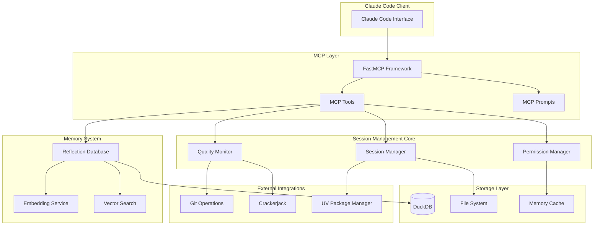
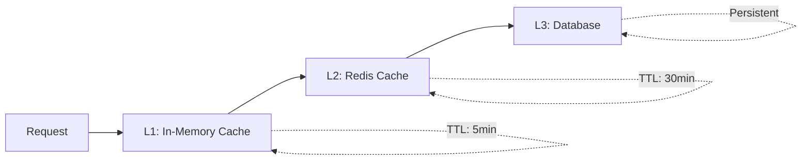

# Architecture Guide

Deep dive into the Session Management MCP server architecture, design patterns, and technical implementation.

## System Overview

The Session Management MCP server is built as a modular, async-first system designed for high performance, reliability, and extensibility.



## Core Architecture Components

### 1. MCP Server Layer

Built on FastMCP framework providing:

- **Tool Registration**: Automatic discovery and registration of MCP tools
- **Async Support**: Native async/await for non-blocking operations
- **Type Safety**: Full TypeScript-compatible type annotations
- **Error Handling**: Structured error responses with recovery strategies

```python
# Core server setup
from fastmcp import FastMCP

mcp = FastMCP("session-mgmt")


@mcp.tool()
async def init(working_directory: str | None = None) -> dict[str, Any]:
    """Session initialization with full type safety."""
    # Implementation with proper async patterns
```

### 2. Session Management Core

#### Session Manager (`session_manager.py`)

Central coordinator for session lifecycle:

```python
@dataclass
class SessionState:
    id: str
    working_directory: Path
    project_context: ProjectContext
    permissions: PermissionState
    quality_metrics: QualityMetrics
    created_at: datetime
    last_checkpoint: datetime | None = None
```

**Responsibilities:**

- Session lifecycle management (init → checkpoint → end)
- Project context analysis and health scoring
- Workspace verification and dependency synchronization
- Cross-session state persistence

#### Permission Manager

Smart permission learning system:

```python
@dataclass
class PermissionState:
    trusted_operations: set[str]
    permission_history: dict[str, PermissionDecision]
    auto_approve_patterns: list[str]
    security_level: SecurityLevel
```

**Features:**

- Learning-based auto-approval for repeated operations
- Security-first design with explicit permission grants
- Operation categorization (low-risk, high-risk, destructive)
- Time-based permission expiration

#### Quality Monitor

Real-time project health assessment:

```python
@dataclass
class QualityMetrics:
    overall_score: float  # 0-100
    project_health: float  # 0-100
    permissions_score: float  # 0-100
    tools_availability: float  # 0-100
    git_status: GitStatus
    dependency_status: DependencyStatus
```

### 3. Memory System Architecture

#### Reflection Database (`reflection_tools.py`)

**Database Schema:**

```sql
-- Core conversations table
CREATE TABLE conversations (
    id TEXT PRIMARY KEY,
    content TEXT NOT NULL,
    embedding FLOAT[384],        -- all-MiniLM-L6-v2 vectors
    project TEXT NOT NULL,
    timestamp TIMESTAMP NOT NULL,
    user_id TEXT DEFAULT 'default',
    session_id TEXT,
    metadata JSON
);

-- Vector similarity index
CREATE INDEX idx_conversations_embedding
ON conversations USING ivfflat (embedding vector_cosine_ops);

-- Reflections table for stored insights
CREATE TABLE reflections (
    id TEXT PRIMARY KEY,
    content TEXT NOT NULL,
    embedding FLOAT[384],
    tags TEXT[],
    project TEXT,
    created_at TIMESTAMP NOT NULL,
    author TEXT DEFAULT 'user'
);

-- Cross-project relationships
CREATE TABLE project_dependencies (
    id TEXT PRIMARY KEY,
    source_project TEXT NOT NULL,
    target_project TEXT NOT NULL,
    dependency_type TEXT NOT NULL, -- 'related', 'continuation', 'reference'
    description TEXT,
    created_at TIMESTAMP NOT NULL
);
```

#### Embedding Service

Local ONNX-based embedding generation:

```python
class EmbeddingService:
    def __init__(self):
        self.model_path = "all-MiniLM-L6-v2.onnx"
        self.tokenizer = AutoTokenizer.from_pretrained(
            "sentence-transformers/all-MiniLM-L6-v2"
        )
        self.session = None  # Lazy loaded
        self.executor = ThreadPoolExecutor(max_workers=4)

    async def generate_embedding(self, text: str) -> np.ndarray:
        """Generate embeddings asynchronously."""
        loop = asyncio.get_event_loop()
        return await loop.run_in_executor(
            self.executor, self._sync_generate_embedding, text
        )
```

**Key Features:**

- **Local Processing**: No external API calls, complete privacy
- **ONNX Runtime**: Optimized inference with CPU acceleration
- **Async Execution**: Non-blocking embedding generation
- **Graceful Fallback**: Text search when ONNX unavailable
- **Memory Management**: Efficient model loading and caching

#### Vector Search Implementation

Hybrid semantic + temporal search:

```python
async def semantic_search(
    self,
    query: str,
    limit: int = 10,
    min_score: float = 0.7,
    project_filter: str | None = None,
) -> list[SearchResult]:
    """Advanced vector search with time decay."""

    # Generate query embedding
    query_embedding = await self.embedding_service.generate_embedding(query)

    # Time-weighted similarity search
    sql = """
    SELECT
        content,
        project,
        timestamp,
        array_cosine_similarity(embedding, $1) as similarity,
        -- Time decay factor (newer = higher score)
        (array_cosine_similarity(embedding, $1) *
         (1.0 + LOG(1.0 + EXTRACT('days' FROM NOW() - timestamp)) * 0.1)
        ) as weighted_score
    FROM conversations
    WHERE array_cosine_similarity(embedding, $1) > $2
    ORDER BY weighted_score DESC
    LIMIT $3
    """
```

### 4. Storage Layer

#### DuckDB Configuration

Optimized for vector operations and analytical queries:

```python
DATABASE_CONFIG = {
    "memory_limit": "2GB",
    "threads": min(8, os.cpu_count()),
    "checkpoint_threshold": "1GB",
    "enable_profiling": False,
    "enable_progress_bar": False,
    "max_memory": "2GB",
    "threads": 4,
}
```

**Performance Features:**

- **Vector Support**: Native FLOAT[] arrays with similarity functions
- **Connection Pooling**: Async-safe connection management
- **Transaction Management**: ACID compliance with rollback support
- **Analytical Engine**: Optimized for aggregations and complex queries

#### Caching Strategy

Multi-layer caching for optimal performance:

```python
@dataclass
class CacheConfig:
    embedding_cache_size: int = 1000
    search_result_cache_ttl: int = 300  # 5 minutes
    permission_cache_ttl: int = 600  # 10 minutes
    project_context_cache_ttl: int = 1800  # 30 minutes
```

### 5. Integration Layer

#### Git Operations (`git_operations.py`)

Smart Git integration with automatic checkpointing:

```python
@dataclass
class GitCheckpoint:
    commit_hash: str
    message: str
    quality_score: float
    session_id: str
    timestamp: datetime
    files_changed: list[str]


async def create_checkpoint_commit(
    session_state: SessionState, quality_metrics: QualityMetrics
) -> GitCheckpoint:
    """Create intelligent checkpoint commits."""

    # Generate contextual commit message
    message = f"""checkpoint: {session_state.project_context.name} (quality: {quality_metrics.overall_score:.0f}/100) - {datetime.now().strftime("%Y-%m-%d %H:%M:%S")}

Session: {session_state.id}
Quality Metrics:
- Project Health: {quality_metrics.project_health:.0f}/100
- Permissions: {quality_metrics.permissions_score:.0f}/100
- Tools Available: {quality_metrics.tools_availability:.0f}/100

🤖 Generated with Session Management MCP
"""
```

#### Crackerjack Integration

Real-time code quality monitoring:

```python
class CrackerjackIntegration:
    async def run_quality_check(self) -> QualityReport:
        """Execute crackerjack and parse results."""

        result = await asyncio.create_subprocess_exec(
            "crackerjack",
            "--json",
            stdout=asyncio.subprocess.PIPE,
            stderr=asyncio.subprocess.PIPE,
        )

        stdout, stderr = await result.communicate()
        return self.parse_quality_report(stdout.decode())
```

## Design Patterns & Principles

### 1. Async-First Architecture

All I/O operations use async/await to prevent blocking:

```python
# ✅ Correct: Non-blocking database operations
async def store_conversation(self, content: str) -> str:
    async with self.get_connection() as conn:
        return await conn.execute(query, params)


# ✅ Correct: Non-blocking embedding generation
async def generate_embedding(self, text: str) -> np.ndarray:
    loop = asyncio.get_event_loop()
    return await loop.run_in_executor(self.executor, self._sync_generate, text)
```

### 2. Graceful Degradation

System continues operating when optional components fail:

```python
async def search(self, query: str) -> list[SearchResult]:
    """Search with fallback strategy."""
    try:
        # Try semantic search first
        return await self.semantic_search(query)
    except (ImportError, RuntimeError) as e:
        logger.warning(f"Semantic search unavailable: {e}")
        # Fallback to text search
        return await self.text_search(query)
```

### 3. Type-Safe Data Modeling

Comprehensive type hints with runtime validation:

```python
from typing import Literal, TypedDict


class SearchParameters(TypedDict, total=False):
    query: str  # Required
    limit: int  # Optional
    min_score: float  # Optional
    project: str | None  # Optional
    content_type: Literal["code", "conversation", "reflection"]  # Optional


@mcp.tool()
async def advanced_search(params: SearchParameters) -> dict[str, Any]:
    """Fully type-safe MCP tool."""
```

### 4. Resource Management

Proper resource lifecycle management:

```python
class ReflectionDatabase:
    async def __aenter__(self):
        """Async context manager entry."""
        self.connection = await self.get_connection()
        return self

    async def __aexit__(self, exc_type, exc_val, exc_tb):
        """Ensure cleanup on exit."""
        if hasattr(self, "connection"):
            await self.connection.close()
```

### 5. Event-Driven Architecture

Extensible event system for customization:

```python
class SessionEvent:
    INIT_STARTED = "session.init.started"
    INIT_COMPLETED = "session.init.completed"
    CHECKPOINT_CREATED = "session.checkpoint.created"
    QUALITY_THRESHOLD_REACHED = "session.quality.threshold"


class EventManager:
    def __init__(self):
        self.handlers: dict[str, list[Callable]] = {}

    def on(self, event: str, handler: Callable):
        """Register event handler."""
        if event not in self.handlers:
            self.handlers[event] = []
        self.handlers[event].append(handler)
```

## Performance Optimization

### 1. Database Query Optimization

**Vector Index Strategy:**

```sql
-- Create specialized indices for common queries
CREATE INDEX idx_conversations_project_timestamp
ON conversations(project, timestamp DESC);

CREATE INDEX idx_conversations_embedding_cosine
ON conversations USING ivfflat (embedding vector_cosine_ops);

-- Query optimization with prepared statements
PREPARE search_by_similarity AS
SELECT content, similarity
FROM (
    SELECT content, array_cosine_similarity(embedding, $1) as similarity
    FROM conversations
    WHERE project = $2
) sub
WHERE similarity > $3
ORDER BY similarity DESC
LIMIT $4;
```

### 2. Memory Management

**Embedding Cache:**

```python
from functools import lru_cache
import weakref


class EmbeddingCache:
    def __init__(self, max_size: int = 1000):
        self.cache = weakref.WeakValueDictionary()
        self.lru = {}
        self.max_size = max_size

    @lru_cache(maxsize=1000)
    def get_embedding(self, text_hash: str) -> np.ndarray | None:
        """LRU cache for embeddings."""
        return self.cache.get(text_hash)
```

### 3. Connection Pooling

**Async Connection Pool:**

```python
import asyncio
from contextlib import asynccontextmanager


class ConnectionPool:
    def __init__(self, max_connections: int = 10):
        self.max_connections = max_connections
        self.available = asyncio.Queue(maxsize=max_connections)
        self.used = set()

    @asynccontextmanager
    async def connection(self):
        """Get connection from pool."""
        conn = await self.available.get()
        self.used.add(conn)
        try:
            yield conn
        finally:
            self.used.remove(conn)
            await self.available.put(conn)
```

## Security Architecture

### 1. Permission System

**Multi-level Security Model:**

```python
from enum import Enum


class SecurityLevel(Enum):
    LOW = "low"  # Read-only operations
    MEDIUM = "medium"  # Write operations, file changes
    HIGH = "high"  # System operations, git commits
    CRITICAL = "critical"  # Destructive operations


class OperationClassifier:
    SECURITY_RULES = {
        "read_file": SecurityLevel.LOW,
        "search_conversations": SecurityLevel.LOW,
        "store_reflection": SecurityLevel.MEDIUM,
        "git_commit": SecurityLevel.HIGH,
        "delete_conversations": SecurityLevel.CRITICAL,
    }
```

### 2. Input Sanitization

**SQL Injection Prevention:**

```python
async def safe_query(self, query: str, params: tuple) -> list[dict]:
    """Parameterized queries only."""
    # Never allow string formatting in queries
    assert "%" not in query, "Use parameterized queries"
    assert ".format(" not in query, "Use parameterized queries"

    async with self.get_connection() as conn:
        return await conn.execute(query, params)
```

### 3. Data Privacy

**Local-First Design:**

- All embeddings generated locally (ONNX runtime)
- No external API calls for core functionality
- Data stored in user-controlled directory (`~/.claude/`)
- Optional encryption for sensitive data

## Scalability Considerations

### 1. Horizontal Scaling

**Stateless Session Design:**

```python
# Sessions can be distributed across instances
class DistributedSession:
    def __init__(self, redis_client):
        self.redis = redis_client

    async def get_session(self, session_id: str) -> SessionState | None:
        """Load session state from Redis."""
        data = await self.redis.get(f"session:{session_id}")
        return SessionState.from_json(data) if data else None
```

### 2. Database Sharding

**Project-Based Sharding:**

```python
class ShardedDatabase:
    def __init__(self, shard_configs: list[dict]):
        self.shards = {
            shard["name"]: DuckDBConnection(shard["path"]) for shard in shard_configs
        }

    def get_shard(self, project: str) -> str:
        """Route project to specific shard."""
        return f"shard_{hash(project) % len(self.shards)}"
```

### 3. Caching Strategy

**Multi-Tier Caching:**



## Testing Architecture

### 1. Testing Strategy

**Four-Layer Testing:**

- **Unit Tests**: Individual component testing with mocks
- **Integration Tests**: Full MCP workflow testing
- **Performance Tests**: Load testing and benchmarking
- **Security Tests**: Permission boundaries and injection testing

### 2. Test Infrastructure

**Async Test Framework:**

```python
import pytest
import asyncio


class TestMCPServer:
    @pytest.fixture
    async def mcp_server(self):
        """Create test MCP server instance."""
        server = await create_test_server()
        yield server
        await server.cleanup()

    @pytest.mark.asyncio
    async def test_session_lifecycle(self, mcp_server):
        """Test complete session workflow."""
        # Init → Checkpoint → End workflow
        init_result = await mcp_server.call_tool("init")
        assert init_result["success"]

        checkpoint_result = await mcp_server.call_tool("checkpoint")
        assert checkpoint_result["quality_score"]["overall"] > 0

        end_result = await mcp_server.call_tool("end")
        assert end_result["handoff_file_created"]
```

## Monitoring & Observability

### 1. Metrics Collection

**Structured Metrics:**

```python
@dataclass
class SystemMetrics:
    requests_per_minute: float
    average_response_time_ms: float
    database_query_time_ms: float
    embedding_generation_time_ms: float
    memory_usage_mb: float
    active_sessions: int
    error_rate: float
```

### 2. Distributed Tracing

**OpenTelemetry Integration:**

```python
from opentelemetry import trace

tracer = trace.get_tracer(__name__)


@mcp.tool()
async def traced_search(query: str) -> dict:
    """Search with distributed tracing."""
    with tracer.start_as_current_span("search_conversations") as span:
        span.set_attribute("query.length", len(query))
        span.set_attribute("search.type", "semantic")

        results = await self.perform_search(query)
        span.set_attribute("results.count", len(results))
        return results
```

### 3. Health Checks

**Comprehensive Health Monitoring:**

```python
@mcp.tool()
async def health_check() -> dict[str, Any]:
    """System health check."""
    return {
        "status": "healthy",
        "checks": {
            "database": await self.check_database_health(),
            "embedding_service": await self.check_embedding_health(),
            "file_system": await self.check_filesystem_health(),
            "memory": await self.check_memory_health(),
        },
        "timestamp": datetime.now().isoformat(),
    }
```

## Future Architecture Considerations

### 1. Microservices Evolution

**Service Decomposition:**

- Session Service
- Memory Service
- Search Service
- Quality Service
- Integration Service

### 2. Event Streaming

**Apache Kafka Integration:**

```python
class EventProducer:
    async def publish_session_event(self, event: SessionEvent):
        """Publish session events to Kafka."""
        await self.producer.send(
            topic="session-events", key=event.session_id, value=event.to_json()
        )
```

### 3. Machine Learning Pipeline

**Enhanced Intelligence:**

- Conversation classification
- Intent prediction
- Quality score prediction
- Personalized recommendations

______________________________________________________________________

**Related Documentation:**

- [CONFIGURATION.md](CONFIGURATION.md) - Configuration options and environment setup
- [DEPLOYMENT.md](DEPLOYMENT.md) - Deployment strategies and production setup
- [MCP_SCHEMA_REFERENCE.md](MCP_SCHEMA_REFERENCE.md) - Complete API reference
