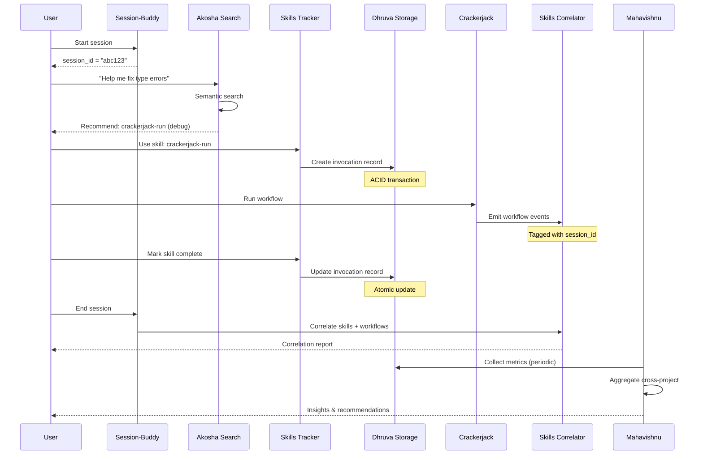
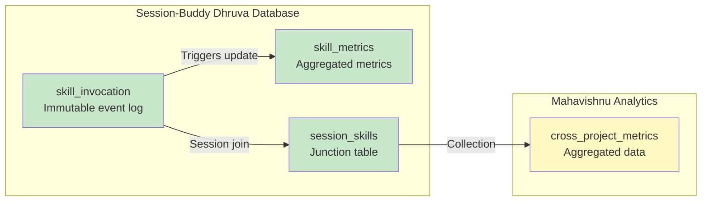
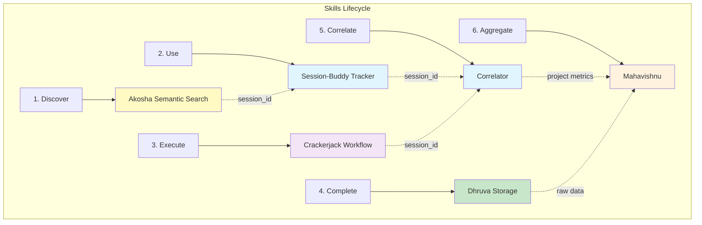

# Skills Metrics Ecosystem Architecture

## System Overview

```mermaid
graph TB
    subgraph "User Layer"
        U[User]
        Q[Query: "Fix type errors"]
    end

    subgraph "Session-Buddy Layer - Core Tracking"
        SB[Session Manager]
        ST[Skills Tracker]
        SS[Skills Storage - Dhruva]
        AS[Semantic Search - Akosha]
        SC[Skills Correlator]
    end

    subgraph "Crackerjack Layer - Quality Workflows"
        CW[Oneiric Workflows]
        WE[Workflow Events]
        SK[Skills Content - .claude/skills/*.md]
    end

    subgraph "Mahavishnu Layer - Cross-Project Analytics"
        MA[Skills Aggregator]
        MP[Multi-Project Database]
        MI[Insights & Recommendations]
    end

    U -->|Start Session| SB
    SB --> ST
    ST --> SS

    U -->|Semantic Query| AS
    AS -->|Index| SK
    AS -->|Recommend| ST

    U -->|Select Skill| ST
    ST -->|Track Usage| SS
    SS -->|ACID Storage| DH[(Dhruva Database)]

    U -->|Run Workflow| CW
    CW -->|Emit Events| WE
    WE -->|Tag: session_id| SC

    ST -->|session_id| SC
    SC -->|Correlate| CR[(Correlation Reports)]

    MA -->|Collect| MP
    MP -->|Aggregates| MI
    MI -->|Cross-Project Insights| U

    style SB fill:#e1f5fe
    style ST fill:#e1f5fe
    style SS fill:#e1f5fe
    style AS fill:#e1f5fe
    style SC fill:#e1f5fe
    style CW fill:#f3e5f5
    style WE fill:#f3e5f5
    style MA fill:#fff3e0
    style MP fill:#fff3e0
    style MI fill:#fff3e0
```

## Data Flow



## Storage Architecture



## Integration Points


