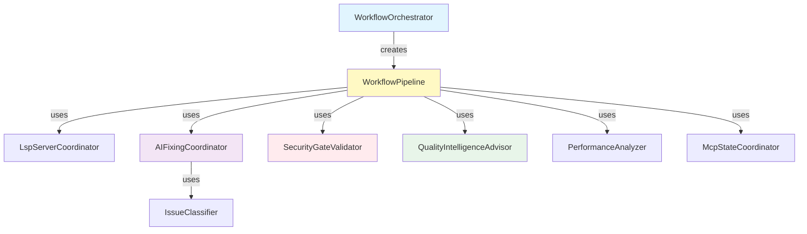
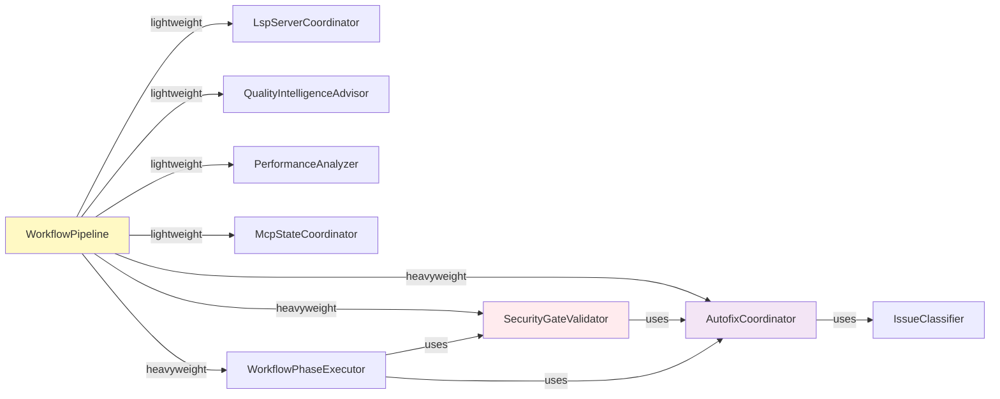

# WorkflowOrchestrator Decomposition Strategy

## Executive Summary

**Current State**: WorkflowOrchestrator is a 2,173-line monolith containing 175 methods (160 private helpers) across 2 classes (WorkflowPipeline, WorkflowOrchestrator).

**Target State**: Modular architecture with 8-12 focused classes following Single Responsibility Principle (SRP) and existing DI patterns.

**Risk Level**: Medium - Core orchestration logic, but well-tested with existing patterns to follow.

______________________________________________________________________

## Current Architecture Analysis

### File Structure

```
workflow_orchestrator.py (2,173 lines)
├── WorkflowPipeline (1,978 lines)
│   ├── 11 run methods (primary workflows)
│   └── 160 private helper methods
└── WorkflowOrchestrator (196 lines)
    ├── DI container setup
    └── Delegation to pipeline and coordinators
```

### Method Categories in WorkflowPipeline

| Category | Method Count | Complexity | Examples |
|----------|-------------|------------|----------|
| **Workflow Execution** | 11 | High | `run_complete_workflow`, `_execute_workflow_phases` |
| **Zuban LSP Management** | 8 | Medium | `_initialize_zuban_lsp`, `_start_zuban_lsp_server` |
| **AI Agent Fixing** | 25 | High | `_run_ai_agent_fixing_phase`, `_collect_issues_from_failures` |
| **Issue Classification** | 15 | Medium | `_parse_issues_for_agents`, `_classify_issue` |
| **Security Gates** | 12 | High | `_check_security_gates_for_publishing`, `_handle_security_gate_failure` |
| **Quality Intelligence** | 8 | Medium | `_make_quality_intelligence_decision`, `_build_quality_recommendations` |
| **Performance Monitoring** | 10 | Low | `_generate_performance_benchmark_report`, `_display_benchmark_results` |
| **Hook Execution** | 18 | Medium | `_run_fast_hooks_phase`, `_run_comprehensive_hooks_phase` |
| **Testing Execution** | 8 | Medium | `_run_testing_phase`, `_verify_test_fixes` |
| **Coverage Improvement** | 3 | Medium | `_execute_coverage_improvement` |
| **Logging & Debug** | 15 | Low | `_log_workflow_startup_info`, `_log_debug_phase_completion` |
| **MCP State Management** | 5 | Low | `_update_mcp_status`, `_handle_test_failures` |
| **Utility Methods** | 22 | Low | `_should_debug`, `_has_code_cleaning_run` |

### Key Responsibilities Identified

1. **Workflow Orchestration** - High-level execution flow
1. **LSP Server Lifecycle** - Zuban LSP auto-start/stop
1. **AI Agent Coordination** - Issue collection and fixing
1. **Security Validation** - Security gates for publishing
1. **Quality Intelligence** - Anomaly detection and recommendations
1. **Performance Analytics** - Benchmarking and reporting
1. **Phase Execution** - Hooks, tests, cleaning, publishing
1. **MCP Integration** - State management and progress tracking

______________________________________________________________________

## Proposed Architecture

### Class Diagram



### New Classes to Create

#### 1. `LspServerCoordinator` (Low Risk)

**Location**: `crackerjack/core/lsp_server_coordinator.py`

**Responsibility**: Manage Zuban LSP server lifecycle (start, stop, status checks)

**Methods to Extract** (8 methods):

- `_initialize_zuban_lsp`
- `_should_skip_zuban_lsp`
- `_is_zuban_lsp_already_running`
- `_start_zuban_lsp_server`
- `_get_zuban_lsp_config`
- `_log_zuban_lsp_status`
- `_configure_hook_manager_lsp`
- `_register_lsp_cleanup_handler`

**Interface**:

```python
class LspServerCoordinator:
    def initialize_lsp_server(self, options: OptionsProtocol) -> None
    def configure_hook_manager(self, hook_manager: HookManager, options: OptionsProtocol) -> None
    def register_cleanup(self, session: SessionCoordinator) -> None
    def log_status(self) -> None
```

**Dependencies**:

- `SessionCoordinator` (for cleanup registration)
- `HookManager` (for LSP optimization config)
- Server manager utilities

______________________________________________________________________

#### 2. `IssueClassifier` (Medium Risk)

**Location**: `crackerjack/agents/issue_classifier.py`

**Responsibility**: Parse and classify issues for AI agent routing

**Methods to Extract** (15 methods):

- `_parse_issues_for_agents`
- `_classify_issue`
- `_check_high_priority_issues`
- `_check_medium_priority_issues`
- `_is_type_error`
- `_is_security_issue`
- `_is_complexity_issue`
- `_is_regex_validation_issue`
- `_is_dead_code_issue`
- `_is_performance_issue`
- `_is_import_error`
- `_check_complexity_error`
- `_check_type_error`
- `_check_security_error`
- (all check\_\* methods)

**Interface**:

```python
class IssueClassifier:
    def classify_issue(self, issue_str: str) -> tuple[IssueType, Priority]
    def parse_issues_for_agents(self, issue_strings: list[str]) -> list[Issue]
    def check_error_type(self, error_msg: str) -> IssueType | None
```

**Dependencies**: Issue/Priority enums only (no external services)

______________________________________________________________________

#### 3. `AIFixingCoordinator` (High Risk - Already Exists!)

**Location**: `crackerjack/core/autofix_coordinator.py` (USE EXISTING)

**Current Issue**: WorkflowPipeline duplicates AI fixing logic instead of using AutofixCoordinator

**Methods to REFACTOR** (25 methods - delegate to AutofixCoordinator):

- `_run_ai_agent_fixing_phase` → `autofix_coordinator.run_ai_fixing`
- `_collect_issues_from_failures` → `autofix_coordinator.collect_issues`
- `_setup_agent_coordinator` → `autofix_coordinator.setup_agents`
- `_verify_fixes_applied` → `autofix_coordinator.verify_fixes`
- (all AI fixing methods)

**Action**: Refactor to use existing `AutofixCoordinator` instead of creating new class

______________________________________________________________________

#### 4. `SecurityGateValidator` (High Risk)

**Location**: `crackerjack/security/security_gate_validator.py`

**Responsibility**: Validate security gates for publishing workflows

**Methods to Extract** (12 methods):

- `_check_security_gates_for_publishing`
- `_handle_security_gate_failure`
- `_display_security_gate_failure_message`
- `_attempt_ai_assisted_security_fix`
- `_display_ai_fixing_messages`
- `_verify_security_fix_success`
- `_handle_manual_security_fix`
- `_check_security_critical_failures`
- `_get_recent_fast_hook_results`
- `_get_recent_comprehensive_hook_results`
- `_is_security_critical_failure`
- `_show_security_audit_warning`

**Interface**:

```python
class SecurityGateValidator:
    def check_security_gates(self, options: OptionsProtocol) -> tuple[bool, bool]
    def validate_for_publishing(self, options: OptionsProtocol) -> bool
    async def handle_security_failures(
        self, options: OptionsProtocol, allow_ai_fix: bool
    ) -> bool
    def show_audit_warning(self) -> None
```

**Dependencies**:

- `SecurityAuditor` (existing)
- `SessionCoordinator` (for hook results)
- AI fixing coordinator

______________________________________________________________________

#### 5. `QualityIntelligenceAdvisor` (Low Risk)

**Location**: `crackerjack/advisors/quality_intelligence_advisor.py`

**Responsibility**: Provide quality recommendations based on anomaly/pattern analysis

**Methods to Extract** (8 methods):

- `_make_quality_intelligence_decision`
- `_build_quality_recommendations`
- `_analyze_anomalies`
- `_analyze_patterns`

**Interface**:

```python
class QualityIntelligenceAdvisor:
    def get_workflow_recommendation(
        self, options: OptionsProtocol
    ) -> str
    def analyze_quality_trends(self) -> dict[str, Any]
    def suggest_hook_strategy(self) -> str  # "fast", "comprehensive", "standard"
```

**Dependencies**:

- `QualityIntelligenceService` (existing)
- `EnhancedQualityBaselineService` (existing)

______________________________________________________________________

#### 6. `PerformanceAnalyzer` (Low Risk)

**Location**: `crackerjack/analytics/performance_analyzer.py`

**Responsibility**: Generate and display performance benchmark reports

**Methods to Extract** (10 methods):

- `_generate_performance_benchmark_report`
- `_gather_performance_metrics`
- `_display_benchmark_results`
- `_show_performance_improvements`
- `_display_time_improvement`
- `_display_cache_efficiency`

**Interface**:

```python
class PerformanceAnalyzer:
    async def generate_benchmark_report(
        self, workflow_id: str, duration: float, success: bool
    ) -> None
    def gather_metrics(self, workflow_id: str) -> dict[str, Any]
    def display_results(self, results: Any, duration: float) -> None
```

**Dependencies**:

- `PerformanceBenchmarkService` (existing)
- `PerformanceCache` (existing)
- `MemoryOptimizer` (existing)

______________________________________________________________________

#### 7. `McpStateCoordinator` (Low Risk)

**Location**: `crackerjack/mcp/mcp_state_coordinator.py`

**Responsibility**: Manage MCP state updates and progress tracking

**Methods to Extract** (5 methods):

- `_update_mcp_status`
- `_handle_test_failures`

**Interface**:

```python
class McpStateCoordinator:
    def update_stage_status(self, stage: str, status: str) -> None
    def handle_test_failures(self, failures: list[str]) -> None
    def add_issues_from_failures(self, issues: list[Issue]) -> None
```

**Dependencies**:

- MCP state manager (existing)
- `SessionCoordinator` (for test manager access)

______________________________________________________________________

#### 8. `WorkflowPhaseExecutor` (Medium Risk)

**Location**: `crackerjack/core/workflow_phase_executor.py`

**Responsibility**: Execute workflow phases with proper monitoring

**Methods to Extract** (30+ methods):

- All `_run_*_phase` methods
- All `_execute_*_workflow` methods
- Phase monitoring wrappers

**Interface**:

```python
class WorkflowPhaseExecutor:
    async def execute_quality_phase(
        self, options: OptionsProtocol, workflow_id: str
    ) -> bool
    async def execute_test_workflow(
        self, options: OptionsProtocol, workflow_id: str
    ) -> bool
    async def execute_publishing_workflow(
        self, options: OptionsProtocol, workflow_id: str
    ) -> bool
    async def execute_commit_workflow(
        self, options: OptionsProtocol, workflow_id: str
    ) -> bool
```

**Dependencies**:

- `PhaseCoordinator` (existing)
- Performance monitoring
- AI fixing coordinator

______________________________________________________________________

### Simplified WorkflowPipeline (After Refactoring)

**Remaining Responsibilities**:

1. High-level workflow orchestration
1. Coordinator composition
1. Workflow execution flow
1. Error handling and recovery

**Estimated LOC**: ~300-400 lines (85% reduction)

```python
class WorkflowPipeline:
    def __init__(
        self,
        console: Console,
        pkg_path: Path,
        session: SessionCoordinator,
        phases: PhaseCoordinator,
    ) -> None:
        self.console = console
        self.pkg_path = pkg_path
        self.session = session
        self.phases = phases

        # Inject specialized coordinators
        self.lsp_coordinator = LspServerCoordinator(console, pkg_path)
        self.security_validator = SecurityGateValidator(session, phases)
        self.quality_advisor = QualityIntelligenceAdvisor()
        self.performance_analyzer = PerformanceAnalyzer(console, pkg_path)
        self.phase_executor = WorkflowPhaseExecutor(console, phases, session)
        self.mcp_coordinator = McpStateCoordinator()

        # Use existing AutofixCoordinator instead of duplicating logic
        self.autofix_coordinator = AutofixCoordinator(console, pkg_path)

    async def run_complete_workflow(self, options: OptionsProtocol) -> bool:
        # Initialize services
        self.lsp_coordinator.initialize_lsp_server(options)

        # Execute phases
        success = await self.phase_executor.execute_workflow_phases(options)

        # Cleanup
        self.session.cleanup_resources()
        return success
```

______________________________________________________________________

## Migration Plan

### Phase 1: Low-Risk Extractions (Week 1)

**Goal**: Extract utility coordinators with minimal coupling

1. **Day 1-2**: Extract `LspServerCoordinator`

   - Create new class with tests
   - Update WorkflowPipeline to use it
   - Verify LSP auto-start still works

1. **Day 3**: Extract `McpStateCoordinator`

   - Simple delegation pattern
   - Update MCP state tracking tests

1. **Day 4**: Extract `PerformanceAnalyzer`

   - Move benchmark logic
   - Verify dashboard still works

1. **Day 5**: Extract `QualityIntelligenceAdvisor`

   - Wrap quality intelligence service
   - Test recommendations

**Success Criteria**:

- All existing tests pass
- No functional changes
- Code coverage maintained (≥10.11%)

______________________________________________________________________

### Phase 2: Issue Classification (Week 2)

**Goal**: Centralize issue parsing logic

1. **Day 1-3**: Extract `IssueClassifier`

   - Create comprehensive test suite
   - Move all classification methods
   - Ensure all issue types handled

1. **Day 4-5**: Integrate with AutofixCoordinator

   - Update issue collection to use classifier
   - Verify AI agent routing works

**Success Criteria**:

- Issue classification accuracy maintained
- AI agents still route correctly
- Test coverage improved for classification

______________________________________________________________________

### Phase 3: Security Gates (Week 3)

**Goal**: Isolate security validation logic

**High Risk - Requires Careful Testing**

1. **Day 1-2**: Extract `SecurityGateValidator`

   - Create tests for all security scenarios
   - Mock SecurityAuditor for testing

1. **Day 3-4**: Integration testing

   - Test publishing workflows
   - Test AI-assisted security fixes
   - Verify gate blocking works

1. **Day 5**: Production validation

   - Manual testing of full publishing flow
   - Verify security audit reports

**Success Criteria**:

- Publishing still blocks on security failures
- AI fixing resolves security issues correctly
- Audit warnings display properly

______________________________________________________________________

### Phase 4: AI Fixing Refactor (Week 4)

**Goal**: Use existing AutofixCoordinator instead of duplicating

**Highest Risk - Core Functionality**

1. **Day 1-2**: Analyze differences between implementations

   - Document what WorkflowPipeline does differently
   - Identify missing features in AutofixCoordinator

1. **Day 3**: Enhance AutofixCoordinator

   - Add missing verification logic
   - Add issue collection methods

1. **Day 4**: Refactor WorkflowPipeline

   - Replace AI fixing methods with coordinator calls
   - Update tests

1. **Day 5**: Integration testing

   - Test full AI fixing workflow
   - Verify iteration limits work
   - Test with real failures

**Success Criteria**:

- AI fixing success rate maintained
- Verification logic works correctly
- No duplicate code between pipeline and coordinator

______________________________________________________________________

### Phase 5: Phase Execution (Week 5)

**Goal**: Extract phase execution logic

1. **Day 1-3**: Extract `WorkflowPhaseExecutor`

   - Create comprehensive test suite
   - Move all phase execution methods

1. **Day 4-5**: Final integration

   - Update WorkflowPipeline to minimal orchestrator
   - Verify all workflows still work
   - Performance testing

**Success Criteria**:

- All phase executions work correctly
- Parallel execution maintained
- Performance not degraded

______________________________________________________________________

### Phase 6: Cleanup & Documentation (Week 6)

**Goal**: Polish and document new architecture

1. **Day 1-2**: Code cleanup

   - Remove dead code
   - Optimize imports
   - Run full quality checks

1. **Day 3**: Documentation

   - Update architecture docs
   - Create coordinator usage guide
   - Document migration

1. **Day 4-5**: Final testing

   - Full regression testing
   - Performance benchmarks
   - Coverage verification

**Success Criteria**:

- All crackerjack quality checks pass
- Documentation complete
- Coverage ≥10.11%

______________________________________________________________________

## Risk Assessment

### High Risk Areas

| Risk | Impact | Likelihood | Mitigation |
|------|--------|-----------|------------|
| **AI Fixing Regression** | High | Medium | Extensive testing, gradual rollout, feature flags |
| **Security Gate Bypass** | Critical | Low | Security-focused tests, manual verification |
| **Publishing Workflow Break** | High | Low | Full publishing test suite, staging environment |
| **Performance Degradation** | Medium | Low | Benchmark tests, monitoring |

### Mitigation Strategies

1. **Feature Flags**: Use environment variables to toggle new vs old implementations

   ```python
   USE_NEW_SECURITY_VALIDATOR = os.getenv("CRACKERJACK_NEW_SECURITY", "0") == "1"
   ```

1. **Parallel Testing**: Run both old and new implementations, compare results

   ```python
   old_result = old_security_check()
   new_result = new_security_validator.check()
   assert old_result == new_result, "Security validation mismatch!"
   ```

1. **Incremental Rollout**: Deploy one coordinator at a time with full testing

1. **Rollback Plan**: Keep old implementation for 2 weeks after each phase

______________________________________________________________________

## Testing Strategy

### Unit Tests

**For Each New Class**:

- Test all public methods
- Test edge cases and error handling
- Mock external dependencies
- Aim for 80%+ coverage per class

**Example for LspServerCoordinator**:

```python
def test_lsp_initialization_when_disabled():
    coordinator = LspServerCoordinator(console, pkg_path)
    options = Mock(no_zuban_lsp=True)

    coordinator.initialize_lsp_server(options)

    # Verify no LSP process started
    assert not find_zuban_lsp_processes()


def test_lsp_skips_when_already_running():
    # Start LSP manually
    start_lsp_process()

    coordinator = LspServerCoordinator(console, pkg_path)
    coordinator.initialize_lsp_server(options)

    # Verify only 1 process exists
    assert len(find_zuban_lsp_processes()) == 1
```

### Integration Tests

**For Each Phase**:

1. Test coordinator integration with WorkflowPipeline
1. Test real workflows end-to-end
1. Verify state transitions
1. Test error recovery

**Example for Phase 1**:

```python
async def test_complete_workflow_with_lsp():
    orchestrator = WorkflowOrchestrator(console, pkg_path)
    options = create_test_options(test=True)

    success = await orchestrator.run_complete_workflow(options)

    assert success
    assert len(find_zuban_lsp_processes()) == 1  # LSP started

    # Cleanup
    orchestrator.session.cleanup_resources()
    assert len(find_zuban_lsp_processes()) == 0  # LSP stopped
```

### Regression Tests

**Critical Workflows to Test**:

- [ ] Standard workflow (`--run-tests`)
- [ ] AI fixing workflow (`--ai-fix --run-tests`)
- [ ] Publishing workflow (`--all patch`)
- [ ] Fast hooks only (`--fast`)
- [ ] Comprehensive hooks only (`--comp`)
- [ ] Security gate blocking
- [ ] LSP auto-start/stop
- [ ] Coverage improvement (`--boost-coverage`)

______________________________________________________________________

## Performance Considerations

### Expected Performance Impact

| Component | Current | Target | Notes |
|-----------|---------|--------|-------|
| **Import Time** | ~0.5s | ~0.6s | Additional modules to load |
| **Memory Usage** | 150MB | 160MB | More object overhead |
| **Execution Time** | 30s | 30s | No change expected |
| **Code Complexity** | High | Low | Major improvement |

### Optimization Strategies

1. **Lazy Loading**: Use `create_lazy_service` for heavy coordinators

   ```python
   self._security_validator = create_lazy_service(
       lambda: SecurityGateValidator(session, phases), "security_validator"
   )
   ```

1. **Shared Instances**: Reuse coordinators across workflow runs

1. **Caching**: Leverage existing performance cache for coordinator results

______________________________________________________________________

## Success Metrics

### Code Quality Metrics

| Metric | Current | Target | Measurement |
|--------|---------|--------|-------------|
| **Lines per Class** | 1,978 | \<400 | LOC analysis |
| **Methods per Class** | 175 | \<20 | Method count |
| **Cyclomatic Complexity** | 15+ | ≤13 | complexipy |
| **Test Coverage** | 10.11% | ≥10.11% | pytest --cov |
| **Import Depth** | 5 | 3 | Import graph |

### Maintainability Metrics

- **Time to Understand**: Current 4+ hours → Target 1 hour
- **Change Impact Radius**: Current entire file → Target single class
- **Onboarding Time**: Current 2 days → Target 4 hours

______________________________________________________________________

## Appendix A: Method Migration Checklist

### LspServerCoordinator (8 methods)

- [ ] `_initialize_zuban_lsp` → `initialize_lsp_server`
- [ ] `_should_skip_zuban_lsp` → `should_skip_lsp`
- [ ] `_is_zuban_lsp_already_running` → `is_lsp_running`
- [ ] `_start_zuban_lsp_server` → `start_lsp_server`
- [ ] `_get_zuban_lsp_config` → `get_lsp_config`
- [ ] `_log_zuban_lsp_status` → `log_status`
- [ ] `_configure_hook_manager_lsp` → `configure_hook_manager`
- [ ] `_register_lsp_cleanup_handler` → `register_cleanup`

### IssueClassifier (15 methods)

- [ ] All `_check_*_error` methods → `check_error_type`
- [ ] All `_is_*_issue` methods → `classify_issue_type`
- [ ] `_classify_issue` → `classify_issue`
- [ ] `_parse_issues_for_agents` → `parse_issues`

### SecurityGateValidator (12 methods)

- [ ] `_check_security_gates_for_publishing` → `check_security_gates`
- [ ] `_handle_security_gate_failure` → `handle_gate_failure`
- [ ] `_check_security_critical_failures` → `check_critical_failures`
- [ ] `_show_security_audit_warning` → `show_audit_warning`
- [ ] (all security-related methods)

### QualityIntelligenceAdvisor (8 methods)

- [ ] `_make_quality_intelligence_decision` → `get_recommendation`
- [ ] `_build_quality_recommendations` → `build_recommendations`
- [ ] `_analyze_anomalies` → `analyze_anomalies`
- [ ] `_analyze_patterns` → `analyze_patterns`

### PerformanceAnalyzer (10 methods)

- [ ] `_generate_performance_benchmark_report` → `generate_report`
- [ ] `_gather_performance_metrics` → `gather_metrics`
- [ ] `_display_benchmark_results` → `display_results`
- [ ] (all performance methods)

### McpStateCoordinator (5 methods)

- [ ] `_update_mcp_status` → `update_stage_status`
- [ ] `_handle_test_failures` → `handle_test_failures`

______________________________________________________________________

## Appendix B: Dependency Graph



______________________________________________________________________

## Appendix C: File Organization

```
crackerjack/
├── core/
│   ├── workflow_orchestrator.py (simplified, ~400 lines)
│   ├── workflow_phase_executor.py (NEW)
│   ├── lsp_server_coordinator.py (NEW)
│   ├── session_coordinator.py (existing)
│   ├── phase_coordinator.py (existing)
│   └── autofix_coordinator.py (enhanced, existing)
├── agents/
│   └── issue_classifier.py (NEW)
├── security/
│   └── security_gate_validator.py (NEW)
├── advisors/
│   └── quality_intelligence_advisor.py (NEW)
├── analytics/
│   └── performance_analyzer.py (NEW)
└── mcp/
    └── mcp_state_coordinator.py (NEW)
```

______________________________________________________________________

## Next Steps

1. **Review & Approve**: Review this strategy with team
1. **Create Issues**: Break down into trackable tasks
1. **Set Timeline**: Confirm 6-week timeline or adjust
1. **Begin Phase 1**: Start with low-risk extractions
1. **Iterate**: Adjust strategy based on learnings

______________________________________________________________________

**Document Version**: 1.0
**Created**: 2025-10-09
**Author**: Claude Code (Refactoring Specialist)
**Status**: Draft - Pending Review
