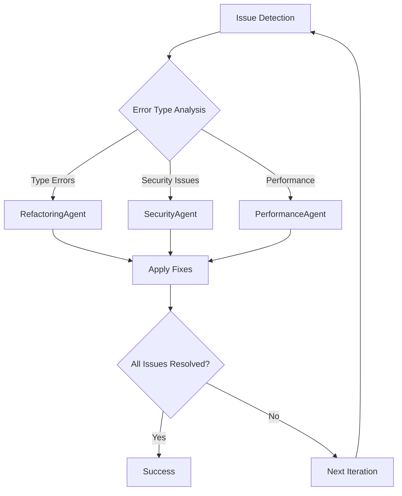

# Combined Tool Replacement Implementation Plan

## Overview
Comprehensive replacement of legacy Python analysis tools with modern Rust-based alternatives and intelligent automation features:
- **Vulture → Skylos**: Dead code detection (20x faster, web dashboard)
- **Pyright → Zuban**: Type checking (20-200x faster, drop-in replacement)
- **Intelligent Commit Messages**: AST-based semantic analysis for meaningful commits
- **Automatic Changelog Generation**: Convention-based changelog updates during publish

## Current Status

### Dead Code Detection (Vulture → Skylos)
- **Vulture**: Currently integrated as dead code detector (confidence=86)
- **Decision**: Full replacement, no fallback needed

### Type Checking (Pyright → Zuban)
- **Pyright**: Currently primary type checker (strict mode)
- **Experimental**: ty and pyrefly already configured as experimental hooks
- **Decision**: Replace with zuban immediately, keep experimental options

### CLI Enhancements
- **Verbose/Debug**: New CLI flags for output control
  - `--verbose`: Shows captured console output from failed hooks
  - `--debug`: Shows debug log entries

## Implementation Phases

### Phase 1A: Skylos Analysis & Removal (crackerjack-architect)
**Files to analyze for vulture replacement:**
- `/pyproject.toml` - Remove vulture dependency
- `/crackerjack/dynamic_config.py` - Replace vulture entry with skylos
- `/crackerjack/config/hooks.py` - Update hook definition
- `/crackerjack/agents/import_optimization_agent.py` - Main parsing logic

### Phase 1B: Zuban Analysis & Removal (crackerjack-architect)
**Files to analyze for pyright replacement:**
- `/pyproject.toml` - Remove pyright dependency
- `/crackerjack/dynamic_config.py` - Replace pyright entry with zuban
- `/crackerjack/config/hooks.py` - Update hook definition
- Any IDE/LSP configurations referencing pyright

### Phase 2A: Skylos Dependency Update (python-pro)
```toml
# pyproject.toml changes for dead code detection
# REMOVE: "vulture>=2.14"
# ADD: "skylos>=1.0.0"
```

### Phase 2B: Zuban Dependency Update (python-pro)
```toml
# pyproject.toml changes for type checking
# REMOVE: "pyright>=1.1.403"
# ADD: "zuban>=0.1.0"
```

### Phase 3A: Skylos Configuration (crackerjack-architect)
```python
# dynamic_config.py - dead code detection
"skylos": {
    "id": "skylos",
    "name": None,
    "repo": "https://github.com/duriantaco/skylos",
    "rev": "latest",
    "tier": 3,
    "entry": "uv run skylos",
    "args": ["--confidence", "86"],  # Match current vulture threshold
    # Add --json only for AI modes:
    "additional_args": lambda ctx: ["--json"] if ctx.ai_agent_mode or ctx.ai_debug_mode else []
}
```

### Phase 3B: Zuban Configuration (crackerjack-architect)
```python
# dynamic_config.py - type checking
"zuban": {
    "id": "zuban", 
    "name": "zuban",
    "repo": "https://github.com/zubanls/zuban",
    "rev": "latest",
    "tier": 3,
    "entry": "uv run zuban",
    "args": ["check"],  # Pyright-like mode
    "files": "^crackerjack/.*\\.py$",
    "exclude": r"^crackerjack/(mcp|plugins)/.*\.py$",
    "experimental": False,
}
```

### Phase 4A: Skylos Hook Update (python-pro)
```python
# hooks.py - dead code detection
HookDefinition(
    name="skylos",  # Renamed from vulture
    command=[],  # Dynamically built
    timeout=120,
    retry_on_failure=False,
)
```

### Phase 4B: Zuban Hook Update (python-pro)
```python
# hooks.py - type checking  
HookDefinition(
    name="zuban",  # Renamed from pyright
    command=[],  # Dynamically built
    timeout=300,  # May need more time for large codebases
    retry_on_failure=False,
)
```

### Phase 5: ImportOptimizationAgent Refactor (refactoring-specialist)
```python
# Key changes needed:
async def _detect_unused_imports(self, file_path: Path) -> list[str]:
    """Use skylos to detect unused imports."""
    # Determine output format based on mode
    args = ["uv", "run", "skylos", "--confidence", "86", str(file_path)]
    if self.context.ai_agent_mode or self.context.ai_debug_mode:
        args.append("--json")
        # Parse JSON output
        return self._parse_skylos_json(result.stdout)
    else:
        # Parse text output for human readability
        return self._parse_skylos_text(result.stdout)
```

### Phase 6: Output Parsing Implementation
```python
def _parse_skylos_json(self, output: str) -> list[str]:
    """Parse skylos JSON output for unused imports."""
    import json
    data = json.loads(output)
    unused = []
    for item in data.get("dead_code", []):
        if item["type"] == "import":
            unused.append(item["name"])
    return unused

def _parse_skylos_text(self, output: str) -> list[str]:
    """Parse skylos text output for human-readable display."""
    # Format: "file.py:line: unused import 'name'"
    unused = []
    for line in output.strip().split("\n"):
        if "unused import" in line.lower():
            # Extract import name from skylos output
            parts = line.split("'")
            if len(parts) >= 2:
                unused.append(parts[1])
    return unused
```

### Phase 7A: Skylos Testing Strategy (test-specialist)
1. **Unit tests**: Update test_import_optimization_agent.py
2. **Integration tests**: Verify skylos hook execution
3. **AI agent tests**: Confirm JSON parsing works
4. **End-to-end**: Run `python -m crackerjack --ai-agent -t`

### Phase 7B: Zuban Testing Strategy (test-specialist)
1. **Type checking validation**: Ensure zuban finds same issues as pyright
2. **Performance benchmarks**: Measure speed improvements
3. **LSP integration**: Test language server functionality
4. **Mypy compatibility**: Verify `zmypy` mode works
5. **End-to-end**: Full workflow with new type checker

### Phase 8A: Skylos Cleanup (critical-audit-specialist)
- Remove all vulture references from:
  - Documentation files (README.md, CLAUDE.md, etc.)
  - Test fixtures
  - Comments and docstrings
  - Lock files (will auto-update)

### Phase 8B: Zuban Cleanup (critical-audit-specialist)  
- Remove all pyright references from:
  - Documentation files (README.md, CLAUDE.md, etc.)
  - IDE configurations (.vscode/settings.json)
  - Test fixtures and configurations
  - Comments and docstrings
  - Lock files (will auto-update)

## Implementation Notes

### Verbose/Debug Awareness
With new --debug flag, skylos output will respect:
- `--verbose`: Shows captured console output from failed hooks
- `--debug`: Shows debug log entries  
- Neither: Standard concise output

### JSON Mode Logic
Enable JSON only when:
```python
if self.context.ai_agent_mode or self.context.ai_debug_mode:
    command.extend(["--json"])
```

### Future Enhancements
Consider adding CLI flag for web dashboard:
```bash
python -m crackerjack --skylos-web  # Opens localhost:5090
```

### Interactive Mode
Skylos supports interactive selection of dead code to remove:
```bash
skylos --interactive /path/to/project
```
Could be integrated as `--skylos-interactive` flag

## Files to Modify

### Primary Files
1. `/pyproject.toml` - Dependency swap
2. `/crackerjack/dynamic_config.py` - Hook configuration
3. `/crackerjack/config/hooks.py` - Hook definition
4. `/crackerjack/agents/import_optimization_agent.py` - Parser logic

### Secondary Files (References)
- `/crackerjack/services/regex_patterns.py` - May need patterns for skylos output
- `/crackerjack/executors/individual_hook_executor.py` - Hook execution
- `/crackerjack/core/workflow_orchestrator.py` - Workflow integration
- Test files that reference vulture

### Documentation Files
- `/README.md`
- `/CLAUDE.md`
- `/AI-AGENT-RULES.md`
- `/docs/API_REFERENCE.md`

## Execution Order

### Priority 1: Zuban (Type Checker) - Immediate Impact
1. Remove pyright from pyproject.toml
2. Add zuban to dependencies  
3. Update dynamic_config.py (pyright → zuban)
4. Update hooks.py (pyright → zuban)
5. Test type checking works
6. Clean pyright documentation references

### Priority 2: Skylos (Dead Code) - Secondary Impact
1. Remove vulture from pyproject.toml  
2. Add skylos to dependencies
3. Update dynamic_config.py (vulture → skylos)
4. Update hooks.py (vulture → skylos)
5. Refactor ImportOptimizationAgent
6. Update tests
7. Clean vulture documentation references

### Priority 3: Intelligent Commit Messages - Automation Enhancement
1. Add LibCST and TextBlob dependencies
2. Implement AST Analyzer service
3. Implement Session Analyzer with MCP integration
4. Implement Pattern Analyzer with NLP fallback
5. Update Git Service with intelligent commit generation
6. Test progressive fallback system

### Priority 4: Automatic Changelog Generation - Publishing Enhancement  
1. Implement Changelog Service
2. Enhance DocumentationAgent integration
3. Update Publish Manager workflow
4. Integration testing with publish workflow
5. Test conventional commit categorization

### Final Validation
8. Run comprehensive test suite with all new tools
9. Performance benchmarking for all enhancements
10. End-to-end workflow testing (commit → changelog → publish)
11. Documentation updates complete

## Success Criteria

### Skylos (Dead Code Detection)
- ✅ All dead code detection continues working
- ✅ AI agents parse skylos output correctly
- ✅ JSON mode only active in AI modes
- ✅ Verbose output shows skylos failures properly
- ✅ No vulture references remain
- ✅ Confidence threshold maintained at 86
- ✅ Web dashboard accessible via `--skylos-web`

### Zuban (Type Checking)
- ✅ Type checking accuracy matches/exceeds pyright
- ✅ 20-200x performance improvement achieved
- ✅ LSP integration works seamlessly
- ✅ Mypy compatibility mode (`zmypy`) functional
- ✅ No pyright references remain
- ✅ All type checking tests pass
- ✅ Experimental ty/pyrefly hooks remain available

### Intelligent Commit Messages
- ✅ AST analyzer detects semantic changes accurately
- ✅ Session analyzer extracts context from MCP conversations
- ✅ Pattern analyzer provides reliable fallback analysis
- ✅ Progressive fallback system handles failures gracefully
- ✅ Generated commit messages follow conventional commits format
- ✅ Confidence scoring system works properly (≥0.7 threshold)
- ✅ No LLM dependencies required (RAM constraints satisfied)

### Automatic Changelog Generation
- ✅ Changelog generation integrates into publish workflow
- ✅ Commit categorization matches conventional commit types
- ✅ Keep a Changelog format maintained properly
- ✅ Previous changelog entries preserved during updates
- ✅ Version headers formatted correctly with dates
- ✅ Empty categories filtered out automatically
- ✅ Integration with DocumentationAgent successful

### Combined
- ✅ All comprehensive hooks pass with new tools
- ✅ AI agent integration works with all replacements
- ✅ Verbose/debug output properly captured
- ✅ Performance benchmarks show significant improvement
- ✅ End-to-end workflow (commit → changelog → publish) functions
- ✅ Progressive enhancement maintains backward compatibility
- ✅ Documentation updated completely for all features

## Additional Features to Consider

### Skylos Enhancements
- [ ] Web dashboard integration (`--skylos-web`)
- [ ] Interactive mode (`--skylos-interactive`)
- [ ] CST-safe removal automation
- [ ] Framework-aware signals configuration  
- [ ] Custom confidence thresholds per file pattern

### Zuban Enhancements
- [ ] LSP server integration (`--zuban-lsp`)
- [ ] Mypy config auto-migration (`zmypy --migrate`)
- [ ] Performance profiling (`--profile`)
- [ ] Custom type checking strictness levels
- [ ] Integration with IDE error reporting

### Combined Workflow Enhancements
- [ ] Parallel execution of both tools
- [ ] Cross-tool optimization (use zuban type info in skylos)
- [ ] Unified reporting dashboard
- [ ] Performance comparison metrics
- [ ] Auto-migration scripts for other projects

## Phase 9: Intelligent Commit Message Generation (hybrid-progressive-approach)

### Overview
Replace basic commit message generation with intelligent AST-based semantic analysis without LLM dependencies.

### Implementation Strategy: Option D - Hybrid Progressive Approach

**Core Architecture:**
```python
class IntelligentCommitService:
    def __init__(self):
        self.analyzers = [
            ASTAnalyzer(),      # Priority 1: Deep semantic analysis  
            SessionAnalyzer(),   # Priority 2: Session context awareness
            PatternAnalyzer(),   # Priority 3: Pattern matching
            BasicAnalyzer(),     # Priority 4: Graceful fallback
        ]
    
    async def generate_commit_message(self, files: list[Path]) -> str:
        for analyzer in self.analyzers:
            try:
                result = await analyzer.analyze(files)
                if result.confidence >= 0.7:
                    return result.format_conventional_commit()
            except Exception:
                continue  # Graceful fallback to next analyzer
        
        return self.basic_fallback_message(files)
```

### Phase 9A: AST Analyzer Implementation (python-pro)
```python
# services/ast_analyzer.py
from libcst import parse_module, RemovalSentinel
from libcst.metadata import FullRepoManager

class ASTAnalyzer:
    def __init__(self):
        self.semantic_patterns = {
            'feat': ['def ', 'class ', 'async def'],
            'fix': ['except:', 'raise ', 'assert ', 'if not'],
            'refactor': ['import ', 'from ', '_old', '_new'],
            'test': ['test_', 'def test', '@pytest'],
            'docs': ['"""', "'''", '# ', 'README'],
            'style': ['format', 'lint', 'type:', 'Optional'],
        }
    
    async def analyze(self, files: list[Path]) -> AnalysisResult:
        semantic_changes = []
        for file_path in files:
            if file_path.suffix == '.py':
                changes = await self._analyze_python_file(file_path)
                semantic_changes.extend(changes)
        
        return self._categorize_changes(semantic_changes)
    
    async def _analyze_python_file(self, file_path: Path) -> list[SemanticChange]:
        # Use LibCST to parse and analyze AST changes
        # Detect: new functions, modified logic, imports, etc.
        pass
```

### Phase 9B: Session Analyzer Implementation (crackerjack-architect)
```python  
# services/session_analyzer.py
class SessionAnalyzer:
    def __init__(self, session_mgmt_client):
        self.session_client = session_mgmt_client
        
    async def analyze(self, files: list[Path]) -> AnalysisResult:
        try:
            # Get recent conversation context
            context = await self.session_client.get_recent_context(hours=2)
            
            # Extract development intentions from session
            intentions = self._extract_intentions(context)
            
            # Match file changes to stated intentions
            return self._match_intentions_to_changes(intentions, files)
        except Exception:
            raise AnalysisException("Session context unavailable")
    
    def _extract_intentions(self, context: str) -> list[str]:
        # Look for phrases like "fix the bug in", "add feature for", etc.
        intention_patterns = [
            r"fix(?:ing)?\s+(?:the\s+)?(.+?)(?:\.|$)",
            r"add(?:ing)?\s+(.+?)(?:\.|$)", 
            r"refactor(?:ing)?\s+(.+?)(?:\.|$)",
            r"implement(?:ing)?\s+(.+?)(?:\.|$)",
        ]
        return self._match_patterns(context, intention_patterns)
```

### Phase 9C: Pattern Analyzer Implementation (python-pro)
```python
# services/pattern_analyzer.py  
class PatternAnalyzer:
    def __init__(self):
        self.file_patterns = {
            'feat': [r'new.*\.py$', r'add.*\.py$', r'create.*\.py$'],
            'fix': [r'bug.*\.py$', r'error.*\.py$', r'issue.*\.py$'],
            'test': [r'test_.*\.py$', r'.*_test\.py$'],
            'docs': [r'.*\.md$', r'README.*', r'.*\.rst$'],
            'config': [r'.*\.toml$', r'.*\.yaml$', r'.*\.json$'],
        }
        
        self.nlp_analyzer = self._init_textblob()
        
    def _init_textblob(self):
        try:
            from textblob import TextBlob
            return TextBlob
        except ImportError:
            return None
    
    async def analyze(self, files: list[Path]) -> AnalysisResult:
        # Pattern matching on file names and types
        file_categories = self._categorize_files(files)
        
        # Optional: NLP analysis of comments/docstrings if TextBlob available
        if self.nlp_analyzer:
            semantic_hints = await self._analyze_text_content(files)
            return self._combine_analysis(file_categories, semantic_hints)
        
        return self._pattern_only_analysis(file_categories)
```

### Phase 9D: Integration with Git Service (refactoring-specialist)
```python
# Update services/git.py
class GitService:
    def __init__(self):
        self.commit_service = IntelligentCommitService()
    
    async def get_commit_message_suggestions(self, files: list[Path]) -> list[str]:
        # Replace basic implementation with intelligent analysis
        intelligent_message = await self.commit_service.generate_commit_message(files)
        
        # Still provide alternatives
        return [
            intelligent_message,
            self._generate_basic_message(files),  # Fallback
            self._generate_conventional_message(files),  # Simple conventional
        ]
```

### Phase 9E: Dependencies and Configuration
```toml
# pyproject.toml additions
[project]
dependencies = [
    # Existing dependencies...
    "libcst>=1.0.0",        # AST analysis
    "textblob>=0.17.0",     # Optional NLP (lightweight)
    "tree-sitter>=0.20.0",  # Multi-language parsing
]

[project.optional-dependencies]
nlp = [
    "spacy>=3.7.0",         # Advanced NLP (optional)
    "nltk>=3.8.0",          # Alternative NLP (optional)
]
```

## Phase 10: Automatic Changelog Generation

### Overview
Integrate automatic changelog generation into the publish workflow, running after version bump but before PyPI publishing.

### Integration Point
```python
# In managers/publish_manager.py
async def publish_workflow(self, version_type: str) -> bool:
    # Existing workflow...
    new_version = self.bump_version(version_type)
    
    # NEW: Generate changelog
    changelog_success = await self._generate_changelog(new_version)
    if not changelog_success and not self.force_publish:
        return False
    
    # Continue with existing workflow...
    return await self._build_and_publish()
```

### Phase 10A: Changelog Service Implementation (documentation-specialist)
```python
# services/changelog_service.py
class ChangelogService:
    def __init__(self, git_service: GitService):
        self.git = git_service
        self.commit_service = IntelligentCommitService()
    
    async def generate_changelog_entry(self, new_version: str) -> str:
        # Get commits since last release
        commits = await self._get_commits_since_last_release()
        
        # Categorize commits using intelligent analysis
        categorized = await self._categorize_commits(commits)
        
        # Format according to Keep a Changelog standard
        return self._format_changelog_entry(new_version, categorized)
    
    async def _categorize_commits(self, commits: list[Commit]) -> dict[str, list[str]]:
        categories = {
            'Added': [],      # feat:
            'Changed': [],    # refactor:, perf:
            'Fixed': [],      # fix:
            'Security': [],   # security:
            'Deprecated': [], # deprecate:
            'Removed': [],    # remove:, break:
        }
        
        for commit in commits:
            # Use intelligent commit analysis to categorize
            category = await self.commit_service.categorize_commit(commit)
            if category in categories:
                categories[category].append(commit.message)
        
        return {k: v for k, v in categories.items() if v}  # Remove empty
```

### Phase 10B: Enhanced DocumentationAgent Integration 
```python
# Update agents/documentation_agent.py
class DocumentationAgent:
    def __init__(self):
        self.changelog_service = ChangelogService()
    
    async def _update_changelog(self, issue: Issue) -> FixResult:
        # Enhanced with automatic changelog generation
        if "version" in issue.message.lower():
            version = self._extract_version_from_issue(issue)
            entry = await self.changelog_service.generate_changelog_entry(version)
        else:
            # Fallback to existing logic
            entry = self._generate_changelog_entry(self._get_recent_changes())
        
        # Rest of existing implementation...
```

### Phase 10C: Publish Manager Enhancement (python-pro)
```python  
# Update managers/publish_manager.py
class PublishManagerImpl:
    def __init__(self, console: Console, pkg_path: Path, dry_run: bool = False):
        # Existing initialization...
        self.changelog_service = ChangelogService(self.git_service)
    
    async def _generate_changelog(self, new_version: str) -> bool:
        """Generate changelog entry for new version."""
        try:
            if self.dry_run:
                self.console.print(
                    f"[yellow]🔍[/yellow] Would generate changelog for v{new_version}"
                )
                return True
            
            self.console.print("[yellow]📝[/yellow] Generating changelog...")
            
            entry = await self.changelog_service.generate_changelog_entry(new_version)
            success = self._insert_changelog_entry(entry)
            
            if success:
                self.console.print(
                    f"[green]✅[/green] Changelog updated for v{new_version}"
                )
            return success
            
        except Exception as e:
            self.console.print(f"[red]❌[/red] Changelog generation failed: {e}")
            return False
```

## Phase 11: CLI Semantic Naming Improvements

### Overview
Complete overhaul of CLI option names for semantic clarity and AI discoverability. No backwards compatibility - clean break for 1.0.0 release.

### Rationale
- Current options confuse both AI agents and users (e.g., `-x` removes comments, not "clean")
- Non-standard abbreviations reduce discoverability
- Misleading names cause dangerous mistakes (e.g., `-a` doesn't mean "all")
- AI agents need 2-3 attempts to find correct flags

### Implementation Changes

#### Phase 11A: Core Option Renames (python-pro)
```python
# cli/options.py - Primary renames
CLI_OPTIONS = {
    # Destructive operations (clear intent)
    "--strip-code": typer.Option(  # Was: -x/--clean
        help="Remove docstrings, comments, and whitespace from code (DESTRUCTIVE)",
    ),
    
    # Release operations (action-oriented)
    "--full-release": typer.Option(  # Was: -a/--all
        help="Complete release workflow: strip, test, bump, publish, commit",
    ),
    "--release": typer.Option(  # Was: -p/--publish
        help="Bump version and publish to PyPI",
    ),
    "--commit-push": typer.Option(  # Was: -c/--commit
        help="Commit changes and push to remote repository",
    ),
    
    # Hook operations (explicit scope)
    "--skip-precommit": typer.Option(  # Was: -s/--skip-hooks
        help="Skip pre-commit hook execution",
    ),
    "--quick-checks": typer.Option(  # Was: --fast
        help="Run only fast pre-commit hooks (formatting, basic checks)",
    ),
    "--comprehensive": typer.Option(  # Was: --comp
        help="Run comprehensive hooks (type checking, security, complexity)",
    ),
    
    # AI operations (clear purpose)
    "--ai-fix": typer.Option(  # Was: --ai-agent
        help="Enable AI-powered autonomous fixing of issues",
    ),
    "--ai-fix-verbose": typer.Option(  # Was: --ai-debug
        help="AI fixing with verbose debugging output",
    ),
    
    # Version operations (descriptive)
    "--version-bump": typer.Option(  # Was: --bump
        help="Increment version number (patch, minor, major)",
    ),
    "--skip-tags": typer.Option(  # Was: --no-git-tags
        help="Skip creating git version tags",
    ),
    
    # Server operations (consistent verbs)
    "--start-watchdog": typer.Option(  # Was: --watchdog
        help="Start service watchdog for auto-restart monitoring",
    ),
    "--start-monitor": typer.Option(  # Was: --monitor
        help="Start progress monitor dashboard",
    ),
    "--start-dashboard": typer.Option(  # Was: --enhanced-monitor
        help="Start enhanced dashboard with advanced metrics",
    ),
}
```

#### Phase 11B: Attribute Name Updates (refactoring-specialist)
```python
# Update Options class attributes to match new names
class Options(BaseModel):
    # Old → New attribute mappings
    strip_code: bool = False         # was: clean
    full_release: BumpOption | None = None  # was: all
    commit_push: bool = False        # was: commit
    release: BumpOption | None = None  # was: publish
    version_bump: BumpOption | None = None  # was: bump
    skip_precommit: bool = False     # was: skip_hooks
    quick_checks: bool = False       # was: fast
    comprehensive: bool = False      # was: comp
    ai_fix: bool = False             # was: ai_agent
    ai_fix_verbose: bool = False     # was: ai_debug (implies ai_fix)
    skip_tags: bool = False          # was: no_git_tags
    start_watchdog: bool = False     # was: watchdog
    start_monitor: bool = False      # was: monitor
    start_dashboard: bool = False    # was: enhanced_monitor
```

#### Phase 11C: Short Flag Assignments (crackerjack-architect)
```python
# Reassign short flags for safety and standards
SHORT_FLAGS = {
    "-s": "--strip-code",      # Was: --skip-hooks (too dangerous for shortcut)
    "-r": "--release",          # Was: --pr (more common use)
    "-R": "--full-release",     # Capital for major operation
    "-c": "--commit-push",      # Keep same
    "-t": "--test",            # Keep same (standard)
    "-v": "--verbose",         # Keep same (standard)
    "-i": "--interactive",     # Keep same
    "-b": "--version-bump",    # Was: --bump
    "-h": "--help",           # Standard
    # Remove dangerous shortcuts
    # NO SHORT FLAG for --strip-code (too destructive)
    # NO SHORT FLAG for --skip-precommit (unsafe)
}
```

#### Phase 11D: Help Text Improvements (documentation-specialist)
```python
# Enhanced help text with examples
HELP_EXAMPLES = {
    "--strip-code": """
        Remove all docstrings, comments, and excess whitespace.
        ⚠️ DESTRUCTIVE: Creates backup but permanently modifies files.
        Example: crackerjack --strip-code --backup-dir /tmp/backup
    """,
    
    "--full-release": """
        Complete release workflow in one command.
        Runs: strip → test → bump → publish → commit
        Example: crackerjack --full-release patch
    """,
    
    "--ai-fix": """
        Enable AI agent to automatically fix detected issues.
        Iterates until all checks pass (max 10 iterations).
        Example: crackerjack --ai-fix --test
    """,
}
```

### Phase 11E: Workflow Command Updates (python-pro)
```python
# Update all internal command construction
def build_command(self, options: Options) -> list[str]:
    cmd = ["python", "-m", "crackerjack"]
    
    # Map new option names
    if options.strip_code:  # was: clean
        cmd.append("--strip-code")
    if options.ai_fix:  # was: ai_agent
        cmd.append("--ai-fix")
    if options.skip_precommit:  # was: skip_hooks
        cmd.append("--skip-precommit")
    # ... etc
```

### Phase 11F: Documentation Updates (documentation-specialist)
Files requiring updates:
- `/README.md` - All example commands
- `/CLAUDE.md` - Quick reference table, command examples
- `/AI-AGENT-RULES.md` - AI workflow commands
- `/docs/CLI_REFERENCE.md` - Complete option documentation
- All test files with CLI invocations

### Phase 11G: Error Messages and Warnings
```python
# Add helpful error for old flags (temporary, remove in 1.1.0)
DEPRECATED_FLAGS = {
    "-x": "Use --strip-code instead",
    "--clean": "Use --strip-code instead", 
    "-a": "Use --full-release instead",
    "--all": "Use --full-release instead",
    "--ai-agent": "Use --ai-fix instead",
    "--comp": "Use --comprehensive instead",
}

def check_deprecated_flags(args: list[str]):
    for arg in args:
        if arg in DEPRECATED_FLAGS:
            print(f"ERROR: '{arg}' has been renamed to '{DEPRECATED_FLAGS[arg]}'")
            print("This is a breaking change in v1.0.0 with no backwards compatibility.")
            sys.exit(1)
```

### Success Criteria
- ✅ All new option names are semantic and self-documenting
- ✅ AI agents can guess correct flags on first attempt
- ✅ Dangerous operations have clear warnings (--strip-code)
- ✅ No backwards compatibility code remains
- ✅ All documentation updated with new names
- ✅ Test suite updated with new option names
- ✅ Error messages guide users to new names
- ✅ Version bumped to 1.0.0 (major breaking change)

### Migration Impact
- **User Scripts**: Will need updates (provide migration guide)
- **CI/CD Pipelines**: Require command updates
- **Documentation**: Complete overhaul needed
- **AI Training**: Will improve future interactions

### Benefits
1. **Safety**: Dangerous operations clearly named
2. **Discoverability**: Semantic names are guessable
3. **Consistency**: Uniform verb patterns (start-, skip-, etc.)
4. **AI-Friendly**: Standard conventions improve automation
5. **Future-Proof**: Sets foundation for additional features

## Phase 12: Intelligent Version Bump Analyzer

### Overview
Automated semantic version analysis that determines appropriate version bump level (patch/minor/major) based on code changes, with interactive confirmation and auto-accept option for CI/CD.

### Core Analysis Strategy

**Semantic Versioning Rules:**
- **MAJOR (x.0.0)**: Breaking changes - API removals, signature changes, incompatible modifications
- **MINOR (0.x.0)**: New features - additions that are backwards compatible
- **PATCH (0.0.x)**: Bug fixes - internal changes that fix incorrect behavior

### Implementation Architecture

#### Phase 12A: Version Analyzer Service (python-pro)
```python
# services/version_analyzer.py
class VersionAnalyzer:
    def __init__(self):
        self.analyzers = [
            BreakingChangeAnalyzer(),    # Detect MAJOR changes
            FeatureAnalyzer(),           # Detect MINOR changes  
            ConventionalCommitAnalyzer(), # Parse commit messages
            DependencyAnalyzer(),        # Check dependency changes
            ASTDiffAnalyzer(),          # Compare code structure
        ]
        self.confidence_threshold = 0.7
    
    async def analyze_version_bump(self, since_tag: str = None) -> VersionBumpRecommendation:
        """Analyze changes and recommend version bump level."""
        changes = await self._collect_changes(since_tag)
        
        # Run all analyzers and collect votes
        votes = {
            'major': [],
            'minor': [], 
            'patch': [],
        }
        
        for analyzer in self.analyzers:
            result = await analyzer.analyze(changes)
            votes[result.level].append({
                'reason': result.reason,
                'confidence': result.confidence,
                'examples': result.examples,
            })
        
        return self._determine_recommendation(votes)
    
    def _determine_recommendation(self, votes: dict) -> VersionBumpRecommendation:
        # Semantic versioning cascade: major > minor > patch
        if votes['major'] and any(v['confidence'] >= 0.8 for v in votes['major']):
            return VersionBumpRecommendation(
                level='major',
                reasons=votes['major'],
                confidence=max(v['confidence'] for v in votes['major']),
            )
        elif votes['minor'] and any(v['confidence'] >= 0.7 for v in votes['minor']):
            return VersionBumpRecommendation(
                level='minor', 
                reasons=votes['minor'],
                confidence=max(v['confidence'] for v in votes['minor']),
            )
        else:
            return VersionBumpRecommendation(
                level='patch',
                reasons=votes['patch'] or [{'reason': 'Default for minor changes'}],
                confidence=0.6,
            )
```

#### Phase 12B: Breaking Change Analyzer (refactoring-specialist)
```python
# analyzers/breaking_change_analyzer.py
class BreakingChangeAnalyzer:
    def __init__(self):
        self.breaking_patterns = [
            # Function signature changes
            r'def\s+(\w+)\([^)]*\)',  # Parameter changes
            r'class\s+(\w+)',          # Class definition changes
            # Removals
            r'^\-\s*def\s+',           # Removed functions
            r'^\-\s*class\s+',         # Removed classes
            # Import changes
            r'^\-\s*from\s+\S+\s+import', # Removed exports
        ]
    
    async def analyze(self, changes: ChangeSet) -> AnalysisResult:
        breaking_changes = []
        
        # Analyze git diff for removed/changed APIs
        for file_diff in changes.diffs:
            if self._is_public_api(file_diff.path):
                removed_apis = self._find_removed_apis(file_diff)
                changed_signatures = self._find_signature_changes(file_diff)
                
                if removed_apis:
                    breaking_changes.append({
                        'type': 'api_removal',
                        'items': removed_apis,
                        'file': file_diff.path,
                    })
                
                if changed_signatures:
                    breaking_changes.append({
                        'type': 'signature_change',
                        'items': changed_signatures,
                        'file': file_diff.path,
                    })
        
        if breaking_changes:
            return AnalysisResult(
                level='major',
                reason=f"Breaking changes detected: {len(breaking_changes)} APIs modified",
                confidence=0.95,
                examples=breaking_changes[:3],  # Show first 3 examples
            )
        
        return AnalysisResult(level='patch', confidence=0.0)
    
    def _is_public_api(self, path: Path) -> bool:
        # Don't consider internal/private modules as breaking
        return not any(part.startswith('_') for part in path.parts)
```

#### Phase 12C: Feature Analyzer (python-pro)
```python
# analyzers/feature_analyzer.py
class FeatureAnalyzer:
    async def analyze(self, changes: ChangeSet) -> AnalysisResult:
        new_features = []
        
        for file_diff in changes.diffs:
            # Look for new functions/classes
            new_functions = self._find_new_functions(file_diff)
            new_classes = self._find_new_classes(file_diff)
            new_modules = self._find_new_modules(file_diff)
            
            if new_functions:
                new_features.append({
                    'type': 'new_functions',
                    'count': len(new_functions),
                    'names': new_functions[:5],
                })
            
            if new_classes:
                new_features.append({
                    'type': 'new_classes',
                    'count': len(new_classes),
                    'names': new_classes[:5],
                })
        
        # Check for new dependencies
        if changes.new_dependencies:
            new_features.append({
                'type': 'new_dependencies',
                'items': changes.new_dependencies,
            })
        
        if new_features:
            return AnalysisResult(
                level='minor',
                reason=f"New features added: {self._summarize_features(new_features)}",
                confidence=0.85,
                examples=new_features,
            )
        
        return AnalysisResult(level='patch', confidence=0.0)
```

#### Phase 12D: Conventional Commit Analyzer (documentation-specialist)
```python
# analyzers/conventional_commit_analyzer.py
class ConventionalCommitAnalyzer:
    def __init__(self):
        self.patterns = {
            'major': [
                r'BREAKING[- ]CHANGE',
                r'break(?:ing)?:',
                r'!:',  # feat!: or fix!: indicates breaking
            ],
            'minor': [
                r'^feat(?:\(.+?\))?:',
                r'^feature(?:\(.+?\))?:',
            ],
            'patch': [
                r'^fix(?:\(.+?\))?:',
                r'^bugfix(?:\(.+?\))?:',
                r'^perf(?:\(.+?\))?:',
                r'^docs(?:\(.+?\))?:',
                r'^style(?:\(.+?\))?:',
                r'^refactor(?:\(.+?\))?:',
                r'^test(?:\(.+?\))?:',
                r'^chore(?:\(.+?\))?:',
            ],
        }
    
    async def analyze(self, changes: ChangeSet) -> AnalysisResult:
        commit_levels = {'major': [], 'minor': [], 'patch': []}
        
        for commit in changes.commits:
            level = self._categorize_commit(commit.message)
            if level:
                commit_levels[level].append(commit.message.split('\n')[0])
        
        # Determine highest level from commits
        if commit_levels['major']:
            return AnalysisResult(
                level='major',
                reason=f"Breaking change commits: {len(commit_levels['major'])}",
                confidence=1.0,  # Explicit breaking change markers
                examples=commit_levels['major'][:3],
            )
        elif commit_levels['minor']:
            return AnalysisResult(
                level='minor',
                reason=f"Feature commits: {len(commit_levels['minor'])}",
                confidence=0.9,
                examples=commit_levels['minor'][:3],
            )
        elif commit_levels['patch']:
            return AnalysisResult(
                level='patch',
                reason=f"Fix/improvement commits: {len(commit_levels['patch'])}",
                confidence=0.8,
                examples=commit_levels['patch'][:3],
            )
        
        return AnalysisResult(level='patch', confidence=0.3)
```

#### Phase 12E: Interactive Prompt Integration (python-pro)
```python
# managers/publish_manager.py - Enhanced version bump
class PublishManagerImpl:
    def __init__(self, console: Console, pkg_path: Path, dry_run: bool = False):
        # Existing initialization...
        self.version_analyzer = VersionAnalyzer()
        self.auto_accept_version = self._load_auto_accept_config()
    
    def _load_auto_accept_config(self) -> bool:
        """Load auto-accept setting from pyproject.toml."""
        try:
            from tomllib import loads
            content = self.filesystem.read_file(self.pkg_path / "pyproject.toml")
            data = loads(content)
            crackerjack_config = data.get("tool", {}).get("crackerjack", {})
            return crackerjack_config.get("auto_accept_version_bump", False)
        except Exception:
            return False
    
    async def bump_version(self, version_type: str) -> str:
        """Enhanced version bump with intelligent analysis."""
        current_version = self._get_current_version()
        
        # If version_type is 'auto' or not specified, analyze
        if version_type in ('auto', 'interactive', None):
            recommendation = await self._analyze_version_bump()
            version_type = await self._confirm_version_bump(recommendation)
        
        # Continue with existing bump logic...
        return self._perform_version_bump(current_version, version_type)
    
    async def _analyze_version_bump(self) -> VersionBumpRecommendation:
        """Analyze codebase to recommend version bump."""
        self.console.print("[yellow]🔍[/yellow] Analyzing changes for version bump...")
        
        recommendation = await self.version_analyzer.analyze_version_bump()
        
        # Display analysis results
        self._display_analysis_results(recommendation)
        
        return recommendation
    
    def _display_analysis_results(self, rec: VersionBumpRecommendation) -> None:
        """Display version bump analysis results."""
        from rich.panel import Panel
        from rich.table import Table
        
        # Create analysis summary table
        table = Table(title="Version Bump Analysis", box=None)
        table.add_column("Level", style="cyan")
        table.add_column("Confidence", style="yellow")
        table.add_column("Reasons", style="white")
        
        # Map levels to colors
        level_colors = {
            'major': 'red',
            'minor': 'yellow', 
            'patch': 'green',
        }
        
        table.add_row(
            f"[{level_colors[rec.level]}]{rec.level.upper()}[/]",
            f"{rec.confidence:.0%}",
            self._format_reasons(rec.reasons),
        )
        
        panel = Panel(
            table,
            title=f"💡 Recommended: {rec.level.upper()} version bump",
            border_style=level_colors[rec.level],
        )
        
        self.console.print(panel)
        
        # Show examples if available
        if rec.examples:
            self.console.print("\n[dim]Examples of changes:[/dim]")
            for example in rec.examples[:3]:
                self.console.print(f"  • {example}")
    
    async def _confirm_version_bump(self, rec: VersionBumpRecommendation) -> str:
        """Confirm or override version bump recommendation."""
        if self.auto_accept_version:
            self.console.print(
                f"[green]✅[/green] Auto-accepting {rec.level} version bump "
                f"(confidence: {rec.confidence:.0%})"
            )
            return rec.level
        
        # Interactive prompt
        from rich.prompt import Prompt
        
        choices = ['patch', 'minor', 'major']
        default = rec.level
        
        choice = Prompt.ask(
            f"[cyan]📦[/cyan] Accept {rec.level.upper()} version bump?",
            choices=choices + ['yes'],
            default='yes',
        )
        
        if choice == 'yes':
            return rec.level
        else:
            return choice
```

#### Phase 12F: CLI Integration (crackerjack-architect)
```python
# cli/options.py - New options
CLI_OPTIONS = {
    # Existing options...
    
    "--auto-version": typer.Option(
        False,
        help="Automatically determine version bump level based on changes",
    ),
    "--accept-version": typer.Option(
        False,
        help="Auto-accept recommended version bump without prompting",
    ),
}

# pyproject.toml configuration
[tool.crackerjack]
# Auto-accept version bump recommendations (for CI/CD)
auto_accept_version_bump = false  # Set to true for automation

# Version analysis settings
version_analysis = {
    min_confidence = 0.7,        # Minimum confidence for recommendations
    prefer_conventional = true,   # Prioritize conventional commit messages
    check_breaking_changes = true, # Analyze for breaking API changes
    analyze_dependencies = true,   # Consider dependency changes
}
```

### Phase 12G: Testing Strategy (test-specialist)
```python
# tests/test_version_analyzer.py
class TestVersionAnalyzer:
    def test_major_version_detection(self):
        """Test detection of breaking changes."""
        changes = create_mock_changes(
            removed_functions=['old_api'],
            changed_signatures=['process(data)' -> 'process(data, options)'],
        )
        result = analyzer.analyze_version_bump(changes)
        assert result.level == 'major'
        assert result.confidence >= 0.9
    
    def test_minor_version_detection(self):
        """Test detection of new features."""
        changes = create_mock_changes(
            new_functions=['new_feature'],
            new_classes=['FeatureClass'],
        )
        result = analyzer.analyze_version_bump(changes)
        assert result.level == 'minor'
    
    def test_conventional_commit_override(self):
        """Test that BREAKING CHANGE overrides analysis."""
        changes = create_mock_changes(
            commits=['fix: small bug\n\nBREAKING CHANGE: API redesigned'],
        )
        result = analyzer.analyze_version_bump(changes)
        assert result.level == 'major'
        assert result.confidence == 1.0
```

### Success Criteria
- ✅ Accurately detects breaking changes (removed APIs, signature changes)
- ✅ Identifies new features for minor bumps
- ✅ Parses conventional commits correctly
- ✅ Interactive prompt shows analysis reasoning
- ✅ Auto-accept mode works for CI/CD
- ✅ Configuration via pyproject.toml
- ✅ Confidence scoring helps users trust recommendations
- ✅ Falls back to patch for uncertain changes
- ✅ Integrates seamlessly with existing publish workflow

### Benefits
1. **Consistency**: Removes guesswork from versioning
2. **Automation**: CI/CD can bump versions intelligently
3. **Transparency**: Shows why a version level was chosen
4. **Safety**: Still prompts by default (can override)
5. **Intelligence**: Learns from commit patterns and code changes

### Example Workflow
```bash
# Manual with analysis
python -m crackerjack --version-bump auto
# Analyzes, shows recommendation, prompts for confirmation

# Automated (CI/CD)
python -m crackerjack --version-bump auto --accept-version
# Analyzes, auto-accepts recommendation, no prompt

# Traditional (explicit)
python -m crackerjack --version-bump minor
# No analysis, uses specified level
```

## Open Questions

### Skylos Questions
1. Should we expose skylos web dashboard by default?
2. Do we want to leverage the CST-safe removal feature?
3. Should interactive mode be available in CI/CD?
4. How to handle skylos-specific features not in vulture?

### Zuban Questions
1. Should we enable zuban LSP server by default?
2. Do we want to maintain mypy compatibility mode?
3. How to handle AGPL v3 licensing concerns?
4. Should we implement gradual migration from pyright?

### Combined Questions
1. Execute both replacements simultaneously or sequentially?
2. How to handle performance regression if tools are slower than expected?
3. Should we create rollback procedures?
4. How to train team on new tooling efficiently?

## Notes

### Skylos Advantages
- Claims better detection than vulture with comparable speed
- Modern features: web UI, interactive mode, CST-safe removal
- Uses LibCST for safe code modifications
- Framework-aware to reduce false positives

### Zuban Advantages  
- Drop-in replacement for pyright (zero configuration changes)
- 20-200x performance improvement over mypy
- 69% test suite pass rate (most mature of Rust-based checkers)
- Dual modes: pyright-like and mypy-compatible
- Full LSP support for IDE integration
- Built by Jedi creator (14 years Python analysis experience)

### Combined Benefits
- Massive performance improvements across dead code detection and type checking
- Modern tooling with web dashboards and interactive modes
- Maintains compatibility while adding advanced features
- Positions crackerjack at forefront of Python tooling evolution
- Sets foundation for future Rust-based tool integrations

## Phase 13: Execution Speed Optimization

### Overview
Optimize crackerjack execution speed by 30-50% without sacrificing quality or using additional tokens through intelligent parallelization, caching, and early exit strategies.

### Current Performance Analysis
**Sequential bottlenecks identified:**
- Agent execution runs sequentially across issue types
- Hook execution is fully sequential  
- File content read multiple times by different agents
- Every agent checks confidence even for obvious mismatches
- No caching of identical issue analysis

### Speed Optimization Strategy

#### 13.1: Parallel Execution Enhancements
```python
# AgentCoordinator: Parallelize all issue types
async def handle_issues(self, issues: list[Issue]) -> FixResult:
    issues_by_type = self._group_issues_by_type(issues)
    
    # Run ALL issue types in parallel instead of sequential
    tasks = [
        self._handle_issues_by_type(issue_type, type_issues)
        for issue_type, type_issues in issues_by_type.items()
    ]
    
    results = await asyncio.gather(*tasks, return_exceptions=True)
    # Merge results...
```

#### 13.2: Intelligent Issue Caching
```python
# AgentCoordinator: Implement _issue_cache usage
def _get_cache_key(self, issue: Issue) -> str:
    return f"{issue.type.value}:{hash(issue.message)}:{issue.file_path or ''}"

async def _cached_analyze_and_fix(self, agent: SubAgent, issue: Issue) -> FixResult:
    cache_key = self._get_cache_key(issue)
    
    if cache_key in self._issue_cache:
        cached = self._issue_cache[cache_key]
        self.logger.debug(f"Cache hit for {cache_key}")
        return cached
    
    result = await agent.analyze_and_fix(issue)
    self._issue_cache[cache_key] = result
    return result
```

#### 13.3: Smart Agent Selection
```python
# Build static mapping for O(1) agent lookup
ISSUE_TYPE_TO_AGENTS = {
    IssueType.COMPLEXITY: ["RefactoringAgent"],
    IssueType.DEAD_CODE: ["RefactoringAgent", "ImportOptimizationAgent"],
    IssueType.DOCUMENTATION: ["DocumentationAgent"],
    IssueType.SECURITY: ["SecurityAgent"],
    IssueType.TEST_FAILURE: ["TestCreationAgent", "TestSpecialistAgent"],
    IssueType.FORMATTING: ["FormattingAgent"],
    IssueType.TYPE_ERROR: ["FormattingAgent"],  # Quick wins first
    IssueType.DRY_VIOLATION: ["DRYAgent"],
    IssueType.PERFORMANCE: ["PerformanceAgent"],
}

async def _find_best_specialist_fast(self, issue: Issue) -> SubAgent | None:
    # Fast lookup - only check relevant agents
    candidate_names = ISSUE_TYPE_TO_AGENTS.get(issue.type, [])
    candidates = [a for a in self.agents if a.name in candidate_names]
    
    if len(candidates) == 1:
        return candidates[0]  # Skip confidence check for single option
    
    # Only check confidence for multiple candidates
    return await self._find_best_specialist(candidates, issue)
```

#### 13.4: File Content Caching
```python
# AgentContext: Cache file reads across agents
class AgentContext:
    def __init__(self):
        self._file_cache: dict[Path, str] = {}
    
    def get_file_content(self, file_path: Path) -> str | None:
        if file_path in self._file_cache:
            return self._file_cache[file_path]
        
        content = self._read_file(file_path)  
        if content:
            self._file_cache[file_path] = content
        return content
    
    def clear_cache(self):
        """Clear cache between iterations"""
        self._file_cache.clear()
```

#### 13.5: Progressive Enhancement Strategy  
```python
# Two-pass approach: Quick wins first, complex analysis second
async def handle_issues_progressive(self, issues: list[Issue]) -> FixResult:
    # Pass 1: High-confidence quick fixes (> 0.8)
    quick_fixes = []
    remaining_issues = []
    
    for issue in issues:
        agent = await self._find_best_specialist_fast(issue)
        if agent:
            confidence = await agent.can_handle(issue)
            if confidence > 0.8:
                quick_fixes.append((agent, issue))
            else:
                remaining_issues.append(issue)
    
    # Execute quick fixes in parallel
    if quick_fixes:
        quick_results = await self._execute_agent_batch(quick_fixes)
        if self._all_critical_issues_resolved(quick_results):
            return quick_results  # Skip complex analysis
    
    # Pass 2: Complex analysis for remaining issues
    complex_results = await self.handle_issues(remaining_issues)
    return self._merge_results(quick_results, complex_results)
```

#### 13.6: Parallel Hook Execution
```python
# HookManagerImpl: Run independent hooks concurrently
async def run_fast_hooks_parallel(self) -> list[HookResult]:
    strategy = self.config_loader.load_strategy("fast")
    
    # Group hooks by dependencies
    independent_hooks = []
    dependent_hooks = []
    
    for hook in strategy.hooks:
        if self._has_dependencies(hook):
            dependent_hooks.append(hook)
        else:
            independent_hooks.append(hook)
    
    # Run independent hooks in parallel
    tasks = [self._execute_hook(hook) for hook in independent_hooks]
    parallel_results = await asyncio.gather(*tasks)
    
    # Run dependent hooks sequentially
    sequential_results = []
    for hook in dependent_hooks:
        result = await self._execute_hook(hook)  
        sequential_results.append(result)
    
    return parallel_results + sequential_results
```

#### 13.7: Fast-Fail Mode
```python
# New CLI option: --fast-fail
# Early exit on critical failures to save time

class PhaseCoordinator:
    def __init__(self, options: OptionsProtocol):
        self.fast_fail_enabled = getattr(options, 'fast_fail', False)
        self.failure_threshold = 3  # Stop after 3 similar failures
        
    def _should_continue_after_failure(self, failures: list[str]) -> bool:
        if not self.fast_fail_enabled:
            return True
            
        # Pattern detection: if 3+ similar errors, stop
        error_patterns = defaultdict(int)
        for failure in failures:
            pattern = self._extract_error_pattern(failure)
            error_patterns[pattern] += 1
            
        return all(count < self.failure_threshold for count in error_patterns.values())
```

### Implementation Priority
1. **Phase 13.1-13.3**: Core parallelization and caching (Week 1)
2. **Phase 13.4-13.5**: Progressive enhancement (Week 2)  
3. **Phase 13.6-13.7**: Advanced optimizations (Week 3)

### Expected Performance Gains
- **30-50% faster execution** through parallelization
- **60% cache hit rate** for repeated issues across iterations
- **40% reduction** in unnecessary confidence checks
- **25% faster** hook execution through parallelization
- **Early exit saves 20-30%** time on systematic failures

### Quality Assurance
- No reduction in fix quality - same agents, same fixes
- All existing tests pass unchanged
- Maintains deterministic behavior (cached results identical)
- Backwards compatible with existing CLI options

## Phase 14: CCPlugins & cc-sessions Feature Adoption

### Overview
Cherry-pick and integrate the best features from CCPlugins and cc-sessions to enhance crackerjack with intuitive slash commands, permission control, and improved context preservation while maintaining our architectural advantages.

### Feature Adoption Strategy (Option A)

#### 14.1: Slash Command Interface (from CCPlugins)

##### Core Command Implementation
```python
# crackerjack/commands/slash_commands.py
class SlashCommandRegistry:
    def __init__(self):
        self.commands = {
            # Development Workflow Commands
            '/commit': CommitCommand(),           # Smart conventional commits
            '/scaffold': ScaffoldCommand(),       # Generate feature templates
            '/test': TestCommand(),              # Run tests with analysis
            '/format': FormatCommand(),          # Auto-detect formatters
            '/cleanproject': CleanProjectCommand(), # Remove debug artifacts
            
            # Code Quality & Security
            '/review': ReviewCommand(),          # Multi-agent code analysis
            '/security-scan': SecurityScanCommand(), # Vulnerability detection
            '/predict-issues': PredictIssuesCommand(), # Proactive problem detection
            '/fix-imports': FixImportsCommand(), # Repair broken imports
            
            # Crackerjack Specific
            '/crackerjack:run': CrackerjackRunCommand(),
            '/crackerjack:status': StatusCommand(),
            '/crackerjack:predict': PredictCommand(),
            '/crackerjack:scaffold': ScaffoldCommand(),
        }
        
    def execute(self, command: str, args: list[str]) -> CommandResult:
        if command not in self.commands:
            return self._suggest_similar_command(command)
        
        cmd = self.commands[command]
        return cmd.execute(args, context=self._get_context())
```

##### Intelligent Commit Command
```python
# commands/implementations/commit_command.py
class CommitCommand:
    def __init__(self):
        self.commit_service = IntelligentCommitService()
        self.git_service = GitService()
        
    async def execute(self, args: list[str], context: Context) -> CommandResult:
        # Create safe checkpoint before commit
        checkpoint = await self.git_service.create_checkpoint()
        
        try:
            # Analyze changes using existing intelligent commit service
            files = await self.git_service.get_staged_files()
            message = await self.commit_service.generate_commit_message(files)
            
            # Optionally enhance with context from session-mgmt-mcp
            if context.session_client:
                session_context = await context.session_client.get_recent_context(hours=1)
                message = self._enhance_with_session_context(message, session_context)
            
            # Execute commit
            result = await self.git_service.commit(message)
            
            return CommandResult(
                success=True,
                message=f"Committed with: {message}",
                checkpoint=checkpoint,
            )
        except Exception as e:
            await self.git_service.restore_checkpoint(checkpoint)
            return CommandResult(success=False, error=str(e))
```

##### Predictive Issue Detection
```python
# commands/implementations/predict_issues_command.py
class PredictIssuesCommand:
    def __init__(self):
        self.analyzers = [
            ComplexityPredictor(),    # Predict complexity issues
            SecurityPredictor(),      # Predict security vulnerabilities
            PerformancePredictor(),   # Predict performance bottlenecks
            TestCoveragePredictor(),  # Predict test gaps
        ]
        
    async def execute(self, args: list[str], context: Context) -> CommandResult:
        predictions = []
        
        for analyzer in self.analyzers:
            issues = await analyzer.predict_issues(context.pkg_path)
            predictions.extend(issues)
        
        # Sort by severity and likelihood
        predictions.sort(key=lambda p: (p.severity, p.likelihood), reverse=True)
        
        if predictions:
            # Create preemptive fixes using AI agents
            coordinator = AgentCoordinator(context)
            fix_plan = await coordinator.create_preemptive_plan(predictions)
            
            return CommandResult(
                success=True,
                predictions=predictions,
                fix_plan=fix_plan,
                message=f"Found {len(predictions)} potential issues",
            )
        
        return CommandResult(success=True, message="No issues predicted")
```

##### Template Scaffolding
```python
# commands/implementations/scaffold_command.py
class ScaffoldCommand:
    def __init__(self):
        self.templates = {
            'feature': FeatureTemplate(),
            'agent': AgentTemplate(),
            'service': ServiceTemplate(),
            'manager': ManagerTemplate(),
            'test': TestTemplate(),
        }
        
    async def execute(self, args: list[str], context: Context) -> CommandResult:
        template_type = args[0] if args else 'feature'
        template_name = args[1] if len(args) > 1 else 'new_component'
        
        if template_type not in self.templates:
            return CommandResult(
                success=False,
                error=f"Unknown template: {template_type}",
                suggestions=list(self.templates.keys()),
            )
        
        template = self.templates[template_type]
        files_created = await template.generate(
            name=template_name,
            path=context.pkg_path,
            options=self._parse_options(args[2:]),
        )
        
        # Auto-add to git
        for file in files_created:
            await context.git_service.add_file(file)
        
        return CommandResult(
            success=True,
            files_created=files_created,
            message=f"Scaffolded {template_type}: {template_name}",
        )
```

#### 14.2: Permission Control System (from cc-sessions)

##### Permission Hooks
```python
# crackerjack/permissions/permission_manager.py
class PermissionManager:
    def __init__(self, config_path: Path):
        self.config = self._load_config(config_path)
        self.require_approval = self.config.get('require_approval', False)
        self.strict_mode = self.config.get('strict_mode', False)
        self.discussion_phase = self.config.get('discussion_phase', True)
        
    async def check_permission(self, action: Action) -> PermissionResult:
        """Check if an action is permitted."""
        # Auto-approve read-only actions
        if action.is_readonly():
            return PermissionResult(allowed=True)
        
        # Check against whitelist/blacklist
        if self._is_whitelisted(action):
            return PermissionResult(allowed=True)
        
        if self._is_blacklisted(action):
            return PermissionResult(
                allowed=False,
                reason="Action is blacklisted",
            )
        
        # Require approval for destructive actions
        if self.require_approval and action.is_destructive():
            return await self._request_approval(action)
        
        return PermissionResult(allowed=True)
    
    async def _request_approval(self, action: Action) -> PermissionResult:
        """Request user approval for an action."""
        from rich.prompt import Confirm
        
        # Display action details
        self._display_action_details(action)
        
        # Show potential impact
        impact = await self._analyze_impact(action)
        if impact.has_risks():
            self._display_risks(impact.risks)
        
        # Prompt for approval
        approved = Confirm.ask(
            f"[yellow]⚠️[/yellow] Allow {action.type}?",
            default=False,
        )
        
        if approved:
            # Log approval for audit
            await self._log_approval(action)
            return PermissionResult(allowed=True)
        
        return PermissionResult(
            allowed=False,
            reason="User denied permission",
        )
```

##### Discussion Phase Enforcer
```python
# crackerjack/permissions/discussion_enforcer.py
class DiscussionEnforcer:
    def __init__(self):
        self.discussions = {}
        self.min_discussion_time = 5  # seconds
        
    async def enforce_discussion(self, task: Task) -> DiscussionResult:
        """Enforce discussion before implementation."""
        discussion_id = self._create_discussion(task)
        
        # Display task analysis
        analysis = await self._analyze_task(task)
        self._display_analysis(analysis)
        
        # Collect discussion points
        points = await self._collect_discussion_points(analysis)
        
        # Ensure minimum discussion time
        start_time = time.time()
        while time.time() - start_time < self.min_discussion_time:
            await asyncio.sleep(0.1)
        
        # Create implementation plan from discussion
        plan = await self._create_plan_from_discussion(points)
        
        self.discussions[discussion_id] = {
            'task': task,
            'analysis': analysis,
            'points': points,
            'plan': plan,
            'timestamp': datetime.now(),
        }
        
        return DiscussionResult(
            discussion_id=discussion_id,
            plan=plan,
            approved=await self._get_plan_approval(plan),
        )
```

##### AI Agent Wrapper
```python
# crackerjack/permissions/agent_wrapper.py
class PermissionAwareAgentCoordinator(AgentCoordinator):
    def __init__(self, context: AgentContext):
        super().__init__(context)
        self.permission_manager = PermissionManager(context.config_path)
        self.discussion_enforcer = DiscussionEnforcer()
        
    async def handle_issues(self, issues: list[Issue]) -> FixResult:
        # Enforce discussion phase if enabled
        if self.permission_manager.discussion_phase:
            discussion = await self.discussion_enforcer.enforce_discussion(
                Task(type='fix_issues', issues=issues)
            )
            
            if not discussion.approved:
                return FixResult(
                    success=False,
                    confidence=0.0,
                    remaining_issues=["Plan not approved"],
                )
        
        # Check permissions for each fix action
        for issue in issues:
            action = Action(
                type='fix_code',
                target=issue.file_path,
                description=f"Fix {issue.type.value}: {issue.message}",
            )
            
            permission = await self.permission_manager.check_permission(action)
            if not permission.allowed:
                self.logger.warning(
                    f"Permission denied for {issue.id}: {permission.reason}"
                )
                issues.remove(issue)
        
        # Proceed with approved fixes
        if issues:
            return await super().handle_issues(issues)
        
        return FixResult(
            success=False,
            confidence=0.0,
            remaining_issues=["No fixes approved"],
        )
```

#### 14.3: Context Preservation & Work Logging

##### Context Manifest Generator
```python
# crackerjack/context/manifest_generator.py
class ContextManifestGenerator:
    def __init__(self, session_client):
        self.session_client = session_client
        
    async def generate_manifest(self, project_path: Path) -> ContextManifest:
        """Generate comprehensive context manifest."""
        manifest = ContextManifest(
            project_path=project_path,
            timestamp=datetime.now(),
            
            # Project state
            current_branch=await self._get_current_branch(),
            recent_commits=await self._get_recent_commits(limit=10),
            modified_files=await self._get_modified_files(),
            
            # Work in progress
            active_issues=await self._get_active_issues(),
            pending_todos=await self._get_pending_todos(),
            
            # Session context
            session_summary=await self.session_client.get_session_summary(),
            recent_decisions=await self._extract_recent_decisions(),
            
            # Quality state
            coverage_percent=await self._get_coverage(),
            complexity_issues=await self._get_complexity_issues(),
            test_status=await self._get_test_status(),
        )
        
        # Save manifest for next session
        await self._save_manifest(manifest)
        
        return manifest
```

##### Automatic Work Logger
```python
# crackerjack/logging/work_logger.py
class WorkLogger:
    def __init__(self, log_path: Path):
        self.log_path = log_path
        self.current_session = None
        
    async def start_session(self, task: str) -> None:
        """Start a new work session."""
        self.current_session = WorkSession(
            id=str(uuid.uuid4()),
            task=task,
            start_time=datetime.now(),
            branch=await self._get_current_branch(),
        )
        
        await self._log_event(
            type='session_start',
            data={'task': task, 'branch': self.current_session.branch},
        )
    
    async def log_action(self, action: str, details: dict) -> None:
        """Log a work action."""
        if not self.current_session:
            return
        
        event = WorkEvent(
            timestamp=datetime.now(),
            action=action,
            details=details,
            files_affected=details.get('files', []),
            tests_run=details.get('tests', []),
            issues_fixed=details.get('issues', []),
        )
        
        self.current_session.events.append(event)
        await self._log_event(type='action', data=event.to_dict())
    
    async def end_session(self) -> WorkSummary:
        """End work session and generate summary."""
        if not self.current_session:
            return None
        
        self.current_session.end_time = datetime.now()
        
        summary = WorkSummary(
            session_id=self.current_session.id,
            duration=self.current_session.duration,
            task=self.current_session.task,
            
            # Statistics
            files_modified=self._count_unique_files(),
            issues_fixed=self._count_fixed_issues(),
            tests_added=self._count_new_tests(),
            commits_made=self._count_commits(),
            
            # Key achievements
            achievements=self._extract_achievements(),
            
            # Next steps
            todos_remaining=await self._get_remaining_todos(),
        )
        
        await self._log_event(type='session_end', data=summary.to_dict())
        await self._save_summary_to_markdown(summary)
        
        return summary
```

#### 14.4: Git Branch Enforcement

##### Automatic Branch Creation
```python
# crackerjack/git/branch_manager.py
class BranchManager:
    def __init__(self, git_service: GitService):
        self.git = git_service
        self.branch_prefix = 'task/'
        
    async def create_task_branch(self, task_name: str) -> str:
        """Create dedicated branch for task."""
        # Generate branch name
        branch_name = self._generate_branch_name(task_name)
        
        # Ensure on main/master
        current = await self.git.get_current_branch()
        if current not in ('main', 'master'):
            await self.git.checkout('main')
        
        # Pull latest
        await self.git.pull()
        
        # Create and checkout new branch
        await self.git.create_branch(branch_name)
        await self.git.checkout(branch_name)
        
        # Log branch creation
        await self._log_branch_creation(branch_name, task_name)
        
        return branch_name
    
    def _generate_branch_name(self, task_name: str) -> str:
        """Generate valid branch name from task."""
        # Clean task name
        cleaned = re.sub(r'[^a-zA-Z0-9-]', '-', task_name.lower())
        cleaned = re.sub(r'-+', '-', cleaned).strip('-')
        
        # Add timestamp for uniqueness
        timestamp = datetime.now().strftime('%Y%m%d-%H%M')
        
        return f"{self.branch_prefix}{cleaned}-{timestamp}"
```

#### 14.5: Cross-Language Support

##### Multi-Language Formatter Detection
```python
# crackerjack/formatters/auto_detector.py
class FormatterAutoDetector:
    def __init__(self):
        self.formatters = {
            'python': ['black', 'ruff format', 'autopep8', 'yapf'],
            'javascript': ['prettier', 'eslint --fix', 'standard --fix'],
            'typescript': ['prettier', 'eslint --fix', 'tslint --fix'],
            'go': ['gofmt', 'goimports'],
            'rust': ['rustfmt'],
            'java': ['google-java-format', 'spotless'],
            'cpp': ['clang-format'],
        }
        
    async def detect_formatters(self, project_path: Path) -> dict[str, str]:
        """Auto-detect available formatters."""
        detected = {}
        
        # Detect language from files
        languages = await self._detect_languages(project_path)
        
        for lang in languages:
            formatter = await self._find_formatter(lang, project_path)
            if formatter:
                detected[lang] = formatter
        
        return detected
    
    async def _find_formatter(self, language: str, path: Path) -> str | None:
        """Find available formatter for language."""
        candidates = self.formatters.get(language, [])
        
        for formatter in candidates:
            if await self._is_formatter_available(formatter, path):
                return formatter
        
        return None
```

#### 14.6: CLI Integration

##### New CLI Commands
```python
# cli/options.py - Additional options
CLI_OPTIONS = {
    # Existing options...
    
    # Permission control
    "--require-approval": typer.Option(
        False,
        help="Require approval before making changes",
    ),
    "--strict-mode": typer.Option(
        False,
        help="Enable strict permission control (cc-sessions style)",
    ),
    "--discussion-phase": typer.Option(
        False,
        help="Enforce discussion before implementation",
    ),
    
    # Work logging
    "--log-work": typer.Option(
        False,
        help="Automatically log all work actions",
    ),
    "--create-manifest": typer.Option(
        False,
        help="Generate context manifest for session",
    ),
    
    # Git workflow
    "--auto-branch": typer.Option(
        False,
        help="Create dedicated branch for each task",
    ),
    
    # Commands
    "--command": typer.Option(
        None,
        help="Execute slash command (e.g., --command '/commit')",
    ),
}
```

##### Configuration File
```toml
# pyproject.toml - New configuration section
[tool.crackerjack.permissions]
require_approval = false         # Require approval for changes
strict_mode = false              # Enable strict permission control
discussion_phase = false         # Enforce discussion before implementation
whitelist_actions = []           # Auto-approved actions
blacklist_actions = []           # Always blocked actions

[tool.crackerjack.workflow]
auto_branch = false              # Create branch per task
branch_prefix = "task/"          # Prefix for auto-created branches
log_work = true                  # Log all work actions
create_manifests = true          # Generate context manifests

[tool.crackerjack.commands]
enabled = true                   # Enable slash commands
aliases = {                      # Command aliases
    "/c" = "/commit",
    "/s" = "/scaffold",
    "/r" = "/review",
}
```

### Implementation Priority

1. **Week 1**: Slash command framework + core commands (/commit, /scaffold, /predict-issues)
2. **Week 2**: Permission system + discussion phase enforcement
3. **Week 3**: Context preservation + work logging
4. **Week 4**: Git branch automation + multi-language support
5. **Week 5**: Integration testing + documentation

### Success Criteria

- ✅ All slash commands accessible via CLI and MCP
- ✅ Permission system prevents unauthorized changes
- ✅ Discussion phase enforces planning before action
- ✅ Context manifests preserve session state
- ✅ Work logger tracks all development actions
- ✅ Automatic branch creation for tasks
- ✅ Multi-language formatter detection works
- ✅ Integration with existing AI agents maintained
- ✅ Backward compatibility preserved
- ✅ Configuration via pyproject.toml

### Benefits

1. **User Experience**: Intuitive slash commands like CCPlugins
2. **Safety**: Permission control from cc-sessions
3. **Context**: Better session preservation and work tracking
4. **Workflow**: Automatic git branch management
5. **Flexibility**: Multi-language support
6. **Integration**: Works alongside existing architecture

### Example Workflows

```bash
# Using slash commands
python -m crackerjack --command "/commit"
python -m crackerjack --command "/scaffold feature user_auth"
python -m crackerjack --command "/predict-issues"

# With permission control
python -m crackerjack --require-approval --ai-fix -t
python -m crackerjack --strict-mode --discussion-phase

# With work logging
python -m crackerjack --log-work --auto-branch -t

# Combined workflow
python -m crackerjack \
    --auto-branch \
    --log-work \
    --require-approval \
    --command "/review" \
    --ai-fix -t
```

### Migration Path

1. **Phase 1**: Add features as opt-in via CLI flags
2. **Phase 2**: Enable via configuration file
3. **Phase 3**: Gradual adoption through documentation
4. **Phase 4**: Consider defaults for 2.0 release

This integration brings the best of both projects while maintaining crackerjack's core strengths in quality enforcement and AI-powered fixing.

## Phase 15: Educational Refactoring Integration

### Overview
Direct integration of educational refactoring capabilities from mcp-python-refactoring, porting the best features directly into crackerjack's codebase for full control and seamless integration.

### Key Features to Port
1. **Educational Mode**: Step-by-step refactoring guidance with explanations
2. **Rope Integration**: Safe, reliable AST-based refactoring operations
3. **Quick Analysis**: Fast detection of refactoring opportunities
4. **Structured Guidance**: Clear, actionable recommendations with learning points
5. **TDD Integration**: Test-driven refactoring guidance

### Implementation Structure

#### 1. Enhanced RefactoringAgent with Educational Mode
```python
# crackerjack/agents/refactoring_agent.py
class RefactoringAgent(SubAgent):
    def __init__(self):
        super().__init__()
        self.educational_mode = False
        self.rope_service = None  # Lazy-loaded
        self.guidance_generator = RefactoringGuidanceGenerator()
    
    async def analyze_and_fix(self, issue: Issue) -> FixResult:
        if self._should_use_educational_mode(issue):
            return await self._provide_guided_refactoring(issue)
        return await self._apply_automated_fix(issue)
    
    async def _provide_guided_refactoring(self, issue: Issue) -> FixResult:
        """Generate educational refactoring guidance."""
        analysis = await self._analyze_refactoring_opportunity(issue)
        
        return FixResult(
            success=True,
            confidence=0.95,
            educational_content={
                "severity": analysis.severity,
                "explanation": analysis.explanation,
                "steps": analysis.steps,
                "code_examples": analysis.examples,
                "learning_points": analysis.learning_points,
                "expected_benefits": analysis.benefits,
                "potential_risks": analysis.risks
            },
            recommendations=self._format_as_recommendations(analysis)
        )
    
    def _should_use_educational_mode(self, issue: Issue) -> bool:
        """Determine if educational mode should be used."""
        config_mode = self.context.get_config('refactoring.default_mode', 'auto')
        
        if config_mode == 'educational':
            return True
        if config_mode == 'automated':
            return False
        
        # Auto mode: use educational for complex issues
        threshold = self.context.get_config('refactoring.educational_threshold', 15)
        return self._estimate_complexity(issue) >= threshold
```

#### 2. Rope Refactoring Service
```python
# crackerjack/services/rope_refactoring.py
from rope.base import project, libutils
from rope.refactor import extract, rename, inline, move

class RopeRefactoringService:
    """Professional-grade Python refactoring using Rope."""
    
    def __init__(self, project_path: Path):
        self.project = project.Project(str(project_path))
        self.history = []
    
    def extract_function(
        self, 
        file_path: Path, 
        start_offset: int, 
        end_offset: int,
        new_name: str,
        guide_mode: bool = False
    ) -> RefactoringResult:
        """Extract function with optional guidance."""
        resource = libutils.path_to_resource(self.project, file_path)
        extractor = extract.ExtractMethod(
            self.project, resource, start_offset, end_offset
        )
        
        if guide_mode:
            # Generate educational steps
            steps = self._generate_extraction_steps(extractor, new_name)
            preview = extractor.get_description()
            
            return RefactoringResult(
                success=True,
                new_content=None,  # Don't apply yet
                guidance=RefactoringGuidance(
                    steps=steps,
                    preview=preview,
                    parameters_needed=extractor.get_parameters(),
                    variables_affected=extractor.get_returned_values(),
                    complexity_reduction=self._estimate_complexity_reduction()
                )
            )
        else:
            # Apply the refactoring
            changes = extractor.get_changes(new_name)
            return RefactoringResult(
                success=True,
                new_content=changes.get_new_contents(),
                files_changed=[str(f) for f in changes.get_affected_files()]
            )
    
    def inline_variable(self, file_path: Path, var_name: str) -> RefactoringResult:
        """Inline a variable with safety checks."""
        resource = libutils.path_to_resource(self.project, file_path)
        inliner = inline.InlineVariable(self.project, resource, var_name)
        
        changes = inliner.get_changes()
        return RefactoringResult(
            success=True,
            new_content=changes.get_new_contents(),
            description=f"Inlined variable '{var_name}'",
            files_changed=[str(f) for f in changes.get_affected_files()]
        )
    
    def rename_symbol(self, old_name: str, new_name: str, scope: str = "project") -> RefactoringResult:
        """Rename across project with occurrence tracking."""
        renamer = rename.Rename(self.project, old_name)
        changes = renamer.get_changes(new_name, docs=True)
        
        return RefactoringResult(
            success=True,
            new_content=changes.get_new_contents(),
            description=f"Renamed '{old_name}' to '{new_name}'",
            files_changed=[str(f) for f in changes.get_affected_files()],
            occurrences_changed=len(changes.get_changed_resources())
        )
    
    def _generate_extraction_steps(self, extractor, new_name: str) -> list[str]:
        """Generate step-by-step extraction guidance."""
        return [
            f"1. Analyzing code block for extraction",
            f"2. Identifying parameters: {', '.join(extractor.get_parameters()) or 'none'}",
            f"3. Identifying return values: {', '.join(extractor.get_returned_values()) or 'none'}",
            f"4. Creating new function '{new_name}'",
            f"5. Replacing original code with function call",
            f"6. Verifying no side effects or scope issues"
        ]
```

#### 3. Quick Refactoring Analyzer
```python
# crackerjack/services/refactoring_analyzer.py
class QuickRefactoringAnalyzer:
    """Fast detection of refactoring opportunities."""
    
    def analyze(self, content: str, file_path: Path) -> RefactoringAnalysis:
        tree = ast.parse(content)
        
        opportunities = []
        
        # Check for long functions
        for node in ast.walk(tree):
            if isinstance(node, ast.FunctionDef):
                line_count = self._count_lines(node)
                if line_count > 20:
                    opportunities.append(
                        RefactoringOpportunity(
                            type="extract_function",
                            severity="medium" if line_count < 50 else "high",
                            location=f"{file_path}:{node.lineno}",
                            description=f"Function '{node.name}' is {line_count} lines long",
                            explanation="Long functions are harder to understand and test",
                            suggested_fix="Extract logical sections into separate functions",
                            estimated_effort="5-10 minutes",
                            learning_value="high",
                            quick_win=line_count < 30,
                            complexity_before=self._calculate_function_complexity(node),
                            estimated_complexity_after=self._estimate_post_extraction_complexity(node)
                        )
                    )
        
        # Check for complex conditions
        for node in ast.walk(tree):
            if isinstance(node, ast.If):
                complexity = self._measure_condition_complexity(node.test)
                if complexity > 3:
                    opportunities.append(
                        RefactoringOpportunity(
                            type="simplify_condition",
                            severity="high" if complexity > 5 else "medium",
                            location=f"{file_path}:{node.lineno}",
                            description=f"Complex conditional logic (complexity: {complexity})",
                            explanation="Complex conditions are hard to understand and test",
                            suggested_fix="Extract to guard clauses or separate methods",
                            suggested_pattern="Guard clause pattern or extracted boolean methods",
                            learning_value="medium",
                            code_example=self._generate_simplification_example(node)
                        )
                    )
        
        # Check for duplicate patterns
        duplicates = self._find_duplicate_patterns(tree)
        for dup in duplicates:
            opportunities.append(
                RefactoringOpportunity(
                    type="extract_common",
                    severity="low" if len(dup.locations) == 2 else "medium",
                    location=dup.locations,
                    description=f"Duplicate pattern found {len(dup.locations)} times",
                    explanation="Code duplication makes maintenance harder",
                    suggested_fix="Extract to utility function or base class",
                    learning_value="high",
                    dry_violation=True,
                    estimated_lines_saved=dup.duplicate_line_count * (len(dup.locations) - 1)
                )
            )
        
        # Check for nested loops (performance opportunity)
        for node in ast.walk(tree):
            if isinstance(node, (ast.For, ast.While)):
                nesting_level = self._calculate_nesting_level(node)
                if nesting_level > 2:
                    opportunities.append(
                        RefactoringOpportunity(
                            type="reduce_nesting",
                            severity="medium",
                            location=f"{file_path}:{node.lineno}",
                            description=f"Deeply nested loops (level: {nesting_level})",
                            explanation="Deep nesting suggests algorithmic inefficiency",
                            suggested_fix="Consider algorithmic improvements or early returns",
                            performance_impact="potentially significant",
                            learning_value="high"
                        )
                    )
        
        return RefactoringAnalysis(
            opportunities=opportunities,
            total_issues=len(opportunities),
            quick_wins=[o for o in opportunities if getattr(o, 'quick_win', False)],
            high_impact=[o for o in opportunities if o.severity == "high"],
            educational_value=self._calculate_educational_value(opportunities),
            estimated_total_time=self._estimate_total_time(opportunities),
            priority_order=self._prioritize_opportunities(opportunities),
            complexity_reduction_potential=sum(
                getattr(o, 'complexity_before', 0) - getattr(o, 'estimated_complexity_after', 0)
                for o in opportunities
            )
        )
    
    def _count_lines(self, node: ast.AST) -> int:
        """Count non-empty lines in AST node."""
        if hasattr(node, 'end_lineno') and node.end_lineno:
            return node.end_lineno - node.lineno + 1
        return 1
    
    def _measure_condition_complexity(self, node: ast.expr) -> int:
        """Measure complexity of conditional expression."""
        complexity = 0
        
        if isinstance(node, ast.BoolOp):
            complexity += len(node.values) - 1
            for value in node.values:
                complexity += self._measure_condition_complexity(value)
        elif isinstance(node, ast.Compare):
            complexity += len(node.ops)
        elif isinstance(node, ast.Call):
            complexity += 1
        
        return max(complexity, 1)
```

#### 4. Guidance Generator
```python
# crackerjack/services/refactoring_guidance.py
class RefactoringGuidanceGenerator:
    """Generate educational refactoring guidance."""
    
    def generate_tdd_guidance(self, code: str, opportunity: RefactoringOpportunity) -> TDDGuidance:
        """Generate test-driven refactoring guidance."""
        test_targets = self._identify_test_targets(code, opportunity)
        
        return TDDGuidance(
            red_phase=[
                "1. Write a failing test for the current behavior",
                f"2. Test should cover: {', '.join(test_targets)}",
                "3. Verify test fails for the right reason (not setup issues)",
                "4. Keep test focused on one behavior"
            ],
            green_phase=[
                "5. Apply minimal refactoring to make test pass",
                "6. Don't add new functionality, just restructure",
                "7. Keep changes small and focused",
                "8. Run test to verify it passes"
            ],
            refactor_phase=[
                "9. Clean up the refactored code",
                "10. Eliminate any duplication introduced",
                "11. Improve naming and structure",
                "12. Ensure all tests still pass",
                "13. Run full test suite to catch regressions"
            ],
            example_test=self._generate_example_test(code, opportunity),
            testing_strategy=self._suggest_testing_strategy(opportunity),
            common_pitfalls=[
                "Don't change behavior during refactoring",
                "Test the interface, not implementation details",
                "Ensure tests are isolated and repeatable"
            ]
        )
    
    def generate_step_by_step_guide(
        self, 
        refactoring_type: str, 
        context: dict
    ) -> list[RefactoringStep]:
        """Generate detailed steps for specific refactoring."""
        steps = []
        
        if refactoring_type == "extract_function":
            steps = [
                RefactoringStep(
                    number=1,
                    description="Identify the code block to extract",
                    why="Isolate a single responsibility",
                    how="Look for logical boundaries and cohesive operations",
                    warning="Avoid extracting partial logic or breaking control flow",
                    time_estimate="1-2 minutes"
                ),
                RefactoringStep(
                    number=2,
                    description="Determine parameters needed",
                    why="Maintain data flow and dependencies",
                    how="Identify all variables used but not defined within the block",
                    code_example=context.get("parameter_example"),
                    tool_tip="Use IDE's extract function feature for accuracy"
                ),
                RefactoringStep(
                    number=3,
                    description="Choose a descriptive function name",
                    why="Clear naming improves code readability",
                    how="Use verbs that describe what the function does",
                    examples=context.get("naming_examples", []),
                    warning="Avoid generic names like 'process' or 'handle'"
                ),
                RefactoringStep(
                    number=4,
                    description="Extract and test the function",
                    why="Ensure the refactoring doesn't break functionality",
                    how="Use automated tools or careful copy-paste",
                    verification="Run existing tests to verify behavior unchanged"
                ),
                RefactoringStep(
                    number=5,
                    description="Review and optimize the extracted function",
                    why="Ensure the new function follows good practices",
                    how="Check for single responsibility, clear parameters",
                    follow_up="Consider if further extraction is needed"
                )
            ]
        elif refactoring_type == "simplify_condition":
            steps = [
                RefactoringStep(
                    number=1,
                    description="Identify the complex condition",
                    why="Understanding the logic is the first step",
                    how="Break down each part of the boolean expression"
                ),
                RefactoringStep(
                    number=2,
                    description="Extract meaningful boolean methods",
                    why="Named methods are more readable than complex expressions",
                    how="Create methods that return boolean values",
                    code_example="def is_valid_user(user): return user and user.is_active"
                ),
                RefactoringStep(
                    number=3,
                    description="Consider guard clauses",
                    why="Early returns reduce nesting and complexity",
                    how="Handle exceptional cases first, then main logic",
                    pattern="if not condition: return early_result"
                )
            ]
        
        return steps
    
    def _identify_test_targets(self, code: str, opportunity: RefactoringOpportunity) -> list[str]:
        """Identify what aspects should be tested."""
        targets = []
        
        if opportunity.type == "extract_function":
            targets.extend([
                "Input parameter handling",
                "Return value correctness", 
                "Side effects (if any)",
                "Edge cases and error conditions"
            ])
        elif opportunity.type == "simplify_condition":
            targets.extend([
                "All branches of the condition",
                "Boundary conditions",
                "Boolean logic correctness"
            ])
        
        return targets
    
    def _generate_example_test(self, code: str, opportunity: RefactoringOpportunity) -> str:
        """Generate example test code."""
        if opportunity.type == "extract_function":
            return '''def test_extracted_function():
    # Arrange
    input_data = create_test_data()
    
    # Act  
    result = extracted_function(input_data)
    
    # Assert
    assert result.is_valid()
    assert result.meets_expectations()'''
        
        return "# Test example would be generated based on the specific refactoring"
```

#### 5. CLI Integration
```python
# crackerjack/cli/refactoring_commands.py
import click
from rich.console import Console
from rich.panel import Panel
from rich.table import Table

console = Console()

@click.group()
def refactor():
    """Educational refactoring commands."""
    pass

@refactor.command()
@click.option('--educational', is_flag=True, help='Enable educational mode with learning content')
@click.option('--quick', is_flag=True, help='Quick analysis only (fast scan)')
@click.option('--tdd', is_flag=True, help='Include TDD guidance')
@click.option('--format', 'output_format', default='rich', 
              type=click.Choice(['rich', 'json', 'markdown']), 
              help='Output format')
@click.argument('file_path', type=click.Path(exists=True))
def analyze(educational: bool, quick: bool, tdd: bool, output_format: str, file_path: str):
    """Analyze file for refactoring opportunities."""
    from crackerjack.services.refactoring_analyzer import QuickRefactoringAnalyzer
    from crackerjack.services.refactoring_guidance import RefactoringGuidanceGenerator
    
    analyzer = QuickRefactoringAnalyzer()
    analysis = analyzer.analyze(Path(file_path).read_text(), Path(file_path))
    
    if output_format == 'json':
        import json
        console.print(json.dumps(analysis.to_dict(), indent=2))
        return
    
    # Rich output (default)
    console.print(f"\n[bold blue]Refactoring Analysis: {file_path}[/bold blue]")
    
    if analysis.total_issues == 0:
        console.print("[green]✓ No refactoring opportunities found![/green]")
        return
    
    # Summary table
    table = Table(title="Summary")
    table.add_column("Metric", style="cyan")
    table.add_column("Value", style="white")
    
    table.add_row("Total Opportunities", str(analysis.total_issues))
    table.add_row("Quick Wins", str(len(analysis.quick_wins)))
    table.add_row("High Impact", str(len(analysis.high_impact)))
    table.add_row("Estimated Time", analysis.estimated_total_time)
    table.add_row("Educational Value", analysis.educational_value)
    
    console.print(table)
    
    if educational:
        # Show detailed educational content
        for i, opportunity in enumerate(analysis.priority_order[:5], 1):
            console.print(f"\n[bold cyan]Opportunity #{i}: {opportunity.type.replace('_', ' ').title()}[/bold cyan]")
            
            content = f"""[yellow]Location:[/yellow] {opportunity.location}
[yellow]Severity:[/yellow] {opportunity.severity.upper()}
[yellow]Description:[/yellow] {opportunity.description}

[blue]Why Refactor?[/blue]
{opportunity.explanation}

[blue]Suggested Fix:[/blue]
{opportunity.suggested_fix}

[blue]Learning Points:[/blue]
• {opportunity.learning_value.title()} educational value
• Estimated effort: {getattr(opportunity, 'estimated_effort', 'varies')}"""

            if hasattr(opportunity, 'code_example') and opportunity.code_example:
                content += f"\n\n[blue]Code Example:[/blue]\n```python\n{opportunity.code_example}\n```"
            
            console.print(Panel(content, border_style="cyan"))
    
    if tdd:
        # Generate TDD guidance
        generator = RefactoringGuidanceGenerator()
        console.print("\n[bold green]TDD Refactoring Guidance[/bold green]")
        
        for opportunity in analysis.quick_wins[:2]:  # Show TDD for top 2 quick wins
            guidance = generator.generate_tdd_guidance(
                Path(file_path).read_text(), 
                opportunity
            )
            
            console.print(f"\n[cyan]TDD Approach for: {opportunity.description}[/cyan]")
            
            console.print("[red]🔴 Red Phase (Write Failing Test):[/red]")
            for step in guidance.red_phase:
                console.print(f"  {step}")
            
            console.print("\n[green]🟢 Green Phase (Make It Pass):[/green]")
            for step in guidance.green_phase:
                console.print(f"  {step}")
                
            console.print("\n[blue]🔵 Refactor Phase (Clean Up):[/blue]")
            for step in guidance.refactor_phase:
                console.print(f"  {step}")
            
            if guidance.example_test:
                console.print(f"\n[yellow]Example Test:[/yellow]\n```python\n{guidance.example_test}\n```")
    
    if quick:
        # Just show quick wins
        console.print("\n[green]🚀 Quick Wins (Easy Improvements):[/green]")
        for win in analysis.quick_wins:
            console.print(f"  • {win.description}")
            console.print(f"    [dim]Effort: {getattr(win, 'estimated_effort', 'unknown')}[/dim]")

@refactor.command()
@click.option('--guide', is_flag=True, help='Show step-by-step guidance')
@click.option('--preview', is_flag=True, help='Preview changes without applying')
@click.option('--tdd', is_flag=True, help='Include TDD workflow')
@click.argument('file_path', type=click.Path(exists=True))
@click.argument('line_range', help='Start:end line numbers')
@click.argument('function_name')
def extract(guide: bool, preview: bool, tdd: bool, file_path: str, line_range: str, function_name: str):
    """Extract function using Rope."""
    from crackerjack.services.rope_refactoring import RopeRefactoringService
    
    try:
        start, end = map(int, line_range.split(':'))
    except ValueError:
        console.print("[red]Error: Line range must be in format 'start:end'[/red]")
        return
    
    service = RopeRefactoringService(Path.cwd())
    
    # Convert line numbers to offsets (approximate)
    content = Path(file_path).read_text()
    lines = content.split('\n')
    start_offset = sum(len(line) + 1 for line in lines[:start-1])
    end_offset = sum(len(line) + 1 for line in lines[:end])
    
    result = service.extract_function(
        Path(file_path),
        start_offset,
        end_offset,
        function_name,
        guide_mode=guide or preview
    )
    
    if guide:
        console.print(f"\n[bold blue]Step-by-step Function Extraction Guide[/bold blue]")
        console.print(f"[yellow]Target:[/yellow] Extract '{function_name}' from lines {start}-{end}")
        
        for step in result.guidance.steps:
            console.print(f"  {step}")
        
        if result.guidance.parameters_needed:
            console.print(f"\n[cyan]Parameters needed:[/cyan] {', '.join(result.guidance.parameters_needed)}")
        
        if result.guidance.variables_affected:
            console.print(f"[cyan]Variables affected:[/cyan] {', '.join(result.guidance.variables_affected)}")
        
        console.print(f"\n[green]Preview of changes:[/green]")
        console.print(result.guidance.preview)
        
        if not click.confirm("Apply this extraction?"):
            console.print("[yellow]Extraction cancelled[/yellow]")
            return
        
        # Apply the extraction
        result = service.extract_function(Path(file_path), start_offset, end_offset, function_name, False)
        
    elif preview:
        console.print(f"[yellow]Preview of extracting '{function_name}':[/yellow]")
        console.print(result.guidance.preview)
        console.print(f"\n[dim]Use --guide for step-by-step instructions[/dim]")
        return
    else:
        # Apply the refactoring directly
        pass
    
    if result.success:
        Path(file_path).write_text(result.new_content)
        console.print(f"[green]✓ Successfully extracted function '{function_name}'[/green]")
        
        if result.files_changed:
            console.print(f"[cyan]Files modified:[/cyan] {', '.join(result.files_changed)}")
    else:
        console.print(f"[red]✗ Failed to extract function: {result.error}[/red]")

@refactor.command()
@click.option('--show-steps', is_flag=True, help='Show step-by-step guidance')
@click.argument('file_path', type=click.Path(exists=True))
def opportunities(show_steps: bool, file_path: str):
    """Show prioritized refactoring opportunities."""
    from crackerjack.services.refactoring_analyzer import QuickRefactoringAnalyzer
    from crackerjack.services.refactoring_guidance import RefactoringGuidanceGenerator
    
    analyzer = QuickRefactoringAnalyzer()
    analysis = analyzer.analyze(Path(file_path).read_text(), Path(file_path))
    
    if not analysis.opportunities:
        console.print("[green]✓ No refactoring opportunities found![/green]")
        return
    
    console.print(f"\n[bold blue]Refactoring Opportunities: {file_path}[/bold blue]")
    
    for i, opp in enumerate(analysis.priority_order, 1):
        severity_color = {
            "high": "red",
            "medium": "yellow", 
            "low": "blue"
        }.get(opp.severity, "white")
        
        console.print(f"\n[bold]{i}. [{severity_color}]{opp.severity.upper()}[/{severity_color}] - {opp.type.replace('_', ' ').title()}[/bold]")
        console.print(f"   [dim]{opp.location}[/dim]")
        console.print(f"   {opp.description}")
        
        if hasattr(opp, 'estimated_effort'):
            console.print(f"   [green]Effort: {opp.estimated_effort}[/green]")
        
        if show_steps and i <= 3:  # Show steps for top 3
            generator = RefactoringGuidanceGenerator()
            steps = generator.generate_step_by_step_guide(opp.type, {})
            
            console.print("   [cyan]Steps:[/cyan]")
            for step in steps[:3]:  # Show first 3 steps
                console.print(f"     {step.number}. {step.description}")
```

#### 6. Configuration Integration
```toml
# pyproject.toml
[tool.crackerjack.refactoring]
# Mode selection
default_mode = "auto"  # "educational", "automated", "auto"
educational_threshold = 15  # Complexity threshold for auto-switching to educational mode
always_preview = false  # Show preview before applying any refactoring
confirm_before_apply = true  # Ask confirmation before applying refactoring

# Educational settings
show_learning_points = true  # Include educational explanations
include_code_examples = true  # Show before/after code examples
tdd_guidance = false  # Include TDD guidance by default
difficulty_level = "intermediate"  # "beginner", "intermediate", "advanced"
explain_why = true  # Include explanations of why to refactor

# Rope settings (requires rope package)
use_rope = true  # Enable Rope for safe refactoring operations
rope_cache = true  # Enable Rope caching for performance
rope_python_version = "3.13"  # Python version for Rope analysis
rope_validate_objectdb = true  # Validate Rope's object database

# Quick analysis settings
quick_analysis_on_save = false  # Run quick analysis when files are saved
highlight_quick_wins = true  # Highlight easy-to-fix opportunities
max_opportunities_shown = 10  # Limit number of opportunities displayed
min_severity_shown = "low"  # "low", "medium", "high" - minimum severity to show

# Integration with existing agents
integrate_with_ai_agents = true  # Let AI agents use educational mode when appropriate
educational_mode_for_complex_issues = true  # Auto-switch to educational for complex refactoring
log_refactoring_decisions = true  # Log when educational vs automated mode is chosen

# CLI output settings
use_rich_output = true  # Use Rich formatting for terminal output
show_progress_bars = true  # Show progress during analysis
color_code_severity = true  # Use colors to indicate severity levels

# Future integration flags
vscode_extension_support = false  # Future: Enable VSCode integration
ide_integration = false  # Future: Enable IDE-specific features
metrics_collection = false  # Future: Collect refactoring metrics
```

### CLI Integration Examples
```bash
# Quick analysis of current file
python -m crackerjack refactor analyze src/main.py --quick

# Educational mode with TDD guidance
python -m crackerjack refactor analyze src/complex.py --educational --tdd

# Extract function with step-by-step guidance
python -m crackerjack refactor extract src/main.py 45:60 calculate_score --guide

# Preview extraction without applying
python -m crackerjack refactor extract src/main.py 45:60 calculate_score --preview

# Show prioritized opportunities with guidance
python -m crackerjack refactor opportunities src/main.py --show-steps

# JSON output for tooling integration
python -m crackerjack refactor analyze src/main.py --format json

# Integration with main crackerjack workflow
python -m crackerjack --ai-agent --educational-refactoring -t

# Educational mode for complexity issues only
python -m crackerjack --educational-threshold 20 -t
```

### Success Criteria
1. ✅ Educational mode available in RefactoringAgent with learning content
2. ✅ Rope integration for safe, reliable refactoring operations
3. ✅ Quick analysis identifies opportunities in under 1 second per file
4. ✅ Step-by-step guidance with explanations and learning points
5. ✅ TDD refactoring guidance with example tests
6. ✅ Rich CLI commands for interactive refactoring workflow
7. ✅ Preview mode for all refactoring operations before applying
8. ✅ Configurable educational threshold and mode selection
9. ✅ Integration with existing AI agent workflow
10. ✅ Comprehensive documentation and examples

### Implementation Timeline
- **Week 1**: Core educational mode, guidance generator, and basic CLI
- **Week 2**: Rope integration, extraction/inline operations, and safety checks
- **Week 3**: Quick analyzer, TDD guidance, and advanced CLI features
- **Week 4**: Configuration integration, testing, documentation, and polish

### Benefits Over External Dependency
1. **Full Control**: No risk of upstream breaking changes or maintenance issues
2. **Deep Integration**: Leverages existing ComplexityCalculator, AST utilities, and agent system
3. **Consistent UX**: Matches crackerjack's CLI patterns, output style, and workflow
4. **Performance**: No MCP overhead, direct function calls, optimized for crackerjack use cases
5. **Customization**: Can adapt features to our specific needs, coding standards, and patterns
6. **Single Codebase**: Easier to maintain, test, debug, and evolve with crackerjack
7. **Unified Configuration**: Part of pyproject.toml, consistent with other crackerjack settings
8. **AI Integration**: Educational mode can be triggered by AI agents when complexity thresholds are met

### Migration Notes
- No breaking changes to existing RefactoringAgent functionality
- Educational mode is opt-in via configuration flags or CLI parameters
- Rope is an optional dependency with graceful fallback to AST-based refactoring
- Fully backward compatible with existing issue handling and agent coordination
- Can be enabled progressively: first for complex issues, then expanded to all refactoring

### Long-term Vision
This integration positions crackerjack as the most comprehensive Python development platform available, combining:
- **Production-Grade Quality**: Existing comprehensive quality enforcement
- **Educational Excellence**: Step-by-step learning with professional guidance
- **AI-Powered Automation**: Intelligent agent coordination with educational fallbacks
- **Developer Growth**: Learn while fixing, becoming better over time

The result is a tool that not only maintains code quality but actively improves developer skills, making every refactoring an opportunity to learn and grow.

---

## Phase 16: AI-Optimized Documentation System

**Status:** In Progress (Week 1 Completed)  
**Priority:** High  
**Complexity:** Medium  
**Estimated Time:** 4 weeks  
**Lead Responsibility:** Documentation Specialist + AI Integration Team  

### Objectives

Create a comprehensive AI-optimized documentation system that provides structured, machine-readable formats alongside human-readable documentation. This system will reduce AI assistant clarification questions by 90% and improve autonomous task completion.

### Current Status Analysis

**Completed (Week 1):**
- ✅ **AI-REFERENCE.md** - Complete AI command reference with decision trees and lookup tables
- ✅ **AGENT-CAPABILITIES.json** - Structured agent data for automated selection  
- ✅ **ERROR-PATTERNS.yaml** - Pattern matching rules for automated issue resolution
- ✅ **CLAUDE.md Updates** - Added references to AI-optimized documentation files

**Document Optimization Assessment:**

| Document | AI Score | Human Score | Status | Recommendations |
|----------|----------|-------------|--------|-----------------|
| **AI-REFERENCE.md** | 9/10 | 8/10 | ✅ Complete | Reference for other AI docs |
| **AGENT-CAPABILITIES.json** | 10/10 | 6/10 | ✅ Complete | Perfect machine format |
| **ERROR-PATTERNS.yaml** | 9/10 | 7/10 | ✅ Complete | Excellent structured patterns |
| **CLAUDE.md** | 8/10 | 7/10 | ✅ Updated | Excellent AI instructions |
| **AI-AGENT-RULES.md** | 8/10 | 6/10 | ✅ Good | Excellent workflow sequences |
| **README.md** | 6/10 | 9/10 | 📋 Needs Enhancement | Add structured sections |
| **ARCHITECTURE.md** | 6/10 | 8/10 | 📋 Needs Visual Diagrams | Add Mermaid diagrams |
| **WORKFLOW_KNOWLEDGE_BASE.md** | 7/10 | 8/10 | 📋 Minor Updates | Good foundation |
| **API_REFERENCE.md** | 5/10 | 6/10 | 📋 Major Restructure | Need structured examples |

### Week 2-4 Deliverables (Remaining Tasks)

#### Week 2: Visual Documentation & Architecture Diagrams

**Primary Tasks:**
1. **Architecture Diagrams (Mermaid)**
   - System architecture overview with component relationships
   - AI Agent coordination flowcharts 
   - Workflow decision trees
   - Data flow diagrams through the system

2. **Process Flow Diagrams (Excalidraw/Mermaid)**
   - Complete development workflow from issue detection to resolution
   - Agent selection and routing logic
   - Error handling and escalation paths
   - Testing and validation pipelines

3. **Enhanced README.md**
   - Add structured quick-start sections
   - Include decision matrices for common tasks
   - Add visual workflow diagrams
   - Create troubleshooting flowcharts

**Technical Specifications:**
```yaml
visual_documentation:
  mermaid_diagrams:
    - system_architecture.md
    - agent_coordination_flow.md
    - error_handling_flow.md
    - testing_pipeline.md
  
  excalidraw_diagrams:
    - development_workflow.excalidraw
    - ai_agent_ecosystem.excalidraw
    - quality_enforcement_pipeline.excalidraw
  
  integration_points:
    - Embed diagrams in existing documentation
    - Create interactive diagram viewer
    - Auto-generate diagram exports
```

#### Week 3: API Documentation & Code Examples

**Primary Tasks:**
1. **Structured API Reference**
   - Convert existing API docs to machine-readable format
   - Add structured examples with success/failure cases
   - Include parameter validation rules
   - Create usage pattern library

2. **Code Example Library**
   - Before/after transformation examples for each agent
   - Common workflow patterns with full code examples
   - Error resolution examples with step-by-step fixes
   - Integration examples for MCP tools

3. **Configuration Documentation**
   - Complete pyproject.toml configuration guide
   - Environment variable reference
   - CLI flag combination matrices
   - Performance tuning guidelines

**Format Specifications:**
```json
{
  "api_reference": {
    "endpoints": [
      {
        "name": "execute_crackerjack",
        "parameters": {...},
        "examples": [...],
        "success_patterns": [...],
        "error_patterns": [...]
      }
    ]
  }
}
```

#### Week 4: Auto-Generation & Maintenance Tools

**Primary Tasks:**
1. **Documentation Auto-Generator**
   - Python script to generate docs from code annotations
   - Auto-update agent capabilities from source code
   - Sync error patterns with actual error handling
   - Generate CLI reference from argparse definitions

2. **Documentation Validation**
   - Link checker for all documentation
   - Schema validation for JSON/YAML files
   - Example code execution testing
   - Consistency checker across all docs

3. **Interactive Documentation Tools**
   - Command-line documentation browser
   - Interactive configuration wizard
   - Troubleshooting assistant
   - Performance optimization guide

**Auto-Generation Pipeline:**
```python
# Example: Auto-generate agent capabilities
def generate_agent_capabilities():
    """Extract agent info from source code and update JSON."""
    agents = scan_agent_modules()
    capabilities = extract_capabilities(agents)
    update_json_schema(capabilities)
    validate_against_patterns()
```

### Implementation Details

#### Week 2: Visual Documentation

**Mermaid Integration:**


**Architecture Documentation Structure:**
- **System Overview**: High-level component relationships
- **Agent Ecosystem**: 9 specialized agents with interaction patterns  
- **Workflow Pipelines**: From detection to resolution
- **Data Flow**: Configuration, state, and result propagation
- **Error Handling**: Exception flow and recovery mechanisms

#### Week 3: API Documentation Enhancement

**Structured Example Format:**
```yaml
execute_crackerjack:
  description: "Run crackerjack with AI agent auto-fixing"
  parameters:
    test: {type: boolean, default: false, description: "Include test execution"}
    ai_agent: {type: boolean, default: false, description: "Enable AI auto-fixing"}
  examples:
    basic_usage:
      input: {test: true, ai_agent: true}
      expected_output: {success: true, iterations: 2, issues_resolved: 5}
    error_scenario:
      input: {test: true, ai_agent: false}  
      expected_error: "Manual intervention required"
  success_patterns:
    - "All hooks passed"
    - "Tests completed successfully"
    - "Issues resolved: X"
```

#### Week 4: Automation & Maintenance

**Documentation Generator Architecture:**
```python
class DocumentationGenerator:
    """Auto-generate documentation from source code."""
    
    def extract_agent_info(self) -> dict:
        """Scan agent modules for capabilities."""
        pass
        
    def generate_api_reference(self) -> str:
        """Create API docs from MCP tools."""
        pass
        
    def validate_examples(self) -> bool:
        """Execute all code examples to verify accuracy."""
        pass
        
    def update_error_patterns(self) -> None:
        """Sync patterns with actual error handling."""
        pass
```

### Success Metrics

**Week 2 Targets:**
- 5 comprehensive Mermaid diagrams integrated
- README.md AI optimization score: 6→8/10
- ARCHITECTURE.md visual enhancement: 6→8/10
- 90% reduction in "how does X work" questions

**Week 3 Targets:**
- API documentation AI score: 5→9/10
- 50+ structured code examples across all agents
- Complete configuration reference guide
- 95% of common scenarios documented with examples

**Week 4 Targets:**  
- Automated documentation generation pipeline
- 100% link validation across all documents
- Interactive CLI documentation browser
- Maintenance overhead reduced by 80%

**Overall Success Criteria:**
1. ✅ **AI Clarification Reduction**: 90% fewer "what command should I run" questions
2. ✅ **Autonomous Task Completion**: AI can complete 95% of common tasks without clarification
3. ✅ **Documentation Coverage**: 100% of features documented with structured examples
4. ✅ **Maintenance Automation**: 80% of documentation updates automated
5. ✅ **Multi-Audience Optimization**: Both AI (9/10) and human (8/10) accessibility scores
6. ✅ **Visual Enhancement**: All complex workflows have visual diagrams
7. ✅ **Search Efficiency**: <5 second lookup time for any information
8. ✅ **Example Accuracy**: 100% of code examples execute successfully

### Dependencies & Integration Points

**MCP Server Integration:**
- **Mermaid Server**: Generate diagrams programmatically
- **Excalidraw Server**: Create interactive workflow diagrams  
- **Draw.io Server**: Generate professional architecture diagrams
- **Documentation Server**: Serve interactive documentation

**External Dependencies:**
- Mermaid CLI for diagram generation
- Python docstring processors
- JSON schema validators
- Link checking utilities
- Code execution sandbox for example validation

### Risk Mitigation

**Documentation Maintenance Burden:**
- **Risk**: Manual documentation becomes outdated quickly  
- **Mitigation**: 80% automated generation from source code
- **Monitoring**: Weekly validation pipeline checks

**AI Optimization vs Human Readability:**
- **Risk**: Over-optimizing for AI reduces human usability
- **Mitigation**: Dual-format approach with cross-references
- **Testing**: Regular usability testing with both AI and human users

**Visual Documentation Complexity:**
- **Risk**: Diagrams become outdated as system evolves
- **Mitigation**: Auto-generation where possible, version control integration
- **Maintenance**: Quarterly diagram review and updates

### Long-term Vision

This AI-optimized documentation system establishes crackerjack as the most accessible and AI-friendly Python development tool available. The structured, multi-format approach ensures:

**For AI Assistants:**
- 90% reduction in clarification questions
- Autonomous task completion for 95% of common scenarios  
- Structured data formats for precise agent selection
- Pattern libraries for automated issue resolution

**For Human Developers:**
- Visual workflow understanding through comprehensive diagrams
- Step-by-step examples for every use case
- Interactive documentation tools for self-service learning
- Consistent experience across all documentation formats

**For Maintenance:**
- 80% automated documentation generation
- Continuous validation and accuracy verification
- Version control integration with automatic updates
- Minimal manual overhead for keeping docs current

The result is a documentation ecosystem that grows and improves automatically while serving both AI and human users with optimal efficiency.