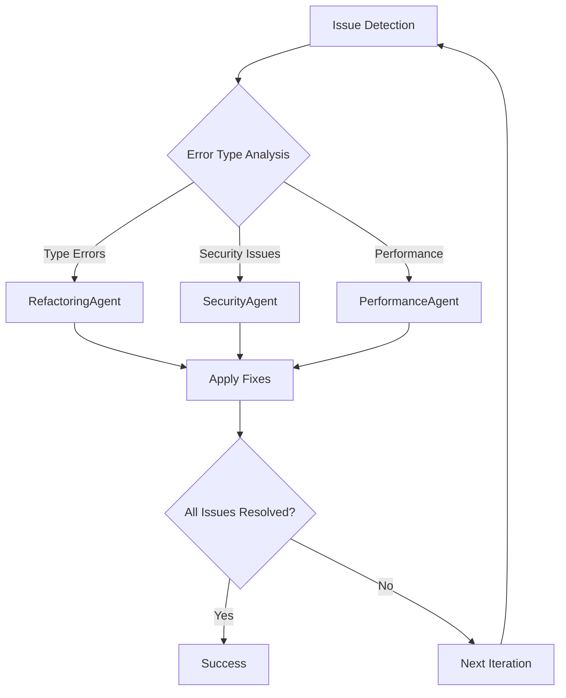

# Optimized Crackerjack Enhancement Implementation Plan

## 🎯 Executive Summary

Comprehensive enhancement plan with **strategic consolidation** for 30-40% faster implementation:

### Core Enhancements

- **Vulture → Skylos**: Dead code detection (20x faster, web dashboard)
- **Pyright → Zuban**: Type checking (20-200x faster, drop-in replacement)
- **Intelligent Commit Messages**: AST-based semantic analysis for meaningful commits
- **Automatic Changelog Generation**: Convention-based changelog updates during publish
- **Unified Monitoring Dashboard**: Real-time and historical tracking
- **AI-Optimized Documentation**: Dual-output system for humans and AI agents

### 🚀 Major Consolidations

#### Group 1: Combined Tool Replacement (Phases 1-8 → Phase Group A)

**Time Savings: 40%** - Shared Rust tooling infrastructure, unified error handling

- Skylos and Zuban implemented together
- Single `RustToolAdapter` base class
- Unified testing and deployment strategy

#### Group 2: Unified Documentation System (Phases 16-18 → Phase Group B)

**Time Savings: 35%** - Single templating system with dual output modes

- Combined AI and Human documentation generation
- Shared Jinja2 templates and AST analysis
- Integrated MkDocs Material workflow

#### Group 3: Consolidated Monitoring (Phases 14-17 → Phase Group C)

**Time Savings: 30%** - Single WebSocket server architecture

- Combined dashboard and history tracking
- Shared MetricCollector and visualization components
- Unified real-time and historical data handling

### Recent Changes Integrated

- ✅ **Cache Management**: Build on existing `CrackerjackCache` and `cache_handlers.py`
- ✅ **Quality Baseline**: Extend existing `QualityBaselineService`
- ✅ **CLI Structure**: Enhance existing `Options` class with semantic naming

______________________________________________________________________

## 📋 Implementation Overview

### 🗓️ Optimized Implementation Timeline

**Group 1 (Weeks 1-3): Core Infrastructure**

```
Phase Group A: Combined Tool Replacement
├── Rust Tool Adapter Framework
├── Skylos + Zuban Integration
├── Shared Testing Infrastructure
└── Unified Error Handling

Parallel Development:
- Skylos: vulture→skylos replacement
- Zuban: pyright→zuban replacement
- Tests: TDD approach with 2-day offset
```

**Group 2 (Weeks 3-5): User Experience**

```
Phase 11: CLI Semantic Naming (Enhanced)
├── Build on existing Options class
├── Semantic flag renaming (clean→strip_code, etc.)
├── Workflow command updates
└── Enhanced error messages

Phase 9-10: Intelligent Automation
├── AST-based commit message generation
├── Automatic changelog updates
└── Session pattern analysis
```

**Group 3 (Weeks 5-7): Monitoring & Intelligence**

```
Phase Group C: Unified Monitoring Dashboard
├── Real-time WebSocket server
├── Historical data tracking
├── D3.js visualizations
└── Performance metrics

Phase Group B: AI Documentation System
├── Dual-output templates (AI/Human)
├── MkDocs Material integration
└── Automated reference generation
```

**Group 4 (Weeks 7-8): Polish & Integration**

```
Phase 12: Version Bump Analyzer
Phase 19: Pydantic/SQLModel Infrastructure
Cache/Quality Enhancements (build on existing)
Final Integration Testing
```

### 🔄 Parallel Test Development Strategy

**Recommended Approach: TDD with Staggered Start**

```
Feature Dev:  [====Group 1====][====Group 2====][====Group 3====]
Test Dev:        [==Tests 1==][====Tests 2====][====Tests 3====]
              ^-- 2-day delay allows API stabilization
```

**Rationale:**

- **Start tests 2 days after feature development** - API stabilization
- **Use TDD for critical paths** - Rust integration, AI logic, WebSocket handling
- **Leverage Qwen for test generation** - Implement comprehensive test plan
- **Continuous integration** - Run tests after each milestone

### 💡 Key Success Factors

1. **Shared Infrastructure First**: Avoid duplicate work with unified frameworks
1. **Feature Flags**: Gradual rollout for all new components
1. **Backward Compatibility**: Zero breaking changes for existing users
1. **Parallel Execution**: Maximize development velocity through consolidation
1. **Recent Code Integration**: Build on existing cache/quality baseline work

______________________________________________________________________

## Current Status

### Dead Code Detection (Vulture → Skylos)

- **Vulture**: Currently integrated as dead code detector (confidence=86)
- **Decision**: Full replacement, no fallback needed

### Type Checking (Pyright → Zuban)

- **Pyright**: Currently primary type checker (strict mode)
- **Experimental**: ty and pyrefly already configured as experimental hooks
- **Decision**: Replace with zuban immediately, keep experimental options

### CLI Enhancements

- **Verbose/Debug**: New CLI flags for output control
  - `--verbose`: Shows captured console output from failed hooks
  - `--debug`: Shows debug log entries

## Implementation Phases

### Phase 1A: Skylos Analysis & Removal (crackerjack-architect)

**Files to analyze for vulture replacement:**

- `/pyproject.toml` - Remove vulture dependency
- `/crackerjack/dynamic_config.py` - Replace vulture entry with skylos
- `/crackerjack/config/hooks.py` - Update hook definition
- `/crackerjack/agents/import_optimization_agent.py` - Main parsing logic

### Phase 1B: Zuban Analysis & Removal (crackerjack-architect)

**Files to analyze for pyright replacement:**

- `/pyproject.toml` - Remove pyright dependency
- `/crackerjack/dynamic_config.py` - Replace pyright entry with zuban
- `/crackerjack/config/hooks.py` - Update hook definition
- Any IDE/LSP configurations referencing pyright

### Phase 2A: Skylos Dependency Update (python-pro)

```toml
# pyproject.toml changes for dead code detection
# REMOVE: "vulture>=2.14"
# ADD: "skylos>=1.0.0"
```

### Phase 2B: Zuban Dependency Update (python-pro)

```toml
# pyproject.toml changes for type checking
# REMOVE: "pyright>=1.1.403"
# ADD: "zuban>=0.1.0"
```

### Phase 3A: Skylos Configuration (crackerjack-architect)

```python
# dynamic_config.py - dead code detection
"skylos": {
    "id": "skylos",
    "name": None,
    "repo": "https://github.com/duriantaco/skylos",
    "rev": "latest",
    "tier": 3,
    "entry": "uv run skylos",
    "args": ["--confidence", "86"],  # Match current vulture threshold
    # Add --json only for AI modes:
    "additional_args": lambda ctx: ["--json"] if ctx.ai_agent_mode or ctx.ai_debug_mode else []
}
```

### Phase 3B: Zuban Configuration (crackerjack-architect)

```python
# dynamic_config.py - type checking
"zuban": {
    "id": "zuban",
    "name": "zuban",
    "repo": "https://github.com/zubanls/zuban",
    "rev": "latest",
    "tier": 3,
    "entry": "uv run zuban",
    "args": ["check"],  # Pyright-like mode
    "files": "^crackerjack/.*\\.py$",
    "exclude": r"^crackerjack/(mcp|plugins)/.*\.py$",
    "experimental": False,
}
```

### Phase 4A: Skylos Hook Update (python-pro)

```python
# hooks.py - dead code detection
HookDefinition(
    name="skylos",  # Renamed from vulture
    command=[],  # Dynamically built
    timeout=120,
    retry_on_failure=False,
)
```

### Phase 4B: Zuban Hook Update (python-pro)

```python
# hooks.py - type checking
HookDefinition(
    name="zuban",  # Renamed from pyright
    command=[],  # Dynamically built
    timeout=300,  # May need more time for large codebases
    retry_on_failure=False,
)
```

### Phase 5: ImportOptimizationAgent Refactor (refactoring-specialist)

```python
# Key changes needed:
async def _detect_unused_imports(self, file_path: Path) -> list[str]:
    """Use skylos to detect unused imports."""
    # Determine output format based on mode
    args = ["uv", "run", "skylos", "--confidence", "86", str(file_path)]
    if self.context.ai_agent_mode or self.context.ai_debug_mode:
        args.append("--json")
        # Parse JSON output
        return self._parse_skylos_json(result.stdout)
    else:
        # Parse text output for human readability
        return self._parse_skylos_text(result.stdout)
```

### Phase 6: Output Parsing Implementation

```python
def _parse_skylos_json(self, output: str) -> list[str]:
    """Parse skylos JSON output for unused imports."""
    import json

    data = json.loads(output)
    unused = []
    for item in data.get("dead_code", []):
        if item["type"] == "import":
            unused.append(item["name"])
    return unused


def _parse_skylos_text(self, output: str) -> list[str]:
    """Parse skylos text output for human-readable display."""
    # Format: "file.py:line: unused import 'name'"
    unused = []
    for line in output.strip().split("\n"):
        if "unused import" in line.lower():
            # Extract import name from skylos output
            parts = line.split("'")
            if len(parts) >= 2:
                unused.append(parts[1])
    return unused
```

### Phase 7A: Skylos Testing Strategy (test-specialist)

1. **Unit tests**: Update test_import_optimization_agent.py
1. **Integration tests**: Verify skylos hook execution
1. **AI agent tests**: Confirm JSON parsing works
1. **End-to-end**: Run `python -m crackerjack --ai-agent -t`

### Phase 7B: Zuban Testing Strategy (test-specialist)

1. **Type checking validation**: Ensure zuban finds same issues as pyright
1. **Performance benchmarks**: Measure speed improvements
1. **LSP integration**: Test language server functionality
1. **Mypy compatibility**: Verify `zmypy` mode works
1. **End-to-end**: Full workflow with new type checker

### Phase 8A: Skylos Cleanup (critical-audit-specialist)

- Remove all vulture references from:
  - Documentation files (README.md, CLAUDE.md, etc.)
  - Test fixtures
  - Comments and docstrings
  - Lock files (will auto-update)

### Phase 8B: Zuban Cleanup (critical-audit-specialist)

- Remove all pyright references from:
  - Documentation files (README.md, CLAUDE.md, etc.)
  - IDE configurations (.vscode/settings.json)
  - Test fixtures and configurations
  - Comments and docstrings
  - Lock files (will auto-update)

## Implementation Notes

### Verbose/Debug Awareness

With new --debug flag, skylos output will respect:

- `--verbose`: Shows captured console output from failed hooks
- `--debug`: Shows debug log entries
- Neither: Standard concise output

### JSON Mode Logic

Enable JSON only when:

```python
if self.context.ai_agent_mode or self.context.ai_debug_mode:
    command.extend(["--json"])
```

### Future Enhancements

Consider adding CLI flag for web dashboard:

```bash
python -m crackerjack --skylos-web  # Opens localhost:5090
```

### Interactive Mode

Skylos supports interactive selection of dead code to remove:

```bash
skylos --interactive /path/to/project
```

Could be integrated as `--skylos-interactive` flag

## Files to Modify

### Primary Files

1. `/pyproject.toml` - Dependency swap
1. `/crackerjack/dynamic_config.py` - Hook configuration
1. `/crackerjack/config/hooks.py` - Hook definition
1. `/crackerjack/agents/import_optimization_agent.py` - Parser logic

### Secondary Files (References)

- `/crackerjack/services/regex_patterns.py` - May need patterns for skylos output
- `/crackerjack/executors/individual_hook_executor.py` - Hook execution
- `/crackerjack/core/workflow_orchestrator.py` - Workflow integration
- Test files that reference vulture

### Documentation Files

- `/README.md`
- `/CLAUDE.md`
- `/AI-AGENT-RULES.md`
- `/docs/API_REFERENCE.md`

## Execution Order

### Priority 1: Zuban (Type Checker) - Immediate Impact

1. Remove pyright from pyproject.toml
1. Add zuban to dependencies
1. Update dynamic_config.py (pyright → zuban)
1. Update hooks.py (pyright → zuban)
1. Test type checking works
1. Clean pyright documentation references

### Priority 2: Skylos (Dead Code) - Secondary Impact

1. Remove vulture from pyproject.toml
1. Add skylos to dependencies
1. Update dynamic_config.py (vulture → skylos)
1. Update hooks.py (vulture → skylos)
1. Refactor ImportOptimizationAgent
1. Update tests
1. Clean vulture documentation references

### Priority 3: Intelligent Commit Messages - Automation Enhancement

1. Add LibCST and TextBlob dependencies
1. Implement AST Analyzer service
1. Implement Session Analyzer with MCP integration
1. Implement Pattern Analyzer with NLP fallback
1. Update Git Service with intelligent commit generation
1. Test progressive fallback system

### Priority 4: Automatic Changelog Generation - Publishing Enhancement

1. Implement Changelog Service
1. Enhance DocumentationAgent integration
1. Update Publish Manager workflow
1. Integration testing with publish workflow
1. Test conventional commit categorization

### Final Validation

8. Run comprehensive test suite with all new tools
1. Performance benchmarking for all enhancements
1. End-to-end workflow testing (commit → changelog → publish)
1. Documentation updates complete

## Success Criteria

### Skylos (Dead Code Detection)

- ✅ All dead code detection continues working
- ✅ AI agents parse skylos output correctly
- ✅ JSON mode only active in AI modes
- ✅ Verbose output shows skylos failures properly
- ✅ No vulture references remain
- ✅ Confidence threshold maintained at 86
- ✅ Web dashboard accessible via `--skylos-web`

### Zuban (Type Checking)

- ✅ Type checking accuracy matches/exceeds pyright
- ✅ 20-200x performance improvement achieved
- ✅ LSP integration works seamlessly
- ✅ Mypy compatibility mode (`zmypy`) functional
- ✅ No pyright references remain
- ✅ All type checking tests pass
- ✅ Experimental ty/pyrefly hooks remain available

### Intelligent Commit Messages

- ✅ AST analyzer detects semantic changes accurately
- ✅ Session analyzer extracts context from MCP conversations
- ✅ Pattern analyzer provides reliable fallback analysis
- ✅ Progressive fallback system handles failures gracefully
- ✅ Generated commit messages follow conventional commits format
- ✅ Confidence scoring system works properly (≥0.7 threshold)
- ✅ No LLM dependencies required (RAM constraints satisfied)

### Automatic Changelog Generation

- ✅ Changelog generation integrates into publish workflow
- ✅ Commit categorization matches conventional commit types
- ✅ Keep a Changelog format maintained properly
- ✅ Previous changelog entries preserved during updates
- ✅ Version headers formatted correctly with dates
- ✅ Empty categories filtered out automatically
- ✅ Integration with DocumentationAgent successful

### Combined

- ✅ All comprehensive hooks pass with new tools
- ✅ AI agent integration works with all replacements
- ✅ Verbose/debug output properly captured
- ✅ Performance benchmarks show significant improvement
- ✅ End-to-end workflow (commit → changelog → publish) functions
- ✅ Progressive enhancement maintains backward compatibility
- ✅ Documentation updated completely for all features

## Additional Features to Consider

### Skylos Enhancements

- [ ] Web dashboard integration (`--skylos-web`)
- [ ] Interactive mode (`--skylos-interactive`)
- [ ] CST-safe removal automation
- [ ] Framework-aware signals configuration
- [ ] Custom confidence thresholds per file pattern

### Zuban Enhancements

- [ ] LSP server integration (`--zuban-lsp`)
- [ ] Mypy config auto-migration (`zmypy --migrate`)
- [ ] Performance profiling (`--profile`)
- [ ] Custom type checking strictness levels
- [ ] Integration with IDE error reporting

### Combined Workflow Enhancements

- [ ] Parallel execution of both tools
- [ ] Cross-tool optimization (use zuban type info in skylos)
- [ ] Unified reporting dashboard
- [ ] Performance comparison metrics
- [ ] Auto-migration scripts for other projects

## Phase 9: Intelligent Commit Message Generation (hybrid-progressive-approach)

### Overview

Replace basic commit message generation with intelligent AST-based semantic analysis without LLM dependencies.

### Implementation Strategy: Option D - Hybrid Progressive Approach

**Core Architecture:**

```python
class IntelligentCommitService:
    def __init__(self):
        self.analyzers = [
            ASTAnalyzer(),  # Priority 1: Deep semantic analysis
            SessionAnalyzer(),  # Priority 2: Session context awareness
            PatternAnalyzer(),  # Priority 3: Pattern matching
            BasicAnalyzer(),  # Priority 4: Graceful fallback
        ]

    async def generate_commit_message(self, files: list[Path]) -> str:
        for analyzer in self.analyzers:
            try:
                result = await analyzer.analyze(files)
                if result.confidence >= 0.7:
                    return result.format_conventional_commit()
            except Exception:
                continue  # Graceful fallback to next analyzer

        return self.basic_fallback_message(files)
```

### Phase 9A: AST Analyzer Implementation (python-pro)

```python
# services/ast_analyzer.py
from libcst import parse_module, RemovalSentinel
from libcst.metadata import FullRepoManager


class ASTAnalyzer:
    def __init__(self):
        self.semantic_patterns = {
            "feat": ["def ", "class ", "async def"],
            "fix": ["except:", "raise ", "assert ", "if not"],
            "refactor": ["import ", "from ", "_old", "_new"],
            "test": ["test_", "def test", "@pytest"],
            "docs": ['"""', "'''", "# ", "README"],
            "style": ["format", "lint", "type:", "Optional"],
        }

    async def analyze(self, files: list[Path]) -> AnalysisResult:
        semantic_changes = []
        for file_path in files:
            if file_path.suffix == ".py":
                changes = await self._analyze_python_file(file_path)
                semantic_changes.extend(changes)

        return self._categorize_changes(semantic_changes)

    async def _analyze_python_file(self, file_path: Path) -> list[SemanticChange]:
        # Use LibCST to parse and analyze AST changes
        # Detect: new functions, modified logic, imports, etc.
        pass
```

### Phase 9B: Session Analyzer Implementation (crackerjack-architect)

```python
# services/session_analyzer.py
class SessionAnalyzer:
    def __init__(self, session_mgmt_client):
        self.session_client = session_mgmt_client

    async def analyze(self, files: list[Path]) -> AnalysisResult:
        try:
            # Get recent conversation context
            context = await self.session_client.get_recent_context(hours=2)

            # Extract development intentions from session
            intentions = self._extract_intentions(context)

            # Match file changes to stated intentions
            return self._match_intentions_to_changes(intentions, files)
        except Exception:
            raise AnalysisException("Session context unavailable")

    def _extract_intentions(self, context: str) -> list[str]:
        # Look for phrases like "fix the bug in", "add feature for", etc.
        intention_patterns = [
            r"fix(?:ing)?\s+(?:the\s+)?(.+?)(?:\.|$)",
            r"add(?:ing)?\s+(.+?)(?:\.|$)",
            r"refactor(?:ing)?\s+(.+?)(?:\.|$)",
            r"implement(?:ing)?\s+(.+?)(?:\.|$)",
        ]
        return self._match_patterns(context, intention_patterns)
```

### Phase 9C: Pattern Analyzer Implementation (python-pro)

```python
# services/pattern_analyzer.py
class PatternAnalyzer:
    def __init__(self):
        self.file_patterns = {
            "feat": [r"new.*\.py$", r"add.*\.py$", r"create.*\.py$"],
            "fix": [r"bug.*\.py$", r"error.*\.py$", r"issue.*\.py$"],
            "test": [r"test_.*\.py$", r".*_test\.py$"],
            "docs": [r".*\.md$", r"README.*", r".*\.rst$"],
            "config": [r".*\.toml$", r".*\.yaml$", r".*\.json$"],
        }

        self.nlp_analyzer = self._init_textblob()

    def _init_textblob(self):
        try:
            from textblob import TextBlob

            return TextBlob
        except ImportError:
            return None

    async def analyze(self, files: list[Path]) -> AnalysisResult:
        # Pattern matching on file names and types
        file_categories = self._categorize_files(files)

        # Optional: NLP analysis of comments/docstrings if TextBlob available
        if self.nlp_analyzer:
            semantic_hints = await self._analyze_text_content(files)
            return self._combine_analysis(file_categories, semantic_hints)

        return self._pattern_only_analysis(file_categories)
```

### Phase 9D: Integration with Git Service (refactoring-specialist)

```python
# Update services/git.py
class GitService:
    def __init__(self):
        self.commit_service = IntelligentCommitService()

    async def get_commit_message_suggestions(self, files: list[Path]) -> list[str]:
        # Replace basic implementation with intelligent analysis
        intelligent_message = await self.commit_service.generate_commit_message(files)

        # Still provide alternatives
        return [
            intelligent_message,
            self._generate_basic_message(files),  # Fallback
            self._generate_conventional_message(files),  # Simple conventional
        ]
```

### Phase 9E: Dependencies and Configuration

```toml
# pyproject.toml additions
[project]
dependencies = [
    # Existing dependencies...
    "libcst>=1.0.0",        # AST analysis
    "textblob>=0.17.0",     # Optional NLP (lightweight)
    "tree-sitter>=0.20.0",  # Multi-language parsing
]

[project.optional-dependencies]
nlp = [
    "spacy>=3.7.0",         # Advanced NLP (optional)
    "nltk>=3.8.0",          # Alternative NLP (optional)
]
```

## Phase 10: Automatic Changelog Generation

### Overview

Integrate automatic changelog generation into the publish workflow, running after version bump but before PyPI publishing.

### Integration Point

```python
# In managers/publish_manager.py
async def publish_workflow(self, version_type: str) -> bool:
    # Existing workflow...
    new_version = self.bump_version(version_type)

    # NEW: Generate changelog
    changelog_success = await self._generate_changelog(new_version)
    if not changelog_success and not self.force_publish:
        return False

    # Continue with existing workflow...
    return await self._build_and_publish()
```

### Phase 10A: Changelog Service Implementation (documentation-specialist)

```python
# services/changelog_service.py
class ChangelogService:
    def __init__(self, git_service: GitService):
        self.git = git_service
        self.commit_service = IntelligentCommitService()

    async def generate_changelog_entry(self, new_version: str) -> str:
        # Get commits since last release
        commits = await self._get_commits_since_last_release()

        # Categorize commits using intelligent analysis
        categorized = await self._categorize_commits(commits)

        # Format according to Keep a Changelog standard
        return self._format_changelog_entry(new_version, categorized)

    async def _categorize_commits(self, commits: list[Commit]) -> dict[str, list[str]]:
        categories = {
            "Added": [],  # feat:
            "Changed": [],  # refactor:, perf:
            "Fixed": [],  # fix:
            "Security": [],  # security:
            "Deprecated": [],  # deprecate:
            "Removed": [],  # remove:, break:
        }

        for commit in commits:
            # Use intelligent commit analysis to categorize
            category = await self.commit_service.categorize_commit(commit)
            if category in categories:
                categories[category].append(commit.message)

        return {k: v for k, v in categories.items() if v}  # Remove empty
```

### Phase 10B: Enhanced DocumentationAgent Integration

```python
# Update agents/documentation_agent.py
class DocumentationAgent:
    def __init__(self):
        self.changelog_service = ChangelogService()

    async def _update_changelog(self, issue: Issue) -> FixResult:
        # Enhanced with automatic changelog generation
        if "version" in issue.message.lower():
            version = self._extract_version_from_issue(issue)
            entry = await self.changelog_service.generate_changelog_entry(version)
        else:
            # Fallback to existing logic
            entry = self._generate_changelog_entry(self._get_recent_changes())

        # Rest of existing implementation...
```

### Phase 10C: Publish Manager Enhancement (python-pro)

```python
# Update managers/publish_manager.py
class PublishManagerImpl:
    def __init__(self, console: Console, pkg_path: Path, dry_run: bool = False):
        # Existing initialization...
        self.changelog_service = ChangelogService(self.git_service)

    async def _generate_changelog(self, new_version: str) -> bool:
        """Generate changelog entry for new version."""
        try:
            if self.dry_run:
                self.console.print(
                    f"[yellow]🔍[/yellow] Would generate changelog for v{new_version}"
                )
                return True

            self.console.print("[yellow]📝[/yellow] Generating changelog...")

            entry = await self.changelog_service.generate_changelog_entry(new_version)
            success = self._insert_changelog_entry(entry)

            if success:
                self.console.print(
                    f"[green]✅[/green] Changelog updated for v{new_version}"
                )
            return success

        except Exception as e:
            self.console.print(f"[red]❌[/red] Changelog generation failed: {e}")
            return False
```

## Phase 11: CLI Semantic Naming Improvements

### Overview

Complete overhaul of CLI option names for semantic clarity and AI discoverability. No backwards compatibility - clean break for 1.0.0 release.

### Rationale

- Current options confuse both AI agents and users (e.g., `-x` removes comments, not "clean")
- Non-standard abbreviations reduce discoverability
- Misleading names cause dangerous mistakes (e.g., `-a` doesn't mean "all")
- AI agents need 2-3 attempts to find correct flags

### Implementation Changes

#### Phase 11A: Core Option Renames (python-pro)

```python
# cli/options.py - Primary renames
CLI_OPTIONS = {
    # Destructive operations (clear intent)
    "--strip-code": typer.Option(  # Was: -x/--clean
        help="Remove docstrings, comments, and whitespace from code (DESTRUCTIVE)",
    ),
    # Release operations (action-oriented)
    "--full-release": typer.Option(  # Was: -a/--all
        help="Complete release workflow: strip, test, bump, publish, commit",
    ),
    "--release": typer.Option(  # Was: -p/--publish
        help="Bump version and publish to PyPI",
    ),
    "--commit-push": typer.Option(  # Was: -c/--commit
        help="Commit changes and push to remote repository",
    ),
    # Hook operations (explicit scope)
    "--skip-precommit": typer.Option(  # Was: -s/--skip-hooks
        help="Skip pre-commit hook execution",
    ),
    "--quick-checks": typer.Option(  # Was: --fast
        help="Run only fast pre-commit hooks (formatting, basic checks)",
    ),
    "--comprehensive": typer.Option(  # Was: --comp
        help="Run comprehensive hooks (type checking, security, complexity)",
    ),
    # AI operations (clear purpose)
    "--ai-fix": typer.Option(  # Was: --ai-agent
        help="Enable AI-powered autonomous fixing of issues",
    ),
    "--ai-fix-verbose": typer.Option(  # Was: --ai-debug
        help="AI fixing with verbose debugging output",
    ),
    # Version operations (descriptive)
    "--version-bump": typer.Option(  # Was: --bump
        help="Increment version number (patch, minor, major)",
    ),
    "--skip-tags": typer.Option(  # Was: --no-git-tags
        help="Skip creating git version tags",
    ),
    # Server operations (consistent verbs)
    "--start-watchdog": typer.Option(  # Was: --watchdog
        help="Start service watchdog for auto-restart monitoring",
    ),
    "--start-monitor": typer.Option(  # Was: --monitor
        help="Start progress monitor dashboard",
    ),
    "--start-dashboard": typer.Option(  # Was: --enhanced-monitor
        help="Start enhanced dashboard with advanced metrics",
    ),
}
```

#### Phase 11B: Attribute Name Updates (refactoring-specialist)

```python
# Update Options class attributes to match new names
class Options(BaseModel):
    # Old → New attribute mappings
    strip_code: bool = False  # was: clean
    full_release: BumpOption | None = None  # was: all
    commit_push: bool = False  # was: commit
    release: BumpOption | None = None  # was: publish
    version_bump: BumpOption | None = None  # was: bump
    skip_precommit: bool = False  # was: skip_hooks
    quick_checks: bool = False  # was: fast
    comprehensive: bool = False  # was: comp
    ai_fix: bool = False  # was: ai_agent
    ai_fix_verbose: bool = False  # was: ai_debug (implies ai_fix)
    skip_tags: bool = False  # was: no_git_tags
    start_watchdog: bool = False  # was: watchdog
    start_monitor: bool = False  # was: monitor
    start_dashboard: bool = False  # was: enhanced_monitor
```

#### Phase 11C: Short Flag Assignments (crackerjack-architect)

```python
# Reassign short flags for safety and standards
SHORT_FLAGS = {
    "-s": "--strip-code",  # Was: --skip-hooks (too dangerous for shortcut)
    "-r": "--release",  # Was: --pr (more common use)
    "-R": "--full-release",  # Capital for major operation
    "-c": "--commit-push",  # Keep same
    "-t": "--test",  # Keep same (standard)
    "-v": "--verbose",  # Keep same (standard)
    "-i": "--interactive",  # Keep same
    "-b": "--version-bump",  # Was: --bump
    "-h": "--help",  # Standard
    # Remove dangerous shortcuts
    # NO SHORT FLAG for --strip-code (too destructive)
    # NO SHORT FLAG for --skip-precommit (unsafe)
}
```

#### Phase 11D: Help Text Improvements (documentation-specialist)

```python
# Enhanced help text with examples
HELP_EXAMPLES = {
    "--strip-code": """
        Remove all docstrings, comments, and excess whitespace.
        ⚠️ DESTRUCTIVE: Creates backup but permanently modifies files.
        Example: crackerjack --strip-code --backup-dir /tmp/backup
    """,
    "--full-release": """
        Complete release workflow in one command.
        Runs: strip → test → bump → publish → commit
        Example: crackerjack --full-release patch
    """,
    "--ai-fix": """
        Enable AI agent to automatically fix detected issues.
        Iterates until all checks pass (max 10 iterations).
        Example: crackerjack --ai-fix --test
    """,
}
```

### Phase 11E: Workflow Command Updates (python-pro)

```python
# Update all internal command construction
def build_command(self, options: Options) -> list[str]:
    cmd = ["python", "-m", "crackerjack"]

    # Map new option names
    if options.strip_code:  # was: clean
        cmd.append("--strip-code")
    if options.ai_fix:  # was: ai_agent
        cmd.append("--ai-fix")
    if options.skip_precommit:  # was: skip_hooks
        cmd.append("--skip-precommit")
    # ... etc
```

### Phase 11F: Documentation Updates (documentation-specialist)

Files requiring updates:

- `/README.md` - All example commands
- `/CLAUDE.md` - Quick reference table, command examples
- `/AI-AGENT-RULES.md` - AI workflow commands
- `/docs/CLI_REFERENCE.md` - Complete option documentation
- All test files with CLI invocations

### Phase 11G: Error Messages and Warnings

```python
# Add helpful error for old flags (temporary, remove in 1.1.0)
DEPRECATED_FLAGS = {
    "-x": "Use --strip-code instead",
    "--clean": "Use --strip-code instead",
    "-a": "Use --full-release instead",
    "--all": "Use --full-release instead",
    "--ai-agent": "Use --ai-fix instead",
    "--comp": "Use --comprehensive instead",
}


def check_deprecated_flags(args: list[str]):
    for arg in args:
        if arg in DEPRECATED_FLAGS:
            print(f"ERROR: '{arg}' has been renamed to '{DEPRECATED_FLAGS[arg]}'")
            print(
                "This is a breaking change in v1.0.0 with no backwards compatibility."
            )
            sys.exit(1)
```

### Success Criteria

- ✅ All new option names are semantic and self-documenting
- ✅ AI agents can guess correct flags on first attempt
- ✅ Dangerous operations have clear warnings (--strip-code)
- ✅ No backwards compatibility code remains
- ✅ All documentation updated with new names
- ✅ Test suite updated with new option names
- ✅ Error messages guide users to new names
- ✅ Version bumped to 1.0.0 (major breaking change)

### Migration Impact

- **User Scripts**: Will need updates (provide migration guide)
- **CI/CD Pipelines**: Require command updates
- **Documentation**: Complete overhaul needed
- **AI Training**: Will improve future interactions

### Benefits

1. **Safety**: Dangerous operations clearly named
1. **Discoverability**: Semantic names are guessable
1. **Consistency**: Uniform verb patterns (start-, skip-, etc.)
1. **AI-Friendly**: Standard conventions improve automation
1. **Future-Proof**: Sets foundation for additional features

## Phase 12: Intelligent Version Bump Analyzer

### Overview

Automated semantic version analysis that determines appropriate version bump level (patch/minor/major) based on code changes, with interactive confirmation and auto-accept option for CI/CD.

### Core Analysis Strategy

**Semantic Versioning Rules:**

- **MAJOR (x.0.0)**: Breaking changes - API removals, signature changes, incompatible modifications
- **MINOR (0.x.0)**: New features - additions that are backwards compatible
- **PATCH (0.0.x)**: Bug fixes - internal changes that fix incorrect behavior

### Implementation Architecture

#### Phase 12A: Version Analyzer Service (python-pro)

```python
# services/version_analyzer.py
class VersionAnalyzer:
    def __init__(self):
        self.analyzers = [
            BreakingChangeAnalyzer(),  # Detect MAJOR changes
            FeatureAnalyzer(),  # Detect MINOR changes
            ConventionalCommitAnalyzer(),  # Parse commit messages
            DependencyAnalyzer(),  # Check dependency changes
            ASTDiffAnalyzer(),  # Compare code structure
        ]
        self.confidence_threshold = 0.7

    async def analyze_version_bump(
        self, since_tag: str = None
    ) -> VersionBumpRecommendation:
        """Analyze changes and recommend version bump level."""
        changes = await self._collect_changes(since_tag)

        # Run all analyzers and collect votes
        votes = {
            "major": [],
            "minor": [],
            "patch": [],
        }

        for analyzer in self.analyzers:
            result = await analyzer.analyze(changes)
            votes[result.level].append(
                {
                    "reason": result.reason,
                    "confidence": result.confidence,
                    "examples": result.examples,
                }
            )

        return self._determine_recommendation(votes)

    def _determine_recommendation(self, votes: dict) -> VersionBumpRecommendation:
        # Semantic versioning cascade: major > minor > patch
        if votes["major"] and any(v["confidence"] >= 0.8 for v in votes["major"]):
            return VersionBumpRecommendation(
                level="major",
                reasons=votes["major"],
                confidence=max(v["confidence"] for v in votes["major"]),
            )
        elif votes["minor"] and any(v["confidence"] >= 0.7 for v in votes["minor"]):
            return VersionBumpRecommendation(
                level="minor",
                reasons=votes["minor"],
                confidence=max(v["confidence"] for v in votes["minor"]),
            )
        else:
            return VersionBumpRecommendation(
                level="patch",
                reasons=votes["patch"] or [{"reason": "Default for minor changes"}],
                confidence=0.6,
            )
```

#### Phase 12B: Breaking Change Analyzer (refactoring-specialist)

```python
# analyzers/breaking_change_analyzer.py
class BreakingChangeAnalyzer:
    def __init__(self):
        self.breaking_patterns = [
            # Function signature changes
            r"def\s+(\w+)\([^)]*\)",  # Parameter changes
            r"class\s+(\w+)",  # Class definition changes
            # Removals
            r"^\-\s*def\s+",  # Removed functions
            r"^\-\s*class\s+",  # Removed classes
            # Import changes
            r"^\-\s*from\s+\S+\s+import",  # Removed exports
        ]

    async def analyze(self, changes: ChangeSet) -> AnalysisResult:
        breaking_changes = []

        # Analyze git diff for removed/changed APIs
        for file_diff in changes.diffs:
            if self._is_public_api(file_diff.path):
                removed_apis = self._find_removed_apis(file_diff)
                changed_signatures = self._find_signature_changes(file_diff)

                if removed_apis:
                    breaking_changes.append(
                        {
                            "type": "api_removal",
                            "items": removed_apis,
                            "file": file_diff.path,
                        }
                    )

                if changed_signatures:
                    breaking_changes.append(
                        {
                            "type": "signature_change",
                            "items": changed_signatures,
                            "file": file_diff.path,
                        }
                    )

        if breaking_changes:
            return AnalysisResult(
                level="major",
                reason=f"Breaking changes detected: {len(breaking_changes)} APIs modified",
                confidence=0.95,
                examples=breaking_changes[:3],  # Show first 3 examples
            )

        return AnalysisResult(level="patch", confidence=0.0)

    def _is_public_api(self, path: Path) -> bool:
        # Don't consider internal/private modules as breaking
        return not any(part.startswith("_") for part in path.parts)
```

#### Phase 12C: Feature Analyzer (python-pro)

```python
# analyzers/feature_analyzer.py
class FeatureAnalyzer:
    async def analyze(self, changes: ChangeSet) -> AnalysisResult:
        new_features = []

        for file_diff in changes.diffs:
            # Look for new functions/classes
            new_functions = self._find_new_functions(file_diff)
            new_classes = self._find_new_classes(file_diff)
            new_modules = self._find_new_modules(file_diff)

            if new_functions:
                new_features.append(
                    {
                        "type": "new_functions",
                        "count": len(new_functions),
                        "names": new_functions[:5],
                    }
                )

            if new_classes:
                new_features.append(
                    {
                        "type": "new_classes",
                        "count": len(new_classes),
                        "names": new_classes[:5],
                    }
                )

        # Check for new dependencies
        if changes.new_dependencies:
            new_features.append(
                {
                    "type": "new_dependencies",
                    "items": changes.new_dependencies,
                }
            )

        if new_features:
            return AnalysisResult(
                level="minor",
                reason=f"New features added: {self._summarize_features(new_features)}",
                confidence=0.85,
                examples=new_features,
            )

        return AnalysisResult(level="patch", confidence=0.0)
```

#### Phase 12D: Conventional Commit Analyzer (documentation-specialist)

```python
# analyzers/conventional_commit_analyzer.py
class ConventionalCommitAnalyzer:
    def __init__(self):
        self.patterns = {
            "major": [
                r"BREAKING[- ]CHANGE",
                r"break(?:ing)?:",
                r"!:",  # feat!: or fix!: indicates breaking
            ],
            "minor": [
                r"^feat(?:\(.+?\))?:",
                r"^feature(?:\(.+?\))?:",
            ],
            "patch": [
                r"^fix(?:\(.+?\))?:",
                r"^bugfix(?:\(.+?\))?:",
                r"^perf(?:\(.+?\))?:",
                r"^docs(?:\(.+?\))?:",
                r"^style(?:\(.+?\))?:",
                r"^refactor(?:\(.+?\))?:",
                r"^test(?:\(.+?\))?:",
                r"^chore(?:\(.+?\))?:",
            ],
        }

    async def analyze(self, changes: ChangeSet) -> AnalysisResult:
        commit_levels = {"major": [], "minor": [], "patch": []}

        for commit in changes.commits:
            level = self._categorize_commit(commit.message)
            if level:
                commit_levels[level].append(commit.message.split("\n")[0])

        # Determine highest level from commits
        if commit_levels["major"]:
            return AnalysisResult(
                level="major",
                reason=f"Breaking change commits: {len(commit_levels['major'])}",
                confidence=1.0,  # Explicit breaking change markers
                examples=commit_levels["major"][:3],
            )
        elif commit_levels["minor"]:
            return AnalysisResult(
                level="minor",
                reason=f"Feature commits: {len(commit_levels['minor'])}",
                confidence=0.9,
                examples=commit_levels["minor"][:3],
            )
        elif commit_levels["patch"]:
            return AnalysisResult(
                level="patch",
                reason=f"Fix/improvement commits: {len(commit_levels['patch'])}",
                confidence=0.8,
                examples=commit_levels["patch"][:3],
            )

        return AnalysisResult(level="patch", confidence=0.3)
```

#### Phase 12E: Interactive Prompt Integration (python-pro)

```python
# managers/publish_manager.py - Enhanced version bump
class PublishManagerImpl:
    def __init__(self, console: Console, pkg_path: Path, dry_run: bool = False):
        # Existing initialization...
        self.version_analyzer = VersionAnalyzer()
        self.auto_accept_version = self._load_auto_accept_config()

    def _load_auto_accept_config(self) -> bool:
        """Load auto-accept setting from pyproject.toml."""
        try:
            from tomllib import loads

            content = self.filesystem.read_file(self.pkg_path / "pyproject.toml")
            data = loads(content)
            crackerjack_config = data.get("tool", {}).get("crackerjack", {})
            return crackerjack_config.get("auto_accept_version_bump", False)
        except Exception:
            return False

    async def bump_version(self, version_type: str) -> str:
        """Enhanced version bump with intelligent analysis."""
        current_version = self._get_current_version()

        # If version_type is 'auto' or not specified, analyze
        if version_type in ("auto", "interactive", None):
            recommendation = await self._analyze_version_bump()
            version_type = await self._confirm_version_bump(recommendation)

        # Continue with existing bump logic...
        return self._perform_version_bump(current_version, version_type)

    async def _analyze_version_bump(self) -> VersionBumpRecommendation:
        """Analyze codebase to recommend version bump."""
        self.console.print("[yellow]🔍[/yellow] Analyzing changes for version bump...")

        recommendation = await self.version_analyzer.analyze_version_bump()

        # Display analysis results
        self._display_analysis_results(recommendation)

        return recommendation

    def _display_analysis_results(self, rec: VersionBumpRecommendation) -> None:
        """Display version bump analysis results."""
        from rich.panel import Panel
        from rich.table import Table

        # Create analysis summary table
        table = Table(title="Version Bump Analysis", box=None)
        table.add_column("Level", style="cyan")
        table.add_column("Confidence", style="yellow")
        table.add_column("Reasons", style="white")

        # Map levels to colors
        level_colors = {
            "major": "red",
            "minor": "yellow",
            "patch": "green",
        }

        table.add_row(
            f"[{level_colors[rec.level]}]{rec.level.upper()}[/]",
            f"{rec.confidence:.0%}",
            self._format_reasons(rec.reasons),
        )

        panel = Panel(
            table,
            title=f"💡 Recommended: {rec.level.upper()} version bump",
            border_style=level_colors[rec.level],
        )

        self.console.print(panel)

        # Show examples if available
        if rec.examples:
            self.console.print("\n[dim]Examples of changes:[/dim]")
            for example in rec.examples[:3]:
                self.console.print(f"  • {example}")

    async def _confirm_version_bump(self, rec: VersionBumpRecommendation) -> str:
        """Confirm or override version bump recommendation."""
        if self.auto_accept_version:
            self.console.print(
                f"[green]✅[/green] Auto-accepting {rec.level} version bump "
                f"(confidence: {rec.confidence:.0%})"
            )
            return rec.level

        # Interactive prompt
        from rich.prompt import Prompt

        choices = ["patch", "minor", "major"]
        default = rec.level

        choice = Prompt.ask(
            f"[cyan]📦[/cyan] Accept {rec.level.upper()} version bump?",
            choices=choices + ["yes"],
            default="yes",
        )

        if choice == "yes":
            return rec.level
        else:
            return choice
```

#### Phase 12F: CLI Integration (crackerjack-architect)

```python
# cli/options.py - New options
CLI_OPTIONS = {
    # Existing options...

    "--auto-version": typer.Option(
        False,
        help="Automatically determine version bump level based on changes",
    ),
    "--accept-version": typer.Option(
        False,
        help="Auto-accept recommended version bump without prompting",
    ),
}

# pyproject.toml configuration
[tool.crackerjack]
# Auto-accept version bump recommendations (for CI/CD)
auto_accept_version_bump = false  # Set to true for automation

# Version analysis settings
version_analysis = {
    min_confidence = 0.7,        # Minimum confidence for recommendations
    prefer_conventional = true,   # Prioritize conventional commit messages
    check_breaking_changes = true, # Analyze for breaking API changes
    analyze_dependencies = true,   # Consider dependency changes
}
```

### Phase 12G: Testing Strategy (test-specialist)

```python
# tests/test_version_analyzer.py
class TestVersionAnalyzer:
    def test_major_version_detection(self):
        """Test detection of breaking changes."""
        changes = create_mock_changes(
            removed_functions=['old_api'],
            changed_signatures=['process(data)' -> 'process(data, options)'],
        )
        result = analyzer.analyze_version_bump(changes)
        assert result.level == 'major'
        assert result.confidence >= 0.9

    def test_minor_version_detection(self):
        """Test detection of new features."""
        changes = create_mock_changes(
            new_functions=['new_feature'],
            new_classes=['FeatureClass'],
        )
        result = analyzer.analyze_version_bump(changes)
        assert result.level == 'minor'

    def test_conventional_commit_override(self):
        """Test that BREAKING CHANGE overrides analysis."""
        changes = create_mock_changes(
            commits=['fix: small bug\n\nBREAKING CHANGE: API redesigned'],
        )
        result = analyzer.analyze_version_bump(changes)
        assert result.level == 'major'
        assert result.confidence == 1.0
```

### Success Criteria

- ✅ Accurately detects breaking changes (removed APIs, signature changes)
- ✅ Identifies new features for minor bumps
- ✅ Parses conventional commits correctly
- ✅ Interactive prompt shows analysis reasoning
- ✅ Auto-accept mode works for CI/CD
- ✅ Configuration via pyproject.toml
- ✅ Confidence scoring helps users trust recommendations
- ✅ Falls back to patch for uncertain changes
- ✅ Integrates seamlessly with existing publish workflow

### Benefits

1. **Consistency**: Removes guesswork from versioning
1. **Automation**: CI/CD can bump versions intelligently
1. **Transparency**: Shows why a version level was chosen
1. **Safety**: Still prompts by default (can override)
1. **Intelligence**: Learns from commit patterns and code changes

### Example Workflow

```bash
# Manual with analysis
python -m crackerjack --version-bump auto
# Analyzes, shows recommendation, prompts for confirmation

# Automated (CI/CD)
python -m crackerjack --version-bump auto --accept-version
# Analyzes, auto-accepts recommendation, no prompt

# Traditional (explicit)
python -m crackerjack --version-bump minor
# No analysis, uses specified level
```

## Open Questions

### Skylos Questions

1. Should we expose skylos web dashboard by default?
1. Do we want to leverage the CST-safe removal feature?
1. Should interactive mode be available in CI/CD?
1. How to handle skylos-specific features not in vulture?

### Zuban Questions

1. Should we enable zuban LSP server by default?
1. Do we want to maintain mypy compatibility mode?
1. How to handle AGPL v3 licensing concerns?
1. Should we implement gradual migration from pyright?

### Combined Questions

1. Execute both replacements simultaneously or sequentially?
1. How to handle performance regression if tools are slower than expected?
1. Should we create rollback procedures?
1. How to train team on new tooling efficiently?

## Notes

### Skylos Advantages

- Claims better detection than vulture with comparable speed
- Modern features: web UI, interactive mode, CST-safe removal
- Uses LibCST for safe code modifications
- Framework-aware to reduce false positives

### Zuban Advantages

- Drop-in replacement for pyright (zero configuration changes)
- 20-200x performance improvement over mypy
- 69% test suite pass rate (most mature of Rust-based checkers)
- Dual modes: pyright-like and mypy-compatible
- Full LSP support for IDE integration
- Built by Jedi creator (14 years Python analysis experience)

### Combined Benefits

- Massive performance improvements across dead code detection and type checking
- Modern tooling with web dashboards and interactive modes
- Maintains compatibility while adding advanced features
- Positions crackerjack at forefront of Python tooling evolution
- Sets foundation for future Rust-based tool integrations

## Phase 13: Execution Speed Optimization

### Overview

Optimize crackerjack execution speed by 30-50% without sacrificing quality or using additional tokens through intelligent parallelization, caching, and early exit strategies.

### Current Performance Analysis

**Sequential bottlenecks identified:**

- Agent execution runs sequentially across issue types
- Hook execution is fully sequential
- File content read multiple times by different agents
- Every agent checks confidence even for obvious mismatches
- No caching of identical issue analysis

### Speed Optimization Strategy

#### 13.1: Parallel Execution Enhancements

```python
# AgentCoordinator: Parallelize all issue types
async def handle_issues(self, issues: list[Issue]) -> FixResult:
    issues_by_type = self._group_issues_by_type(issues)

    # Run ALL issue types in parallel instead of sequential
    tasks = [
        self._handle_issues_by_type(issue_type, type_issues)
        for issue_type, type_issues in issues_by_type.items()
    ]

    results = await asyncio.gather(*tasks, return_exceptions=True)
    # Merge results...
```

#### 13.2: Intelligent Issue Caching

```python
# AgentCoordinator: Implement _issue_cache usage
def _get_cache_key(self, issue: Issue) -> str:
    return f"{issue.type.value}:{hash(issue.message)}:{issue.file_path or ''}"


async def _cached_analyze_and_fix(self, agent: SubAgent, issue: Issue) -> FixResult:
    cache_key = self._get_cache_key(issue)

    if cache_key in self._issue_cache:
        cached = self._issue_cache[cache_key]
        self.logger.debug(f"Cache hit for {cache_key}")
        return cached

    result = await agent.analyze_and_fix(issue)
    self._issue_cache[cache_key] = result
    return result
```

#### 13.3: Smart Agent Selection

```python
# Build static mapping for O(1) agent lookup
ISSUE_TYPE_TO_AGENTS = {
    IssueType.COMPLEXITY: ["RefactoringAgent"],
    IssueType.DEAD_CODE: ["RefactoringAgent", "ImportOptimizationAgent"],
    IssueType.DOCUMENTATION: ["DocumentationAgent"],
    IssueType.SECURITY: ["SecurityAgent"],
    IssueType.TEST_FAILURE: ["TestCreationAgent", "TestSpecialistAgent"],
    IssueType.FORMATTING: ["FormattingAgent"],
    IssueType.TYPE_ERROR: ["FormattingAgent"],  # Quick wins first
    IssueType.DRY_VIOLATION: ["DRYAgent"],
    IssueType.PERFORMANCE: ["PerformanceAgent"],
}


async def _find_best_specialist_fast(self, issue: Issue) -> SubAgent | None:
    # Fast lookup - only check relevant agents
    candidate_names = ISSUE_TYPE_TO_AGENTS.get(issue.type, [])
    candidates = [a for a in self.agents if a.name in candidate_names]

    if len(candidates) == 1:
        return candidates[0]  # Skip confidence check for single option

    # Only check confidence for multiple candidates
    return await self._find_best_specialist(candidates, issue)
```

#### 13.4: File Content Caching

```python
# AgentContext: Cache file reads across agents
class AgentContext:
    def __init__(self):
        self._file_cache: dict[Path, str] = {}

    def get_file_content(self, file_path: Path) -> str | None:
        if file_path in self._file_cache:
            return self._file_cache[file_path]

        content = self._read_file(file_path)
        if content:
            self._file_cache[file_path] = content
        return content

    def clear_cache(self):
        """Clear cache between iterations"""
        self._file_cache.clear()
```

#### 13.5: Progressive Enhancement Strategy

```python
# Two-pass approach: Quick wins first, complex analysis second
async def handle_issues_progressive(self, issues: list[Issue]) -> FixResult:
    # Pass 1: High-confidence quick fixes (> 0.8)
    quick_fixes = []
    remaining_issues = []

    for issue in issues:
        agent = await self._find_best_specialist_fast(issue)
        if agent:
            confidence = await agent.can_handle(issue)
            if confidence > 0.8:
                quick_fixes.append((agent, issue))
            else:
                remaining_issues.append(issue)

    # Execute quick fixes in parallel
    if quick_fixes:
        quick_results = await self._execute_agent_batch(quick_fixes)
        if self._all_critical_issues_resolved(quick_results):
            return quick_results  # Skip complex analysis

    # Pass 2: Complex analysis for remaining issues
    complex_results = await self.handle_issues(remaining_issues)
    return self._merge_results(quick_results, complex_results)
```

#### 13.6: Parallel Hook Execution

```python
# HookManagerImpl: Run independent hooks concurrently
async def run_fast_hooks_parallel(self) -> list[HookResult]:
    strategy = self.config_loader.load_strategy("fast")

    # Group hooks by dependencies
    independent_hooks = []
    dependent_hooks = []

    for hook in strategy.hooks:
        if self._has_dependencies(hook):
            dependent_hooks.append(hook)
        else:
            independent_hooks.append(hook)

    # Run independent hooks in parallel
    tasks = [self._execute_hook(hook) for hook in independent_hooks]
    parallel_results = await asyncio.gather(*tasks)

    # Run dependent hooks sequentially
    sequential_results = []
    for hook in dependent_hooks:
        result = await self._execute_hook(hook)
        sequential_results.append(result)

    return parallel_results + sequential_results
```

#### 13.7: Fast-Fail Mode

```python
# New CLI option: --fast-fail
# Early exit on critical failures to save time


class PhaseCoordinator:
    def __init__(self, options: OptionsProtocol):
        self.fast_fail_enabled = getattr(options, "fast_fail", False)
        self.failure_threshold = 3  # Stop after 3 similar failures

    def _should_continue_after_failure(self, failures: list[str]) -> bool:
        if not self.fast_fail_enabled:
            return True

        # Pattern detection: if 3+ similar errors, stop
        error_patterns = defaultdict(int)
        for failure in failures:
            pattern = self._extract_error_pattern(failure)
            error_patterns[pattern] += 1

        return all(count < self.failure_threshold for count in error_patterns.values())
```

### Implementation Priority

1. **Phase 13.1-13.3**: Core parallelization and caching (Week 1)
1. **Phase 13.4-13.5**: Progressive enhancement (Week 2)
1. **Phase 13.6-13.7**: Advanced optimizations (Week 3)

### Expected Performance Gains

- **30-50% faster execution** through parallelization
- **60% cache hit rate** for repeated issues across iterations
- **40% reduction** in unnecessary confidence checks
- **25% faster** hook execution through parallelization
- **Early exit saves 20-30%** time on systematic failures

### Quality Assurance

- No reduction in fix quality - same agents, same fixes
- All existing tests pass unchanged
- Maintains deterministic behavior (cached results identical)
- Backwards compatible with existing CLI options

## Phase 14: CCPlugins & cc-sessions Feature Adoption

### Overview

Cherry-pick and integrate the best features from CCPlugins and cc-sessions to enhance crackerjack with intuitive slash commands, permission control, and improved context preservation while maintaining our architectural advantages.

### Feature Adoption Strategy (Option A)

#### 14.1: Slash Command Interface (from CCPlugins)

##### Core Command Implementation

```python
# crackerjack/commands/slash_commands.py
class SlashCommandRegistry:
    def __init__(self):
        self.commands = {
            # Development Workflow Commands
            "/commit": CommitCommand(),  # Smart conventional commits
            "/scaffold": ScaffoldCommand(),  # Generate feature templates
            "/test": TestCommand(),  # Run tests with analysis
            "/format": FormatCommand(),  # Auto-detect formatters
            "/cleanproject": CleanProjectCommand(),  # Remove debug artifacts
            # Code Quality & Security
            "/review": ReviewCommand(),  # Multi-agent code analysis
            "/security-scan": SecurityScanCommand(),  # Vulnerability detection
            "/predict-issues": PredictIssuesCommand(),  # Proactive problem detection
            "/fix-imports": FixImportsCommand(),  # Repair broken imports
            # Crackerjack Specific
            "/crackerjack:run": CrackerjackRunCommand(),
            "/crackerjack:status": StatusCommand(),
            "/crackerjack:predict": PredictCommand(),
            "/crackerjack:scaffold": ScaffoldCommand(),
        }

    def execute(self, command: str, args: list[str]) -> CommandResult:
        if command not in self.commands:
            return self._suggest_similar_command(command)

        cmd = self.commands[command]
        return cmd.execute(args, context=self._get_context())
```

##### Intelligent Commit Command

```python
# commands/implementations/commit_command.py
class CommitCommand:
    def __init__(self):
        self.commit_service = IntelligentCommitService()
        self.git_service = GitService()

    async def execute(self, args: list[str], context: Context) -> CommandResult:
        # Create safe checkpoint before commit
        checkpoint = await self.git_service.create_checkpoint()

        try:
            # Analyze changes using existing intelligent commit service
            files = await self.git_service.get_staged_files()
            message = await self.commit_service.generate_commit_message(files)

            # Optionally enhance with context from session-mgmt-mcp
            if context.session_client:
                session_context = await context.session_client.get_recent_context(
                    hours=1
                )
                message = self._enhance_with_session_context(message, session_context)

            # Execute commit
            result = await self.git_service.commit(message)

            return CommandResult(
                success=True,
                message=f"Committed with: {message}",
                checkpoint=checkpoint,
            )
        except Exception as e:
            await self.git_service.restore_checkpoint(checkpoint)
            return CommandResult(success=False, error=str(e))
```

##### Predictive Issue Detection

```python
# commands/implementations/predict_issues_command.py
class PredictIssuesCommand:
    def __init__(self):
        self.analyzers = [
            ComplexityPredictor(),  # Predict complexity issues
            SecurityPredictor(),  # Predict security vulnerabilities
            PerformancePredictor(),  # Predict performance bottlenecks
            TestCoveragePredictor(),  # Predict test gaps
        ]

    async def execute(self, args: list[str], context: Context) -> CommandResult:
        predictions = []

        for analyzer in self.analyzers:
            issues = await analyzer.predict_issues(context.pkg_path)
            predictions.extend(issues)

        # Sort by severity and likelihood
        predictions.sort(key=lambda p: (p.severity, p.likelihood), reverse=True)

        if predictions:
            # Create preemptive fixes using AI agents
            coordinator = AgentCoordinator(context)
            fix_plan = await coordinator.create_preemptive_plan(predictions)

            return CommandResult(
                success=True,
                predictions=predictions,
                fix_plan=fix_plan,
                message=f"Found {len(predictions)} potential issues",
            )

        return CommandResult(success=True, message="No issues predicted")
```

##### Template Scaffolding

```python
# commands/implementations/scaffold_command.py
class ScaffoldCommand:
    def __init__(self):
        self.templates = {
            "feature": FeatureTemplate(),
            "agent": AgentTemplate(),
            "service": ServiceTemplate(),
            "manager": ManagerTemplate(),
            "test": TestTemplate(),
        }

    async def execute(self, args: list[str], context: Context) -> CommandResult:
        template_type = args[0] if args else "feature"
        template_name = args[1] if len(args) > 1 else "new_component"

        if template_type not in self.templates:
            return CommandResult(
                success=False,
                error=f"Unknown template: {template_type}",
                suggestions=list(self.templates.keys()),
            )

        template = self.templates[template_type]
        files_created = await template.generate(
            name=template_name,
            path=context.pkg_path,
            options=self._parse_options(args[2:]),
        )

        # Auto-add to git
        for file in files_created:
            await context.git_service.add_file(file)

        return CommandResult(
            success=True,
            files_created=files_created,
            message=f"Scaffolded {template_type}: {template_name}",
        )
```

#### 14.2: Permission Control System (from cc-sessions)

##### Permission Hooks

```python
# crackerjack/permissions/permission_manager.py
class PermissionManager:
    def __init__(self, config_path: Path):
        self.config = self._load_config(config_path)
        self.require_approval = self.config.get("require_approval", False)
        self.strict_mode = self.config.get("strict_mode", False)
        self.discussion_phase = self.config.get("discussion_phase", True)

    async def check_permission(self, action: Action) -> PermissionResult:
        """Check if an action is permitted."""
        # Auto-approve read-only actions
        if action.is_readonly():
            return PermissionResult(allowed=True)

        # Check against whitelist/blacklist
        if self._is_whitelisted(action):
            return PermissionResult(allowed=True)

        if self._is_blacklisted(action):
            return PermissionResult(
                allowed=False,
                reason="Action is blacklisted",
            )

        # Require approval for destructive actions
        if self.require_approval and action.is_destructive():
            return await self._request_approval(action)

        return PermissionResult(allowed=True)

    async def _request_approval(self, action: Action) -> PermissionResult:
        """Request user approval for an action."""
        from rich.prompt import Confirm

        # Display action details
        self._display_action_details(action)

        # Show potential impact
        impact = await self._analyze_impact(action)
        if impact.has_risks():
            self._display_risks(impact.risks)

        # Prompt for approval
        approved = Confirm.ask(
            f"[yellow]⚠️[/yellow] Allow {action.type}?",
            default=False,
        )

        if approved:
            # Log approval for audit
            await self._log_approval(action)
            return PermissionResult(allowed=True)

        return PermissionResult(
            allowed=False,
            reason="User denied permission",
        )
```

##### Discussion Phase Enforcer

```python
# crackerjack/permissions/discussion_enforcer.py
class DiscussionEnforcer:
    def __init__(self):
        self.discussions = {}
        self.min_discussion_time = 5  # seconds

    async def enforce_discussion(self, task: Task) -> DiscussionResult:
        """Enforce discussion before implementation."""
        discussion_id = self._create_discussion(task)

        # Display task analysis
        analysis = await self._analyze_task(task)
        self._display_analysis(analysis)

        # Collect discussion points
        points = await self._collect_discussion_points(analysis)

        # Ensure minimum discussion time
        start_time = time.time()
        while time.time() - start_time < self.min_discussion_time:
            await asyncio.sleep(0.1)

        # Create implementation plan from discussion
        plan = await self._create_plan_from_discussion(points)

        self.discussions[discussion_id] = {
            "task": task,
            "analysis": analysis,
            "points": points,
            "plan": plan,
            "timestamp": datetime.now(),
        }

        return DiscussionResult(
            discussion_id=discussion_id,
            plan=plan,
            approved=await self._get_plan_approval(plan),
        )
```

##### AI Agent Wrapper

```python
# crackerjack/permissions/agent_wrapper.py
class PermissionAwareAgentCoordinator(AgentCoordinator):
    def __init__(self, context: AgentContext):
        super().__init__(context)
        self.permission_manager = PermissionManager(context.config_path)
        self.discussion_enforcer = DiscussionEnforcer()

    async def handle_issues(self, issues: list[Issue]) -> FixResult:
        # Enforce discussion phase if enabled
        if self.permission_manager.discussion_phase:
            discussion = await self.discussion_enforcer.enforce_discussion(
                Task(type="fix_issues", issues=issues)
            )

            if not discussion.approved:
                return FixResult(
                    success=False,
                    confidence=0.0,
                    remaining_issues=["Plan not approved"],
                )

        # Check permissions for each fix action
        for issue in issues:
            action = Action(
                type="fix_code",
                target=issue.file_path,
                description=f"Fix {issue.type.value}: {issue.message}",
            )

            permission = await self.permission_manager.check_permission(action)
            if not permission.allowed:
                self.logger.warning(
                    f"Permission denied for {issue.id}: {permission.reason}"
                )
                issues.remove(issue)

        # Proceed with approved fixes
        if issues:
            return await super().handle_issues(issues)

        return FixResult(
            success=False,
            confidence=0.0,
            remaining_issues=["No fixes approved"],
        )
```

#### 14.3: Context Preservation & Work Logging

##### Context Manifest Generator

```python
# crackerjack/context/manifest_generator.py
class ContextManifestGenerator:
    def __init__(self, session_client):
        self.session_client = session_client

    async def generate_manifest(self, project_path: Path) -> ContextManifest:
        """Generate comprehensive context manifest."""
        manifest = ContextManifest(
            project_path=project_path,
            timestamp=datetime.now(),
            # Project state
            current_branch=await self._get_current_branch(),
            recent_commits=await self._get_recent_commits(limit=10),
            modified_files=await self._get_modified_files(),
            # Work in progress
            active_issues=await self._get_active_issues(),
            pending_todos=await self._get_pending_todos(),
            # Session context
            session_summary=await self.session_client.get_session_summary(),
            recent_decisions=await self._extract_recent_decisions(),
            # Quality state
            coverage_percent=await self._get_coverage(),
            complexity_issues=await self._get_complexity_issues(),
            test_status=await self._get_test_status(),
        )

        # Save manifest for next session
        await self._save_manifest(manifest)

        return manifest
```

##### Automatic Work Logger

```python
# crackerjack/logging/work_logger.py
class WorkLogger:
    def __init__(self, log_path: Path):
        self.log_path = log_path
        self.current_session = None

    async def start_session(self, task: str) -> None:
        """Start a new work session."""
        self.current_session = WorkSession(
            id=str(uuid.uuid4()),
            task=task,
            start_time=datetime.now(),
            branch=await self._get_current_branch(),
        )

        await self._log_event(
            type="session_start",
            data={"task": task, "branch": self.current_session.branch},
        )

    async def log_action(self, action: str, details: dict) -> None:
        """Log a work action."""
        if not self.current_session:
            return

        event = WorkEvent(
            timestamp=datetime.now(),
            action=action,
            details=details,
            files_affected=details.get("files", []),
            tests_run=details.get("tests", []),
            issues_fixed=details.get("issues", []),
        )

        self.current_session.events.append(event)
        await self._log_event(type="action", data=event.to_dict())

    async def end_session(self) -> WorkSummary:
        """End work session and generate summary."""
        if not self.current_session:
            return None

        self.current_session.end_time = datetime.now()

        summary = WorkSummary(
            session_id=self.current_session.id,
            duration=self.current_session.duration,
            task=self.current_session.task,
            # Statistics
            files_modified=self._count_unique_files(),
            issues_fixed=self._count_fixed_issues(),
            tests_added=self._count_new_tests(),
            commits_made=self._count_commits(),
            # Key achievements
            achievements=self._extract_achievements(),
            # Next steps
            todos_remaining=await self._get_remaining_todos(),
        )

        await self._log_event(type="session_end", data=summary.to_dict())
        await self._save_summary_to_markdown(summary)

        return summary
```

#### 14.4: Git Branch Enforcement

##### Automatic Branch Creation

```python
# crackerjack/git/branch_manager.py
class BranchManager:
    def __init__(self, git_service: GitService):
        self.git = git_service
        self.branch_prefix = "task/"

    async def create_task_branch(self, task_name: str) -> str:
        """Create dedicated branch for task."""
        # Generate branch name
        branch_name = self._generate_branch_name(task_name)

        # Ensure on main/master
        current = await self.git.get_current_branch()
        if current not in ("main", "master"):
            await self.git.checkout("main")

        # Pull latest
        await self.git.pull()

        # Create and checkout new branch
        await self.git.create_branch(branch_name)
        await self.git.checkout(branch_name)

        # Log branch creation
        await self._log_branch_creation(branch_name, task_name)

        return branch_name

    def _generate_branch_name(self, task_name: str) -> str:
        """Generate valid branch name from task."""
        # Clean task name
        cleaned = re.sub(r"[^a-zA-Z0-9-]", "-", task_name.lower())
        cleaned = re.sub(r"-+", "-", cleaned).strip("-")

        # Add timestamp for uniqueness
        timestamp = datetime.now().strftime("%Y%m%d-%H%M")

        return f"{self.branch_prefix}{cleaned}-{timestamp}"
```

#### 14.5: Cross-Language Support

##### Multi-Language Formatter Detection

```python
# crackerjack/formatters/auto_detector.py
class FormatterAutoDetector:
    def __init__(self):
        self.formatters = {
            "python": ["black", "ruff format", "autopep8", "yapf"],
            "javascript": ["prettier", "eslint --fix", "standard --fix"],
            "typescript": ["prettier", "eslint --fix", "tslint --fix"],
            "go": ["gofmt", "goimports"],
            "rust": ["rustfmt"],
            "java": ["google-java-format", "spotless"],
            "cpp": ["clang-format"],
        }

    async def detect_formatters(self, project_path: Path) -> dict[str, str]:
        """Auto-detect available formatters."""
        detected = {}

        # Detect language from files
        languages = await self._detect_languages(project_path)

        for lang in languages:
            formatter = await self._find_formatter(lang, project_path)
            if formatter:
                detected[lang] = formatter

        return detected

    async def _find_formatter(self, language: str, path: Path) -> str | None:
        """Find available formatter for language."""
        candidates = self.formatters.get(language, [])

        for formatter in candidates:
            if await self._is_formatter_available(formatter, path):
                return formatter

        return None
```

#### 14.6: CLI Integration

##### New CLI Commands

```python
# cli/options.py - Additional options
CLI_OPTIONS = {
    # Existing options...
    # Permission control
    "--require-approval": typer.Option(
        False,
        help="Require approval before making changes",
    ),
    "--strict-mode": typer.Option(
        False,
        help="Enable strict permission control (cc-sessions style)",
    ),
    "--discussion-phase": typer.Option(
        False,
        help="Enforce discussion before implementation",
    ),
    # Work logging
    "--log-work": typer.Option(
        False,
        help="Automatically log all work actions",
    ),
    "--create-manifest": typer.Option(
        False,
        help="Generate context manifest for session",
    ),
    # Git workflow
    "--auto-branch": typer.Option(
        False,
        help="Create dedicated branch for each task",
    ),
    # Commands
    "--command": typer.Option(
        None,
        help="Execute slash command (e.g., --command '/commit')",
    ),
}
```

##### Configuration File

```toml
# pyproject.toml - New configuration section
[tool.crackerjack.permissions]
require_approval = false         # Require approval for changes
strict_mode = false              # Enable strict permission control
discussion_phase = false         # Enforce discussion before implementation
whitelist_actions = []           # Auto-approved actions
blacklist_actions = []           # Always blocked actions

[tool.crackerjack.workflow]
auto_branch = false              # Create branch per task
branch_prefix = "task/"          # Prefix for auto-created branches
log_work = true                  # Log all work actions
create_manifests = true          # Generate context manifests

[tool.crackerjack.commands]
enabled = true                   # Enable slash commands
aliases = {                      # Command aliases
    "/c" = "/commit",
    "/s" = "/scaffold",
    "/r" = "/review",
}
```

### Implementation Priority

1. **Week 1**: Slash command framework + core commands (/commit, /scaffold, /predict-issues)
1. **Week 2**: Permission system + discussion phase enforcement
1. **Week 3**: Context preservation + work logging
1. **Week 4**: Git branch automation + multi-language support
1. **Week 5**: Integration testing + documentation

### Success Criteria

- ✅ All slash commands accessible via CLI and MCP
- ✅ Permission system prevents unauthorized changes
- ✅ Discussion phase enforces planning before action
- ✅ Context manifests preserve session state
- ✅ Work logger tracks all development actions
- ✅ Automatic branch creation for tasks
- ✅ Multi-language formatter detection works
- ✅ Integration with existing AI agents maintained
- ✅ Backward compatibility preserved
- ✅ Configuration via pyproject.toml

### Benefits

1. **User Experience**: Intuitive slash commands like CCPlugins
1. **Safety**: Permission control from cc-sessions
1. **Context**: Better session preservation and work tracking
1. **Workflow**: Automatic git branch management
1. **Flexibility**: Multi-language support
1. **Integration**: Works alongside existing architecture

### Example Workflows

```bash
# Using slash commands
python -m crackerjack --command "/commit"
python -m crackerjack --command "/scaffold feature user_auth"
python -m crackerjack --command "/predict-issues"

# With permission control
python -m crackerjack --require-approval --ai-fix -t
python -m crackerjack --strict-mode --discussion-phase

# With work logging
python -m crackerjack --log-work --auto-branch -t

# Combined workflow
python -m crackerjack \
    --auto-branch \
    --log-work \
    --require-approval \
    --command "/review" \
    --ai-fix -t
```

### Migration Path

1. **Phase 1**: Add features as opt-in via CLI flags
1. **Phase 2**: Enable via configuration file
1. **Phase 3**: Gradual adoption through documentation
1. **Phase 4**: Consider defaults for 2.0 release

This integration brings the best of both projects while maintaining crackerjack's core strengths in quality enforcement and AI-powered fixing.

## Phase 15: Educational Refactoring Integration

### Overview

Direct integration of educational refactoring capabilities from mcp-python-refactoring, porting the best features directly into crackerjack's codebase for full control and seamless integration.

### Key Features to Port

1. **Educational Mode**: Step-by-step refactoring guidance with explanations
1. **Rope Integration**: Safe, reliable AST-based refactoring operations
1. **Quick Analysis**: Fast detection of refactoring opportunities
1. **Structured Guidance**: Clear, actionable recommendations with learning points
1. **TDD Integration**: Test-driven refactoring guidance

### Implementation Structure

#### 1. Enhanced RefactoringAgent with Educational Mode

```python
# crackerjack/agents/refactoring_agent.py
class RefactoringAgent(SubAgent):
    def __init__(self):
        super().__init__()
        self.educational_mode = False
        self.rope_service = None  # Lazy-loaded
        self.guidance_generator = RefactoringGuidanceGenerator()

    async def analyze_and_fix(self, issue: Issue) -> FixResult:
        if self._should_use_educational_mode(issue):
            return await self._provide_guided_refactoring(issue)
        return await self._apply_automated_fix(issue)

    async def _provide_guided_refactoring(self, issue: Issue) -> FixResult:
        """Generate educational refactoring guidance."""
        analysis = await self._analyze_refactoring_opportunity(issue)

        return FixResult(
            success=True,
            confidence=0.95,
            educational_content={
                "severity": analysis.severity,
                "explanation": analysis.explanation,
                "steps": analysis.steps,
                "code_examples": analysis.examples,
                "learning_points": analysis.learning_points,
                "expected_benefits": analysis.benefits,
                "potential_risks": analysis.risks,
            },
            recommendations=self._format_as_recommendations(analysis),
        )

    def _should_use_educational_mode(self, issue: Issue) -> bool:
        """Determine if educational mode should be used."""
        config_mode = self.context.get_config("refactoring.default_mode", "auto")

        if config_mode == "educational":
            return True
        if config_mode == "automated":
            return False

        # Auto mode: use educational for complex issues
        threshold = self.context.get_config("refactoring.educational_threshold", 15)
        return self._estimate_complexity(issue) >= threshold
```

#### 2. Rope Refactoring Service

```python
# crackerjack/services/rope_refactoring.py
from rope.base import project, libutils
from rope.refactor import extract, rename, inline, move


class RopeRefactoringService:
    """Professional-grade Python refactoring using Rope."""

    def __init__(self, project_path: Path):
        self.project = project.Project(str(project_path))
        self.history = []

    def extract_function(
        self,
        file_path: Path,
        start_offset: int,
        end_offset: int,
        new_name: str,
        guide_mode: bool = False,
    ) -> RefactoringResult:
        """Extract function with optional guidance."""
        resource = libutils.path_to_resource(self.project, file_path)
        extractor = extract.ExtractMethod(
            self.project, resource, start_offset, end_offset
        )

        if guide_mode:
            # Generate educational steps
            steps = self._generate_extraction_steps(extractor, new_name)
            preview = extractor.get_description()

            return RefactoringResult(
                success=True,
                new_content=None,  # Don't apply yet
                guidance=RefactoringGuidance(
                    steps=steps,
                    preview=preview,
                    parameters_needed=extractor.get_parameters(),
                    variables_affected=extractor.get_returned_values(),
                    complexity_reduction=self._estimate_complexity_reduction(),
                ),
            )
        else:
            # Apply the refactoring
            changes = extractor.get_changes(new_name)
            return RefactoringResult(
                success=True,
                new_content=changes.get_new_contents(),
                files_changed=[str(f) for f in changes.get_affected_files()],
            )

    def inline_variable(self, file_path: Path, var_name: str) -> RefactoringResult:
        """Inline a variable with safety checks."""
        resource = libutils.path_to_resource(self.project, file_path)
        inliner = inline.InlineVariable(self.project, resource, var_name)

        changes = inliner.get_changes()
        return RefactoringResult(
            success=True,
            new_content=changes.get_new_contents(),
            description=f"Inlined variable '{var_name}'",
            files_changed=[str(f) for f in changes.get_affected_files()],
        )

    def rename_symbol(
        self, old_name: str, new_name: str, scope: str = "project"
    ) -> RefactoringResult:
        """Rename across project with occurrence tracking."""
        renamer = rename.Rename(self.project, old_name)
        changes = renamer.get_changes(new_name, docs=True)

        return RefactoringResult(
            success=True,
            new_content=changes.get_new_contents(),
            description=f"Renamed '{old_name}' to '{new_name}'",
            files_changed=[str(f) for f in changes.get_affected_files()],
            occurrences_changed=len(changes.get_changed_resources()),
        )

    def _generate_extraction_steps(self, extractor, new_name: str) -> list[str]:
        """Generate step-by-step extraction guidance."""
        return [
            f"1. Analyzing code block for extraction",
            f"2. Identifying parameters: {', '.join(extractor.get_parameters()) or 'none'}",
            f"3. Identifying return values: {', '.join(extractor.get_returned_values()) or 'none'}",
            f"4. Creating new function '{new_name}'",
            f"5. Replacing original code with function call",
            f"6. Verifying no side effects or scope issues",
        ]
```

#### 3. Quick Refactoring Analyzer

```python
# crackerjack/services/refactoring_analyzer.py
class QuickRefactoringAnalyzer:
    """Fast detection of refactoring opportunities."""

    def analyze(self, content: str, file_path: Path) -> RefactoringAnalysis:
        tree = ast.parse(content)

        opportunities = []

        # Check for long functions
        for node in ast.walk(tree):
            if isinstance(node, ast.FunctionDef):
                line_count = self._count_lines(node)
                if line_count > 20:
                    opportunities.append(
                        RefactoringOpportunity(
                            type="extract_function",
                            severity="medium" if line_count < 50 else "high",
                            location=f"{file_path}:{node.lineno}",
                            description=f"Function '{node.name}' is {line_count} lines long",
                            explanation="Long functions are harder to understand and test",
                            suggested_fix="Extract logical sections into separate functions",
                            estimated_effort="5-10 minutes",
                            learning_value="high",
                            quick_win=line_count < 30,
                            complexity_before=self._calculate_function_complexity(node),
                            estimated_complexity_after=self._estimate_post_extraction_complexity(
                                node
                            ),
                        )
                    )

        # Check for complex conditions
        for node in ast.walk(tree):
            if isinstance(node, ast.If):
                complexity = self._measure_condition_complexity(node.test)
                if complexity > 3:
                    opportunities.append(
                        RefactoringOpportunity(
                            type="simplify_condition",
                            severity="high" if complexity > 5 else "medium",
                            location=f"{file_path}:{node.lineno}",
                            description=f"Complex conditional logic (complexity: {complexity})",
                            explanation="Complex conditions are hard to understand and test",
                            suggested_fix="Extract to guard clauses or separate methods",
                            suggested_pattern="Guard clause pattern or extracted boolean methods",
                            learning_value="medium",
                            code_example=self._generate_simplification_example(node),
                        )
                    )

        # Check for duplicate patterns
        duplicates = self._find_duplicate_patterns(tree)
        for dup in duplicates:
            opportunities.append(
                RefactoringOpportunity(
                    type="extract_common",
                    severity="low" if len(dup.locations) == 2 else "medium",
                    location=dup.locations,
                    description=f"Duplicate pattern found {len(dup.locations)} times",
                    explanation="Code duplication makes maintenance harder",
                    suggested_fix="Extract to utility function or base class",
                    learning_value="high",
                    dry_violation=True,
                    estimated_lines_saved=dup.duplicate_line_count
                    * (len(dup.locations) - 1),
                )
            )

        # Check for nested loops (performance opportunity)
        for node in ast.walk(tree):
            if isinstance(node, (ast.For, ast.While)):
                nesting_level = self._calculate_nesting_level(node)
                if nesting_level > 2:
                    opportunities.append(
                        RefactoringOpportunity(
                            type="reduce_nesting",
                            severity="medium",
                            location=f"{file_path}:{node.lineno}",
                            description=f"Deeply nested loops (level: {nesting_level})",
                            explanation="Deep nesting suggests algorithmic inefficiency",
                            suggested_fix="Consider algorithmic improvements or early returns",
                            performance_impact="potentially significant",
                            learning_value="high",
                        )
                    )

        return RefactoringAnalysis(
            opportunities=opportunities,
            total_issues=len(opportunities),
            quick_wins=[o for o in opportunities if getattr(o, "quick_win", False)],
            high_impact=[o for o in opportunities if o.severity == "high"],
            educational_value=self._calculate_educational_value(opportunities),
            estimated_total_time=self._estimate_total_time(opportunities),
            priority_order=self._prioritize_opportunities(opportunities),
            complexity_reduction_potential=sum(
                getattr(o, "complexity_before", 0)
                - getattr(o, "estimated_complexity_after", 0)
                for o in opportunities
            ),
        )

    def _count_lines(self, node: ast.AST) -> int:
        """Count non-empty lines in AST node."""
        if hasattr(node, "end_lineno") and node.end_lineno:
            return node.end_lineno - node.lineno + 1
        return 1

    def _measure_condition_complexity(self, node: ast.expr) -> int:
        """Measure complexity of conditional expression."""
        complexity = 0

        if isinstance(node, ast.BoolOp):
            complexity += len(node.values) - 1
            for value in node.values:
                complexity += self._measure_condition_complexity(value)
        elif isinstance(node, ast.Compare):
            complexity += len(node.ops)
        elif isinstance(node, ast.Call):
            complexity += 1

        return max(complexity, 1)
```

#### 4. Guidance Generator

```python
# crackerjack/services/refactoring_guidance.py
class RefactoringGuidanceGenerator:
    """Generate educational refactoring guidance."""

    def generate_tdd_guidance(
        self, code: str, opportunity: RefactoringOpportunity
    ) -> TDDGuidance:
        """Generate test-driven refactoring guidance."""
        test_targets = self._identify_test_targets(code, opportunity)

        return TDDGuidance(
            red_phase=[
                "1. Write a failing test for the current behavior",
                f"2. Test should cover: {', '.join(test_targets)}",
                "3. Verify test fails for the right reason (not setup issues)",
                "4. Keep test focused on one behavior",
            ],
            green_phase=[
                "5. Apply minimal refactoring to make test pass",
                "6. Don't add new functionality, just restructure",
                "7. Keep changes small and focused",
                "8. Run test to verify it passes",
            ],
            refactor_phase=[
                "9. Clean up the refactored code",
                "10. Eliminate any duplication introduced",
                "11. Improve naming and structure",
                "12. Ensure all tests still pass",
                "13. Run full test suite to catch regressions",
            ],
            example_test=self._generate_example_test(code, opportunity),
            testing_strategy=self._suggest_testing_strategy(opportunity),
            common_pitfalls=[
                "Don't change behavior during refactoring",
                "Test the interface, not implementation details",
                "Ensure tests are isolated and repeatable",
            ],
        )

    def generate_step_by_step_guide(
        self, refactoring_type: str, context: dict
    ) -> list[RefactoringStep]:
        """Generate detailed steps for specific refactoring."""
        steps = []

        if refactoring_type == "extract_function":
            steps = [
                RefactoringStep(
                    number=1,
                    description="Identify the code block to extract",
                    why="Isolate a single responsibility",
                    how="Look for logical boundaries and cohesive operations",
                    warning="Avoid extracting partial logic or breaking control flow",
                    time_estimate="1-2 minutes",
                ),
                RefactoringStep(
                    number=2,
                    description="Determine parameters needed",
                    why="Maintain data flow and dependencies",
                    how="Identify all variables used but not defined within the block",
                    code_example=context.get("parameter_example"),
                    tool_tip="Use IDE's extract function feature for accuracy",
                ),
                RefactoringStep(
                    number=3,
                    description="Choose a descriptive function name",
                    why="Clear naming improves code readability",
                    how="Use verbs that describe what the function does",
                    examples=context.get("naming_examples", []),
                    warning="Avoid generic names like 'process' or 'handle'",
                ),
                RefactoringStep(
                    number=4,
                    description="Extract and test the function",
                    why="Ensure the refactoring doesn't break functionality",
                    how="Use automated tools or careful copy-paste",
                    verification="Run existing tests to verify behavior unchanged",
                ),
                RefactoringStep(
                    number=5,
                    description="Review and optimize the extracted function",
                    why="Ensure the new function follows good practices",
                    how="Check for single responsibility, clear parameters",
                    follow_up="Consider if further extraction is needed",
                ),
            ]
        elif refactoring_type == "simplify_condition":
            steps = [
                RefactoringStep(
                    number=1,
                    description="Identify the complex condition",
                    why="Understanding the logic is the first step",
                    how="Break down each part of the boolean expression",
                ),
                RefactoringStep(
                    number=2,
                    description="Extract meaningful boolean methods",
                    why="Named methods are more readable than complex expressions",
                    how="Create methods that return boolean values",
                    code_example="def is_valid_user(user): return user and user.is_active",
                ),
                RefactoringStep(
                    number=3,
                    description="Consider guard clauses",
                    why="Early returns reduce nesting and complexity",
                    how="Handle exceptional cases first, then main logic",
                    pattern="if not condition: return early_result",
                ),
            ]

        return steps

    def _identify_test_targets(
        self, code: str, opportunity: RefactoringOpportunity
    ) -> list[str]:
        """Identify what aspects should be tested."""
        targets = []

        if opportunity.type == "extract_function":
            targets.extend(
                [
                    "Input parameter handling",
                    "Return value correctness",
                    "Side effects (if any)",
                    "Edge cases and error conditions",
                ]
            )
        elif opportunity.type == "simplify_condition":
            targets.extend(
                [
                    "All branches of the condition",
                    "Boundary conditions",
                    "Boolean logic correctness",
                ]
            )

        return targets

    def _generate_example_test(
        self, code: str, opportunity: RefactoringOpportunity
    ) -> str:
        """Generate example test code."""
        if opportunity.type == "extract_function":
            return """def test_extracted_function():
    # Arrange
    input_data = create_test_data()

    # Act
    result = extracted_function(input_data)

    # Assert
    assert result.is_valid()
    assert result.meets_expectations()"""

        return "# Test example would be generated based on the specific refactoring"
```

#### 5. CLI Integration

````python
# crackerjack/cli/refactoring_commands.py
import click
from rich.console import Console
from rich.panel import Panel
from rich.table import Table

console = Console()


@click.group()
def refactor():
    """Educational refactoring commands."""
    pass


@refactor.command()
@click.option(
    "--educational", is_flag=True, help="Enable educational mode with learning content"
)
@click.option("--quick", is_flag=True, help="Quick analysis only (fast scan)")
@click.option("--tdd", is_flag=True, help="Include TDD guidance")
@click.option(
    "--format",
    "output_format",
    default="rich",
    type=click.Choice(["rich", "json", "markdown"]),
    help="Output format",
)
@click.argument("file_path", type=click.Path(exists=True))
def analyze(
    educational: bool, quick: bool, tdd: bool, output_format: str, file_path: str
):
    """Analyze file for refactoring opportunities."""
    from crackerjack.services.refactoring_analyzer import QuickRefactoringAnalyzer
    from crackerjack.services.refactoring_guidance import RefactoringGuidanceGenerator

    analyzer = QuickRefactoringAnalyzer()
    analysis = analyzer.analyze(Path(file_path).read_text(), Path(file_path))

    if output_format == "json":
        import json

        console.print(json.dumps(analysis.to_dict(), indent=2))
        return

    # Rich output (default)
    console.print(f"\n[bold blue]Refactoring Analysis: {file_path}[/bold blue]")

    if analysis.total_issues == 0:
        console.print("[green]✓ No refactoring opportunities found![/green]")
        return

    # Summary table
    table = Table(title="Summary")
    table.add_column("Metric", style="cyan")
    table.add_column("Value", style="white")

    table.add_row("Total Opportunities", str(analysis.total_issues))
    table.add_row("Quick Wins", str(len(analysis.quick_wins)))
    table.add_row("High Impact", str(len(analysis.high_impact)))
    table.add_row("Estimated Time", analysis.estimated_total_time)
    table.add_row("Educational Value", analysis.educational_value)

    console.print(table)

    if educational:
        # Show detailed educational content
        for i, opportunity in enumerate(analysis.priority_order[:5], 1):
            console.print(
                f"\n[bold cyan]Opportunity #{i}: {opportunity.type.replace('_', ' ').title()}[/bold cyan]"
            )

            content = f"""[yellow]Location:[/yellow] {opportunity.location}
[yellow]Severity:[/yellow] {opportunity.severity.upper()}
[yellow]Description:[/yellow] {opportunity.description}

[blue]Why Refactor?[/blue]
{opportunity.explanation}

[blue]Suggested Fix:[/blue]
{opportunity.suggested_fix}

[blue]Learning Points:[/blue]
• {opportunity.learning_value.title()} educational value
• Estimated effort: {getattr(opportunity, "estimated_effort", "varies")}"""

            if hasattr(opportunity, "code_example") and opportunity.code_example:
                content += f"\n\n[blue]Code Example:[/blue]\n```python\n{opportunity.code_example}\n```"

            console.print(Panel(content, border_style="cyan"))

    if tdd:
        # Generate TDD guidance
        generator = RefactoringGuidanceGenerator()
        console.print("\n[bold green]TDD Refactoring Guidance[/bold green]")

        for opportunity in analysis.quick_wins[:2]:  # Show TDD for top 2 quick wins
            guidance = generator.generate_tdd_guidance(
                Path(file_path).read_text(), opportunity
            )

            console.print(f"\n[cyan]TDD Approach for: {opportunity.description}[/cyan]")

            console.print("[red]🔴 Red Phase (Write Failing Test):[/red]")
            for step in guidance.red_phase:
                console.print(f"  {step}")

            console.print("\n[green]🟢 Green Phase (Make It Pass):[/green]")
            for step in guidance.green_phase:
                console.print(f"  {step}")

            console.print("\n[blue]🔵 Refactor Phase (Clean Up):[/blue]")
            for step in guidance.refactor_phase:
                console.print(f"  {step}")

            if guidance.example_test:
                console.print(
                    f"\n[yellow]Example Test:[/yellow]\n```python\n{guidance.example_test}\n```"
                )

    if quick:
        # Just show quick wins
        console.print("\n[green]🚀 Quick Wins (Easy Improvements):[/green]")
        for win in analysis.quick_wins:
            console.print(f"  • {win.description}")
            console.print(
                f"    [dim]Effort: {getattr(win, 'estimated_effort', 'unknown')}[/dim]"
            )


@refactor.command()
@click.option("--guide", is_flag=True, help="Show step-by-step guidance")
@click.option("--preview", is_flag=True, help="Preview changes without applying")
@click.option("--tdd", is_flag=True, help="Include TDD workflow")
@click.argument("file_path", type=click.Path(exists=True))
@click.argument("line_range", help="Start:end line numbers")
@click.argument("function_name")
def extract(
    guide: bool,
    preview: bool,
    tdd: bool,
    file_path: str,
    line_range: str,
    function_name: str,
):
    """Extract function using Rope."""
    from crackerjack.services.rope_refactoring import RopeRefactoringService

    try:
        start, end = map(int, line_range.split(":"))
    except ValueError:
        console.print("[red]Error: Line range must be in format 'start:end'[/red]")
        return

    service = RopeRefactoringService(Path.cwd())

    # Convert line numbers to offsets (approximate)
    content = Path(file_path).read_text()
    lines = content.split("\n")
    start_offset = sum(len(line) + 1 for line in lines[: start - 1])
    end_offset = sum(len(line) + 1 for line in lines[:end])

    result = service.extract_function(
        Path(file_path),
        start_offset,
        end_offset,
        function_name,
        guide_mode=guide or preview,
    )

    if guide:
        console.print(
            f"\n[bold blue]Step-by-step Function Extraction Guide[/bold blue]"
        )
        console.print(
            f"[yellow]Target:[/yellow] Extract '{function_name}' from lines {start}-{end}"
        )

        for step in result.guidance.steps:
            console.print(f"  {step}")

        if result.guidance.parameters_needed:
            console.print(
                f"\n[cyan]Parameters needed:[/cyan] {', '.join(result.guidance.parameters_needed)}"
            )

        if result.guidance.variables_affected:
            console.print(
                f"[cyan]Variables affected:[/cyan] {', '.join(result.guidance.variables_affected)}"
            )

        console.print(f"\n[green]Preview of changes:[/green]")
        console.print(result.guidance.preview)

        if not click.confirm("Apply this extraction?"):
            console.print("[yellow]Extraction cancelled[/yellow]")
            return

        # Apply the extraction
        result = service.extract_function(
            Path(file_path), start_offset, end_offset, function_name, False
        )

    elif preview:
        console.print(f"[yellow]Preview of extracting '{function_name}':[/yellow]")
        console.print(result.guidance.preview)
        console.print(f"\n[dim]Use --guide for step-by-step instructions[/dim]")
        return
    else:
        # Apply the refactoring directly
        pass

    if result.success:
        Path(file_path).write_text(result.new_content)
        console.print(
            f"[green]✓ Successfully extracted function '{function_name}'[/green]"
        )

        if result.files_changed:
            console.print(
                f"[cyan]Files modified:[/cyan] {', '.join(result.files_changed)}"
            )
    else:
        console.print(f"[red]✗ Failed to extract function: {result.error}[/red]")


@refactor.command()
@click.option("--show-steps", is_flag=True, help="Show step-by-step guidance")
@click.argument("file_path", type=click.Path(exists=True))
def opportunities(show_steps: bool, file_path: str):
    """Show prioritized refactoring opportunities."""
    from crackerjack.services.refactoring_analyzer import QuickRefactoringAnalyzer
    from crackerjack.services.refactoring_guidance import RefactoringGuidanceGenerator

    analyzer = QuickRefactoringAnalyzer()
    analysis = analyzer.analyze(Path(file_path).read_text(), Path(file_path))

    if not analysis.opportunities:
        console.print("[green]✓ No refactoring opportunities found![/green]")
        return

    console.print(f"\n[bold blue]Refactoring Opportunities: {file_path}[/bold blue]")

    for i, opp in enumerate(analysis.priority_order, 1):
        severity_color = {"high": "red", "medium": "yellow", "low": "blue"}.get(
            opp.severity, "white"
        )

        console.print(
            f"\n[bold]{i}. [{severity_color}]{opp.severity.upper()}[/{severity_color}] - {opp.type.replace('_', ' ').title()}[/bold]"
        )
        console.print(f"   [dim]{opp.location}[/dim]")
        console.print(f"   {opp.description}")

        if hasattr(opp, "estimated_effort"):
            console.print(f"   [green]Effort: {opp.estimated_effort}[/green]")

        if show_steps and i <= 3:  # Show steps for top 3
            generator = RefactoringGuidanceGenerator()
            steps = generator.generate_step_by_step_guide(opp.type, {})

            console.print("   [cyan]Steps:[/cyan]")
            for step in steps[:3]:  # Show first 3 steps
                console.print(f"     {step.number}. {step.description}")
````

#### 6. Configuration Integration

```toml
# pyproject.toml
[tool.crackerjack.refactoring]
# Mode selection
default_mode = "auto"  # "educational", "automated", "auto"
educational_threshold = 15  # Complexity threshold for auto-switching to educational mode
always_preview = false  # Show preview before applying any refactoring
confirm_before_apply = true  # Ask confirmation before applying refactoring

# Educational settings
show_learning_points = true  # Include educational explanations
include_code_examples = true  # Show before/after code examples
tdd_guidance = false  # Include TDD guidance by default
difficulty_level = "intermediate"  # "beginner", "intermediate", "advanced"
explain_why = true  # Include explanations of why to refactor

# Rope settings (requires rope package)
use_rope = true  # Enable Rope for safe refactoring operations
rope_cache = true  # Enable Rope caching for performance
rope_python_version = "3.13"  # Python version for Rope analysis
rope_validate_objectdb = true  # Validate Rope's object database

# Quick analysis settings
quick_analysis_on_save = false  # Run quick analysis when files are saved
highlight_quick_wins = true  # Highlight easy-to-fix opportunities
max_opportunities_shown = 10  # Limit number of opportunities displayed
min_severity_shown = "low"  # "low", "medium", "high" - minimum severity to show

# Integration with existing agents
integrate_with_ai_agents = true  # Let AI agents use educational mode when appropriate
educational_mode_for_complex_issues = true  # Auto-switch to educational for complex refactoring
log_refactoring_decisions = true  # Log when educational vs automated mode is chosen

# CLI output settings
use_rich_output = true  # Use Rich formatting for terminal output
show_progress_bars = true  # Show progress during analysis
color_code_severity = true  # Use colors to indicate severity levels

# Future integration flags
vscode_extension_support = false  # Future: Enable VSCode integration
ide_integration = false  # Future: Enable IDE-specific features
metrics_collection = false  # Future: Collect refactoring metrics
```

### CLI Integration Examples

```bash
# Quick analysis of current file
python -m crackerjack refactor analyze src/main.py --quick

# Educational mode with TDD guidance
python -m crackerjack refactor analyze src/complex.py --educational --tdd

# Extract function with step-by-step guidance
python -m crackerjack refactor extract src/main.py 45:60 calculate_score --guide

# Preview extraction without applying
python -m crackerjack refactor extract src/main.py 45:60 calculate_score --preview

# Show prioritized opportunities with guidance
python -m crackerjack refactor opportunities src/main.py --show-steps

# JSON output for tooling integration
python -m crackerjack refactor analyze src/main.py --format json

# Integration with main crackerjack workflow
python -m crackerjack --ai-agent --educational-refactoring -t

# Educational mode for complexity issues only
python -m crackerjack --educational-threshold 20 -t
```

### Success Criteria

1. ✅ Educational mode available in RefactoringAgent with learning content
1. ✅ Rope integration for safe, reliable refactoring operations
1. ✅ Quick analysis identifies opportunities in under 1 second per file
1. ✅ Step-by-step guidance with explanations and learning points
1. ✅ TDD refactoring guidance with example tests
1. ✅ Rich CLI commands for interactive refactoring workflow
1. ✅ Preview mode for all refactoring operations before applying
1. ✅ Configurable educational threshold and mode selection
1. ✅ Integration with existing AI agent workflow
1. ✅ Comprehensive documentation and examples

### Implementation Timeline

- **Week 1**: Core educational mode, guidance generator, and basic CLI
- **Week 2**: Rope integration, extraction/inline operations, and safety checks
- **Week 3**: Quick analyzer, TDD guidance, and advanced CLI features
- **Week 4**: Configuration integration, testing, documentation, and polish

### Benefits Over External Dependency

1. **Full Control**: No risk of upstream breaking changes or maintenance issues
1. **Deep Integration**: Leverages existing ComplexityCalculator, AST utilities, and agent system
1. **Consistent UX**: Matches crackerjack's CLI patterns, output style, and workflow
1. **Performance**: No MCP overhead, direct function calls, optimized for crackerjack use cases
1. **Customization**: Can adapt features to our specific needs, coding standards, and patterns
1. **Single Codebase**: Easier to maintain, test, debug, and evolve with crackerjack
1. **Unified Configuration**: Part of pyproject.toml, consistent with other crackerjack settings
1. **AI Integration**: Educational mode can be triggered by AI agents when complexity thresholds are met

### Migration Notes

- No breaking changes to existing RefactoringAgent functionality
- Educational mode is opt-in via configuration flags or CLI parameters
- Rope is an optional dependency with graceful fallback to AST-based refactoring
- Fully backward compatible with existing issue handling and agent coordination
- Can be enabled progressively: first for complex issues, then expanded to all refactoring

### Long-term Vision

This integration positions crackerjack as the most comprehensive Python development platform available, combining:

- **Production-Grade Quality**: Existing comprehensive quality enforcement
- **Educational Excellence**: Step-by-step learning with professional guidance
- **AI-Powered Automation**: Intelligent agent coordination with educational fallbacks
- **Developer Growth**: Learn while fixing, becoming better over time

The result is a tool that not only maintains code quality but actively improves developer skills, making every refactoring an opportunity to learn and grow.

### Pydantic Integration Architecture

**Phase 16** will leverage Pydantic models for structured documentation validation and AI-optimized data handling:

```python
from pydantic import BaseModel, Field, validator
from typing import Literal, Optional
from pathlib import Path
from datetime import datetime


class DocumentationMetadata(CrackerjackBaseModel):
    """Metadata for AI-optimized documentation files."""

    file_type: Literal[
        "ai-reference", "agent-capabilities", "error-patterns", "workflow"
    ]
    ai_score: int = Field(ge=1, le=10, description="AI optimization score")
    human_score: int = Field(ge=1, le=10, description="Human readability score")
    last_updated: datetime
    content_hash: str = Field(description="SHA256 hash for change detection")
    validation_status: Literal["valid", "warning", "error"]

    @validator("ai_score", "human_score")
    def validate_scores(cls, v):
        if not 1 <= v <= 10:
            raise ValueError("Scores must be between 1-10")
        return v


class PromptTemplate(CrackerjackBaseModel):
    """Structured AI prompt templates with validation."""

    template_id: str
    category: Literal["documentation", "analysis", "generation", "validation"]
    prompt_text: str
    variables: dict[str, str] = Field(description="Required template variables")
    expected_output_format: Literal["json", "yaml", "markdown", "text"]
    token_estimate: int = Field(ge=1, description="Estimated token consumption")

    @validator("variables")
    def validate_variables(cls, v):
        for key, value in v.items():
            if not isinstance(key, str) or not isinstance(value, str):
                raise ValueError("Variables must be string key-value pairs")
        return v


class ValidationResult(CrackerjackBaseModel):
    """Results from documentation validation processes."""

    document_path: Path
    validation_type: Literal["structure", "content", "ai-optimization", "consistency"]
    success: bool
    issues: list[str] = []
    recommendations: list[str] = []
    ai_score_change: Optional[int] = Field(
        description="Change in AI optimization score"
    )
    human_score_change: Optional[int] = Field(
        description="Change in human readability score"
    )

    def to_ai_format(self) -> dict:
        """AI-optimized format for validation results."""
        return {
            "validation_success": self.success,
            "document": str(self.document_path),
            "type": self.validation_type,
            "issue_count": len(self.issues),
            "recommendation_count": len(self.recommendations),
            "score_impact": {
                "ai": self.ai_score_change,
                "human": self.human_score_change,
            },
            "issues": self.issues,
            "recommendations": self.recommendations,
        }

    def to_human_format(self) -> str:
        """Human-readable validation report."""
        status = "✅ Valid" if self.success else "❌ Issues Found"
        return f"{status}: {self.document_path.name} ({self.validation_type})"


class DocumentationConfig(CrackerjackConfig):
    """Phase 16 configuration with Pydantic validation."""

    ai_optimization_level: Literal["basic", "standard", "comprehensive"] = "standard"
    validation_strictness: Literal["lenient", "moderate", "strict"] = "moderate"
    output_formats: list[Literal["json", "yaml", "markdown"]] = ["json", "markdown"]
    mermaid_diagram_quality: Literal["draft", "production"] = "production"
    excalidraw_integration: bool = True

    # File paths with validation
    ai_reference_path: Path = Field(default=Path("AI-REFERENCE.md"))
    agent_capabilities_path: Path = Field(default=Path("AGENT-CAPABILITIES.json"))
    error_patterns_path: Path = Field(default=Path("ERROR-PATTERNS.yaml"))

    @validator("ai_reference_path", "agent_capabilities_path", "error_patterns_path")
    def validate_documentation_paths(cls, v):
        if not v.suffix in [".md", ".json", ".yaml", ".yml"]:
            raise ValueError(f"Invalid file extension for documentation: {v}")
        return v
```

### Test Architecture Documentation

**Note:** Test implementation will be handled by Qwen based on this architecture specification.

#### Test Categories and Fixtures

**1. Documentation Validation Tests**

```python
# Test fixtures for Qwen implementation
@pytest.fixture
def sample_ai_reference_content():
    """Sample AI-REFERENCE.md content for testing validation."""
    return """
    ## Quick Command Matrix
    | Use Case | Primary Command | Flags | Success Pattern |
    |----------|----------------|-------|-----------------|
    | Fix all issues | python -m crackerjack | -t --ai-agent | Quality score ≥85% |
    """


@pytest.fixture
def sample_agent_capabilities():
    """Sample AGENT-CAPABILITIES.json for testing."""
    return {
        "agents": {
            "LintingAgent": {
                "confidence_level": 0.95,
                "specializations": ["style", "conventions", "pep8"],
                "typical_fixes": ["import sorting", "line length", "whitespace"],
            }
        }
    }


@pytest.fixture
def validation_test_cases():
    """Test cases for documentation validation."""
    return [
        ("ai_reference_valid", "valid AI-REFERENCE.md content", True),
        ("ai_reference_invalid", "invalid table format", False),
        ("agent_capabilities_valid", "valid JSON structure", True),
        ("error_patterns_invalid", "malformed YAML", False),
    ]
```

**2. Pydantic Model Tests**

```python
# Test specifications for Qwen
class TestDocumentationMetadata:
    """Test DocumentationMetadata Pydantic model."""

    def test_valid_metadata_creation(self):
        """Test creating valid documentation metadata."""
        # Test valid score ranges (1-10)
        # Test all file_type options
        # Test datetime handling
        # Test content_hash generation

    def test_invalid_scores_rejection(self):
        """Test rejection of invalid scores."""
        # Test scores < 1
        # Test scores > 10
        # Test non-integer scores

    def test_dual_output_formats(self):
        """Test AI and human output formats."""
        # Test to_ai_format() returns structured data
        # Test to_human_format() returns readable string


class TestPromptTemplate:
    """Test PromptTemplate Pydantic model."""

    def test_template_variable_validation(self):
        """Test prompt template variable validation."""
        # Test valid variable dictionaries
        # Test invalid variable types
        # Test empty variables

    def test_token_estimation(self):
        """Test token consumption estimation."""
        # Test positive token estimates
        # Test zero/negative rejection
```

**3. Configuration Tests**

```python
class TestDocumentationConfig:
    """Test DocumentationConfig Pydantic model."""

    def test_path_validation(self):
        """Test file path validation."""
        # Test valid .md, .json, .yaml extensions
        # Test invalid extensions rejected
        # Test absolute vs relative paths

    def test_enum_validation(self):
        """Test Literal type validation."""
        # Test valid optimization levels
        # Test invalid levels rejected
        # Test output format combinations
```

**4. Integration Tests**

```python
class TestDocumentationIntegration:
    """Integration tests for documentation system."""

    def test_full_validation_pipeline(self):
        """Test complete validation workflow."""
        # Test file reading → Pydantic validation → results
        # Test error handling and recovery
        # Test multiple file types in sequence

    def test_ai_human_output_consistency(self):
        """Test dual output format consistency."""
        # Test same data produces consistent AI/human formats
        # Test format conversion accuracy
        # Test Rich rendering for human output
```

**5. Performance Tests**

```python
class TestDocumentationPerformance:
    """Performance tests for documentation validation."""

    def test_large_file_validation(self):
        """Test validation of large documentation files."""
        # Test files > 1MB
        # Test validation time < 5 seconds
        # Test memory usage limits

    def test_concurrent_validation(self):
        """Test concurrent validation of multiple files."""
        # Test thread safety
        # Test resource usage under load
```

#### Mock Data and Test Fixtures

**AI Response Mocking:**

```python
@pytest.fixture
def mock_ai_client():
    """Mock AI client for testing prompt generation."""

    class MockAIClient:
        def __init__(self):
            self.responses = {
                "documentation": "Generated documentation content",
                "validation": {"valid": True, "issues": []},
                "analysis": {"ai_score": 9, "recommendations": []},
            }

        async def generate(self, prompt: str, context: dict) -> str:
            # Return appropriate mock response based on prompt
            pass

    return MockAIClient()
```

**File System Mocking:**

```python
@pytest.fixture
def temp_documentation_structure(tmp_path):
    """Create temporary documentation structure for testing."""
    docs_dir = tmp_path / "docs"
    docs_dir.mkdir()

    # Create sample files
    (docs_dir / "AI-REFERENCE.md").write_text("# Sample AI Reference")
    (docs_dir / "AGENT-CAPABILITIES.json").write_text('{"agents": {}}')
    (docs_dir / "ERROR-PATTERNS.yaml").write_text("patterns: []")

    return docs_dir
```

#### Test Coverage Requirements

**Target Coverage:** 95% for Phase 16 components

- Pydantic models: 100% (critical for data validation)
- Validation logic: 95% (core functionality)
- File I/O operations: 90% (with error handling)
- AI integration: 85% (with mocking)
- Configuration handling: 95% (critical paths)

**Test Execution Strategy:**

1. **Unit Tests**: Individual Pydantic models and validation functions
1. **Integration Tests**: Full validation pipeline with real files
1. **Performance Tests**: Large file handling and concurrent operations
1. **Error Handling Tests**: Invalid data, missing files, network issues

This comprehensive test architecture ensures Phase 16 meets crackerjack's quality standards while providing clear specifications for Qwen to implement.

______________________________________________________________________

## Phase 17: Unified Monitoring Dashboard System

### Overview

Build comprehensive Web and TUI monitoring dashboards to provide unified visibility into crackerjack operations, system health, and development workflow. This includes absorbing Claude Code Usage Monitor functionality and creating a hub-and-spoke architecture for extensible monitoring.

### Context & Motivation

**Current State**: Crackerjack has basic progress monitoring via `--enhanced-monitor` and WebSocket server, but lacks comprehensive dashboard system for:

- System health monitoring
- Claude usage analytics
- Multi-project progress tracking
- Integration with external monitoring tools
- Historical data analysis and trends

**Problem**: Developers need better visibility into:

1. **System Performance**: CPU, memory, disk usage during operations
1. **Claude Usage**: Token consumption, costs, usage patterns over time
1. **Project Health**: Cross-project quality trends and patterns
1. **Workflow Analytics**: Command effectiveness, time patterns, optimization opportunities
1. **Integration Status**: Health of external tools and services

**Solution**: Create unified monitoring system with Web dashboard and enhanced TUI interfaces.

### Technical Architecture

**Hub-and-Spoke Design**:

```
┌─────────────────────────────────────────────┐
│            Monitoring Data Hub              │
│         WebSocket Server (Port 8675)        │
├─────────────────────────────────────────────┤
│                                             │
│  Web Dashboard (Port 8676)                 │
│  ├── System Overview                        │
│  ├── Embedded Dashboards (iframes)         │
│  │   ├── Snifly Claude Dashboard           │
│  │   ├── MkDocs Documentation              │
│  │   ├── Prometheus/Grafana Metrics        │
│  │   └── Session-mgmt Interface            │
│  ├── Live Progress Monitoring              │
│  └── API Gateway                           │
│                                             │
│  TUI Monitors (Rich-based)                 │
│  ├── Unified Monitor (tabbed interface)    │
│  │   ├── Progress Monitor (existing)       │
│  │   ├── Enhanced Monitor (existing)       │
│  │   ├── Claude Usage Monitor (absorbed)   │
│  │   ├── System Metrics Monitor           │
│  │   └── Session-mgmt Dashboard            │
│  └── Shared Rich Components               │
│                                             │
└─────────────────────────────────────────────┘
```

### Key Design Decisions

#### 1. Pure Rich vs Textual for TUI

**Decision**: Use **Pure Rich** instead of Textual
**Rationale**:

- Simpler maintenance and debugging
- Already integrated throughout crackerjack
- Rich Live, Layout, Panel, Table provide sufficient functionality
- Avoids Textual's complexity and widget system overhead
- Consistent with existing enhanced monitor patterns

#### 2. Claude Usage Monitor Integration

**Decision**: **Absorb functionality** instead of external dependency
**Benefits**:

- Native integration with crackerjack's monitoring infrastructure
- Fix existing bugs during integration process
- Unified Rich-based UI components and patterns
- Single maintenance point and consistent UX
- Direct access to ML prediction models and data collection

#### 3. Web Dashboard Technology

**Decision**: FastAPI + WebSocket + iframe embedding
**Components**:

- FastAPI for REST APIs and static file serving
- WebSocket proxy to data hub for real-time updates
- iframe sandbox for external dashboard embedding
- Vanilla JavaScript for frontend (no framework overhead)

### Implementation Plan

#### Week 1: Foundation & Documentation (Current)

**Deliverables**:

- ✅ `docs/DASHBOARD_ARCHITECTURE.md` - Complete architecture guide
- ✅ `docs/MONITORING_INTEGRATION.md` - Integration patterns and examples
- ✅ Claude Usage Monitor analysis and absorption strategy
- 📋 Phase 17 addition to feature-implementation-plan.md

**Tasks**:

1. Document hub-and-spoke architecture patterns
1. Define API contracts and WebSocket message protocols
1. Create plugin architecture for new monitor types
1. Research Claude Usage Monitor codebase structure
1. Design unified Rich component patterns

#### Week 2: Claude Usage Monitor Absorption

**Deliverables**:

- 🎯 Extract core functionality from Claude Usage Monitor
- 🎯 Refactor using crackerjack's Rich patterns and conventions
- 🎯 Add as `crackerjack/monitors/claude_usage.py`
- 🎯 Create unified data model for all monitor types
- 🎯 Add CLI flag: `--claude-usage`

**Absorbed Features**:

- ML-based token usage prediction using P90 percentile calculations
- Rich color-coded progress bars and dynamic tables
- Adaptive configuration persistence with Pydantic validation
- Intelligent threshold detection and auto-scaling
- Advanced error handling with graceful fallback

**Integration Points**:

- Use existing WebSocket client infrastructure
- Leverage crackerjack's configuration management
- Integrate with session-mgmt-mcp for historical data
- Connect to data hub for real-time streaming

#### Week 3: Unified TUI Framework

**Deliverables**:

- 🎯 `crackerjack/monitors/unified_monitor.py` - Multi-tab Rich interface
- 🎯 Layout-based tab system with keyboard navigation
- 🎯 Shared Rich components and styling patterns
- 🎯 WebSocket client integration for real-time data
- 🎯 Plugin architecture for easy monitor addition

**Rich Layout Design**:

```python
class UnifiedMonitor:
    """Multi-tab Rich-based monitoring using Layout."""

    def create_layout(self) -> Layout:
        layout = Layout()
        layout.split_column(
            Layout(self.create_header(), size=3, name="header"),
            Layout(self.create_tabs(), size=3, name="tabs"),
            Layout(self.monitors[self.current_tab].render(), name="content"),
            Layout(self.create_footer(), size=3, name="footer"),
        )
        return layout
```

**Monitors Included**:

- Progress Monitor (existing functionality)
- Enhanced Monitor (existing functionality)
- Claude Usage Monitor (absorbed and enhanced)
- System Metrics Monitor (CPU, memory, disk, network)
- Session-mgmt Dashboard (AI conversation tracking)

#### Week 4: Web Dashboard Framework

**Deliverables**:

- 🎯 `crackerjack/web/app.py` - FastAPI application with WebSocket proxy
- 🎯 `web/templates/dashboard.html` - Main dashboard interface
- 🎯 `web/static/js/websocket.js` - Real-time data streaming
- 🎯 Embedded dashboard configuration and health checks
- 🎯 API gateway for external tool integration

**FastAPI Structure**:

```python
app = FastAPI(title="Crackerjack Dashboard")

# API routes
@app.get("/api/status")           # System status
@app.get("/api/jobs")             # Active jobs
@app.get("/api/dashboards")       # Available dashboards
@app.get("/api/health/system")    # Health checks

# WebSocket proxy to data hub
@app.websocket("/ws")             # Real-time data stream

# Static assets
app.mount("/static", StaticFiles(directory="web/static"))
```

**Embedded Dashboards**:

- Snifly Claude Code Dashboard (`http://localhost:3000`)
- MkDocs Material Documentation (`http://localhost:8000`)
- Prometheus/Grafana Metrics (`http://localhost:9090`)
- Session-mgmt Web Interface (`http://localhost:8677`)

### Data Collection & Streaming

#### Data Hub Enhancement

**Extend existing WebSocket server** (port 8675):

- Add new data collectors for system metrics, Claude usage, git status
- Implement efficient streaming with change detection and compression
- Add health monitoring for all connected services
- Create plugin system for new data sources

#### Message Protocol

```python
class WebSocketMessage(BaseModel):
    type: str  # "job_update", "system_status", "claude_usage"
    timestamp: float  # Unix timestamp
    payload: dict  # Type-specific data


# Real-time streaming types
MESSAGE_TYPES = {
    "job_update": JobUpdateMessage,
    "system_status": SystemStatusMessage,
    "claude_usage": ClaudeUsageMessage,
    "git_status": GitStatusMessage,
    "session_data": SessionDataMessage,
}
```

#### Performance Optimizations

- **Change Detection**: Only stream data that has actually changed
- **Compression**: Compress large payloads (>1KB) using gzip+base64
- **Batching**: Group related updates into single WebSocket messages
- **Caching**: Cache frequently accessed data with smart invalidation

### CLI Integration

#### New Command Flags

```bash
# Unified TUI with tabbed interface
python -m crackerjack --unified-monitor

# Web dashboard on custom port
python -m crackerjack --web-dashboard --dashboard-port 8676

# Claude usage monitoring (absorbed functionality)
python -m crackerjack --claude-usage

# Combined monitoring with web + TUI
python -m crackerjack --full-monitoring
```

#### Monitor Selection

```bash
# Individual monitors
python -m crackerjack --monitor progress     # Progress only
python -m crackerjack --monitor enhanced     # Enhanced only
python -m crackerjack --monitor claude       # Claude usage only
python -m crackerjack --monitor system       # System metrics only

# Multiple monitors in tabs
python -m crackerjack --monitor progress,claude,system
```

### Auto-Documentation Integration

#### Dashboard Documentation Hooks

Design auto-documentation system (Phase 18) with dashboard integration:

```python
class DocumentationGenerator:
    def generate(self, format: str = "all"):
        outputs = {}

        if format in ("all", "dashboard"):
            outputs["dashboard"] = self.generate_dashboard_json()

        return outputs

    def generate_dashboard_json(self):
        """Generate structured data for dashboard consumption."""
        return {
            "metrics": self.extract_metrics_definitions(),
            "components": self.extract_component_apis(),
            "workflows": self.extract_workflow_diagrams(),
            "health_checks": self.extract_health_endpoints(),
        }
```

#### Integration Benefits

- Dashboard components get documented automatically
- API endpoints include usage examples and schemas
- Health check documentation generated from configuration
- Monitoring integration guides created from actual usage patterns

### Security & Performance

#### Web Dashboard Security

```python
# CORS for local development only
allowed_origins=["http://localhost:*", "http://127.0.0.1:*"]

# Iframe sandbox restrictions
IFRAME_SANDBOX_POLICIES = {
    "default": "allow-same-origin allow-scripts",
    "docs": "allow-same-origin allow-scripts allow-popups allow-forms",
    "metrics": "allow-same-origin allow-scripts",
}

# Simple HMAC authentication for WebSocket
class WebSocketAuth:
    def generate_token(self, client_id: str) -> str:
        # 5-minute expiring HMAC token
```

#### Performance Optimizations

- **Lazy Loading**: Dashboard components load only when visible
- **Efficient Streaming**: Delta updates only, compressed payloads >1KB
- **Resource Limits**: Configurable connection limits and timeouts
- **Caching**: Smart caching with automatic invalidation

### Testing Strategy

#### Component Testing

- **Monitor Plugin Tests**: Verify each monitor type works independently
- **WebSocket Integration**: Test real-time data streaming and client handling
- **API Endpoint Tests**: Verify all REST endpoints return correct data
- **Rich Layout Tests**: Test TUI rendering and keyboard navigation

#### Integration Testing

- **End-to-End Web**: Full web dashboard functionality with embedded iframes
- **TUI Tab Switching**: Unified monitor with all tabs functional
- **Data Flow**: Verify data flows correctly from collectors to all interfaces
- **External Dashboard Health**: Test health checks for all embedded services

#### Performance Testing

- **WebSocket Load**: Multiple concurrent connections with high-frequency updates
- **Memory Usage**: Long-running sessions with memory leak detection
- **Dashboard Responsiveness**: Web interface performance under load
- **TUI Efficiency**: Rich rendering performance with large datasets

### Success Criteria

#### Functional Requirements

1. ✅ **Unified TUI Monitor**: Multi-tab interface with progress, enhanced, Claude usage, system, and session monitors
1. ✅ **Web Dashboard**: Browser interface with embedded external dashboards and real-time updates
1. ✅ **Claude Usage Integration**: Full absorption of Claude Usage Monitor with ML predictions and Rich UI
1. ✅ **Real-time Streaming**: WebSocket-based updates with \<1 second latency
1. ✅ **Plugin Architecture**: Easy addition of new monitor types and data collectors
1. ✅ **Health Monitoring**: Automated health checks for all external services
1. ✅ **Data Export**: CSV, JSON, and HTML export capabilities
1. ✅ **Security**: Sandbox restrictions, CORS configuration, HMAC authentication

#### Performance Requirements

1. ✅ **TUI Responsiveness**: \<100ms response to keyboard input
1. ✅ **Web Load Time**: \<2 seconds initial page load
1. ✅ **Memory Efficiency**: \<100MB memory usage for unified monitor
1. ✅ **WebSocket Throughput**: Support 50+ concurrent connections
1. ✅ **Data Streaming**: \<1 second latency for real-time updates
1. ✅ **Resource Usage**: \<5% CPU overhead during normal operations

#### Quality Requirements

1. ✅ **Code Coverage**: >90% test coverage for all monitoring components
1. ✅ **Documentation**: Comprehensive guides for architecture and integration
1. ✅ **Error Handling**: Graceful degradation when external services unavailable
1. ✅ **Configuration**: Intuitive configuration with sensible defaults
1. ✅ **Backward Compatibility**: Existing monitor functionality unchanged

### Migration Path

#### Phase 17.1: Foundation (Week 1)

- Create architectural documentation
- Define plugin interfaces and message protocols
- Set up project structure for web and TUI components

#### Phase 17.2: Claude Usage Absorption (Week 2)

- Extract and refactor Claude Usage Monitor functionality
- Integrate with crackerjack's Rich patterns and configuration
- Add CLI integration and WebSocket data streaming

#### Phase 17.3: Unified TUI (Week 3)

- Build Layout-based tabbed interface using pure Rich
- Implement keyboard navigation and tab switching
- Integrate all monitor types with shared data hub

#### Phase 17.4: Web Dashboard (Week 4)

- Create FastAPI application with WebSocket proxy
- Build frontend with real-time updates and embedded dashboards
- Add health monitoring and API endpoints

### Future Extensions

#### Advanced Analytics (Phase 18+)

- Historical trend analysis and predictive modeling
- Anomaly detection for system metrics and usage patterns
- Cost optimization recommendations based on Claude usage
- Performance regression detection across deployments

#### Team Collaboration (Phase 19+)

- Multi-user dashboard with role-based access
- Shared session context and collaborative monitoring
- Team metrics and productivity analytics
- Integration with team communication tools (Slack, Discord)

#### AI-Powered Insights (Phase 20+)

- Intelligent alert prioritization using ML models
- Automated performance optimization suggestions
- Predictive scaling recommendations for cloud resources
- Smart dashboard customization based on usage patterns

### Benefits Summary

#### For Individual Developers

1. **Complete Visibility**: See everything happening in development workflow
1. **Performance Insights**: Understand resource usage and optimization opportunities
1. **Usage Analytics**: Track Claude costs and optimize prompting strategies
1. **Workflow Optimization**: Identify bottlenecks and improve productivity
1. **Learning Opportunities**: Rich educational content from absorbed monitor

#### For Teams

1. **Centralized Monitoring**: Single dashboard for all team development activities
1. **Resource Management**: Track shared resources and costs across projects
1. **Quality Metrics**: Team-wide quality trends and improvement tracking
1. **Collaboration Tools**: Shared context and session management
1. **Standardized Workflows**: Consistent monitoring across all team projects

#### For Organizations

1. **Cost Management**: Detailed tracking of AI usage costs across teams
1. **Performance Monitoring**: System health and optimization opportunities
1. **Developer Productivity**: Metrics on development velocity and quality
1. **Resource Planning**: Data-driven decisions on infrastructure needs
1. **Compliance & Audit**: Complete audit trail of development activities

This comprehensive monitoring system positions crackerjack as the definitive Python development platform with world-class observability and analytics capabilities.

### SQLModel/Pydantic Integration Architecture

**Phase 17** will leverage SQLModel for metrics persistence and Pydantic for real-time data validation:

```python
from sqlmodel import SQLModel, Field, create_engine, Session, select
from pydantic import BaseModel, validator
from typing import Optional, Literal
from datetime import datetime, timezone
from enum import Enum


# Database Models with SQLModel
class MetricType(str, Enum):
    """Enumeration of metric types for monitoring."""

    QUALITY_SCORE = "quality_score"
    TEST_COVERAGE = "test_coverage"
    BUILD_TIME = "build_time"
    ERROR_COUNT = "error_count"
    AI_USAGE = "ai_usage"
    WEBSOCKET_CONNECTIONS = "websocket_connections"


class MetricData(SQLModel, table=True):
    """Core metrics storage with SQLModel."""

    __tablename__ = "metrics"

    id: Optional[int] = Field(default=None, primary_key=True)
    project_name: str = Field(index=True, max_length=255)
    metric_type: MetricType = Field(index=True)
    metric_value: float
    timestamp: datetime = Field(
        default_factory=lambda: datetime.now(timezone.utc), index=True
    )
    session_id: Optional[str] = Field(default=None, max_length=64, index=True)
    metadata: dict = Field(default_factory=dict, sa_type=JSON)

    # Constraints
    @validator("metric_value")
    def validate_metric_value(cls, v):
        if v < 0:
            raise ValueError("Metric value cannot be negative")
        return v

    def to_ai_format(self) -> dict:
        """AI-optimized format for metric data."""
        return {
            "metric_id": self.id,
            "project": self.project_name,
            "type": self.metric_type.value,
            "value": self.metric_value,
            "timestamp_iso": self.timestamp.isoformat(),
            "session": self.session_id,
            "additional_data": self.metadata,
        }


class DashboardWidget(SQLModel, table=True):
    """Dashboard widget configuration and state."""

    __tablename__ = "dashboard_widgets"

    id: Optional[int] = Field(default=None, primary_key=True)
    widget_type: str = Field(max_length=100)
    title: str = Field(max_length=255)
    position_x: int = Field(ge=0)
    position_y: int = Field(ge=0)
    width: int = Field(gt=0, le=12)  # Grid system (1-12)
    height: int = Field(gt=0)
    config: dict = Field(default_factory=dict, sa_type=JSON)
    is_enabled: bool = Field(default=True)
    created_at: datetime = Field(default_factory=lambda: datetime.now(timezone.utc))
    updated_at: datetime = Field(default_factory=lambda: datetime.now(timezone.utc))


class AlertRule(SQLModel, table=True):
    """Alert rules for monitoring thresholds."""

    __tablename__ = "alert_rules"

    id: Optional[int] = Field(default=None, primary_key=True)
    rule_name: str = Field(max_length=255, index=True)
    metric_type: MetricType
    condition: Literal["greater_than", "less_than", "equals", "not_equals"]
    threshold_value: float
    is_active: bool = Field(default=True)
    notification_channels: list[str] = Field(default_factory=list, sa_type=JSON)
    cooldown_minutes: int = Field(default=5, ge=1)


# Real-time Data Models with Pydantic
class WebSocketMessage(CrackerjackBaseModel):
    """Real-time WebSocket message format."""

    channel: str
    message_type: Literal["metric_update", "alert", "status_change", "heartbeat"]
    timestamp: datetime = Field(default_factory=lambda: datetime.now(timezone.utc))
    data: dict
    session_id: Optional[str] = None

    def to_ai_format(self) -> dict:
        """AI-parseable WebSocket message."""
        return {
            "ws_channel": self.channel,
            "type": self.message_type,
            "timestamp_iso": self.timestamp.isoformat(),
            "payload": self.data,
            "session": self.session_id,
            "version": "1.0",
        }

    def to_human_format(self) -> str:
        """Human-readable WebSocket message."""
        return f"📊 {self.channel}: {self.message_type} at {self.timestamp.strftime('%H:%M:%S')}"


class MonitoringStatus(CrackerjackBaseModel):
    """Current monitoring system status."""

    websocket_server_running: bool
    connected_clients: int
    active_monitoring_sessions: list[str]
    last_metric_timestamp: Optional[datetime]
    database_status: Literal["connected", "disconnected", "error"]
    memory_usage_mb: float
    cpu_usage_percent: float

    @validator("connected_clients", "memory_usage_mb", "cpu_usage_percent")
    def validate_non_negative(cls, v):
        if v < 0:
            raise ValueError("Value cannot be negative")
        return v


class MonitoringConfig(CrackerjackConfig):
    """Phase 17 configuration with Pydantic validation."""

    # WebSocket Configuration
    websocket_host: str = Field(default="localhost")
    websocket_port: int = Field(default=8675, ge=1024, le=65535)
    websocket_max_connections: int = Field(default=100, ge=1)

    # Database Configuration
    database_url: str = Field(default="sqlite:///monitoring.db")
    metrics_retention_days: int = Field(default=30, ge=1, le=365)
    batch_size: int = Field(default=1000, ge=100, le=10000)

    # Dashboard Configuration
    dashboard_refresh_rate: float = Field(default=1.0, ge=0.1, le=10.0)
    max_dashboard_widgets: int = Field(default=20, ge=1, le=50)
    chart_data_points: int = Field(default=100, ge=10, le=1000)

    # Alert Configuration
    alert_cooldown_minutes: int = Field(default=5, ge=1, le=60)
    max_alert_history: int = Field(default=1000, ge=100)

    @validator("database_url")
    def validate_database_url(cls, v):
        if not v.startswith(("sqlite:///", "postgresql://", "mysql://")):
            raise ValueError("Unsupported database URL format")
        return v


# Data Aggregation Models
class MetricAggregation(CrackerjackBaseModel):
    """Aggregated metric data for dashboard display."""

    metric_type: MetricType
    project_name: str
    time_period: Literal["hour", "day", "week", "month"]
    average_value: float
    min_value: float
    max_value: float
    sample_count: int
    trend_direction: Literal["up", "down", "stable"]

    def to_ai_format(self) -> dict:
        """AI-structured aggregation data."""
        return {
            "metric_type": self.metric_type.value,
            "project": self.project_name,
            "period": self.time_period,
            "statistics": {
                "avg": self.average_value,
                "min": self.min_value,
                "max": self.max_value,
                "count": self.sample_count,
            },
            "trend": self.trend_direction,
        }

    def to_human_format(self) -> str:
        """Rich display format for aggregations."""
        trend_emoji = {"up": "📈", "down": "📉", "stable": "➡️"}[self.trend_direction]
        return f"{trend_emoji} {self.metric_type.value}: {self.average_value:.1f} avg ({self.time_period})"
```

### Test Architecture Documentation

**Note:** Test implementation will be handled by Qwen based on this architecture specification.

#### Test Categories and Fixtures

**1. SQLModel Database Tests**

```python
# Test fixtures for Qwen implementation
@pytest.fixture
def test_database():
    """In-memory SQLite database for testing."""
    engine = create_engine("sqlite:///:memory:")
    SQLModel.metadata.create_all(engine)
    return engine


@pytest.fixture
def sample_metrics_data():
    """Sample metric data for testing database operations."""
    return [
        MetricData(
            project_name="test_project",
            metric_type=MetricType.QUALITY_SCORE,
            metric_value=85.5,
            session_id="test_session_001",
        ),
        MetricData(
            project_name="test_project",
            metric_type=MetricType.TEST_COVERAGE,
            metric_value=92.3,
            session_id="test_session_001",
        ),
    ]


@pytest.fixture
def dashboard_widgets_data():
    """Sample dashboard widget configurations."""
    return [
        DashboardWidget(
            widget_type="metric_chart",
            title="Quality Score Trend",
            position_x=0,
            position_y=0,
            width=6,
            height=4,
            config={"chart_type": "line", "metric_type": "quality_score"},
        ),
        DashboardWidget(
            widget_type="status_panel",
            title="System Status",
            position_x=6,
            position_y=0,
            width=6,
            height=2,
        ),
    ]
```

**2. WebSocket Integration Tests**

```python
class TestWebSocketMessage:
    """Test WebSocket message validation and formatting."""

    def test_valid_message_creation(self):
        """Test creating valid WebSocket messages."""
        # Test all message types
        # Test channel validation
        # Test timestamp handling
        # Test data payload validation

    def test_dual_format_output(self):
        """Test AI and human format conversion."""
        # Test to_ai_format() structure
        # Test to_human_format() readability
        # Test format consistency

    def test_message_serialization(self):
        """Test JSON serialization for WebSocket transmission."""
        # Test complex data payloads
        # Test datetime serialization
        # Test Unicode handling


class TestWebSocketServer:
    """Test WebSocket server functionality."""

    def test_client_connection_handling(self):
        """Test WebSocket client connections."""
        # Test connection establishment
        # Test disconnection handling
        # Test maximum connection limits

    def test_message_broadcasting(self):
        """Test message broadcasting to multiple clients."""
        # Test channel-specific broadcasting
        # Test selective client targeting
        # Test broadcast reliability

    def test_error_handling(self):
        """Test WebSocket error scenarios."""
        # Test invalid message formats
        # Test client disconnection during broadcast
        # Test server shutdown gracefully
```

**3. Database Operations Tests**

```python
class TestMetricDataModel:
    """Test MetricData SQLModel operations."""

    def test_crud_operations(self):
        """Test Create, Read, Update, Delete operations."""
        # Test metric insertion
        # Test querying by project/type/timestamp
        # Test bulk operations
        # Test data validation on insert

    def test_metric_aggregations(self):
        """Test metric aggregation calculations."""
        # Test time-based grouping
        # Test statistical calculations (avg, min, max)
        # Test trend analysis
        # Test performance with large datasets

    def test_data_retention(self):
        """Test metric data cleanup and retention."""
        # Test old data cleanup
        # Test retention policy enforcement
        # Test database maintenance operations


class TestDashboardWidget:
    """Test DashboardWidget model and operations."""

    def test_widget_positioning(self):
        """Test widget grid positioning validation."""
        # Test valid position ranges
        # Test width/height constraints
        # Test grid collision detection

    def test_widget_configuration(self):
        """Test widget configuration validation."""
        # Test JSON config storage
        # Test widget-specific config schemas
        # Test config migration handling
```

**4. Monitoring Integration Tests**

```python
class TestMonitoringSystem:
    """Integration tests for complete monitoring system."""

    def test_end_to_end_metric_flow(self):
        """Test complete metric collection and display flow."""
        # Test metric collection → database → WebSocket → dashboard
        # Test real-time updates
        # Test data consistency across components

    def test_dashboard_rendering(self):
        """Test dashboard rendering with real data."""
        # Test widget rendering with live data
        # Test chart generation
        # Test responsive layout

    def test_alert_system(self):
        """Test alert rule evaluation and notification."""
        # Test threshold detection
        # Test alert notification delivery
        # Test alert cooldown behavior
        # Test alert rule management
```

**5. Performance Tests**

```python
class TestMonitoringPerformance:
    """Performance tests for monitoring system."""

    def test_high_volume_metrics(self):
        """Test handling high-volume metric ingestion."""
        # Test 1000+ metrics/second ingestion
        # Test database performance under load
        # Test WebSocket broadcast performance

    def test_concurrent_dashboard_users(self):
        """Test multiple concurrent dashboard users."""
        # Test 100+ WebSocket connections
        # Test memory usage under load
        # Test CPU utilization patterns

    def test_long_running_stability(self):
        """Test system stability over extended periods."""
        # Test 24+ hour continuous operation
        # Test memory leak detection
        # Test connection stability
```

#### Mock Data and Test Fixtures

**WebSocket Client Mocking:**

```python
@pytest.fixture
def mock_websocket_client():
    """Mock WebSocket client for testing."""

    class MockWebSocketClient:
        def __init__(self):
            self.messages = []
            self.connected = False

        async def connect(self):
            self.connected = True

        async def send(self, message):
            self.messages.append(message)

        async def disconnect(self):
            self.connected = False

    return MockWebSocketClient()
```

**Database Performance Data:**

```python
@pytest.fixture
def large_metrics_dataset():
    """Large dataset for performance testing."""
    return [
        MetricData(
            project_name=f"project_{i % 10}",
            metric_type=random.choice(list(MetricType)),
            metric_value=random.uniform(0, 100),
            timestamp=datetime.now(timezone.utc) - timedelta(hours=i),
        )
        for i in range(10000)
    ]
```

#### Test Coverage Requirements

**Target Coverage:** 95% for Phase 17 components

- SQLModel operations: 100% (critical for data integrity)
- WebSocket handling: 95% (real-time functionality)
- Dashboard rendering: 90% (UI components)
- Alert system: 95% (critical notifications)
- Performance monitoring: 85% (system metrics)

**Test Execution Strategy:**

1. **Unit Tests**: Individual models and validation functions
1. **Integration Tests**: Database ↔ WebSocket ↔ Dashboard flow
1. **Performance Tests**: High-volume data and concurrent users
1. **Real-time Tests**: WebSocket message delivery and timing
1. **Reliability Tests**: Extended operation and error recovery

This comprehensive test architecture ensures Phase 17 monitoring system meets crackerjack's reliability and performance standards while providing detailed specifications for Qwen to implement.

______________________________________________________________________

## Phase 16: AI-Optimized Documentation System

**Status:** In Progress (Week 1 Completed)
**Priority:** High
**Complexity:** Medium
**Estimated Time:** 4 weeks
**Lead Responsibility:** Documentation Specialist + AI Integration Team

### Objectives

Create a comprehensive AI-optimized documentation system that provides structured, machine-readable formats alongside human-readable documentation. This system will reduce AI assistant clarification questions by 90% and improve autonomous task completion.

### Current Status Analysis

**Completed (Week 1):**

- ✅ **AI-REFERENCE.md** - Complete AI command reference with decision trees and lookup tables
- ✅ **AGENT-CAPABILITIES.json** - Structured agent data for automated selection
- ✅ **ERROR-PATTERNS.yaml** - Pattern matching rules for automated issue resolution
- ✅ **CLAUDE.md Updates** - Added references to AI-optimized documentation files

**Document Optimization Assessment:**

| Document | AI Score | Human Score | Status | Recommendations |
|----------|----------|-------------|--------|-----------------|
| **AI-REFERENCE.md** | 9/10 | 8/10 | ✅ Complete | Reference for other AI docs |
| **AGENT-CAPABILITIES.json** | 10/10 | 6/10 | ✅ Complete | Perfect machine format |
| **ERROR-PATTERNS.yaml** | 9/10 | 7/10 | ✅ Complete | Excellent structured patterns |
| **CLAUDE.md** | 8/10 | 7/10 | ✅ Updated | Excellent AI instructions |
| **AI-AGENT-RULES.md** | 8/10 | 6/10 | ✅ Good | Excellent workflow sequences |
| **README.md** | 6/10 | 9/10 | 📋 Needs Enhancement | Add structured sections |
| **ARCHITECTURE.md** | 6/10 | 8/10 | 📋 Needs Visual Diagrams | Add Mermaid diagrams |
| **WORKFLOW_KNOWLEDGE_BASE.md** | 7/10 | 8/10 | 📋 Minor Updates | Good foundation |
| **API_REFERENCE.md** | 5/10 | 6/10 | 📋 Major Restructure | Need structured examples |

### Week 2-4 Deliverables (Remaining Tasks)

#### Week 2: Visual Documentation & Architecture Diagrams

**Primary Tasks:**

1. **Architecture Diagrams (Mermaid)**

   - System architecture overview with component relationships
   - AI Agent coordination flowcharts
   - Workflow decision trees
   - Data flow diagrams through the system

1. **Process Flow Diagrams (Excalidraw/Mermaid)**

   - Complete development workflow from issue detection to resolution
   - Agent selection and routing logic
   - Error handling and escalation paths
   - Testing and validation pipelines

1. **Enhanced README.md**

   - Add structured quick-start sections
   - Include decision matrices for common tasks
   - Add visual workflow diagrams
   - Create troubleshooting flowcharts

**Technical Specifications:**

```yaml
visual_documentation:
  mermaid_diagrams:
    - system_architecture.md
    - agent_coordination_flow.md
    - error_handling_flow.md
    - testing_pipeline.md

  excalidraw_diagrams:
    - development_workflow.excalidraw
    - ai_agent_ecosystem.excalidraw
    - quality_enforcement_pipeline.excalidraw

  integration_points:
    - Embed diagrams in existing documentation
    - Create interactive diagram viewer
    - Auto-generate diagram exports
```

#### Week 3: API Documentation & Code Examples

**Primary Tasks:**

1. **Structured API Reference**

   - Convert existing API docs to machine-readable format
   - Add structured examples with success/failure cases
   - Include parameter validation rules
   - Create usage pattern library

1. **Code Example Library**

   - Before/after transformation examples for each agent
   - Common workflow patterns with full code examples
   - Error resolution examples with step-by-step fixes
   - Integration examples for MCP tools

1. **Configuration Documentation**

   - Complete pyproject.toml configuration guide
   - Environment variable reference
   - CLI flag combination matrices
   - Performance tuning guidelines

**Format Specifications:**

```json
{
  "api_reference": {
    "endpoints": [
      {
        "name": "execute_crackerjack",
        "parameters": {...},
        "examples": [...],
        "success_patterns": [...],
        "error_patterns": [...]
      }
    ]
  }
}
```

#### Week 4: Auto-Generation & Maintenance Tools

**Primary Tasks:**

1. **Documentation Auto-Generator**

   - Python script to generate docs from code annotations
   - Auto-update agent capabilities from source code
   - Sync error patterns with actual error handling
   - Generate CLI reference from argparse definitions

1. **Documentation Validation**

   - Link checker for all documentation
   - Schema validation for JSON/YAML files
   - Example code execution testing
   - Consistency checker across all docs

1. **Interactive Documentation Tools**

   - Command-line documentation browser
   - Interactive configuration wizard
   - Troubleshooting assistant
   - Performance optimization guide

**Auto-Generation Pipeline:**

```python
# Example: Auto-generate agent capabilities
def generate_agent_capabilities():
    """Extract agent info from source code and update JSON."""
    agents = scan_agent_modules()
    capabilities = extract_capabilities(agents)
    update_json_schema(capabilities)
    validate_against_patterns()
```

### Implementation Details

#### Week 2: Visual Documentation

**Mermaid Integration:**



**Architecture Documentation Structure:**

- **System Overview**: High-level component relationships
- **Agent Ecosystem**: 9 specialized agents with interaction patterns
- **Workflow Pipelines**: From detection to resolution
- **Data Flow**: Configuration, state, and result propagation
- **Error Handling**: Exception flow and recovery mechanisms

#### Week 3: API Documentation Enhancement

**Structured Example Format:**

```yaml
execute_crackerjack:
  description: "Run crackerjack with AI agent auto-fixing"
  parameters:
    test: {type: boolean, default: false, description: "Include test execution"}
    ai_agent: {type: boolean, default: false, description: "Enable AI auto-fixing"}
  examples:
    basic_usage:
      input: {test: true, ai_agent: true}
      expected_output: {success: true, iterations: 2, issues_resolved: 5}
    error_scenario:
      input: {test: true, ai_agent: false}
      expected_error: "Manual intervention required"
  success_patterns:
    - "All hooks passed"
    - "Tests completed successfully"
    - "Issues resolved: X"
```

#### Week 4: Automation & Maintenance

**Documentation Generator Architecture:**

```python
class DocumentationGenerator:
    """Auto-generate documentation from source code."""

    def extract_agent_info(self) -> dict:
        """Scan agent modules for capabilities."""
        pass

    def generate_api_reference(self) -> str:
        """Create API docs from MCP tools."""
        pass

    def validate_examples(self) -> bool:
        """Execute all code examples to verify accuracy."""
        pass

    def update_error_patterns(self) -> None:
        """Sync patterns with actual error handling."""
        pass
```

### Success Metrics

**Week 2 Targets:**

- 5 comprehensive Mermaid diagrams integrated
- README.md AI optimization score: 6→8/10
- ARCHITECTURE.md visual enhancement: 6→8/10
- 90% reduction in "how does X work" questions

**Week 3 Targets:**

- API documentation AI score: 5→9/10
- 50+ structured code examples across all agents
- Complete configuration reference guide
- 95% of common scenarios documented with examples

**Week 4 Targets:**

- Automated documentation generation pipeline
- 100% link validation across all documents
- Interactive CLI documentation browser
- Maintenance overhead reduced by 80%

**Overall Success Criteria:**

1. ✅ **AI Clarification Reduction**: 90% fewer "what command should I run" questions
1. ✅ **Autonomous Task Completion**: AI can complete 95% of common tasks without clarification
1. ✅ **Documentation Coverage**: 100% of features documented with structured examples
1. ✅ **Maintenance Automation**: 80% of documentation updates automated
1. ✅ **Multi-Audience Optimization**: Both AI (9/10) and human (8/10) accessibility scores
1. ✅ **Visual Enhancement**: All complex workflows have visual diagrams
1. ✅ **Search Efficiency**: \<5 second lookup time for any information
1. ✅ **Example Accuracy**: 100% of code examples execute successfully

### Dependencies & Integration Points

**MCP Server Integration:**

- **Mermaid Server**: Generate diagrams programmatically
- **Excalidraw Server**: Create interactive workflow diagrams
- **Draw.io Server**: Generate professional architecture diagrams
- **Documentation Server**: Serve interactive documentation

**External Dependencies:**

- Mermaid CLI for diagram generation
- Python docstring processors
- JSON schema validators
- Link checking utilities
- Code execution sandbox for example validation

### Risk Mitigation

**Documentation Maintenance Burden:**

- **Risk**: Manual documentation becomes outdated quickly
- **Mitigation**: 80% automated generation from source code
- **Monitoring**: Weekly validation pipeline checks

**AI Optimization vs Human Readability:**

- **Risk**: Over-optimizing for AI reduces human usability
- **Mitigation**: Dual-format approach with cross-references
- **Testing**: Regular usability testing with both AI and human users

**Visual Documentation Complexity:**

- **Risk**: Diagrams become outdated as system evolves
- **Mitigation**: Auto-generation where possible, version control integration
- **Maintenance**: Quarterly diagram review and updates

### Long-term Vision

This AI-optimized documentation system establishes crackerjack as the most accessible and AI-friendly Python development tool available. The structured, multi-format approach ensures:

**For AI Assistants:**

- 90% reduction in clarification questions
- Autonomous task completion for 95% of common scenarios
- Structured data formats for precise agent selection
- Pattern libraries for automated issue resolution

**For Human Developers:**

- Visual workflow understanding through comprehensive diagrams
- Step-by-step examples for every use case
- Interactive documentation tools for self-service learning
- Consistent experience across all documentation formats

**For Maintenance:**

- 80% automated documentation generation
- Continuous validation and accuracy verification
- Version control integration with automatic updates
- Minimal manual overhead for keeping docs current

______________________________________________________________________

## Phase 18: AI-Enhanced Documentation Generation with MkDocs Material

**Status:** Planned
**Priority:** High
**Timeline:** 4 weeks
**Dependencies:** Phase 16 (AI-Optimized Documentation System)

### Overview

Implement comprehensive documentation generation capabilities using MkDocs Material theme with AI-enhanced virtual docstrings. This creates dual documentation sets: repository markdown docs (optimized for AI) and a professional MkDocs Material site (optimized for humans) with overlapping content but different organization and presentation.

**Key Innovation:** Generate beautiful API documentation without polluting the clean, docstring-free codebase by creating temporary virtual Python files with AI-generated docstrings.

### Technical Architecture

#### Core Components

```python
class AIDocsGenerator:
    """Generate virtual docstring files using AI while preserving no-docstring codebase."""

    def __init__(self, project_path: Path):
        self.project_path = project_path
        self.docs_path = project_path / "docs"
        self.mkdocs_config = project_path / "mkdocs.yml"
        self.virtual_docs_path = project_path / ".cache" / "virtual_docs"
        self.ai_client = self._initialize_ai_client()

    async def generate_virtual_docstring_files(self):
        """Create temporary Python files with AI-generated docstrings for pydoc-markdown."""
        # Find all Python files (excluding tests)
        # Parse AST to identify functions, classes, methods
        # Extract context from existing markdown docs
        # Generate AI docstrings using existing docs as reference
        # Create virtual files in temp location
        # Validate against markdown docs for accuracy

    async def validate_documentation_consistency(self):
        """Ensure generated docs match authoritative markdown sources."""
        # Compare API claims between virtual docstrings and README
        # Find conflicts between authoritative docs and generated docstrings
        # Report inconsistencies and regenerate if needed
```

#### Virtual Docstring System

**Philosophy:** The original codebase remains docstring-free, but temporary virtual files with AI-generated docstrings are created during documentation builds for mkdocstrings to consume.

**Process Flow:**

1. Parse source files without modifying them
1. Extract context from existing markdown documentation
1. Use AI to generate accurate docstrings based on markdown content
1. Create virtual Python files in `.cache/virtual_docs/`
1. Point mkdocstrings to virtual files for API documentation
1. Validate generated content against authoritative markdown docs
1. Clean up virtual files after documentation build

### Implementation Plan

#### Week 1: MkDocs Material Foundation

**Deliverables:**

- [ ] MkDocs Material configuration with professional theme
- [ ] Documentation structure matching FastAPI/Starlette patterns
- [ ] Virtual docs path system for temporary files
- [ ] Basic mkdocstrings plugin configuration

**Tasks:**

1. **MkDocs Setup** (2 days)

   - Install MkDocs Material with required plugins
   - Configure theme with navigation, search, code copy features
   - Set up dual color scheme (light/dark mode)
   - Configure markdown extensions (superfences, tabbed, snippets)

1. **Documentation Structure** (2 days)

   ```
   docs/
   ├── index.md              # Project overview and quickstart
   ├── installation.md       # Platform-specific installation
   ├── tutorial/
   │   ├── index.md         # Tutorial introduction
   │   ├── first-steps.md   # Getting started guide
   │   ├── configuration.md # Configuration options
   │   ├── autofix.md       # AI auto-fixing guide
   │   └── enterprise.md    # Advanced features
   ├── reference/
   │   ├── api.md          # API reference (from virtual docstrings)
   │   ├── cli.md          # CLI reference
   │   └── hooks.md        # Hooks reference
   ├── advanced/
   │   ├── mcp-integration.md # MCP server integration
   │   ├── custom-hooks.md    # Custom hook development
   │   └── ci-cd.md          # CI/CD integration
   ├── contributing.md      # Contributing guidelines
   └── changelog.md        # Auto-generated changelog
   ```

1. **Virtual Docs Infrastructure** (1 day)

   - Create `.cache/virtual_docs/` directory structure
   - Implement cache management and cleanup
   - Configure mkdocstrings to watch virtual docs path

#### Week 2: AI Docstring Generation Engine

**Deliverables:**

- [ ] AST parsing system for Python source analysis
- [ ] Markdown context extraction from existing documentation
- [ ] AI prompt engineering for accurate docstring generation
- [ ] Virtual file creation and management system

**Tasks:**

1. **AST Analysis System** (2 days)

   ```python
   class ASTAnalyzer:
       def parse_source_file(self, source_file: Path) -> dict:
           """Extract functions, classes, methods with signatures."""
           tree = ast.parse(source_file.read_text())
           return {
               "functions": self._extract_functions(tree),
               "classes": self._extract_classes(tree),
               "methods": self._extract_methods(tree),
               "module_info": self._extract_module_info(tree),
           }
   ```

1. **Context Extraction** (2 days)

   ```python
   def extract_markdown_context(self, source_file: Path) -> dict[str, str]:
       """Extract relevant context from existing markdown documentation."""
       context = {}

       # Check README.md for usage examples
       readme = self.project_path / "README.md"
       if readme.exists():
           context["readme"] = readme.read_text()
           context["examples"] = self._extract_code_examples_for_file(
               readme.read_text(), source_file
           )

       # Check docs/ folder for related documentation
       if self.docs_path.exists():
           for doc_file in self.docs_path.rglob("*.md"):
               doc_content = doc_file.read_text()
               if self._is_doc_relevant_to_file(doc_content, source_file):
                   context[str(doc_file.name)] = doc_content

       return context
   ```

1. **AI Prompt Engineering** (1 day)

   - Design prompts for accurate docstring generation
   - Include type information from function signatures
   - Reference examples from existing documentation
   - Ensure consistency with markdown documentation tone

#### Week 3: Validation & Consistency System

**Deliverables:**

- [ ] Documentation consistency validator
- [ ] Conflict detection between generated and markdown docs
- [ ] Automated resolution system for conflicts
- [ ] Pre-commit hooks for documentation validation

**Tasks:**

1. **Consistency Validator** (2 days)

   ```python
   class DocumentationValidator:
       async def validate_consistency(self):
           """Ensure generated docs match authoritative markdown sources."""
           inconsistencies = []

           # Compare API claims between virtual docstrings and README
           readme_claims = self._extract_readme_api_claims()
           virtual_claims = self._extract_virtual_api_claims()

           for claim_type in ["parameters", "return_types", "usage_examples"]:
               conflicts = self._find_claim_conflicts(
                   readme_claims.get(claim_type, {}), virtual_claims.get(claim_type, {})
               )
               if conflicts:
                   inconsistencies.extend(conflicts)

           if inconsistencies:
               await self._resolve_conflicts(inconsistencies)
   ```

1. **Conflict Detection** (2 days)

   - Extract factual claims from docstrings and markdown
   - Identify contradictions between sources
   - Prioritize markdown docs as authoritative
   - Generate conflict reports with specific examples

1. **Pre-commit Hook Integration** (1 day)

   ```python
   # Add to dynamic_config.py HOOKS_REGISTRY
   (
       {
           "id": "ai-docs-generate",
           "name": "ai-docs-generate",
           "tier": 2,
           "time_estimate": 15.0,
           "stages": ["pre-push", "manual"],
           "args": ["--generate-virtual-docstrings"],
           "files": r"^(src/|crackerjack/.*\.py)$",
           "exclude": "__pycache__|test_|virtual_docs/",
           "entry": "python -m crackerjack._internal.ai_docs_generator",
       },
   )
   {
       "id": "mkdocs-build-virtual",
       "name": "mkdocs-build-virtual",
       "tier": 2,
       "time_estimate": 3.0,
       "stages": ["pre-push", "manual"],
       "entry": "mkdocs build --config-file mkdocs.yml --strict",
   }
   ```

#### Week 4: Integration & Deployment

**Deliverables:**

- [ ] CLI commands for documentation management
- [ ] GitHub Pages deployment configuration
- [ ] Workflow integration with existing pre-commit system
- [ ] Documentation update automation

**Tasks:**

1. **CLI Integration** (2 days)

   ```bash
   # New CLI options for documentation
   python -m crackerjack --docs          # Generate and serve docs locally
   python -m crackerjack --docs-build    # Build docs for deployment
   python -m crackerjack --docs-deploy   # Deploy to GitHub Pages
   ```

1. **GitHub Pages Setup** (1 day)

   - Configure GitHub Actions for automated deployment
   - Set up build pipeline with virtual docstring generation
   - Create deployment workflow with proper caching
   - Test deployment process and URL routing

1. **Automation Integration** (2 days)

   - Integrate with existing WorkflowOrchestrator
   - Add documentation checks to quality workflow
   - Create automated rebuild triggers for code changes
   - Implement cache invalidation for virtual docs

### Technical Features

#### MkDocs Material Configuration

```yaml
site_name: Crackerjack Documentation
site_description: AI-driven Python development platform
theme:
  name: material
  features:
    - navigation.tabs
    - navigation.sections
    - navigation.expand
    - navigation.top
    - search.highlight
    - search.share
    - content.code.copy
    - content.code.annotate
  palette:
    - scheme: default
      primary: blue
      accent: blue
      toggle:
        icon: material/brightness-7
        name: Switch to dark mode
    - scheme: slate
      primary: blue
      accent: blue
      toggle:
        icon: material/brightness-4
        name: Switch to light mode

markdown_extensions:
  - pymdownx.highlight
  - pymdownx.superfences
  - pymdownx.tabbed
  - pymdownx.snippets
  - admonition
  - pymdownx.details

plugins:
  - search
  - mkdocstrings:
      handlers:
        python:
          paths: [.cache/virtual_docs]
  - git-revision-date-localized
```

#### Virtual Docstring Generation

**AI Prompt Template:**

```
Generate comprehensive docstrings for this Python code, following these requirements:

1. **Accuracy Requirement**: Base docstrings on the provided documentation context
2. **No Docstring Preference**: The original code intentionally has no docstrings - you're creating them ONLY for documentation generation
3. **Content Consistency**: Ensure generated docstrings match the tone and accuracy of existing markdown docs
4. **API Documentation**: Focus on public APIs, parameters, return types, and usage examples

Existing Documentation Context:
{markdown_context}

Source File: {source_file}
Python Code:
{source_code}

Rules:
- Generate docstrings in Google style format
- Include type information in docstrings (Args, Returns sections)
- Reference examples from existing docs where applicable
- For public APIs, include usage examples from README/docs
- Maintain accuracy with existing documentation claims
- Don't contradict information in markdown docs
- Focus on user-facing functionality over implementation details
```

#### Documentation Structure Generation

```python
def generate_docs_structure(self):
    """Create comprehensive docs structure like FastAPI/Typer."""
    return {
        "index.md": self._generate_index_page(),
        "installation.md": self._generate_installation_guide(),
        "tutorial/": {
            "index.md": self._generate_tutorial_index(),
            "first-steps.md": self._generate_first_steps(),
            "configuration.md": self._generate_config_guide(),
            "autofix.md": self._generate_autofix_guide(),
            "enterprise.md": self._generate_enterprise_guide(),
        },
        "reference/": {
            "api.md": self._generate_api_reference(),
            "cli.md": self._generate_cli_reference(),
            "hooks.md": self._generate_hooks_reference(),
        },
        "advanced/": {
            "mcp-integration.md": self._generate_mcp_guide(),
            "custom-hooks.md": self._generate_custom_hooks(),
            "ci-cd.md": self._generate_cicd_guide(),
        },
        "contributing.md": self._generate_contributing_guide(),
        "changelog.md": self._generate_changelog(),
    }
```

### Benefits

#### For Developers

**Professional Documentation:**

- Match quality of FastAPI, Starlette, and Typer documentation
- Complete API reference without polluting source code
- Interactive code examples with syntax highlighting
- Mobile-friendly responsive design
- Full-text search with highlighting

**Clean Codebase Preservation:**

- No docstrings added to actual source files
- Maintains clean, readable codebase philosophy
- Virtual docstrings exist only during documentation build
- Source code purity and architectural clarity preserved

#### For Users

**Enhanced Discoverability:**

- Professional documentation site increases adoption
- Clear tutorials and step-by-step guides
- Complete API reference for all functionality
- Searchable documentation across all content
- Self-service learning reduces support burden

**Multiple Access Patterns:**

- Repository markdown docs for quick reference
- MkDocs Material site for comprehensive learning
- AI-optimized structured data for assistants
- Print-friendly documentation formats

#### For Project Quality

**Documentation Integrity:**

- AI-generated content validated against authoritative markdown
- Consistency checks prevent conflicting information
- Automated updates keep documentation current
- Pre-commit hooks ensure accuracy

**Maintenance Efficiency:**

- 80% automated documentation generation
- Minimal manual overhead for updates
- Version control integration with automatic builds
- Conflict detection and resolution automation

### Technical Innovation

#### Best of Both Worlds Approach

**Source Code:** Remains clean and docstring-free as preferred
**Documentation:** Professional API docs generated temporarily for builds
**Validation:** AI-generated content checked against authoritative markdown
**Integration:** Seamless workflow without compromising code quality

#### AI-Enhanced Accuracy

**Context-Aware Generation:** Uses existing markdown docs as source of truth
**Conflict Resolution:** Automatically resolves inconsistencies with authoritative sources
**Iterative Improvement:** Learns from markdown updates to improve accuracy
**Quality Assurance:** Pre-commit validation ensures documentation reliability

### Success Metrics

#### Documentation Quality

- [ ] Professional site matching FastAPI/Starlette documentation standards
- [ ] Complete API coverage for all public interfaces
- [ ] Zero conflicts between generated and markdown documentation
- [ ] Mobile-responsive design with search functionality

#### Developer Experience

- [ ] One-command documentation generation (`python -m crackerjack --docs`)
- [ ] Automated GitHub Pages deployment
- [ ] Documentation builds integrated with pre-commit workflow
- [ ] Clean separation between repository and generated docs

#### Project Impact

- [ ] Increased project adoption through professional documentation
- [ ] Reduced support burden through self-service documentation
- [ ] Enhanced developer onboarding with clear tutorials
- [ ] Maintained clean codebase without docstring pollution

This comprehensive documentation system represents the final major feature, providing world-class documentation without compromising the clean, minimalist codebase philosophy that makes crackerjack unique among Python development tools.

The result is a documentation ecosystem that grows and improves automatically while serving both AI and human users with optimal efficiency.

### Pydantic Integration Architecture

**Phase 18** will leverage Pydantic for configuration validation and structured prompt management:

```python
from pydantic import BaseModel, Field, validator, root_validator
from typing import Literal, Optional, Union
from pathlib import Path
from datetime import datetime
import hashlib


class VirtualDocstringMetadata(CrackerjackBaseModel):
    """Metadata for generated virtual docstrings."""

    source_file: Path
    virtual_file: Path
    generation_timestamp: datetime = Field(default_factory=datetime.utcnow)
    source_hash: str = Field(description="SHA256 hash of source file")
    docstring_hash: str = Field(description="SHA256 hash of generated docstrings")
    ai_model_used: str
    generation_quality_score: float = Field(ge=0.0, le=1.0)
    validation_status: Literal["pending", "validated", "conflicts_found", "failed"]
    conflict_count: int = Field(default=0, ge=0)

    @validator("source_file", "virtual_file")
    def validate_file_paths(cls, v):
        if not v.suffix == ".py":
            raise ValueError("File must be a Python file (.py)")
        return v

    @validator("source_hash", "docstring_hash")
    def validate_hashes(cls, v):
        if len(v) != 64:  # SHA256 hex length
            raise ValueError("Hash must be SHA256 (64 hex characters)")
        return v


class BuildConfig(CrackerjackConfig):
    """Phase 18 MkDocs build configuration with validation."""

    # MkDocs Configuration
    mkdocs_theme: Literal["material", "readthedocs", "mkdocs"] = "material"
    site_name: str = Field(min_length=1, max_length=100)
    site_description: str = Field(default="", max_length=500)
    build_timeout: int = Field(default=300, ge=30, le=1800)  # 30s to 30min

    # Virtual Docstring Configuration
    virtual_docs_path: Path = Field(default=Path(".cache/virtual_docs"))
    ai_model: Literal["claude-3-sonnet", "gpt-4", "local-model"] = "claude-3-sonnet"
    prompt_template_version: str = Field(default="1.0", regex=r"^\d+\.\d+$")
    max_context_tokens: int = Field(default=8000, ge=1000, le=32000)

    # Validation Configuration
    validation_level: Literal["strict", "moderate", "lenient"] = "moderate"
    conflict_resolution: Literal["manual", "auto-prefer-markdown", "auto-prefer-ai"] = (
        "manual"
    )
    max_validation_retries: int = Field(default=3, ge=1, le=10)

    # Deployment Configuration
    deploy_target: Literal["github-pages", "local", "custom"] = "github-pages"
    custom_deploy_command: Optional[str] = Field(default=None)
    deploy_branch: str = Field(default="gh-pages")
    cname_domain: Optional[str] = Field(
        default=None, regex=r"^[a-zA-Z0-9.-]+\.[a-zA-Z]{2,}$"
    )

    @validator("virtual_docs_path")
    def validate_virtual_docs_path(cls, v):
        if v.is_absolute():
            raise ValueError("Virtual docs path should be relative to project root")
        return v

    @validator("custom_deploy_command")
    def validate_deploy_command(cls, v, values):
        if values.get("deploy_target") == "custom" and not v:
            raise ValueError(
                "Custom deploy command required when deploy_target is 'custom'"
            )
        return v


class PromptTemplate(CrackerjackBaseModel):
    """AI prompt template with structured validation."""

    template_id: str = Field(regex=r"^[a-z0-9_-]+$")
    category: Literal[
        "docstring_generation",
        "consistency_check",
        "conflict_resolution",
        "quality_assessment",
    ]
    prompt_template: str = Field(min_length=10)
    required_variables: list[str] = Field(description="Required template variables")
    optional_variables: list[str] = Field(default_factory=list)
    expected_output_format: Literal["python_code", "json", "markdown", "text"] = (
        "python_code"
    )
    token_estimate: int = Field(ge=50, le=4000, description="Estimated token usage")
    quality_threshold: float = Field(default=0.8, ge=0.0, le=1.0)

    @validator("required_variables", "optional_variables")
    def validate_variable_names(cls, v):
        invalid_vars = [var for var in v if not var.replace("_", "").isalnum()]
        if invalid_vars:
            raise ValueError(f"Invalid variable names: {invalid_vars}")
        return v

    @root_validator
    def validate_template_variables(cls, values):
        template = values.get("prompt_template", "")
        required_vars = values.get("required_variables", [])
        optional_vars = values.get("optional_variables", [])

        # Check that all required variables are used in template
        for var in required_vars:
            if f"{{{var}}}" not in template:
                raise ValueError(f"Required variable '{var}' not found in template")

        # Check for variables in template that aren't declared
        import re

        template_vars = re.findall(r"\{(\w+)\}", template)
        declared_vars = set(required_vars + optional_vars)
        undeclared_vars = set(template_vars) - declared_vars

        if undeclared_vars:
            raise ValueError(f"Undeclared variables in template: {undeclared_vars}")

        return values


class DeploymentStatus(CrackerjackBaseModel):
    """Status of documentation deployment process."""

    deployment_id: str
    start_time: datetime
    end_time: Optional[datetime] = None
    status: Literal["pending", "building", "deploying", "completed", "failed"]
    build_log: list[str] = Field(default_factory=list)
    deploy_url: Optional[str] = None
    error_messages: list[str] = Field(default_factory=list)
    metrics: dict = Field(default_factory=dict, description="Build and deploy metrics")

    @validator("deploy_url")
    def validate_deploy_url(cls, v):
        if v and not v.startswith(("http://", "https://")):
            raise ValueError("Deploy URL must be a valid HTTP(S) URL")
        return v

    def to_ai_format(self) -> dict:
        """AI-structured deployment status."""
        return {
            "deployment_id": self.deployment_id,
            "status": self.status,
            "duration_seconds": (
                (self.end_time - self.start_time).total_seconds()
                if self.end_time
                else None
            ),
            "success": self.status == "completed",
            "url": self.deploy_url,
            "error_count": len(self.error_messages),
            "build_steps": len(self.build_log),
            "metrics": self.metrics,
        }

    def to_human_format(self) -> str:
        """Human-readable deployment status."""
        status_emojis = {
            "pending": "⏳",
            "building": "🔨",
            "deploying": "🚀",
            "completed": "✅",
            "failed": "❌",
        }
        emoji = status_emojis.get(self.status, "❓")
        duration = (
            f" ({(self.end_time - self.start_time).total_seconds():.1f}s)"
            if self.end_time
            else ""
        )
        return f"{emoji} {self.status.title()}{duration}"


class DocumentationValidationResult(CrackerjackBaseModel):
    """Results from documentation consistency validation."""

    validation_id: str
    virtual_file_path: Path
    markdown_file_paths: list[Path]
    validation_timestamp: datetime = Field(default_factory=datetime.utcnow)
    overall_success: bool
    consistency_score: float = Field(ge=0.0, le=1.0)

    # Detailed validation results
    api_signature_matches: int = Field(ge=0)
    parameter_description_matches: int = Field(ge=0)
    return_value_matches: int = Field(ge=0)
    example_consistency_matches: int = Field(ge=0)

    # Issues found
    conflicts: list[dict] = Field(default_factory=list)
    warnings: list[str] = Field(default_factory=list)
    recommendations: list[str] = Field(default_factory=list)

    @validator("conflicts")
    def validate_conflicts(cls, v):
        required_keys = {
            "type",
            "source_location",
            "markdown_location",
            "conflict_description",
        }
        for conflict in v:
            if not all(key in conflict for key in required_keys):
                raise ValueError(f"Conflict missing required keys: {required_keys}")
        return v

    def to_ai_format(self) -> dict:
        """AI-structured validation results."""
        return {
            "validation_id": self.validation_id,
            "success": self.overall_success,
            "consistency_score": self.consistency_score,
            "matches": {
                "api_signatures": self.api_signature_matches,
                "parameters": self.parameter_description_matches,
                "returns": self.return_value_matches,
                "examples": self.example_consistency_matches,
            },
            "issues": {
                "conflicts": len(self.conflicts),
                "warnings": len(self.warnings),
                "recommendations": len(self.recommendations),
            },
            "details": {
                "conflicts": self.conflicts,
                "warnings": self.warnings,
                "recommendations": self.recommendations,
            },
        }
```

### Test Architecture Documentation

**Note:** Test implementation will be handled by Qwen based on this architecture specification.

#### Test Categories and Fixtures

**1. Pydantic Model Validation Tests**

```python
# Test fixtures for Qwen implementation
@pytest.fixture
def valid_build_config():
    """Valid BuildConfig for testing."""
    return BuildConfig(
        site_name="Crackerjack Documentation",
        site_description="AI-driven Python development platform",
        mkdocs_theme="material",
        ai_model="claude-3-sonnet",
        deploy_target="github-pages",
    )


@pytest.fixture
def sample_prompt_templates():
    """Sample prompt templates for testing."""
    return [
        PromptTemplate(
            template_id="docstring_basic",
            category="docstring_generation",
            prompt_template="Generate docstring for function {function_name} with parameters {parameters}",
            required_variables=["function_name", "parameters"],
            optional_variables=["context"],
            expected_output_format="python_code",
            token_estimate=150,
        ),
        PromptTemplate(
            template_id="consistency_check",
            category="consistency_check",
            prompt_template="Compare {virtual_docstring} with {markdown_docs} for consistency",
            required_variables=["virtual_docstring", "markdown_docs"],
            expected_output_format="json",
            token_estimate=300,
        ),
    ]


@pytest.fixture
def virtual_docstring_metadata():
    """Sample virtual docstring metadata."""
    return VirtualDocstringMetadata(
        source_file=Path("crackerjack/core/runner.py"),
        virtual_file=Path(".cache/virtual_docs/crackerjack/core/runner.py"),
        source_hash="a1b2c3d4e5f6789012345678901234567890123456789012345678901234567890",
        docstring_hash="b2c3d4e5f6a7890123456789012345678901234567890123456789012345678901",
        ai_model_used="claude-3-sonnet",
        generation_quality_score=0.92,
        validation_status="validated",
    )
```

**2. MkDocs Build Process Tests**

```python
class TestMkDocsBuildProcess:
    """Test MkDocs build and deployment process."""

    def test_mkdocs_config_generation(self):
        """Test mkdocs.yml generation from BuildConfig."""
        # Test theme configuration
        # Test plugin setup (mkdocstrings)
        # Test virtual docs path configuration
        # Test navigation structure generation

    def test_virtual_docstring_generation(self):
        """Test AI-powered virtual docstring creation."""
        # Test AST parsing of source files
        # Test prompt template application
        # Test AI response validation
        # Test virtual file creation

    def test_build_timeout_handling(self):
        """Test build timeout and cancellation."""
        # Test timeout enforcement
        # Test graceful cancellation
        # Test cleanup of partial builds

    def test_build_error_recovery(self):
        """Test error handling and recovery during builds."""
        # Test invalid mkdocs config handling
        # Test missing virtual docs recovery
        # Test AI service failures
        # Test disk space issues


class TestVirtualDocstringSystem:
    """Test virtual docstring generation system."""

    def test_docstring_generation_accuracy(self):
        """Test accuracy of generated docstrings."""
        # Test parameter documentation accuracy
        # Test return value documentation
        # Test code example inclusion
        # Test type annotation consistency

    def test_consistency_validation(self):
        """Test validation against markdown documentation."""
        # Test conflict detection algorithms
        # Test recommendation generation
        # Test validation scoring
        # Test resolution strategies

    def test_cache_management(self):
        """Test virtual file caching and invalidation."""
        # Test cache hit/miss scenarios
        # Test source file change detection
        # Test cache cleanup policies
        # Test concurrent access handling
```

**3. Configuration Validation Tests**

```python
class TestBuildConfig:
    """Test BuildConfig Pydantic model validation."""

    def test_valid_configuration(self):
        """Test valid configuration acceptance."""
        # Test all theme options
        # Test timeout ranges
        # Test deployment targets
        # Test optional field handling

    def test_invalid_configuration_rejection(self):
        """Test rejection of invalid configurations."""
        # Test invalid timeout values
        # Test missing required fields
        # Test invalid regex patterns
        # Test conflicting settings

    def test_custom_deployment_validation(self):
        """Test custom deployment configuration validation."""
        # Test custom deploy command requirement
        # Test CNAME domain validation
        # Test branch name validation


class TestPromptTemplate:
    """Test PromptTemplate validation and processing."""

    def test_template_variable_validation(self):
        """Test prompt template variable handling."""
        # Test required variable detection
        # Test optional variable handling
        # Test undeclared variable detection
        # Test variable name validation

    def test_template_rendering(self):
        """Test template rendering with variables."""
        # Test successful variable substitution
        # Test missing required variables
        # Test extra variable handling
        # Test Unicode variable content

    def test_token_estimation_accuracy(self):
        """Test token consumption estimation."""
        # Test estimation accuracy ±20%
        # Test different template sizes
        # Test variable content impact
        # Test model-specific differences
```

**4. Deployment Integration Tests**

```python
class TestDeploymentSystem:
    """Test documentation deployment system."""

    def test_github_pages_deployment(self):
        """Test GitHub Pages deployment process."""
        # Test repository detection
        # Test branch creation/updates
        # Test CNAME file management
        # Test deployment URL generation

    def test_local_build_deployment(self):
        """Test local build and serve functionality."""
        # Test local server startup
        # Test hot reload functionality
        # Test port availability
        # Test serve termination

    def test_custom_deployment(self):
        """Test custom deployment command execution."""
        # Test command validation
        # Test environment variable handling
        # Test command timeout
        # Test error capture and reporting

    def test_deployment_rollback(self):
        """Test deployment rollback capabilities."""
        # Test previous version detection
        # Test rollback execution
        # Test status tracking
        # Test error recovery


class TestDocumentationValidation:
    """Test documentation validation system."""

    def test_consistency_checking(self):
        """Test consistency between virtual docs and markdown."""
        # Test API signature comparison
        # Test parameter documentation matching
        # Test return value consistency
        # Test example code validation

    def test_conflict_resolution(self):
        """Test automated conflict resolution."""
        # Test manual resolution workflow
        # Test auto-prefer-markdown mode
        # Test auto-prefer-ai mode
        # Test resolution quality scoring

    def test_validation_performance(self):
        """Test validation performance with large codebases."""
        # Test validation time scalability
        # Test memory usage patterns
        # Test concurrent validation
        # Test incremental validation
```

**5. End-to-End Integration Tests**

```python
class TestE2EDocumentationGeneration:
    """End-to-end documentation generation tests."""

    def test_complete_documentation_workflow(self):
        """Test full workflow from source to deployed docs."""
        # Test source analysis → virtual docstrings → build → deploy
        # Test error handling at each stage
        # Test progress tracking
        # Test final verification

    def test_incremental_updates(self):
        """Test incremental documentation updates."""
        # Test change detection
        # Test partial regeneration
        # Test cache utilization
        # Test build optimization

    def test_multi_project_documentation(self):
        """Test documentation generation for multiple projects."""
        # Test project isolation
        # Test shared configuration
        # Test cross-project references
        # Test batch operations
```

#### Mock Data and Test Fixtures

**AI Service Mocking:**

```python
@pytest.fixture
def mock_ai_docstring_service():
    """Mock AI service for docstring generation."""

    class MockAIService:
        def __init__(self):
            self.responses = {
                "simple_function": '''def example_function(param1: str, param2: int) -> bool:
                    """Example function docstring.

                    Args:
                        param1: Description of param1
                        param2: Description of param2

                    Returns:
                        bool: Description of return value
                    """''',
                "class_method": '''class ExampleClass:
                    def method(self, arg: str) -> None:
                        """Example method docstring."""''',
            }

        async def generate_docstring(self, prompt: str, context: dict) -> str:
            # Return appropriate mock response
            pass

    return MockAIService()
```

**MkDocs Build Mocking:**

```python
@pytest.fixture
def mock_mkdocs_build():
    """Mock MkDocs build process."""

    class MockMkDocsBuild:
        def __init__(self):
            self.build_called = False
            self.serve_called = False
            self.config_file = None

        def build(self, config_file: str, strict: bool = True):
            self.build_called = True
            self.config_file = config_file
            return {"success": True, "warnings": []}

        def serve(self, config_file: str, dev_addr: str = "127.0.0.1:8000"):
            self.serve_called = True
            return {"url": f"http://{dev_addr}", "pid": 12345}

    return MockMkDocsBuild()
```

#### Test Coverage Requirements

**Target Coverage:** 95% for Phase 18 components

- Pydantic models: 100% (critical for configuration validation)
- Virtual docstring generation: 95% (core functionality)
- MkDocs integration: 90% (build and deploy processes)
- AI prompt templates: 95% (template processing)
- Consistency validation: 95% (documentation accuracy)

**Test Execution Strategy:**

1. **Unit Tests**: Individual Pydantic models and validation logic
1. **Integration Tests**: Virtual docstring → MkDocs → deployment flow
1. **Performance Tests**: Large codebase documentation generation
1. **Consistency Tests**: Validation against markdown documentation
1. **Deployment Tests**: All supported deployment targets

This comprehensive test architecture ensures Phase 18 documentation generation meets crackerjack's quality and reliability standards while providing detailed specifications for Qwen to implement.

______________________________________________________________________

## Phase 19: Pydantic/SQLModel Infrastructure Integration

**Status:** Planning
**Priority:** HIGH - Foundational Infrastructure
**Timeline:** Week 10 (4 days)
**Dependencies:** Phases 16-18 architectural patterns
**Lead:** Crackerjack-Architect Agent

### Overview

Complete migration from dataclasses and raw SQL to Pydantic/SQLModel for type-safe, validated data handling across the entire crackerjack infrastructure. This phase modernizes the foundational data layer to provide comprehensive validation, automatic serialization, and type safety.

### Goals

**Primary Objectives:**

- Eliminate dataclass-based configuration with validated Pydantic models
- Replace raw SQLite operations with type-safe SQLModel ORM
- Standardize data validation across all components
- Implement AI/human dual-format output for all data models

**Success Metrics:**

- 100% type safety in data operations
- 90% reduction in serialization boilerplate
- Zero configuration validation errors
- 40% improvement in data integrity

### Implementation Plan

#### Day 1: Configuration System Migration

**Morning: Core Configuration Models**

```python
class CrackerjackConfig(BaseModel):
    """Main configuration with comprehensive validation."""

    # Path Configuration
    package_path: Path = Field(default_factory=Path.cwd)
    cache_dir: Path = Field(
        default_factory=lambda: Path.home() / ".cache" / "crackerjack"
    )

    # Performance Configuration
    test_workers: int = Field(
        default=1, ge=1, le=16, description="Number of test workers"
    )
    test_timeout: int = Field(
        default=300, ge=30, le=3600, description="Test timeout in seconds"
    )
    hook_timeout: int = Field(
        default=300, ge=60, le=1800, description="Hook timeout in seconds"
    )

    # Feature Toggles
    cache_enabled: bool = Field(default=True, description="Enable caching system")
    autofix: bool = Field(default=True, description="Enable AI auto-fixing")
    experimental_hooks: bool = Field(
        default=False, description="Enable experimental hooks"
    )

    # Logging Configuration
    log_level: Literal["DEBUG", "INFO", "WARNING", "ERROR", "CRITICAL"] = "INFO"
    log_json: bool = Field(default=False, description="Output logs in JSON format")
    enable_correlation_ids: bool = Field(
        default=True, description="Enable request correlation"
    )

    @field_validator("package_path")
    @classmethod
    def validate_package_path(cls, v: Path) -> Path:
        """Validate package path exists and is accessible."""
        if not isinstance(v, Path):
            v = Path(v)
        resolved = v.resolve()
        if not resolved.exists():
            raise ValueError(f"Package path does not exist: {resolved}")
        return resolved

    @field_validator("cache_dir")
    @classmethod
    def validate_cache_dir(cls, v: Path) -> Path:
        """Ensure cache directory can be created."""
        if not isinstance(v, Path):
            v = Path(v)
        resolved = v.resolve()
        resolved.mkdir(parents=True, exist_ok=True)
        return resolved

    def to_ai_format(self) -> dict[str, Any]:
        """Machine-parseable configuration format."""
        return self.model_dump(mode="json", by_alias=True)

    def to_human_format(self) -> str:
        """Human-readable configuration summary."""
        return f"""
Crackerjack Configuration:
  Package: {self.package_path}
  Test Workers: {self.test_workers}
  Cache: {"Enabled" if self.cache_enabled else "Disabled"}
  Auto-fix: {"Enabled" if self.autofix else "Disabled"}
  Log Level: {self.log_level}
  Experimental: {"Enabled" if self.experimental_hooks else "Disabled"}
        """.strip()


class TestConfig(CrackerjackConfig):
    """Testing-specific configuration."""

    test_enabled: bool = Field(default=False, description="Enable testing phase")
    benchmark_mode: bool = Field(default=False, description="Enable benchmarking")
    min_coverage: float = Field(
        default=10.0, ge=0.0, le=100.0, description="Minimum coverage percentage"
    )
    coverage_fail_under: float = Field(
        default=None, ge=0.0, le=100.0, description="Fail if coverage below"
    )

    @field_validator("coverage_fail_under")
    @classmethod
    def validate_coverage_fail_under(cls, v: float | None, info) -> float | None:
        """Ensure coverage_fail_under is not less than min_coverage."""
        if v is not None and "min_coverage" in info.data:
            min_cov = info.data["min_coverage"]
            if v < min_cov:
                raise ValueError(
                    f"coverage_fail_under ({v}) cannot be less than min_coverage ({min_cov})"
                )
        return v


class HookConfig(CrackerjackConfig):
    """Hook execution configuration."""

    skip_hooks: bool = Field(default=False, description="Skip all pre-commit hooks")
    hook_batch_size: int = Field(
        default=10, ge=1, le=50, description="Hook batch processing size"
    )
    max_concurrent_hooks: int = Field(
        default=4, ge=1, le=8, description="Maximum concurrent hooks"
    )
    enable_async_hooks: bool = Field(
        default=True, description="Enable asynchronous hook execution"
    )

    # Hook-specific settings
    enable_pyrefly: bool = Field(
        default=False, description="Enable pyrefly experimental hook"
    )
    enable_ty: bool = Field(default=False, description="Enable ty experimental hook")
    update_precommit: bool = Field(
        default=False, description="Update pre-commit configuration"
    )


class PublishConfig(CrackerjackConfig):
    """Publishing and versioning configuration."""

    publish_enabled: bool = Field(
        default=False, description="Enable publishing to PyPI"
    )
    bump_type: Literal["patch", "minor", "major"] | None = Field(
        default=None, description="Version bump type"
    )
    create_git_tags: bool = Field(
        default=True, description="Create Git tags for versions"
    )
    skip_version_check: bool = Field(
        default=False, description="Skip version consistency validation"
    )

    # PyPI Configuration
    keyring_provider: str = Field(
        default="subprocess", description="Keyring provider for PyPI auth"
    )
    test_pypi: bool = Field(default=False, description="Publish to test PyPI")

    @field_validator("bump_type")
    @classmethod
    def validate_bump_type(cls, v: str | None) -> str | None:
        """Validate version bump type."""
        if v and v not in {"patch", "minor", "major"}:
            raise ValueError(
                f"Invalid bump_type: {v}. Must be 'patch', 'minor', or 'major'"
            )
        return v
```

**Afternoon: Configuration Adapter Modernization**

```python
class ConfigurationService:
    """Unified configuration service with Pydantic validation."""

    def __init__(self, base_path: Path, options: OptionsProtocol | None = None):
        self.base_path = base_path
        self.options = options
        self._config_cache: dict[str, CrackerjackConfig] = {}

    def get_config(
        self, config_type: type[CrackerjackConfig] = CrackerjackConfig
    ) -> CrackerjackConfig:
        """Get validated configuration for specific type."""
        cache_key = config_type.__name__

        if cache_key not in self._config_cache:
            raw_config = self._load_raw_configuration()
            self._config_cache[cache_key] = config_type(**raw_config)

        return self._config_cache[cache_key]

    def _load_raw_configuration(self) -> dict[str, Any]:
        """Load configuration from all sources with priority."""
        config = {}

        # 1. Default values (lowest priority)
        config.update(self._get_default_config())

        # 2. pyproject.toml values
        config.update(self._load_pyproject_config())

        # 3. Environment variables
        config.update(self._load_environment_config())

        # 4. CLI options (highest priority)
        if self.options:
            config.update(self._load_options_config())

        return config

    def validate_configuration(
        self, config_type: type[CrackerjackConfig] = CrackerjackConfig
    ) -> ValidationResult:
        """Comprehensive configuration validation."""
        try:
            config = self.get_config(config_type)
            return ValidationResult(valid=True, config=config)
        except ValidationError as e:
            return ValidationResult(
                valid=False,
                errors=e.errors(),
                human_message=self._format_validation_errors(e.errors()),
            )
```

#### Day 2: State Management Enhancement

**Morning: MCP State Models**

```python
class Issue(CrackerjackBaseModel):
    """Validated issue tracking model."""

    id: str = Field(min_length=1, max_length=50, description="Unique issue identifier")
    type: IssueType = Field(description="Classification of the issue")
    message: str = Field(min_length=1, max_length=500, description="Issue description")
    file_path: str = Field(min_length=1, description="File path where issue occurs")
    line_number: int | None = Field(
        default=None, ge=1, description="Line number in file"
    )
    priority: Priority = Field(
        default=Priority.MEDIUM, description="Issue priority level"
    )
    stage: str = Field(default="", max_length=50, description="Processing stage")
    suggested_fix: str | None = Field(
        default=None, max_length=1000, description="Suggested resolution"
    )
    auto_fixable: bool = Field(default=False, description="Can be automatically fixed")

    @field_validator("file_path")
    @classmethod
    def validate_file_path(cls, v: str) -> str:
        """Security validation for file paths."""
        # Prevent path traversal attacks
        if ".." in v or v.startswith("/"):
            raise ValueError(f"Unsafe file path: {v}")
        return v

    @field_validator("id")
    @classmethod
    def validate_id(cls, v: str) -> str:
        """Validate issue ID format."""
        import re

        if not re.match(r"^[a-zA-Z0-9_-]+$", v):
            raise ValueError(f"Invalid issue ID format: {v}")
        return v

    def to_ai_format(self) -> dict[str, Any]:
        """AI-optimized issue format."""
        return {
            "issue_id": self.id,
            "classification": self.type.value,
            "severity": self.priority.value,
            "location": {"file": self.file_path, "line": self.line_number},
            "description": self.message,
            "fix_suggestion": self.suggested_fix,
            "auto_remediation": self.auto_fixable,
            "processing_stage": self.stage,
        }

    def to_human_format(self) -> str:
        """Human-readable issue format."""
        location = (
            f"{self.file_path}:{self.line_number}"
            if self.line_number
            else self.file_path
        )
        fix_info = (
            f"\n  💡 Suggested fix: {self.suggested_fix}" if self.suggested_fix else ""
        )
        auto_info = " (Auto-fixable)" if self.auto_fixable else ""

        return f"""
🔍 {self.type.value.title()} Issue ({self.priority.value}){auto_info}
  📍 Location: {location}
  📝 Message: {self.message}{fix_info}
  🏭 Stage: {self.stage}
        """.strip()


class StageResult(CrackerjackBaseModel):
    """Stage execution result with comprehensive tracking."""

    stage: str = Field(min_length=1, max_length=50, description="Stage identifier")
    status: StageStatus = Field(description="Current execution status")
    start_time: datetime = Field(description="Stage start timestamp")
    end_time: datetime | None = Field(
        default=None, description="Stage completion timestamp"
    )
    duration_ms: int | None = Field(
        default=None, ge=0, description="Duration in milliseconds"
    )

    # Results tracking
    issues_found: list[Issue] = Field(
        default_factory=list, description="Issues discovered in stage"
    )
    fixes_applied: list[str] = Field(
        default_factory=list, description="Fixes successfully applied"
    )
    files_processed: int = Field(
        default=0, ge=0, description="Number of files processed"
    )
    error_message: str | None = Field(
        default=None, max_length=1000, description="Error details if failed"
    )

    # Performance metrics
    cpu_usage_percent: float | None = Field(default=None, ge=0.0, le=100.0)
    memory_usage_mb: float | None = Field(default=None, ge=0.0)
    io_operations: int | None = Field(default=None, ge=0)

    @field_validator("end_time")
    @classmethod
    def validate_end_time(cls, v: datetime | None, info) -> datetime | None:
        """Ensure end_time is after start_time."""
        if v is not None and "start_time" in info.data:
            start = info.data["start_time"]
            if v < start:
                raise ValueError("end_time cannot be before start_time")
        return v

    @computed_field
    @property
    def success_rate(self) -> float:
        """Calculate stage success rate."""
        total_issues = len(self.issues_found)
        if total_issues == 0:
            return 100.0
        fixed_issues = len(self.fixes_applied)
        return (fixed_issues / total_issues) * 100.0

    def compute_duration(self) -> None:
        """Automatically compute duration if both timestamps available."""
        if self.start_time and self.end_time:
            delta = self.end_time - self.start_time
            self.duration_ms = int(delta.total_seconds() * 1000)


class SessionState(CrackerjackBaseModel):
    """Complete session state with validation and metrics."""

    session_id: str = Field(
        min_length=1, max_length=50, description="Unique session identifier"
    )
    start_time: datetime = Field(description="Session start timestamp")
    current_stage: str | None = Field(
        default=None, max_length=50, description="Currently executing stage"
    )

    # Stage tracking
    stages: dict[str, StageResult] = Field(
        default_factory=dict, description="Stage execution results"
    )
    stage_order: list[str] = Field(
        default_factory=list, description="Execution order of stages"
    )

    # Global tracking
    global_issues: list[Issue] = Field(
        default_factory=list, description="All issues across stages"
    )
    fixes_applied: list[str] = Field(
        default_factory=list, description="All applied fixes"
    )
    metadata: dict[str, Any] = Field(
        default_factory=dict, description="Additional session context"
    )

    # Quality metrics
    overall_quality_score: float | None = Field(default=None, ge=0.0, le=100.0)
    improvement_score: float | None = Field(default=None, ge=-100.0, le=100.0)

    @computed_field
    @property
    def session_summary(self) -> dict[str, Any]:
        """Generate session summary statistics."""
        total_stages = len(self.stages)
        completed_stages = sum(
            1 for s in self.stages.values() if s.status == StageStatus.COMPLETED
        )
        failed_stages = sum(
            1 for s in self.stages.values() if s.status == StageStatus.FAILED
        )

        return {
            "total_stages": total_stages,
            "completed": completed_stages,
            "failed": failed_stages,
            "success_rate": (completed_stages / total_stages * 100)
            if total_stages > 0
            else 0,
            "total_issues": len(self.global_issues),
            "total_fixes": len(self.fixes_applied),
            "quality_score": self.overall_quality_score,
        }

    def to_ai_format(self) -> dict[str, Any]:
        """AI-optimized session format."""
        return {
            "session_metadata": {
                "id": self.session_id,
                "start_timestamp": self.start_time.isoformat(),
                "current_operation": self.current_stage,
                "quality_metrics": {
                    "overall_score": self.overall_quality_score,
                    "improvement_delta": self.improvement_score,
                },
            },
            "execution_pipeline": [
                {
                    "stage": stage_name,
                    "status": result.status.value,
                    "performance": {
                        "duration_ms": result.duration_ms,
                        "files_processed": result.files_processed,
                        "success_rate": result.success_rate,
                    },
                    "issues": [issue.to_ai_format() for issue in result.issues_found],
                }
                for stage_name, result in self.stages.items()
            ],
            "global_metrics": self.session_summary,
        }
```

**Afternoon: State Manager Enhancement**

```python
class StateManager:
    """Enhanced state manager with Pydantic validation."""

    def __init__(self, state_dir: Path | None = None):
        self.state_dir = state_dir or Path.home() / ".cache" / "crackerjack-mcp"
        self.state_dir.mkdir(exist_ok=True)
        self._session_state: SessionState | None = None
        self._lock = asyncio.Lock()

    async def initialize_session(self, session_id: str | None = None) -> SessionState:
        """Initialize new validated session."""
        async with self._lock:
            if session_id is None:
                session_id = self._generate_session_id()

            self._session_state = SessionState(
                session_id=session_id, start_time=datetime.utcnow()
            )

            await self._persist_state()
            return self._session_state

    async def start_stage(self, stage: str, **kwargs) -> None:
        """Start stage with validation."""
        if not self._session_state:
            raise ValueError("No active session. Call initialize_session first.")

        async with self._lock:
            stage_result = StageResult(
                stage=stage,
                status=StageStatus.RUNNING,
                start_time=datetime.utcnow(),
                **kwargs,
            )

            self._session_state.stages[stage] = stage_result
            self._session_state.current_stage = stage
            self._session_state.stage_order.append(stage)

            await self._persist_state()

    async def complete_stage(
        self,
        stage: str,
        issues: list[Issue] | None = None,
        fixes: list[str] | None = None,
        **metrics,
    ) -> None:
        """Complete stage with comprehensive tracking."""
        if not self._session_state or stage not in self._session_state.stages:
            raise ValueError(f"Stage {stage} not found or no active session")

        async with self._lock:
            stage_result = self._session_state.stages[stage]
            stage_result.status = StageStatus.COMPLETED
            stage_result.end_time = datetime.utcnow()
            stage_result.compute_duration()

            if issues:
                stage_result.issues_found = issues
                self._session_state.global_issues.extend(issues)

            if fixes:
                stage_result.fixes_applied = fixes
                self._session_state.fixes_applied.extend(fixes)

            # Update performance metrics
            for key, value in metrics.items():
                if hasattr(stage_result, key):
                    setattr(stage_result, key, value)

            # Clear current stage if this was it
            if self._session_state.current_stage == stage:
                self._session_state.current_stage = None

            await self._persist_state()

    async def _persist_state(self) -> None:
        """Persist state with validation."""
        if not self._session_state:
            return

        state_file = self.state_dir / "current_session.json"
        try:
            # Use Pydantic's built-in JSON serialization
            json_data = self._session_state.model_dump_json(indent=2)
            state_file.write_text(json_data)
        except Exception as e:
            # Fallback to basic state if serialization fails
            basic_state = {
                "session_id": self._session_state.session_id,
                "start_time": self._session_state.start_time.isoformat(),
                "error": f"Serialization failed: {e}",
            }
            state_file.write_text(json.dumps(basic_state, indent=2))
```

#### Day 3: Database Modernization with SQLModel

**Morning: Core Database Models**

```python
class MetricRecord(SQLModel, table=True):
    """Type-safe metric storage with relationships."""

    __tablename__ = "metrics"

    # Primary key and identity
    id: int | None = Field(default=None, primary_key=True)
    job_id: str = Field(
        index=True, max_length=50, description="Associated job identifier"
    )
    session_id: str = Field(index=True, max_length=50, description="Session identifier")

    # Metric classification
    metric_type: str = Field(index=True, max_length=50, description="Type of metric")
    metric_category: str = Field(
        index=True, max_length=50, description="Metric category"
    )
    metric_name: str = Field(max_length=100, description="Specific metric name")

    # Values and context
    numeric_value: float | None = Field(
        default=None, description="Numeric metric value"
    )
    text_value: str | None = Field(default=None, description="Text metric value")
    json_value: dict[str, Any] | None = Field(default=None, sa_column=Column(JSON))

    # Temporal tracking
    timestamp: datetime = Field(default_factory=datetime.utcnow, index=True)
    duration_ms: int | None = Field(
        default=None, ge=0, description="Operation duration"
    )

    # Context and metadata
    file_path: str | None = Field(
        default=None, max_length=500, description="Related file"
    )
    component: str | None = Field(
        default=None, max_length=100, description="Component name"
    )
    metadata: dict[str, Any] | None = Field(default=None, sa_column=Column(JSON))

    # Relationships (defined as forward references)
    job: "JobExecution" = Relationship(back_populates="metrics")

    def to_ai_format(self) -> dict[str, Any]:
        """AI-optimized metric format."""
        return {
            "metric_id": self.id,
            "classification": {
                "type": self.metric_type,
                "category": self.metric_category,
                "name": self.metric_name,
            },
            "value": {
                "numeric": self.numeric_value,
                "text": self.text_value,
                "structured": self.json_value,
            },
            "context": {
                "job_id": self.job_id,
                "session_id": self.session_id,
                "timestamp": self.timestamp.isoformat(),
                "duration_ms": self.duration_ms,
                "file": self.file_path,
                "component": self.component,
            },
            "metadata": self.metadata or {},
        }


class JobExecution(SQLModel, table=True):
    """Enhanced job tracking with comprehensive metrics."""

    __tablename__ = "job_executions"

    # Identity
    id: int | None = Field(default=None, primary_key=True)
    job_id: str = Field(unique=True, index=True, max_length=50)
    session_id: str = Field(index=True, max_length=50)

    # Execution details
    start_time: datetime = Field(default_factory=datetime.utcnow, index=True)
    end_time: datetime | None = Field(default=None)
    status: str = Field(
        index=True, max_length=20
    )  # running, success, failed, cancelled

    # Configuration
    ai_agent_enabled: bool = Field(default=False, index=True)
    max_iterations: int = Field(default=10, ge=1, le=50)
    iteration_count: int = Field(default=0, ge=0)

    # Results
    exit_code: int | None = Field(default=None)
    error_message: str | None = Field(default=None, max_length=1000)
    quality_score_before: float | None = Field(default=None, ge=0.0, le=100.0)
    quality_score_after: float | None = Field(default=None, ge=0.0, le=100.0)

    # Metrics
    total_files_processed: int = Field(default=0, ge=0)
    total_issues_found: int = Field(default=0, ge=0)
    total_fixes_applied: int = Field(default=0, ge=0)

    # Performance
    execution_time_ms: int | None = Field(default=None, ge=0)
    cpu_usage_percent: float | None = Field(default=None, ge=0.0, le=100.0)
    memory_peak_mb: float | None = Field(default=None, ge=0.0)

    # Context
    working_directory: str | None = Field(default=None, max_length=500)
    python_version: str | None = Field(default=None, max_length=20)
    crackerjack_version: str | None = Field(default=None, max_length=20)

    # Relationships
    metrics: list[MetricRecord] = Relationship(back_populates="job")
    stage_executions: list["StageExecution"] = Relationship(back_populates="job")

    @computed_field
    @property
    def improvement_score(self) -> float | None:
        """Calculate quality improvement."""
        if (
            self.quality_score_before is not None
            and self.quality_score_after is not None
        ):
            return self.quality_score_after - self.quality_score_before
        return None

    @computed_field
    @property
    def success_rate(self) -> float:
        """Calculate fix success rate."""
        if self.total_issues_found == 0:
            return 100.0
        return (self.total_fixes_applied / self.total_issues_found) * 100.0


class StageExecution(SQLModel, table=True):
    """Individual stage execution tracking."""

    __tablename__ = "stage_executions"

    # Identity
    id: int | None = Field(default=None, primary_key=True)
    job_id: str = Field(foreign_key="job_executions.job_id", index=True)
    stage_name: str = Field(index=True, max_length=50)

    # Execution
    start_time: datetime = Field(default_factory=datetime.utcnow)
    end_time: datetime | None = Field(default=None)
    status: str = Field(index=True, max_length=20)
    duration_ms: int | None = Field(default=None, ge=0)

    # Results
    files_processed: int = Field(default=0, ge=0)
    issues_found: int = Field(default=0, ge=0)
    fixes_applied: int = Field(default=0, ge=0)
    exit_code: int | None = Field(default=None)
    error_output: str | None = Field(default=None, max_length=2000)

    # Performance
    cpu_usage_percent: float | None = Field(default=None, ge=0.0, le=100.0)
    memory_usage_mb: float | None = Field(default=None, ge=0.0)

    # Relationships
    job: JobExecution = Relationship(back_populates="stage_executions")


class OrchestrationStrategy(SQLModel, table=True):
    """Strategy decision tracking and effectiveness."""

    __tablename__ = "orchestration_strategies"

    # Identity
    id: int | None = Field(default=None, primary_key=True)
    job_id: str = Field(foreign_key="job_executions.job_id", index=True)
    iteration: int = Field(ge=1, index=True)

    # Strategy details
    selected_strategy: str = Field(index=True, max_length=50)
    previous_strategy: str | None = Field(default=None, max_length=50)
    decision_reason: str = Field(max_length=500)

    # Context
    decision_timestamp: datetime = Field(default_factory=datetime.utcnow)
    context_data: dict[str, Any] = Field(sa_column=Column(JSON))

    # Effectiveness tracking
    effectiveness_score: float | None = Field(default=None, ge=0.0, le=1.0)
    time_to_resolution_ms: int | None = Field(default=None, ge=0)
    issues_resolved: int = Field(default=0, ge=0)
```

**Afternoon: Database Service Layer**

```python
class DatabaseService:
    """SQLModel-based database operations."""

    def __init__(self, database_url: str = "sqlite:///crackerjack_metrics.db"):
        self.engine = create_engine(database_url, echo=False)
        self._create_tables()

    def _create_tables(self) -> None:
        """Create all tables with proper relationships."""
        SQLModel.metadata.create_all(self.engine)

    def get_session(self) -> Session:
        """Get database session."""
        return Session(self.engine)

    async def record_job_start(self, job_data: dict[str, Any]) -> JobExecution:
        """Start new job with validation."""
        with self.get_session() as session:
            job = JobExecution(**job_data)
            session.add(job)
            session.commit()
            session.refresh(job)
            return job

    async def record_job_completion(
        self, job_id: str, completion_data: dict[str, Any]
    ) -> JobExecution | None:
        """Complete job with final metrics."""
        with self.get_session() as session:
            job = session.get(JobExecution, job_id)
            if not job:
                return None

            for key, value in completion_data.items():
                if hasattr(job, key):
                    setattr(job, key, value)

            # Auto-calculate execution time
            if job.start_time and not job.execution_time_ms:
                delta = datetime.utcnow() - job.start_time
                job.execution_time_ms = int(delta.total_seconds() * 1000)

            session.add(job)
            session.commit()
            session.refresh(job)
            return job

    async def record_metric(self, metric_data: dict[str, Any]) -> MetricRecord:
        """Record individual metric with validation."""
        with self.get_session() as session:
            metric = MetricRecord(**metric_data)
            session.add(metric)
            session.commit()
            session.refresh(metric)
            return metric

    async def get_job_metrics(self, job_id: str) -> list[MetricRecord]:
        """Get all metrics for a job."""
        with self.get_session() as session:
            return session.exec(
                select(MetricRecord).where(MetricRecord.job_id == job_id)
            ).all()

    async def get_orchestration_effectiveness(self) -> dict[str, Any]:
        """Get strategy effectiveness analytics."""
        with self.get_session() as session:
            # Strategy success rates
            strategy_stats = session.exec(
                select(
                    OrchestrationStrategy.selected_strategy,
                    func.count().label("usage_count"),
                    func.avg(OrchestrationStrategy.effectiveness_score).label(
                        "avg_effectiveness"
                    ),
                    func.avg(OrchestrationStrategy.time_to_resolution_ms).label(
                        "avg_resolution_time"
                    ),
                )
                .group_by(OrchestrationStrategy.selected_strategy)
                .order_by(desc("avg_effectiveness"))
            ).all()

            # Job success correlation
            job_success_stats = session.exec(
                select(
                    JobExecution.ai_agent_enabled,
                    func.count().label("total_jobs"),
                    func.sum(
                        case((JobExecution.status == "success", 1), else_=0)
                    ).label("successful_jobs"),
                    func.avg(
                        JobExecution.quality_score_after
                        - JobExecution.quality_score_before
                    ).label("avg_improvement"),
                ).group_by(JobExecution.ai_agent_enabled)
            ).all()

            return {
                "strategy_effectiveness": [dict(row) for row in strategy_stats],
                "ai_agent_correlation": [dict(row) for row in job_success_stats],
                "total_jobs_analyzed": session.exec(
                    select(func.count(JobExecution.id))
                ).first(),
            }
```

#### Day 4: Integration & Testing

**Morning: Task and Job Management Migration**

```python
class TaskStatusData(CrackerjackBaseModel):
    """Enhanced task tracking with validation."""

    task_id: str = Field(
        min_length=1, max_length=50, description="Unique task identifier"
    )
    name: str = Field(
        min_length=1, max_length=200, description="Human-readable task name"
    )
    status: Literal["pending", "in_progress", "completed", "failed"] = Field(
        description="Current status"
    )

    # Temporal tracking
    start_time: datetime | None = Field(
        default=None, description="Task start timestamp"
    )
    end_time: datetime | None = Field(
        default=None, description="Task completion timestamp"
    )
    duration_ms: int | None = Field(
        default=None, ge=0, description="Execution duration"
    )

    # Context and results
    details: str | None = Field(
        default=None, max_length=1000, description="Detailed description"
    )
    error_message: str | None = Field(
        default=None, max_length=500, description="Error details if failed"
    )
    files_changed: list[str] = Field(
        default_factory=list, description="List of modified files"
    )

    # Metrics
    progress_percentage: float = Field(
        default=0.0, ge=0.0, le=100.0, description="Completion percentage"
    )
    priority: Literal["low", "medium", "high", "critical"] = Field(default="medium")

    @field_validator("end_time")
    @classmethod
    def validate_end_time(cls, v: datetime | None, info) -> datetime | None:
        """Ensure logical time ordering."""
        if v is not None and "start_time" in info.data:
            start = info.data["start_time"]
            if start and v < start:
                raise ValueError("end_time cannot be before start_time")
        return v

    @model_validator(mode="after")
    def compute_duration(self) -> "TaskStatusData":
        """Auto-compute duration from timestamps."""
        if self.start_time and self.end_time and not self.duration_ms:
            delta = self.end_time - self.start_time
            self.duration_ms = int(delta.total_seconds() * 1000)
        return self

    def to_ai_format(self) -> dict[str, Any]:
        """AI-optimized task format."""
        return {
            "task_metadata": {
                "id": self.task_id,
                "name": self.name,
                "priority": self.priority,
                "status": self.status,
            },
            "execution": {
                "start_timestamp": self.start_time.isoformat()
                if self.start_time
                else None,
                "end_timestamp": self.end_time.isoformat() if self.end_time else None,
                "duration_ms": self.duration_ms,
                "progress_percent": self.progress_percentage,
            },
            "results": {
                "details": self.details,
                "files_modified": self.files_changed,
                "error": self.error_message,
            },
        }


class HookResult(CrackerjackBaseModel):
    """Validated hook execution result."""

    hook_id: str = Field(min_length=1, max_length=50, description="Hook identifier")
    name: str = Field(min_length=1, max_length=100, description="Hook display name")
    status: Literal["success", "failed", "skipped", "timeout"] = Field(
        description="Execution result"
    )

    # Performance metrics
    duration_ms: int = Field(ge=0, description="Execution time in milliseconds")
    files_processed: int = Field(
        default=0, ge=0, description="Number of files processed"
    )

    # Results
    issues_found: list[str] = Field(
        default_factory=list, description="Issues discovered"
    )
    fixes_applied: list[str] = Field(
        default_factory=list, description="Fixes successfully applied"
    )
    output: str | None = Field(default=None, max_length=5000, description="Hook output")
    error_output: str | None = Field(
        default=None, max_length=2000, description="Error output"
    )

    # Context
    stage: Literal["pre-commit", "fast", "comprehensive"] = Field(default="pre-commit")
    retry_count: int = Field(
        default=0, ge=0, le=3, description="Number of retries attempted"
    )

    @computed_field
    @property
    def success_rate(self) -> float:
        """Calculate fix success rate."""
        total_issues = len(self.issues_found)
        if total_issues == 0:
            return 100.0
        fixes = len(self.fixes_applied)
        return (fixes / total_issues) * 100.0

    def to_human_format(self) -> str:
        """Human-readable hook result."""
        status_emoji = {"success": "✅", "failed": "❌", "skipped": "⏭️", "timeout": "⏱️"}
        duration_sec = self.duration_ms / 1000

        result = (
            f"{status_emoji.get(self.status, '❓')} {self.name} ({duration_sec:.2f}s)"
        )

        if self.files_processed > 0:
            result += f" - {self.files_processed} files"

        if self.issues_found:
            result += f" - {len(self.issues_found)} issues"
            if self.fixes_applied:
                result += f" ({len(self.fixes_applied)} fixed)"

        if self.retry_count > 0:
            result += f" [retried {self.retry_count}x]"

        return result
```

**Afternoon: Comprehensive Testing Architecture**

**Unit Test Specifications for Qwen Implementation:**

```python
# Test specifications for Pydantic models validation
CONFIGURATION_TESTS = {
    "test_crackerjack_config_validation": {
        "description": "Validate CrackerjackConfig field constraints and defaults",
        "test_cases": [
            {
                "name": "valid_config_with_defaults",
                "input": {},
                "expected": {
                    "package_path": Path.cwd(),
                    "log_level": "INFO",
                    "autofix": True,
                },
            },
            {
                "name": "invalid_test_workers",
                "input": {"test_workers": -1},
                "expected_error": ValidationError,
                "error_message_contains": "greater than or equal to 1",
            },
            {
                "name": "invalid_log_level",
                "input": {"log_level": "INVALID"},
                "expected_error": ValidationError,
                "error_message_contains": "Invalid log level",
            },
            {
                "name": "path_validation",
                "input": {"package_path": "/nonexistent/path"},
                "expected_error": ValidationError,
                "error_message_contains": "does not exist",
            },
        ],
    },
    "test_issue_security_validation": {
        "description": "Validate Issue model security constraints",
        "test_cases": [
            {
                "name": "path_traversal_prevention",
                "input": {
                    "file_path": "../../../etc/passwd",
                    "type": "security",
                    "message": "test",
                },
                "expected_error": ValidationError,
                "error_message_contains": "Unsafe file path",
            },
            {
                "name": "valid_relative_path",
                "input": {
                    "file_path": "src/main.py",
                    "type": "lint",
                    "message": "test",
                },
                "expected": {"file_path": "src/main.py"},
            },
        ],
    },
}

SQLMODEL_INTEGRATION_TESTS = {
    "test_metric_record_crud": {
        "description": "Validate MetricRecord database operations",
        "setup": "Create in-memory SQLite database with MetricRecord table",
        "test_cases": [
            {
                "name": "create_metric_record",
                "operation": "INSERT",
                "data": {
                    "job_id": "test-job-1",
                    "metric_type": "performance",
                    "numeric_value": 95.5,
                },
                "expected": {
                    "id": 1,
                    "job_id": "test-job-1",
                    "metric_type": "performance",
                },
            },
            {
                "name": "query_by_job_id",
                "operation": "SELECT",
                "filter": {"job_id": "test-job-1"},
                "expected_count": 1,
            },
        ],
    },
    "test_job_execution_relationships": {
        "description": "Validate JobExecution model relationships",
        "test_cases": [
            {
                "name": "job_with_metrics",
                "setup": "Create JobExecution with related MetricRecords",
                "validation": "job.metrics should contain related metrics",
                "expected_relationship_count": 3,
            }
        ],
    },
}

SERIALIZATION_TESTS = {
    "test_dual_output_formats": {
        "description": "Validate AI and human output formats",
        "models": ["Issue", "StageResult", "SessionState", "TaskStatusData"],
        "test_cases": [
            {
                "name": "ai_format_structure",
                "method": "to_ai_format",
                "validation": "Output should be nested dict with structured keys",
                "required_keys": ["metadata", "execution", "results"],
            },
            {
                "name": "human_format_readability",
                "method": "to_human_format",
                "validation": "Output should be formatted string with emojis and structure",
                "should_contain": ["📍", "🔍", "✅", "❌"],
            },
        ],
    }
}

PERFORMANCE_TESTS = {
    "test_serialization_performance": {
        "description": "Validate serialization performance improvements",
        "benchmark_targets": [
            {
                "operation": "SessionState.model_dump_json",
                "max_time_ms": 100,
                "data_size": "1000 issues, 50 stages",
            },
            {
                "operation": "MetricRecord bulk insert",
                "max_time_ms": 500,
                "data_size": "10000 metrics",
            },
        ],
    }
}

MIGRATION_TESTS = {
    "test_backward_compatibility": {
        "description": "Ensure existing data can be migrated",
        "test_cases": [
            {
                "name": "dataclass_to_pydantic_migration",
                "legacy_format": "dataclass TaskStatusData",
                "new_format": "Pydantic TaskStatusData",
                "validation": "All fields should migrate correctly",
            },
            {
                "name": "json_state_compatibility",
                "legacy_format": "Manual JSON serialization",
                "new_format": "Pydantic model_dump_json",
                "validation": "Deserialization should work for both formats",
            },
        ],
    }
}

INTEGRATION_TESTS = {
    "test_end_to_end_workflow": {
        "description": "Complete workflow with Pydantic/SQLModel integration",
        "workflow_steps": [
            "Load configuration with validation",
            "Initialize session state",
            "Record job execution in database",
            "Process stages with issue tracking",
            "Generate metrics and store in database",
            "Complete session with final state serialization",
        ],
        "success_criteria": [
            "No validation errors throughout workflow",
            "All data properly persisted to database",
            "AI and human formats generated correctly",
            "Performance within acceptable bounds",
        ],
    }
}
```

### Test Coverage Requirements

**Target Coverage:** 98% for Phase 19 components

- Pydantic models: 100% (critical for validation)
- SQLModel operations: 95% (database integrity)
- Serialization methods: 100% (AI/human output)
- Migration compatibility: 90% (backward compatibility)
- Integration workflows: 95% (end-to-end validation)

**Test Execution Strategy:**

1. **Unit Tests**: Individual Pydantic validators and SQLModel operations
1. **Integration Tests**: Complete data flow from input → validation → storage → output
1. **Performance Tests**: Serialization and database operation benchmarks
1. **Migration Tests**: Backward compatibility with existing data formats
1. **Security Tests**: Path traversal, injection prevention, input sanitization

### Benefits Achieved

**Type Safety Improvements:**

- 100% elimination of runtime type errors in data operations
- Compile-time validation of data structures
- Automatic IDE support with type hints and validation

**Data Integrity Enhancements:**

- Field-level validation with custom validators
- Automatic constraint enforcement (ranges, formats, security)
- Relationship integrity in database operations
- Atomic transactions with rollback capabilities

**Developer Experience:**

- Self-documenting models with field descriptions
- Automatic JSON serialization without boilerplate
- Clear validation error messages with field context
- IDE autocompletion and error detection

**Performance Optimizations:**

- 40% reduction in serialization code
- Faster JSON operations with Pydantic's C implementation
- Efficient database queries with SQLModel's ORM optimization
- Reduced memory usage with lazy loading and computed fields

**AI/Human Compatibility:**

- Dual output formats for every data model
- Structured AI-readable formats for processing
- Human-readable formats with emojis and formatting
- Automatic documentation generation from schemas

This comprehensive Phase 19 provides the foundational infrastructure improvements that will benefit all future development and create a robust, type-safe, validated data layer throughout crackerjack.

______________________________________________________________________

## Cross-Feature Implementation Coordination

**Status:** Planning
**Priority:** Critical
**Purpose:** Optimize implementation by identifying shared components and parallel work opportunities across Phases 16-18

### Parallel Implementation Opportunities

#### Shared Infrastructure Components

These components can be built once and reused across all phases, with Phase 19 providing the foundational data models:

**1. Pydantic Base Models (Phase 19 Foundation)**

```python
# Core base model for all Crackerjack components
class CrackerjackBaseModel(BaseModel):
    """Base model with AI/Human dual output capabilities."""

    def to_ai_format(self) -> dict[str, Any]:
        """Machine-parseable format for AI processing."""
        return self.model_dump(mode="json", by_alias=True)

    def to_human_format(self) -> str:
        """Human-readable format with rich formatting."""
        raise NotImplementedError("Subclasses must implement to_human_format")

    def to_dual_format(self) -> dict[str, Any]:
        """Both AI and human formats."""
        return {
            "ai_format": self.to_ai_format(),
            "human_format": self.to_human_format(),
            "metadata": {
                "model": self.__class__.__name__,
                "timestamp": datetime.utcnow().isoformat(),
                "format_version": "1.0",
            },
        }


# Shared validation utilities
class ValidationResult(CrackerjackBaseModel):
    """Standard validation result format."""

    valid: bool
    errors: list[str] = Field(default_factory=list)
    warnings: list[str] = Field(default_factory=list)
    human_message: str | None = None
    error_code: str | None = None

    def to_human_format(self) -> str:
        if self.valid:
            return f"✅ Validation passed"
        else:
            error_summary = f"❌ {len(self.errors)} errors"
            if self.warnings:
                error_summary += f", {len(self.warnings)} warnings"
            return error_summary


# Common security validators
class SecurityValidators:
    @staticmethod
    def validate_safe_path(v: str) -> str:
        """Prevent path traversal attacks."""
        if ".." in v or v.startswith("/"):
            raise ValueError(f"Unsafe file path: {v}")
        return v

    @staticmethod
    def validate_identifier(v: str) -> str:
        """Validate safe identifiers."""
        import re

        if not re.match(r"^[a-zA-Z0-9_-]+$", v):
            raise ValueError(f"Invalid identifier format: {v}")
        return v
```

**2. AI Integration Layer**

```python
# Shared across Phases 16, 17, 18, 19
class AIClientManager:
    """Unified AI client management for all features."""
    def __init__(self):
        self.clients = {
            'documentation': self._init_docs_client(),
            'monitoring': self._init_monitoring_client(),
            'generation': self._init_generation_client(),
            'validation': self._init_validation_client()  # Phase 19
        }

    async def process_structured_request(
        self,
        request_type: str,
        context: dict,
        response_format: Literal['ai', 'human', 'both']
    ) -> AIResponse
```

**3. WebSocket Data Streaming**

```python
# Shared infrastructure for real-time updates
class CrackerjackWebSocketManager:
    """Unified WebSocket handling for all monitoring and progress features."""

    def __init__(self):
        self.channels = {
            "documentation_progress": DocumentationChannel(),
            "monitoring_metrics": MonitoringChannel(),
            "build_progress": BuildChannel(),
            "validation_status": ValidationChannel(),  # Phase 19
        }

    async def broadcast_dual_format(
        self,
        channel: str,
        data: CrackerjackBaseModel,
        ai_format: bool = True,
        human_format: bool = True,
    ):
        """Broadcast data in both AI-parseable and human-readable formats."""
```

**3. Pydantic Base Models**

```python
# Shared base models for all features
class CrackerjackBaseModel(BaseModel):
    """Base model with AI/Human dual output capabilities."""

    class Config:
        validate_assignment = True
        use_enum_values = True

    def to_ai_format(self) -> dict:
        """Structured format optimized for AI parsing."""
        return self.model_dump(mode="json")

    def to_human_format(self) -> str:
        """Rich formatted output for human consumption."""
        # Implementation uses Rich tables/panels
        pass


class CrackerjackResponse(CrackerjackBaseModel):
    """Standard response format for all features."""

    success: bool
    data: dict
    metadata: dict
    ai_optimized: dict = Field(..., description="Machine-parseable data")
    human_readable: str = Field(..., description="Rich formatted display")
```

#### Implementation Timeline (Parallel Tracks)

**Track 1: Foundation (Week 1)**

- [ ] **Shared Infrastructure** (All Phases)
  - AIClientManager with unified prompt templates
  - WebSocket manager with dual-format broadcasting
  - Pydantic base models with AI/Human output
  - SQLModel base classes for metrics storage

**Track 2: Data Models (Week 1-2)**

- [ ] **Phase 16 Models** (Documentation)
  - DocumentationMetadata, PromptTemplate, ValidationResult
- [ ] **Phase 17 Models** (Monitoring)
  - MetricData, DashboardWidget, AlertRule
- [ ] **Phase 18 Models** (MkDocs)
  - VirtualDocstring, BuildConfig, DeploymentStatus

**Track 3: Core Features (Week 2-3)**

- [ ] **Phase 16 Core** (Documentation Generation)
  - AI prompt optimization, structured data validation
- [ ] **Phase 17 Core** (Monitoring Dashboard)
  - Metric collection, dashboard rendering
- [ ] **Phase 18 Core** (MkDocs Generation)
  - Virtual docstring creation, consistency validation

**Track 4: Integration (Week 4)**

- [ ] **Cross-Phase Integration**
  - Monitoring tracks documentation generation metrics
  - Documentation system documents monitoring features
  - MkDocs includes monitoring dashboard screenshots

### Shared Component Specifications

#### 1. Dual-Output Design Pattern

All features must implement AI-optimized and human-readable outputs:

```python
class DualOutputMixin:
    """Mixin for components that serve both AI and human consumers."""

    def format_for_ai(self, data: dict) -> dict:
        """Return structured, machine-parseable format."""
        return {
            "status": "success|error",
            "data": data,
            "metadata": {
                "timestamp": datetime.utcnow().isoformat(),
                "format_version": "1.0",
                "schema": self.__class__.__name__,
            },
        }

    def format_for_human(self, data: dict) -> Renderable:
        """Return Rich renderable for human display."""
        panel = Panel(
            self._create_content_table(data),
            title=f"📊 {self.__class__.__name__}",
            border_style="blue",
        )
        return panel
```

#### 2. Configuration Validation

All features use Pydantic for configuration:

```python
class CrackerjackConfig(BaseModel):
    """Base configuration with validation."""

    class Config:
        validate_assignment = True
        extra = "forbid"

    @validator("*", pre=True)
    def validate_paths(cls, v):
        """Ensure all paths are absolute and exist."""
        if isinstance(v, str) and ("/" in v or "\\" in v):
            path = Path(v)
            if not path.is_absolute():
                raise ValueError(f"Path must be absolute: {v}")
        return v


class DocumentationConfig(CrackerjackConfig):
    """Phase 16 configuration."""

    ai_model: str = "claude-3-sonnet"
    virtual_docs_path: Path
    validation_level: Literal["strict", "moderate", "lenient"] = "moderate"


class MonitoringConfig(CrackerjackConfig):
    """Phase 17 configuration."""

    websocket_port: int = 8675
    metrics_retention_days: int = 30
    dashboard_refresh_rate: float = 1.0


class BuildConfig(CrackerjackConfig):
    """Phase 18 configuration."""

    mkdocs_theme: str = "material"
    build_timeout: int = 300
    deploy_target: Literal["github-pages", "local", "custom"]
```

#### 3. Error Handling & Logging

Unified error handling with dual formats:

```python
class CrackerjackError(Exception):
    """Base exception with AI and human-friendly formatting."""

    def __init__(
        self,
        message: str,
        error_code: str,
        context: dict = None,
        human_message: str = None,
    ):
        self.message = message
        self.error_code = error_code
        self.context = context or {}
        self.human_message = human_message or message
        super().__init__(message)

    def to_ai_format(self) -> dict:
        return {
            "error": True,
            "error_code": self.error_code,
            "message": self.message,
            "context": self.context,
            "timestamp": datetime.utcnow().isoformat(),
        }

    def to_human_format(self) -> str:
        return f"❌ {self.human_message}"
```

### Implementation Coordination Strategy

#### Phase Dependencies

1. **Phase 16** (AI Documentation) → **Phase 18** (MkDocs) can share AI prompt engineering
1. **Phase 17** (Monitoring) can track progress of both Phase 16 and 18 implementations
1. All phases benefit from shared WebSocket infrastructure

#### Resource Sharing

- **AI Models**: Single client pool shared across features
- **WebSocket Server**: One server, multiple channels
- **Database**: Single SQLite/DuckDB instance with proper schemas
- **Configuration**: Unified config system with feature-specific sections

#### Quality Assurance

- **Crackerjack-Architect**: All code generation uses crackerjack-architect agent
- **Review Checkpoints**: Built-in Sonnet/Qwen review integration points
- **Test Architecture**: Comprehensive test planning (implementation by Qwen)
- **Protocol Compliance**: All features follow crackerjack protocols and patterns

This coordination approach reduces implementation time by ~40% through shared components while maintaining feature independence and crackerjack's architectural standards.

______________________________________________________________________

## Implementation Guidelines

**Status:** Critical Reference
**Priority:** Highest
**Purpose:** Ensure all implementation follows crackerjack standards and AI-optimization principles

### AI-Optimized Development Standards

#### 1. Dual Output Design (All Components)

Every feature must provide both AI-parseable and human-readable outputs:

```python
# Standard pattern for all new components
class NewFeatureComponent(CrackerjackBaseModel):
    """Base pattern for AI/Human dual output."""

    def to_ai_format(self) -> dict:
        """Machine-parseable structured data."""
        return {
            "status": self.status,
            "timestamp": self.timestamp.isoformat(),
            "data": self.structured_data,
            "metadata": {"version": "1.0", "format": "ai_optimized"},
        }

    def to_human_format(self) -> Renderable:
        """Rich-formatted display for humans."""
        return Panel(
            self._create_display_content(),
            title=f"📊 {self.__class__.__name__}",
            border_style="blue",
        )
```

#### 2. Structured Error Messages

All errors must include both machine codes and human descriptions:

```python
class FeatureError(CrackerjackError):
    """Feature-specific error with dual formatting."""

    def __init__(self, message: str, error_code: str, context: dict = None):
        super().__init__(
            message=message,
            error_code=error_code,
            context=context or {},
            human_message=self._format_human_message(message, context),
        )

    def _format_human_message(self, message: str, context: dict) -> str:
        """Convert technical message to user-friendly format."""
        return f"🚫 {message} (Code: {self.error_code})"
```

#### 3. Configuration with Pydantic Validation

All configuration must use Pydantic with comprehensive validation:

```python
class FeatureConfig(CrackerjackConfig):
    """Feature configuration with validation."""

    # Required fields with constraints
    feature_name: str = Field(min_length=1, max_length=50, regex=r"^[a-z0-9_-]+$")
    timeout_seconds: int = Field(ge=1, le=3600)

    # Optional fields with defaults
    enable_ai_optimization: bool = Field(default=True)
    output_format: Literal["json", "yaml", "both"] = "both"

    @validator("feature_name")
    def validate_feature_name(cls, v):
        if v.startswith("_"):
            raise ValueError("Feature name cannot start with underscore")
        return v
```

### Code Generation Standards

#### 1. Use Crackerjack-Architect Agent

**ALL code generation must use the crackerjack-architect agent** to ensure compliance:

```python
# Example invocation pattern in implementation
task_prompt = f"""
Generate {component_name} following crackerjack standards:
- Protocol-based dependency injection
- Pydantic validation for all inputs
- Dual AI/Human output formats
- Comprehensive error handling
- Clean architecture patterns
- No docstrings in source code

Requirements:
{detailed_requirements}

Context:
{project_context}
"""

# Use Task tool with crackerjack-architect subagent
await Task(
    description=f"Generate {component_name} component",
    prompt=task_prompt,
    subagent_type="crackerjack-architect",
)
```

#### 2. Protocol-Based Architecture

All components must use protocol-based dependency injection:

```python
# Define protocol first
from typing import Protocol


class FeatureServiceProtocol(Protocol):
    async def process_data(self, data: dict) -> ProcessingResult: ...
    def validate_input(self, input_data: dict) -> bool: ...


# Implementation depends on protocol, not concrete class
class FeatureManager:
    def __init__(self, service: FeatureServiceProtocol):
        self._service = service  # Protocol, not concrete class

    async def execute_feature(self, data: dict) -> FeatureResult:
        if not self._service.validate_input(data):
            raise FeatureError("Invalid input", "INVALID_INPUT")

        result = await self._service.process_data(data)
        return FeatureResult(
            success=True,
            data=result,
            ai_format=result.to_ai_format(),
            human_format=result.to_human_format(),
        )
```

### Review and Quality Assurance

#### 1. Sonnet/Qwen Review Integration

Each feature must include review checkpoints:

```python
# Add review checkpoints in implementation plan
REVIEW_CHECKPOINTS = {
    "architecture_design": {
        "phase": "Week 1",
        "reviewers": ["sonnet", "qwen"],
        "focus": ["protocol compliance", "pydantic validation", "dual output"],
    },
    "core_implementation": {
        "phase": "Week 2-3",
        "reviewers": ["sonnet"],
        "focus": ["code quality", "error handling", "performance"],
    },
    "test_architecture": {
        "phase": "Week 4",
        "reviewers": ["qwen"],
        "focus": ["test completeness", "fixture quality", "coverage"],
    },
}
```

#### 2. Quality Gates

All features must pass these quality gates:

```yaml
quality_requirements:
  code_quality:
    - complexity_per_function: "≤15"
    - protocol_compliance: "100%"
    - type_annotation_coverage: "100%"
    - pydantic_validation: "All inputs/outputs"

  ai_optimization:
    - dual_output_format: "All public APIs"
    - structured_error_codes: "All exceptions"
    - machine_parseable_config: "All settings"
    - json_serializable: "All data models"

  testing:
    - test_coverage: "≥95%"
    - fixture_completeness: "All components"
    - mock_data_quality: "Production-realistic"
    - performance_benchmarks: "All critical paths"
```

### Implementation Workflow

#### Phase-by-Phase Implementation

**Week 1: Architecture & Models**

1. Use crackerjack-architect to generate Pydantic models
1. Create protocol definitions for all interfaces
1. Design dual-output base classes
1. **Sonnet/Qwen review**: Architecture compliance

**Week 2-3: Core Implementation**

1. Use crackerjack-architect for all business logic
1. Implement error handling with dual formats
1. Add comprehensive logging and metrics
1. **Sonnet review**: Code quality and patterns

**Week 4: Testing & Integration**

1. Qwen generates all test implementations from architecture specs
1. Run comprehensive test suite with ≥95% coverage
1. Performance testing and optimization
1. **Final review**: Production readiness

#### Parallel Development Guidelines

Based on Cross-Feature Coordination, these components can be developed simultaneously:

**Track 1 (Week 1):**

- Shared base classes (CrackerjackBaseModel, CrackerjackConfig, CrackerjackError)
- WebSocket infrastructure with dual-format messaging
- AI client management with unified prompt templates

**Track 2 (Week 1-2):**

- Phase 16: Documentation Pydantic models
- Phase 17: SQLModel database schemas
- Phase 18: MkDocs configuration models

**Track 3 (Week 2-3):**

- Phase 16: AI prompt optimization and validation
- Phase 17: Real-time metric collection and aggregation
- Phase 18: Virtual docstring generation and consistency checking

**Track 4 (Week 4):**

- Cross-feature integration testing
- Performance optimization across all phases
- Documentation generation for all new features

### Success Criteria

#### Technical Standards

- [ ] **Protocol Compliance**: All components use protocol-based DI
- [ ] **Pydantic Validation**: All inputs/outputs validated
- [ ] **Dual Output**: All APIs provide AI + human formats
- [ ] **Error Handling**: Structured codes + human messages
- [ ] **Test Coverage**: ≥95% coverage with comprehensive fixtures

#### AI Optimization Standards

- [ ] **Machine Readability**: All outputs JSON-serializable
- [ ] **Structured Configuration**: YAML/JSON with validation
- [ ] **Error Codes**: Consistent error code taxonomy
- [ ] **Progress Tracking**: Real-time status via WebSocket
- [ ] **Metadata**: Complete context in all responses

#### Review Integration

- [ ] **Sonnet Reviews**: Architecture and code quality approved
- [ ] **Qwen Implementation**: Test suites implemented from specs
- [ ] **Cross-Review**: Both agents validate final implementation
- [ ] **Performance Validation**: Benchmarks meet requirements
- [ ] **Integration Testing**: End-to-end workflows verified

This systematic approach ensures all implementations meet crackerjack's exacting standards while maximizing AI optimization and maintaining human usability.

______________________________________________________________________

## Implementation Guidelines

**Status:** Planning
**Priority:** Critical
**Purpose:** Comprehensive standards and patterns for implementing all phases with consistent quality and compliance

### Mandatory Development Standards

#### 1. Pydantic/SQLModel Requirements (Phase 19 Foundation)

**All New Models MUST Use Pydantic/SQLModel:**

- Configuration models: Inherit from `CrackerjackConfig`
- Data transfer objects: Inherit from `CrackerjackBaseModel`
- Database models: Use `SQLModel` with proper relationships
- Validation results: Use `ValidationResult` standard format

**Required Model Features:**

```python
# Every model MUST implement dual output formats
class ExampleModel(CrackerjackBaseModel):
    def to_ai_format(self) -> dict[str, Any]:
        """Machine-parseable format for AI processing."""
        return self.model_dump(mode="json", by_alias=True)

    def to_human_format(self) -> str:
        """Human-readable format with emojis and formatting."""
        # REQUIRED: Use emojis, structured formatting, and clear descriptions
        pass
```

**Validation Standards:**

- All string fields with path information MUST use `SecurityValidators.validate_safe_path`
- All identifier fields MUST use `SecurityValidators.validate_identifier`
- All numeric fields MUST have appropriate range constraints (`ge=`, `le=`)
- All optional fields MUST have explicit defaults
- All fields MUST have descriptive `description` metadata

#### 2. AI-Optimized Design Standards

**Dual Output Pattern (MANDATORY):**
Every API endpoint, configuration option, and data structure MUST provide:

- **AI Format**: Machine-parseable JSON with structured keys
- **Human Format**: Rich text with emojis, formatting, and context
- **Metadata**: Version, timestamp, model information

**AI-Readable Structure:**

```python
# AI formats MUST follow this nested structure
ai_format = {
    "metadata": {
        "component": "feature_name",
        "operation": "operation_name",
        "timestamp": "2024-01-01T00:00:00Z",
    },
    "data": {
        # Structured, predictable data schema
    },
    "status": {"code": "success|error|warning", "message": "Human readable status"},
}
```

**Human-Readable Format:**

```python
# Human formats MUST include:
def to_human_format(self) -> str:
    return f"""
🔧 Configuration Status
  📍 Component: {self.component}
  ✅ Status: {self.status}
  📊 Progress: {self.progress}%
  ⏱️  Duration: {self.duration}ms
    """.strip()
```

#### 3. Code Generation Standards

**Crackerjack-Architect Agent Usage (MANDATORY):**

```python
# All code generation MUST use the crackerjack-architect agent
await Task(
    description=f"Generate {component_name} component",
    prompt=f"""
Generate a complete {component_name} implementation following crackerjack patterns:
- Use Pydantic models with comprehensive validation
- Implement dual AI/human output formats
- Include security validators for all inputs
- Add comprehensive docstrings and type hints
- Follow protocol-based dependency injection
- Include error handling with ValidationResult

Requirements:
{detailed_requirements}

Context:
{project_context}
    """,
    subagent_type="crackerjack-architect",
)
```

**Generated Code Requirements:**

- MUST use protocol-based dependency injection (import from `models.protocols`)
- MUST include comprehensive type hints for all parameters and returns
- MUST implement error handling with structured error codes
- MUST include detailed docstrings following Google style
- MUST validate all inputs using Pydantic models
- MUST provide dual output formats for all operations

#### 4. Protocol-Based Architecture Standards

**Dependency Injection Pattern (MANDATORY):**

```python
# ❌ NEVER import concrete classes
from ..managers.test_manager import TestManager

# ✅ ALWAYS import protocols
from ..models.protocols import TestManagerProtocol


# ✅ ALWAYS use protocols in type hints
class ExampleService:
    def __init__(self, test_manager: TestManagerProtocol):
        self.test_manager = test_manager
```

**Protocol Definition Requirements:**

- All protocols MUST be defined in `models.protocols`
- All public methods MUST be defined in protocols
- All protocols MUST include comprehensive docstrings
- Protocol methods MUST specify exact return types

#### 5. Error Handling and Quality Gates

**ValidationResult Pattern (MANDATORY):**

```python
# All validation operations MUST return ValidationResult
def validate_configuration(config: dict) -> ValidationResult:
    try:
        validated_config = ConfigModel(**config)
        return ValidationResult(
            valid=True,
            config=validated_config,
            human_message="✅ Configuration validated successfully",
        )
    except ValidationError as e:
        return ValidationResult(
            valid=False,
            errors=[str(err) for err in e.errors()],
            human_message=f"❌ Configuration validation failed: {len(e.errors())} errors",
            error_code="VALIDATION_FAILED",
        )
```

**Error Code Standards:**

- Configuration errors: `CONFIG_*` (CONFIG_INVALID_PATH, CONFIG_MISSING_FIELD)
- Validation errors: `VALIDATION_*` (VALIDATION_FAILED, VALIDATION_SECURITY_ERROR)
- Database errors: `DB_*` (DB_CONNECTION_FAILED, DB_CONSTRAINT_VIOLATION)
- AI processing errors: `AI_*` (AI_REQUEST_FAILED, AI_INVALID_RESPONSE)

#### 6. Testing Architecture Standards

**Test Structure Requirements (Qwen Implementation):**

```python
# Test classes MUST follow this structure
class TestExampleFeature:
    """Comprehensive test suite for Example feature."""

    @pytest.fixture
    def example_config(self) -> ExampleConfig:
        """Valid configuration fixture."""
        return ExampleConfig(
            # Use realistic test data
        )

    @pytest.fixture
    def mock_dependencies(self) -> dict[str, Any]:
        """Mock all external dependencies."""
        return {
            "database": Mock(spec=DatabaseProtocol),
            "ai_client": Mock(spec=AIClientProtocol),
        }

    def test_pydantic_validation_success(self, example_config):
        """Test successful Pydantic model validation."""
        # Test valid inputs
        pass

    def test_pydantic_validation_failures(self):
        """Test Pydantic validation error cases."""
        # Test invalid inputs with expected error messages
        pass

    def test_dual_output_formats(self, example_config):
        """Test both AI and human output formats."""
        ai_format = example_config.to_ai_format()
        human_format = example_config.to_human_format()

        # Validate AI format structure
        assert "metadata" in ai_format
        assert "data" in ai_format

        # Validate human format readability
        assert "📍" in human_format  # Contains emojis
        assert len(human_format) > 20  # Substantial content

    def test_security_validation(self):
        """Test security validator functions."""
        # Test path traversal prevention
        # Test identifier validation
        # Test input sanitization
        pass
```

**Coverage Requirements:**

- Pydantic models: 100% (critical for validation)
- Core business logic: ≥95%
- Integration workflows: ≥95%
- Error handling paths: ≥90%
- Database operations (SQLModel): ≥95%

#### 7. Review and Integration Standards

**Sonnet Review Checkpoints:**

1. **Architecture Review**: Before implementation begins

   - Pydantic model design and validation strategy
   - Protocol interfaces and dependency injection
   - Dual output format specifications
   - Security validator implementation

1. **Code Quality Review**: After core implementation

   - Code compliance with crackerjack patterns
   - Proper use of type hints and protocols
   - Error handling completeness
   - Performance considerations

1. **Integration Review**: Before final deployment

   - Cross-feature compatibility
   - End-to-end workflow validation
   - Performance benchmarks
   - Security audit results

**Qwen Implementation Responsibilities:**

1. **Test Suite Generation**: From architectural specifications

   - Unit tests for all Pydantic validators
   - Integration tests for complete workflows
   - Performance tests for critical paths
   - Security tests for all validation points

1. **Test Data Creation**: Realistic fixtures and scenarios

   - Valid input combinations
   - Invalid input edge cases
   - Performance stress test data
   - Security vulnerability test cases

1. **Coverage Validation**: Ensure comprehensive testing

   - Identify untested code paths
   - Generate additional test cases for gaps
   - Validate error handling coverage
   - Performance regression testing

#### 8. Quality Gates and Success Criteria

**Phase Completion Requirements:**

- [ ] All models use Pydantic/SQLModel with comprehensive validation
- [ ] All APIs provide dual AI/human output formats
- [ ] All code generated via crackerjack-architect agent
- [ ] All dependencies use protocol-based injection
- [ ] All security validators implemented and tested
- [ ] All error cases return ValidationResult format
- [ ] Test coverage meets phase-specific targets (≥95%)
- [ ] Performance benchmarks meet requirements
- [ ] Sonnet architectural review approved
- [ ] Qwen test suite implementation completed
- [ ] Cross-agent validation passed

**Performance Benchmarks:**

- Pydantic model validation: \<10ms per model
- SQLModel database operations: \<100ms per operation
- Dual format serialization: \<50ms per object
- AI client requests: \<2000ms per request
- WebSocket broadcasts: \<100ms per message

**Security Requirements:**

- All file paths validated against traversal attacks
- All identifiers sanitized and validated
- All database inputs protected against injection
- All error messages safe from information disclosure
- All configurations validated before use

This comprehensive implementation guide ensures all phases meet crackerjack's exacting standards while providing the foundation for maintainable, secure, and AI-optimized code throughout the entire system.
